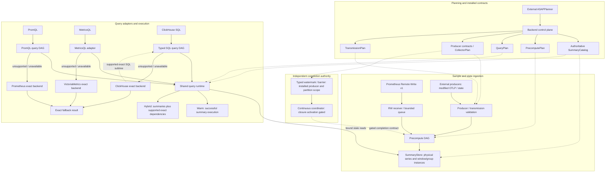

[](https://github.com/ProjectASAP/ASAPQuery-backend/actions/workflows/mvp-ci.yml)

# ASAPQuery-backend

ASAPQuery-backend compiles and executes planned observability queries using
materialized exact accumulators and sketches, with configured exact backends
for unsupported or unavailable results. It contains the backend control plane,
summary storage, precompute runtime and query adapters. Query semantics and
post-ASAP candidate generation come from the external
[ASAPPlanner](https://github.com/ProjectASAP/ASAPPlanner) dependency.

Start with the [E2E physical-DAG walkthrough](docs/evaluation/e2e-physical-dag.md)
for workload inputs, ERP evidence, selected plans, sample ingestion, storage
inspection and query execution. The [documentation index](docs/README.md) links
the detailed guides. This README describes the repository entry points; it does
not promise a universal latency improvement or a single accuracy bound across
summary families.

## Planning, state and execution

```text
Workload + capabilities + cost/accuracy evidence
                    |
          external ASAPPlanner
          selected post-ASAP DAG
                    |
       backend PhysicalCompiler
                    |
       authoritative SummaryCatalog
       + shared physical-plan publication
           /                        \
   PrecomputePlan                 QueryPlan
   producer/input subDAGs         query/readout subDAGs
           |                        |
    SummaryStore <---- bound state reads
           |                        |
   physical instances       result or exact fallback
```

The backend compiler consumes the selected Planner DAG and places supported
operations. It preserves semantic nodes and bindings rather than rediscovering
query intent from metric names. ERP evidence can influence eligible choices;
its presence alone does not prove selection or measured benefit.

| Contract or component | Responsibility |
| --- | --- |
| `SummaryCatalog` | Authoritative generation and descriptors for data, summary semantics, population, windows and materialization identity. Sibling plans validate against the same catalog. |
| `PrecomputePlan` | Materializations, input schemas, producer bindings and installed precompute subDAGs. Window size, slide, layout and origin are explicit contracts. |
| `ProducerContract`, `CollectorPlan`, `TransmissionPlan` | Producer/materialization authorization, external collector work and state-frame encoding/sequence rules. They are shared producer/consumer contracts; backend-local Remote Write does not require ASAPCollector. |
| `QueryPlan` | Language-tagged query entries, exact dependencies, typed operations and materialization/readout bindings. Query subDAGs execute against the active installed snapshot. |
| SummaryStore (`SketchStore`) | Physical state, indexes, lifecycle and persistence. A `SummaryDefinitionId` identifies the planned materialization. SID identifies a physical stored series/lifetime; `SummaryInstanceId` identifies a concrete definition/window/group instance. Planner node IDs are not storage IDs. |
| Physical-plan publication | Publishes catalog, precompute, query, collector and transmission views together; invalid bindings reject installation rather than silently selecting replacement state. |

See the [physical compiler](docs/developer_docs/control-plane/physical-compiler.md),
[catalog/runtime design](docs/developer_docs/query-engine/catalog-physical-plan-runtime.md)
and [maintenance protocol](docs/developer_docs/maintenance-replay.md).

## Interfaces and support boundaries



Dotted edges show installed contracts or explicitly gated paths. The barrier is
independent of Remote Write samples; this figure does not advertise a public
barrier endpoint or continuous/sliding activation. Warm and hybrid labels apply
only to successful execution with the corresponding actual summary reads;
external-only DAG execution is not acceleration.

| Surface | Current path and boundary |
| --- | --- |
| Prometheus | `/api/v1/write` accepts Remote Write **v1** scalar samples. PromQL instant/range queries use installed plans with configured Prometheus exact fallback. The collector-free `asapquery` profile is a bounded compatibility profile, not every distributed/persistent deployment option. |
| VictoriaMetrics | A separate MetricsQL adapter and listener lower supported expressions through Planner and the shared runtime. Unsupported syntax or unavailable coverage retains VictoriaMetrics exact fallback. See [MetricsQL support](docs/developer_docs/query-engine/victoriametrics-metricsql-support.md). |
| ClickHouse | An optional SQL HTTP adapter uses the same catalog/publication with typed relational and mixed exact/summary DAG execution. Supported collection/scalar operations are explicit; arbitrary SQL, lambdas and counter queries are not implied. External-only DAG execution is not summary acceleration. See [SQL support](docs/developer_docs/query-engine/clickhouse-sql-support.md). |
| External producers | The distributed path accepts configured collector/state input, including modified OTLP. It is distinct from standard Prometheus Remote Write and uses the shared producer/transmission contracts. |

Remote Write `204` acknowledges atomic bounded queue admission, **not** durable
accumulator publication or a raw write-ahead log. Deduplication is in memory;
there is no durable raw-WAL replay guarantee. Stale markers are recognized and
excluded from numeric aggregation, not propagated as general lifecycle events.
Native histograms and exemplars are rejected in this v1 path.

Remote Write does not carry an authoritative completion watermark. Installed
producer partition rosters and typed barriers define a separate completion
scope; roster membership alone does not provide authentication, durable progress
or continuous scheduling. Finite immutable maintenance has explicit source,
population, window and operator gates. Continuous/sliding activation must not be
inferred from available metadata or a successful ingest response.

Fallback and execution provenance must reflect the path that actually produced
a successful result. Missing coverage and unsupported operations must not be
reported as warm success. Accuracy and benefit claims need the selected family's
contract and workload-specific evidence. Thanos/object-store integrations are
optional deployment paths, not the default architecture or a required quickstart.

## Build and inspect

Use a current Rust toolchain with `rustfmt`/`clippy` and a protobuf compiler
(`protoc`). The workspace has sibling path dependencies on
[ASAPCollector](https://github.com/ProjectASAP/ASAPCollector) and
[asap_sketchlib](https://github.com/ProjectASAP/asap_sketchlib):

```text
parent/
├── ASAPQuery-backend/
├── ASAPCollector/
└── asap_sketchlib/
```

Use compatible dependency revisions; [MVP CI](.github/workflows/mvp-ci.yml)
records the tested checkout/build setup. ASAPPlanner is a pinned Git dependency
in the Cargo manifests, not an in-tree planner directory.

From this repository root:

```bash
cargo build --locked -p control_plane -p data_plane
cargo run --locked -p control_plane --example inspect_physical_dag -- \
  docs/examples/asapquery-compatibility-demo-snapshot.json \
  > selected.json
```

The backend executable is `target/debug/data_plane` (or
`target/release/data_plane` with `--release`). The inspector runs the ordinary
snapshot compiler and emits the catalog and execution plans under
`install_request`. Its output is labeled `inspection_only`; the demo costs are
not measurements. See the [walkthrough](docs/evaluation/e2e-physical-dag.md) for
candidate inspection and `jq` examples.

## Run and verify

For the included real Prometheus/Pushgateway demonstration, install Docker,
curl, Python 3 and jq, then run:

```bash
./scripts/e2e.sh asapquery-demo
```

The [demo runner](demos/asapquery/run.sh) documents its lifecycle and evidence
output. To connect an existing Prometheus and run the backend directly, follow
the [compatibility-profile guide](docs/user_guide/asapquery-profile.md); it
includes the planning snapshot, healthy exact-upstream requirement, Remote Write
configuration and startup arguments. Other deployment modes are covered by
[running and verifying](docs/user_guide/running-and-verifying.md).

The focused production-path regression is:

```bash
cargo test --locked -p data_plane --test asapquery_compatibility_process_e2e \
  collector_free_profile_serves_complete_matrix_and_falls_back_exactly -- --exact
```

This test uses a **mock exact upstream**, not a running Prometheus server, and
removes its temporary artifacts. The broader suite is
`./scripts/e2e.sh asapquery`. For recorded datasets, use the
[replay guide](docs/user_guide/o11y-replay.md) and
[execution calibration](tools/o11y-execution/CALIBRATION.md). Report correctness,
fallbacks, build/update cost and whole-deployment resources separately from
query latency.

## Repository map

| Path | Contents |
| --- | --- |
| [control_plane/](control_plane/) | Planner adapters, physical compilation, placement/cost evaluation, publication and runtime configuration. |
| [crates/asap_types/](crates/asap_types/) | Shared catalog, SDS identities, plan, grouping, window and producer contracts. |
| [crates/asap_otel_proto/](crates/asap_otel_proto/) | Modified OTLP protobuf bindings for supported external state ingestion. |
| [data_plane/src/precompute_engine/](data_plane/src/precompute_engine/) | Ingest-time operators, coordination and immutable maintenance execution. |
| [data_plane/src/storage_engines/sketch_db/](data_plane/src/storage_engines/sketch_db/) | SummaryStore implementation, physical indexes, lifecycle, backfill and persistence. |
| [data_plane/src/query_engines/](data_plane/src/query_engines/) | Summary readout, shared DAG execution, protocol adapters and exact routing. |
| [data_plane/src/drivers/](data_plane/src/drivers/) | HTTP, ingestion and control-plane interfaces. |
| [data_plane/tests/](data_plane/tests/) | Runtime and process integration tests. |
| [demos/](demos/), [scripts/](scripts/), [tools/](tools/) | Runnable demonstrations, validation and workload/evaluation tooling. |
| [docs/](docs/README.md) | Architecture, operator guides, support boundaries and evaluation evidence. |

## License

MIT — see [LICENSE](LICENSE).
