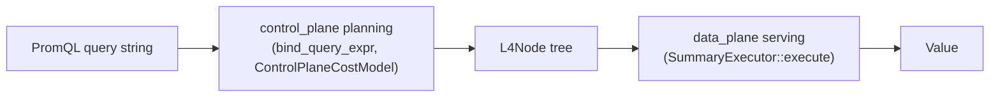

# L4 serving-time execution — design

Design doc, not an implementation log — same spirit as
[`sketchindex-sid-unification-plan.md`](./sketchindex-sid-unification-plan.md).
This describes the target architecture for `data_plane`'s serving-time query
execution and the interfaces it's built against, so that work on it (and
discussion of open questions) has a stable reference independent of which
piece has landed on which day.

## Scope and motivation

`data_plane` today answers queries through `SketchReducer`
(`storage_engines/sketch_db/query/sketch_reducer.rs`), a flat, per-capability
dispatcher: `engine.rs` collects a `Vec<ASAPTierCandidate>` from
`analyze_promql_for_asap_tier` and calls one `SketchReducer` method per
candidate. This has three structural limitations baked into its shape,
independent of any particular bug:

- **No real tree.** A candidate is a flat `(metric, capability, group_by_keys,
  outer_fn, outer_agg, ...)` record, not a composable plan. Nested
  compositions (`quantile(0.9, sum by (job) (m))`, cross-stage sketch merges)
  aren't representable as a single structure the reducer walks; they're
  handled — when they're handled at all — by ad hoc, PromQL-string-level
  fallbacks in `engine.rs` (`try_topk_over_rate_fallback`,
  `try_rate_over_frequency_fallback`, `apply_outer_agg_fold`).
- **No generic cross-sid merge.** Merging multiple sids that answer the same
  logical group exists for `ExactAgg` (`evaluate_exact_agg`'s own
  `AggregateCore::merge_with` fold) and, separately, as one bespoke special
  case for global HLL cardinality (`evaluate_cardinality_global`). Every
  other grouped sketch case has no generic merge path.
- **No compile-time contract.** Nothing enforces that candidates merged
  together actually agree on sketch family and parameters; that's discovered
  (or not) at read time.

The redesign is to route serving through `asap_sketch::exec::execute()` and
the `SummaryExecutor` trait it defines — the counterpart, upstream, to the
planning-time `asap_plan::bind` interface — trading the flat-candidate model
for a real recursive tree walk with structural guarantees enforced generically
by `asap-sketch`, not re-implemented per deployment.

## Architecture: planning vs. serving-time execution

ASAPController's own design doc treats this as a first-class split — see
[`docs/design.md` § "Serving-time execution"](https://github.com/ProjectASAP/ASAPController/blob/097f440079f851a560cc6927f50eb7f56a49e6c/docs/design.md#serving-time-execution):

> Everything above (L1-L5) is the **planning** pipeline: turning a query
> string into a plan. This section is different in kind — it's what
> actually **answers** a query at request time, using whatever plan L1-L5
> already decided... From a code standpoint, planning and serving are two
> separate interfaces a downstream deployment implements against:
> `asap_plan` (planning-time binder) and `SummaryExecutor` (serving-time
> executor).

For this deployment:

- **Planning** (`L3 QueryExpr → L4 L4Node`) is `control_plane`'s
  responsibility — `asap_plan::bind`/`implement_tree_in_with`, parameterized
  by a `CostModel`. Planning has, by design, no reference to what's actually
  materialized anywhere — it symbolically picks a summary family and
  parameters from the query shape and an accuracy target alone.
- **Serving** (`L4Node → Value`: walk the already-decided tree against
  whatever is actually materialized right now) is `data_plane`'s
  responsibility — an `impl SummaryExecutor` type, covered below. Serving
  needs its own error vocabulary distinct from planning's, because reality
  can diverge from the plan in ways planning never sees: missing data,
  multiple instances needing a merge, instances that disagree on parameters.

`control_plane` runs **in-process** with `data_plane` in this deployment (see
`data_plane/Cargo.toml`'s dependency comment), so calling `control_plane`'s
planning entry point directly from `data_plane` at request time is a
same-binary library call, not a network hop or a second planning
implementation living in `data_plane`. That's a deployment-specific
convenience this topology affords, not something `asap-plan`/`asap-sketch`
assume of every deployment.



### Which planning entry point

Two `control_plane` functions can turn a PromQL string into an `L4Node`, and
they are **not interchangeable**:

- `control_plane::sketch_algebra::lower::bind_query_expr` — parameterized by
  `ControlPlaneCostModel`: real accuracy-bound-driven parameter sizing, and,
  via `boundary::implementation_for_with` + `realize_extension`/
  `readout_extension`, correct realization of the `Extension`/`Frequency`
  intent (CMS/CountSketch). This is the function `main.rs`'s own production
  planning pipeline calls.
- `control_plane::asap_tier_implement::implement_promql_for_asap_tier` —
  parameterized by the naive `asap_plan::DefaultCostModel`: no accuracy-driven
  sizing, and a documented inability to realize the `Frequency` intent at all
  (falls back to `SummaryExpr::Logical` for the entire CMS/CountSketch
  family — see that module's own doc).

Serving-time tree construction must use `bind_query_expr`. `implement_promql_for_asap_tier`
exists for a narrower purpose (finding realizable `Aggregate` subtrees
anywhere in a query tree, not just at the root) and is not a drop-in
substitute for planning a whole query for serving.

`bind_query_expr(expr: &QueryExpr, accuracy: AccuracyTarget) -> Result<PhysicalExpr, BindingError>`
always returns `PhysicalExpr::Committed(L4Plan::Summary(Rc<L4Node>))` per its
own contract (it never picks a Phase ε.1 edge/backend placement), so
extracting the tree is a simple pattern match; any other `PhysicalExpr` shape
is a signal this deployment doesn't yet handle that binding outcome.

`ControlPlaneCostModel::new(accuracy)` takes only an `AccuracyTarget` — no
live server or catalog state — so it's constructible standalone wherever
`control_plane` is reachable as a library.

**Design consequence — sizing is not guaranteed to match what's stored.** A
freshly-computed `SummaryParams` (width/depth/k/precision) from planning is
not guaranteed to exactly match whatever a given sid was actually provisioned
with (registration happens at a different time, potentially under a
different accuracy target or cost-model version). Since `find_candidates`'s
contract is an *exact* `(SummaryKind, SummaryParams)` match, a mismatch here
simply yields no candidates for that sid — a capability miss, not a wrong
answer. Any rollout strategy needs to account for how often this drift
occurs before relying on serving-time re-planning as the sole tree source.

## The `SummaryExecutor` interface

`asap-sketch`'s `exec` module defines the shared, deployment-agnostic
contract:

```rust
trait SummaryExecutor {
    type Handle: Clone;
    type State;
    type Value;
    type Error;
    type GroupKey: Clone + Ord + Default;

    fn find_candidates(
        &self,
        sketch: &SummaryKind,
        params: &SummaryParams,
        col: &ColumnRef,
        by: &[ColumnId],
        child: &L4Node,
    ) -> Result<Vec<(Self::GroupKey, Self::Handle)>, Self::Error>;

    fn fetch_state(&self, handle: &Self::Handle) -> Result<Self::State, Self::Error>;
    fn merge_states(&self, states: Vec<Self::State>) -> Result<Self::State, Self::Error>;
    fn readout(&self, state: &Self::State, query: &SketchQuery) -> Result<Self::Value, Self::Error>;
    fn logical(&self, expr: &QueryExpr) -> Result<Self::Value, Self::Error>;
}
```

`execute(node, exec)` (upstream, not deployment code) does the recursive
walk and owns the *structural* rules generically:

- A `SummaryAgg` leaf resolves via `find_candidates`, groups the returned
  `(GroupKey, Handle)` pairs by `GroupKey`, and folds each group's handles
  independently via `fetch_state`+`merge_states` — a group's state is never
  combined with another group's.
- A `SummaryMerge` requires every child to agree on `(SummaryKind,
  SummaryParams)` before folding their states together across children,
  key-by-key.
- A `SummaryEstimate` calls `readout` on the state its child produced.
- Nesting composes: `execute()`'s own recursion handles arbitrary depth
  (`SummaryAgg`-of-`SummaryAgg`, `SummaryMerge`-of-`SummaryMerge`, ...); the
  deployment only ever sees one level at a time through the trait methods.

The deployment supplies storage, summary math, and readout; `asap-sketch`
enforces which nestings are structurally valid and propagates the
`(SummaryKind, SummaryParams)` agreement check through arbitrary nesting
depth — a deployment implementing this trait does not need its own
merge-precondition check layered on top.

## Data model

`QueryExecutionContext<'a>` is the `SummaryExecutor` implementer — a small,
per-query, stack-local value (`index: &SketchStore`, `t0_ms`, `t1_ms`,
`is_cumulative`), constructed fresh per incoming query rather than carried on
`ASAPQueryEngine` itself: the trait carries no time-range parameter, and
`ASAPQueryEngine` is called concurrently, so threading a query's range through
shared mutable engine state would race.

| Interface type | Design |
|---|---|
| `GroupKey` | `BTreeMap<String, String>` — the output row's label identity. See "Grouping semantics" below; this is the type with the least-settled design. |
| `Handle` | A sid plus its already-fetched `[t0, t1]` data, carried through from `find_candidates` so `fetch_state`/`readout` don't re-query the same range. Structured as an enum over the two payload shapes a sid can carry: a sketch series (`Rc<SketchTimeSeries>` + a decode-parameter tag) or an exact-aggregation window map (`Rc<BTreeMap<i64, Arc<dyn AggregateCore>>>` + the `AggregationType`). One sid answers one aggregation — there is no special-cased "is this exact or approximate" branch anywhere above this data-shape distinction; both payload kinds sit inside the same `find_candidates`/`fetch_state`/`merge_states` machinery. |
| `State` | Mirrors `Handle`'s two-variant shape: an accumulated list of sketch entries sharing one decode kind, or an accumulated list of exact-aggregation window maps sharing one `AggregationType`. Decode/merge for the sketch variant is deliberately lazy — `fetch_state`/`merge_states` only assemble the candidate list; reconstruction and merge happen in `readout`, which is the one place that knows cumulative-vs-per-window mode. |
| `Value` | Carries two shapes driven purely by the `SketchQuery` issued: `Points` (one scalar per timestamp) or `TopK` (one ranked `(item, value)` list per timestamp). Both variants carry the group's own observed `(min_window_end_ms, max_window_end_ms)` coverage alongside the payload — see "Coverage" below. |
| `Error` | Distinguishes: no candidate found (→ failover), an unresolved `by` column, a family this executor can't merge/decode, a decode/merge failure surfaced from lower layers, a bare `Logical` node (nothing committed at this point in the tree — same meaning as "no candidate bound," lets the caller fail over to archive), and a query shape outside this executor's covered scope. Each is a distinct, matchable variant, not a single opaque error string — callers (today: tests; eventually: `engine.rs`) need to tell these apart to decide whether to fail over to archive, log a bug, or something else.

### `find_candidates`

Walks the `L4Node` subtree (`child`) down to a `Scan{source:
TimeSeries{metric}, ..}` to recover the metric name (`SummaryAgg` itself
carries no metric/source field), then looks up sids by `(metric,
required_keys)` and filters to the sids whose stored kind is an *exact*
match: for a sketch-backed sid, `(SketchKindHandle, SketchConfig)` equal to
`(sketch, params)`; for an exact-aggregation-backed sid, an `AggregationType`
that maps unambiguously onto `(sketch, params)` (see "ExactAgg" below for
which mappings are unambiguous and which aren't). This is a strictly exact
match, not the family-only `Capability::is_satisfied_by` check the legacy
flat-candidate path uses — `SummaryMerge`'s precondition (every child agrees
on kind AND params) is satisfied by construction for anything this executor
produces, rather than needing a second check layered on top.

### Grouping semantics

`by: &[ColumnId]` names the output columns the caller wants each row keyed
by. The natural design is: project each matched sid's own label values onto
exactly those columns to get the row's `GroupKey`; sids that project to the
same key merge (via `merge_states`); sids that project to different keys stay
distinct rows.

This is correct and sufficient whenever `by` is a genuine, resolvable
requirement — e.g. `quantile by (zone) (...)`, where the query explicitly
asks for one row per `zone`. It is **not sufficient on its own** when `by` is
empty, because an empty `by` is ambiguous between two genuinely different
intents that the current `L4Node` shape cannot distinguish:

1. **No reduction concept applies.** A bare per-series function with no
   PromQL `by(...)` and no label selector at all (e.g. `quantile_over_time(q,
   m[r])`) has no grouping syntax to begin with — planning has nothing in
   the query text to resolve a label column against, so the schema simply
   doesn't carry one. The correct output here is one row *per underlying
   series*, each keeping its own full label identity — never merging series
   that happen to share no explicit `by`.
2. **An explicit, empty reduction was requested.** A genuine PromQL
   aggregation operator invoked with no `by(...)` (e.g. `count(hll_metric)`,
   `sum(exact_metric)`) means "reduce every matching series into one." The
   correct output here is exactly one row, merging every matched sid
   together, regardless of what labels they individually carry.

Both cases produce the identical `SummaryAgg{by: []}` shape — confirmed by
inspecting the bound tree for each directly. The distinction (an aggregation
operator's own, possibly-empty `by(...)` vs. a construct with no grouping
concept at all) exists at the PromQL/L1 surface and is not preserved through
the L2→L3 canonicalization that unifies both into the same `Aggregate`
node shape.

**Two families with different, independently-correct defaults today:**

- **`ExactAgg`** (`Sum`/`Increase`): these `AggregationType`s map *only* from
  genuine PromQL aggregation operators (`sum()`, `increase()`) — there is no
  bare-range-function path into this family with the ambiguity described
  above (`sum_over_time`/`avg_over_time` map to different, currently-unmatched
  intents). So an empty `by` here is unambiguous: reduce fully. Projection
  onto `by` (empty producing one shared key) is correct as-is.
- **Sketch families** (`DDSketch`/`Kll`/`Hll`/`Cms`/`CountSketch`, with or
  without a heap): each of these families is reachable through *both* a bare
  range function (case 1) and a genuine aggregation operator (case 2) —
  `quantile_over_time(...)` and `quantile(...)`/`count(hll_metric)` both
  bind to the same `SummaryKind`. The conservative, always-safe default is
  case 1's behavior: when `by` is empty, use the sid's own full label
  identity rather than collapsing to a shared empty key — this can never
  silently merge two series that weren't meant to be merged, at the cost of
  under-serving case 2 (a true full-reduction query gets one row per sid
  instead of one merged row).

**Open design question — resolving case 2 generally.** Under-serving case 2
is not a narrow, single-metric special case to work around locally; every
sketch family has this same ambiguity whenever `by` is empty. A general
resolution needs one of:

- An upstream signal on `SummaryAgg` (or an adjacent structure) distinguishing
  "this by is empty because the query has no grouping syntax at all" from
  "this by is empty because an aggregation operator explicitly reduced
  everything" — surviving the L2→L3 canonicalization that currently discards
  it. This is an `asap-ir`/`asap-plan` design question, not one `data_plane`
  can resolve unilaterally.
- Equivalently, a caller-supplied signal threaded alongside the tree at
  serving time (mirroring how `engine.rs`'s flat-candidate path already
  carries an independent `outer_agg`/`by_labels` derived directly from the
  original PromQL AST, entirely outside the `L4Node`/`Capability` vocabulary).
  Note that a full reduction over a non-additive statistic (cardinality is
  the concrete example: HLL registers must be merged *before* estimating,
  not estimated-then-summed, or overlapping members get double-counted) is
  exactly the kind of "merge these states together, then read out once"
  operation this executor's own `find_candidates`→`merge_states`→`readout`
  pipeline already performs for any group sharing one key — the missing
  piece is purely which sids belong in that one group, not new merge math.

Until one of these lands, full-reduction queries with an empty, ambiguous
`by` over one of the sketch families are not generally answerable through
this executor — they remain the flat legacy path's responsibility (which
resolves the ambiguity today via bespoke, capability-specific special cases,
e.g. HLL's own global-cardinality dispatch).

### Readout

Two modes, both doing real cross-sid merging rather than reporting one
sid's data or the first match found:

- **Cumulative** (`quantile_over_time`/`count_distinct_over_time`-shaped
  instant queries): fold each group's whole `[t0, t1]` range into one merged
  state per group, then read out one scalar (or one ranked list, for
  `SketchQuery::TopK`).
- **Per-window** (matrix/range queries): reconstruct each group's sids' own
  per-window states, merge same-window states *across* sids, then evaluate
  each window independently — one merged answer per window, not one merged
  answer for the whole range. Windows union across sids: a sid missing a
  particular window simply doesn't contribute to it, rather than dropping
  the whole window.

Cross-sid merge for both modes goes through a shared "merge same summary
family" operation — the sketch-family analog of `AggregateCore::merge_with`,
generalized from what was originally a single family-specific special case
into a mechanism that covers every sketch family this executor supports,
including heap-bearing (top-k) variants. Partial coverage — a group missing
a sid for one part of the range — folds whatever is present rather than
dropping the whole group, matching `SummaryMerge`'s own semantics upstream.

### Coverage

Each readout carries the group's own observed `(min_window_end_ms,
max_window_end_ms)` alongside its value — the signal a caller needs to
decide whether warm-tier data alone answers a query or whether an archive
tier must also be consulted and the two answers stitched. This mirrors the
legacy tier result's own coverage field, including a subtlety worth being
explicit about: despite that field's naming, no window-*start* is available
on the sketch storage path at all (samples are keyed by window-*end* only)
— both coverage bounds are folded from window-end timestamps observed across
the group's own windows, not true window starts. Coverage is folded from
*every* window observed, including any carry-in base spliced in to seed a
leading delta-only window — that base never surfaces as an output point, but
its window-end legitimately extends the group's covered range.

### ExactAgg

Exact-aggregation-backed sids (`Sum`, `Increase` today) participate in
`find_candidates`/`fetch_state`/`merge_states` as first-class candidates,
matched by the same one-sid-one-aggregation contract as sketches — no
"is this exact or approximate" branch anywhere in the matching logic.

`MinMax` is deliberately **not** matched: `AggregationType` carries no
min-vs-max direction, so there is no honest way to resolve which statistic a
readout should compute from an `ExactAgg` sid's stored metadata alone —
matching it would force a guess. `Count`/`Rate` are also not matched: no
`AggregationType` resolves to either today (`Rate` in particular is reached
by rewriting to `Increase` before an accumulator is chosen at all, so the
distinct concept never reaches storage).

`readout`/`SketchQuery` never see an `ExactAgg` state in practice:
`asap_plan::bind` never wraps an exact-accumulator implementation in a
`SummaryEstimate` (an intent's `estimate` flag is false for these), so
`execute()` on a tree rooted in one of these intents returns
`ExecOutcome::State` directly rather than reaching a `SummaryEstimate`
node — a caller-side concern, not something this trait implementation
handles. The value-extraction entry point for this case lives on the state
type itself (folding every window/sid in the group via
`AggregateCore::merge_with`, then reading out the statistic the
`AggregationType` implies) — called directly by whatever code reads an
`ExecOutcome::State`'s contents once the caller side of that path exists.

## Nested queries in this deployment's topology

`execute()`'s recursion handles arbitrary nesting depth already; the
deployment-specific question is what nesting actually *occurs* in a
three-stage (edge/gateway/backend) topology:

- **`SummaryAgg`-of-`SummaryAgg`** (`quantile(0.9, sum by (job) (m))`): edge
  builds per-job sums, backend's sketch is built over that sum stream.
  Already a valid, structurally-supported shape — `find_candidates` walking
  past the inner `SummaryAgg` to find the metric is the only requirement.
- **`SummaryMerge`-of-`SummaryMerge`**: a plausible real shape once merging
  isn't `ExactAgg`-only — e.g. per-zone edge sketches merge at a regional
  gateway, regional merges merge again at the backend. `execute()`'s
  `(kind, params)` agreement check is transitive through this nesting, so
  this is a rollout/topology question, not a structural gap: does this
  deployment's stage allocator ever actually *produce* a two-level merge
  cascade, or does everything currently collapse to one gateway hop? Worth
  checking against the stage-allocation output before assuming the
  two-level case needs dedicated testing.
- **`SummaryAgg`-over-`SummaryEstimate`**: flagged upstream as an open,
  unresolved question in general (building a new summary from another
  summary's query-time readout). `data_plane`'s storage only ever serves
  summaries built at ingest time from raw samples — if `find_candidates`
  ever receives a `child` whose subtree bottoms out in a `SummaryEstimate`
  rather than raw `Logical`/`SummaryAgg`, the right answer is `Err`
  (unsupported), not a guess.

## Rollout design

Because planning-time re-derivation can drift from what's actually stored
(see "sizing is not guaranteed to match" above) and because the grouping
ambiguity above means some query shapes aren't yet generally answerable,
cutting serving over to this executor outright is not a safe first step.
The intended rollout shape is **shadow mode**: compute the new answer
alongside whatever the legacy path already produces, diff the two, log
discrepancies, and always return the legacy answer — mirroring
`docs/design-sketch-db-roadmap.md` § 13.2's documented (previously
unimplemented) pattern for exactly this kind of migration:

```rust
let old = legacy_path.evaluate(...);
if shadow_mode_enabled() {
    let new = new_executor.execute(...);
    log_diff(old, new); // never affects what's returned
}
old
```

A query shape known to bind successfully but answer *differently* under the
two paths (rather than simply not binding) must be excluded from the
comparison rather than compared naively — e.g. `rate()`/`irate()` bind to a
valid tree (the underlying intent is rewritten to `Increase` before
accumulator choice), but this executor has no rate-division step, so a naive
comparison would show a spurious, not a real, discrepancy.

Actually switching what's served, and retiring the legacy reducer path
entirely, both require: confidence data from shadow mode about how often
planning-time re-derivation disagrees with what's stored, a resolution for
the grouping ambiguity above (at least for the query shapes real traffic
exercises), and a resolution for the outer-fold family of gaps below — none
of which shadow mode alone produces; it only makes the size and shape of
those gaps observable.

## Open design questions

1. **Grouping ambiguity for empty, sketch-family `by`** — see "Grouping
   semantics" above. Affects every sketch family; needs either an upstream
   IR signal or a caller-supplied one, not a per-metric special case.
2. **Outer-fold family of gaps.** Two PromQL compositions the flat
   `Capability`/`by` vocabulary can't express are handled today only by
   bespoke, PromQL-string-level fallbacks outside the reducer proper:
   `topk(K, sum by (...) (rate(m[r])))` (ranking by a non-additive measure
   over a rate) and stacking an outer exact statistic (avg/stddev/count/
   group/min/max) on top of an already-computed sketch or exact-agg readout.
   Neither has an equivalent in this executor; resolving either is explicitly
   out of scope for a single deployment to decide unilaterally — it needs a
   cross-repo design conversation, since it's really a question about what
   `asap-sketch`'s IR should be able to express, not a `data_plane`-local gap.
3. **`rate(cms_metric[r])` / bare frequency-family rate.** Same "outer fold"
   category as above, specific to the Frequency family.
4. **`SummaryMerge`-of-`SummaryMerge` in practice** — see "Nested queries"
   above; whether this deployment's topology ever produces the two-level
   case is unconfirmed.
5. **`SummaryAgg`-over-`SummaryEstimate`** — flagged upstream as open in
   general; this deployment's answer (reject, don't guess) is a local
   default, not a resolution of the upstream question.
6. **Sizing drift** — how often and how badly a freshly-planned
   `SummaryParams` fails to match what's actually registered; only
   measurable empirically once serving-time re-planning is exercised against
   real traffic.
