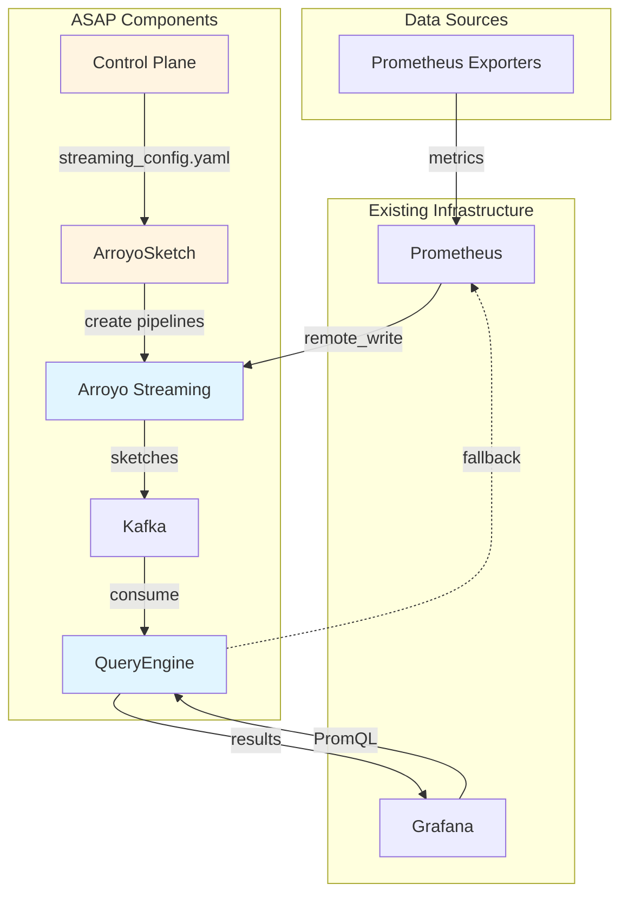
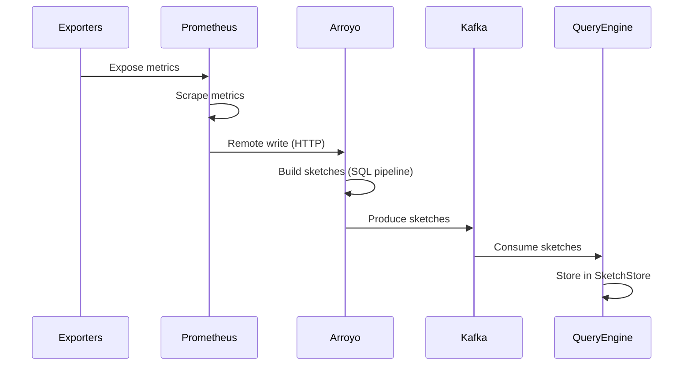
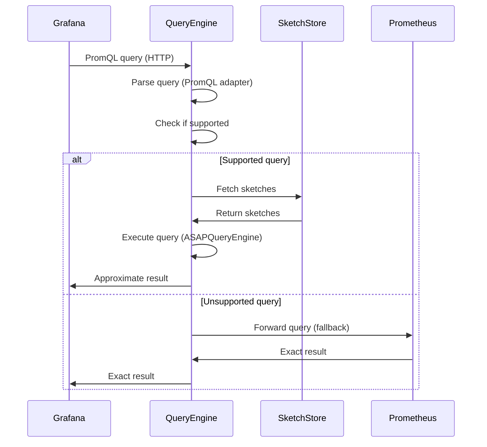
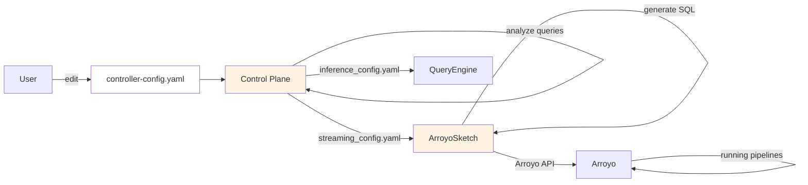

# Architecture

This document provides a comprehensive overview of ASAP's architecture, data flows, and design decisions.

## Table of Contents
- [High-Level Architecture](#high-level-architecture)
- [Data Flows](#data-flows)
- [Component Overview](#component-overview)
- [Key Design Decisions](#key-design-decisions)
- [Technology Stack](#technology-stack)
- [Repository Structure](#repository-structure)

## High-Level Architecture

ASAP consists of six main components working together to accelerate Prometheus queries:



## Data Flows

ASAP has three primary data flows: **Ingestion**, **Query Execution**, and **Configuration**.

### Ingestion Path

How metrics flow from exporters to sketches:



**Step-by-step:**

1. **Exporters** expose metrics on HTTP endpoints (e.g., `:9100/metrics`)
2. **Prometheus** scrapes metrics at a specified time interval (e.g. every 10s)
3. **Prometheus** sends metrics to **Arroyo** via remote write API
4. **Arroyo** receives raw metrics via custom connector (`prometheus_remote_write_optimized`)
5. **Arroyo** executes SQL pipelines that build sketches in real-time (configured by **ArroyoSketch**)
6. **Arroyo** produces sketches to **Kafka** output topic
7. **QueryEngine** consumes sketches from **Kafka**
8. **QueryEngine** stores sketches in **SketchStore** (in-memory)

**Data format transformations:**
- **Exporter → Prometheus**: Prometheus exposition format (text)
- **Prometheus → Arroyo**: Prometheus remote write protobuf
- **Arroyo → Kafka**: Serialized sketches (custom format)
- **Kafka → QueryEngine**: Deserialize to custom sketch objects

### Query Path

How queries are executed:



**Step-by-step:**

1. **Grafana** sends PromQL query to **QueryEngine** (port 8088)
2. **PrometheusHttpAdapter** parses the HTTP request and extracts the query
3. **ASAPQueryEngine** checks if the query can be answered with sketches
4. **If supported:**
   - Fetch relevant sketches from **SketchStore**
   - Execute query using sketch operations
   - Format result as Prometheus-compatible JSON
5. **If unsupported:**
   - Forward query to **Prometheus** via fallback client
   - Return exact result from Prometheus
6. **QueryEngine** returns result to **Grafana**

**Query support examples:**
- ✅ Supported: `quantile(0.99, http_request_duration)`, `sum(rate(...))`
- ❌ Unsupported: `up == 1`, `label_replace(...)`, exact histograms

### Configuration Path

How sketches are configured:



**Step-by-step:**

1. **User** creates `controller-config.yaml` with:
   - List of queries to accelerate
   - Metric metadata (labels, types)

2. **Control Plane** analyzes the query workload:
   - Determines which sketch algorithms to use (DDSketch, KLL, etc.)
   - Computes sketch parameters (size, accuracy)
   - Generates `streaming_config.yaml` for Arroyo
   - Generates `inference_config.yaml` for QueryEngine

3. **ArroyoSketch** reads `streaming_config.yaml`:
   - Renders SQL templates using Jinja2
   - Creates Arroyo pipelines via REST API
   - Configures sketch UDFs with parameters

4. **QueryEngine** reads `inference_config.yaml`:
   - Knows which sketches to expect from Kafka
   - Configures deserialization logic
   - Sets up query routing

## Components

ASAPQuery-backend is a Cargo workspace of two binaries plus shared
crates (see the repository tree above):

| Component | Purpose | Location |
|-----------|---------|----------|
| **data plane** | Query backend: OTLP ingest, warm-tier `ASAPQueryEngine` over `SketchStore`, archive-tier `ThanosQueryEngine` forwarder | `data_plane/` |
| **control plane** | Planner: lowers PromQL/SQL to an intent algebra, plans sketches, pushes per-runtime config to agents over OpAMP | `control_plane/` |
| **shared crates** | `asap_types`, `promql_utilities`, `asap_otel_proto` | `crates/` |

The edge side (agents, gateway, sketch processors, exporters) lives in
[ASAPCollector](https://github.com/ProjectASAP/ASAPCollector); the
archive tier uses external Thanos + object storage.

## Key Design Decisions

### Fallback Mechanism

**Design decision**: Always support fallback to Prometheus

**Rationale**:
- Not all queries can be accelerated (e.g., label manipulation)
- Users shouldn't have to know which queries are supported
- Gradual adoption - users can try ASAP without changing queries

**Implementation**:
- QueryEngine detects unsupported queries during parsing
- Forwards to Prometheus via HTTP client
- Returns results transparently

**Trade-off**: Added complexity vs. compatibility
- **Benefit outweighs cost**: Users can point Grafana at ASAP without modifying dashboards

## Technology Stack

### Core Languages
- **Rust** — `data_plane` and `control_plane` (this repo)
  - Tokio for async runtime
  - Axum for HTTP server
  - Serde for serialization
  - DataSketches (dsrs) for sketch algorithms
  - Hydra for experiment config composition

### Infrastructure
- **Apache Kafka** - Message broker (KRaft mode, no Zookeeper)
- **Prometheus** - Time-series database
- **Grafana** - Visualization (unchanged from user's existing setup)

### Development Tools
- **Cargo** - Rust build system
- **Docker** - Containerization
- **GitHub Actions** - CI/CD
- **Pre-commit** - Git hooks for linting

## Repository Structure

```
ASAPQuery-backend/                 # Cargo workspace
├── crates/                        # Shared workspace libraries
│   ├── asap_types/                  # StorageBackend enum, accuracy envelopes
│   ├── promql_utilities/            # PromQL AST helpers
│   └── asap_otel_proto/             # OTLP protobuf bindings
├── data_plane/                    # Query backend (binary)
│   └── src/
│       ├── drivers/                 # ingest, query adapters/servers, control_plane_client
│       ├── query_engines/           # ASAPQueryEngine (warm) + ThanosQueryEngine (archive) + routing
│       ├── storage_engines/         # SketchStore (sketch_db) + gorilla_object_store + types
│       ├── precompute_engine/       # Streaming pipeline (+ operators/)
│       └── tests/                   # Integration tests
├── control_plane/                 # In-repo control plane / planner (binary)
│   └── src/                         # query_parser, intent_algebra, sketch_algebra,
│                                    #   optimizer, physical, emit, opamp
└── docs/                          # Developer documentation (this)
    ├── 01-getting-started/
    └── 03-how-to-guides/
```
