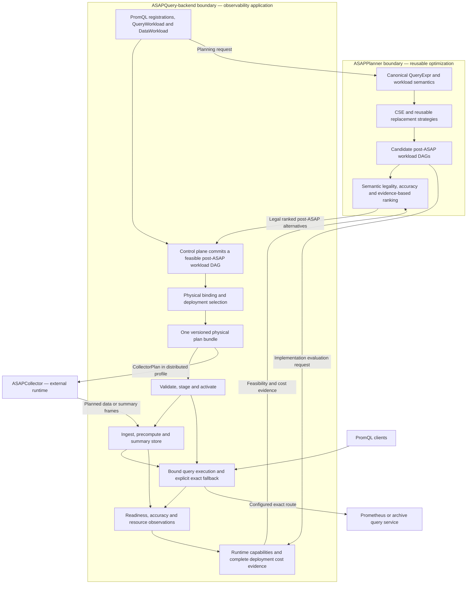

# ASAPPlanner and ASAPQuery-backend: integrated architecture

Status: proposed system-level consolidation and high-level migration, grounded
in existing integration. This is not a claim that every target capability is
implemented. No repository rename is proposed.

This document owns the Planner/backend integration proposal, not a second copy
of the [shared ASAP system contracts](https://github.com/ProjectASAP/ASAPCollector/tree/main/docs/design_docs).
The existing physical-plan, collection, transmission, and storage contracts
remain authoritative for their respective interfaces.

## Design decision

<p align="center"><strong>Figure 1. Integrated ASAPPlanner–ASAPQuery-backend architecture and workflow.</strong></p>



**ASAPPlanner's selected post-ASAP workload DAG is the authoritative semantic
plan. ASAPQuery-backend binds and executes that decision through its control
plane and data plane.** Backend physical plans remain necessary, but must be
traceable projections of that DAG, not independently optimized replacements
for its dependencies, shared state, or query-result semantics.

Planner provides reusable legal alternatives and ranking. The backend owns
deployment commitment, concrete realization, and operational policy. A
deployment choice cannot silently change Planner-owned grouping, statistic,
summary parameters, logical window, accuracy, or lifecycle: it must return to
the legal candidate-selection boundary.

## Architecture boundaries and reuse

ASAPQuery-backend is the observability downstream application, including the
MetricsObservabilityQuery use case. DQC (the proposed name for the current
asap-fusion repository) is a separate downstream application, not an execution
dependency of this backend.

| Responsibility | ASAPPlanner | ASAPQuery-backend |
| --- | --- | --- |
| Query semantics | Canonical expressions, equivalence, grouping and time semantics | PromQL API, workload registration and profile restrictions |
| Optimization | CSE, legal sharing, rollup, decomposition, summary and accuracy alternatives | Feasibility evidence, deployment commitment and concrete assignments |
| Time and state | Logical windows, abstract window framework and maintenance lifecycle | Panes, retention layout, update implementation and placement |
| Plan identity | Logical producer identities and result dependencies | Plan versions, physical materializations, SID bindings and runtime handles |
| Execution | Deployment-independent semantic contract | Ingest, precompute, store, serving, readiness and fallback |
| Operations | Reusable models consuming scoped evidence | Activation, rollback, telemetry, freshness and resource enforcement |

Reuse works in both directions. The backend consumes Planner strategies;
general-purpose rules discovered while optimizing repeated observability
queries belong in Planner so DQC and other applications can reuse them.
Prometheus staleness handling, SID resolution, Collector placement, and OpAMP
publication remain downstream responsibilities.

## Inspection: what already exists

Inspected backend main at
[`95131d83972bb7a07d338e2a5af925a20c15ddce`](https://github.com/ProjectASAP/ASAPQuery-backend/tree/95131d83972bb7a07d338e2a5af925a20c15ddce),
using its pinned Planner revision
[`cb50219c582d43f53ab77d3a595bd1ea4a9aa119`](https://github.com/ProjectASAP/ASAPPlanner/tree/cb50219c582d43f53ab77d3a595bd1ea4a9aa119).
The baseline is merged code, not the completion of open PRs.

| Area | Existing foundation | Consolidation needed |
| --- | --- | --- |
| Frontend and selection | Planner dependency, canonical query parsing, backend selection from Planner alternatives | Make workload-wide sharing and strategy composition explicit across supported entry points |
| Physical compilation | One bundle with precompute, transmission, backend and query projections; Collector projections when applicable | Preserve all selected shared producers and provenance through every projection |
| Serving | Bound QueryPlan execution, exact materialization identities and explicit fallback | Audit remaining compatibility paths; serving must not make a new summary choice |
| Deployment | Versioned staging and activation, runtime capability and evidence checks | Verify profile-specific failure and readiness behavior end to end |
| Compatibility | Backend-local ASAPQuery profile alongside distributed collection | Keep distinct deployment profiles on the same semantic contract |

Evidence:
[selection adapter](../../control_plane/src/planner_selection.rs),
[physical compiler](../../control_plane/src/physical/compiler.rs),
[legacy workload adapter](../../control_plane/src/physical/workload_planner.rs),
[QueryPlan](../../control_plane/src/query_plan.rs), and
[bound serving executor](../../data_plane/src/query_engines/asap_query_engine/post_asap_readout.rs).
The selection adapter explicitly commits a ranked Planner candidate downstream.
Consequently, the figure does not imply that the Planner library deploys or
commits a complete backend configuration by itself.

This is an extension of existing integration, not a proposal to replace it
wholesale. Implementation guides sometimes describe a broader target than an
individual runtime path supports; migration acceptance must be demonstrated
against executable paths, not inferred from interface names.

## One authoritative semantic DAG, derived runtime plans

The shared contract must preserve sources and filters, label/grouping identity,
exact operators surrounding summaries, summary build/merge/readout, shared
producers, query roots, logical time coverage, accuracy, and maintenance
requirements. Audit the pinned post-ASAP representation for genuine gaps;
extend Planner semantics where necessary.

Do not put concrete engine or implementation IDs into Planner IR. The backend
retains a binding from logical producer identity to implementation, placement,
materialization, state schema, and active generation. This follows the
[Planner/downstream boundary](https://github.com/ProjectASAP/ASAPPlanner/blob/cb50219c582d43f53ab77d3a595bd1ea4a9aa119/docs/design_docs/asapplanner-downstream-boundary.md).

One selected DAG can produce several execution projections:

- PrecomputePlan: how the selected state is built and maintained.
- TransmissionPlan and optional CollectorPlan: how distributed producers
  implement and deliver that state.
- SummaryCatalog: canonical summary/data descriptors and stable materialization identities.
- QueryPlan: executable reads, merges, readouts and remaining exact operations.

These projections may expand one semantic node into several physical tasks.
They must not invent a different semantic sharing graph. QueryPlan need not be
a byte-for-byte serialization of post-ASAP IR, nor should ingestion and query
serving literally run an identical task schedule. They implement different
phases of the same selected computation.

Sharing has explicit scope: maintain a shared producer once per compatible
source/window/plan generation; reuse its state across query roots. Memoizing a
query DAG within one request is useful but does not, by itself, prove
cross-query or cross-request sharing.

## End-to-end workflow

1. **Register demand.** Collect canonical queries, evaluation cadence, time
   windows, accuracy scope, source arrival facts and optimization horizon.
2. **Generate alternatives.** Planner applies legal rewrites and sharing,
   choosing among summary, abstract-window and lifecycle alternatives.
3. **Evaluate implementations.** The backend checks runtime feasibility and
   supplies complete, fresh costs over the same workload horizon.
4. **Commit and bind.** The control plane selects a legal workload alternative,
   retains its concrete realization, and compiles one coherent plan bundle.
5. **Publish.** Validate and stage matching projections. For distributed
   deployment, require the corresponding Collector application evidence
   before activation. A failed rollout preserves the prior active generation.
6. **Maintain and serve.** Ingest updates the selected state; a request uses one
   active snapshot and exact bindings. Warm execution requires complete,
   fresh coverage. Otherwise follow the configured exact route or return an
   explicit failure if that route is unavailable.
7. **Observe and replan.** Attribute cost, readiness and accuracy evidence to
   the plan generation and producer. Semantic changes require a new planning
   decision and activation, not an ad-hoc serving-time substitution.

The backend-local profile uses Remote Write, local precompute and Prometheus
fallback without requiring Collector/OpAMP. The distributed profile may use
Collector-maintained summaries and configured archive services. Neither
profile's optional infrastructure becomes a prerequisite for the other.

## Example: repeated dashboard queries sharing one state producer

Consider a gauge `request_size_bytes`, one scalar series per
`(service, instance)`, without extra labels. Register these instant-query
expressions repeatedly at the same evaluation cadence:

```promql
# Q1: sum of observed sample values per service over the last five minutes
sum by (service) (sum_over_time(request_size_bytes[5m]))

# Q2: sample-weighted mean per service over that same interval
sum by (service) (sum_over_time(request_size_bytes[5m]))
/
sum by (service) (count_over_time(request_size_bytes[5m]))
```

Q2 is deliberately not the unweighted mean of per-instance means. Its
denominator counts actual observations, which matters when instances have
different sample counts. These are gauge samples, not counter increases.

A legal target alternative is:

```text
Selected samples and logical five-minute coverage
                    |
       Shared state per (service, instance)
          SUM(value), COUNT(observations)
                    |
          Merge/reduce by service
             SUM(sum), SUM(count)
                    |
             +------+------+
             |             |
          sum -> Q1    sum / count -> Q2
```

Planner recognizes the common sum computation and can propose aggregate-state
fusion with per-consumer readouts. The backend implements the selected window
framework with compatible runtime state and binds both query roots to the
same producer. It must preserve PromQL range boundaries, labels, absent-series
behavior and division semantics; a missing denominator is not invented as
zero. Physical panes may be used only when their coverage matches the selected
logical interval, including boundary handling.

This diagram is a target acceptance example, not a claim that today's compiler
already fuses these complete PromQL expressions. If an operator or window
cannot be realized end to end, the current supported behavior is explicit
fallback rather than partial warm execution with changed semantics.

For the first milestone, use exact sum/count state and compare against
Prometheus at identical timestamps. Verify both numerical/label equivalence
and one maintained producer shared by the two roots. Exact aggregate state
does not eliminate the separate requirement to verify data completeness.

Approximate extensions must declare what epsilon measures and what delta
covers. For a whole 20-row result with failure probability at most 0.05,
20 valid per-row failure bounds of at most 0.0025 suffice by the union bound;
independence is not required. Per-row 95% intervals alone do not establish
95% confidence for the complete result. Multiple dashboard evaluations need
their own declared scope; a result-level guarantee is not automatically
session-wide. Shared state also does not make separate errors independent.

## Capabilities, costs and feedback

Capabilities answer **can this deployment faithfully execute this alternative?**
Costs answer **which feasible alternative is preferable?**

| Capability question | Why it constrains selection |
| --- | --- |
| Can the producer build/update the selected family and parameters? | A readout implementation alone does not make a state maintainable |
| Can storage and readout preserve the selected windows and labels? | A tumbling-only path cannot silently implement arbitrary sliding coverage |
| Are merge operations and full/delta encodings compatible? | Distributed producers must construct the same logical state |
| Can the runtime perform every exact operator after readout? | A supported sketch is insufficient for an unsupported full expression |
| Can readiness, staleness and exact fallback be enforced? | Mathematical legality does not establish runtime answerability |

Costs include initialization, ingestion updates, overlapping/retained state,
transmission, storage, merges, readouts, recurring queries, and shared producer
construction once. Compare alternatives over the same data and demand scope.
Missing evidence is not zero cost; stale or incomplete implementation evidence
cannot justify selection.

Runtime observations reference the concrete binding and selected semantic
producer. Physical controls may vary only within already-authorized
guardrails. Changing grouping, family, parameters, windows or sharing returns
to planning.

## Reuse across various ASAP workload scenarios

| Scenario | Reusable Planner strategy | Application-specific responsibility |
| --- | --- | --- |
| Repeated dashboards (MetricsObservabilityQuery) | Shared aggregates and prepared/maintained state | PromQL semantics, freshness and serving |
| Multiple dashboard resolutions | Legal rollup and window alternatives | Compatible retention and exact time coverage |
| Distributed telemetry aggregation | Mergeable summary and grouping alternatives | Collector placement, transmission and activation |
| DQC analytical workloads | CSE, aggregate fusion and rollup | DQC engine adapters and batch execution policy |

General semantic rules belong in Planner. Backend-local metric-name fixtures,
SID lookup or deployment-specific placement must not become universal Planner
rules. No dependency on DQC is needed to reuse strategies contributed by it.

## High-level migration

See the [migration delivery plan](asapplanner-migration-plan.md) for PR-sized
implementation slices, dependencies, regression fixtures and completion gates.

| Milestone | System outcome | Acceptance |
| --- | --- | --- |
| 1. Audit the shared contract and entry points | Current canonical compilation and compatibility paths have explicit ownership | Document supported operators, sharing scope, profile limits and true IR gaps |
| 2. Complete one workload-wide semantic path | Registered queries use Planner alternatives with preserved shared producers | The two-query example has one selected producer and both result roots |
| 3. Preserve bindings through all projections | Precompute, storage and serving implement the same selected decision | No duplicate maintenance; exact state/schema/window and generation agreement |
| 4. Consolidate reusable strategies | Missing general fusion/rollup rules extend Planner | Rules work without backend metric names, SID objects or placement assumptions |
| 5. Close capability and cost feedback | Only fully executable, properly costed alternatives are committed | Unsupported or stale evidence fails closed; estimated and observed costs are traceable |
| 6. Validate profiles and retire redundant selection paths | Serving executes installed bindings without independent semantic planning | Prometheus parity, sharing, readiness, fallback and activation-failure tests pass |
| 7. Broaden coverage (ProjectASAP-wide; not required for this repository) | Other applications, engines, sketches and lifecycles reuse the contract | Each participating provider demonstrates capability and semantic conformance |

The first milestone demonstration should use backend-local ingestion and the
exact two-query example. Distributed rollout follows the same contract with
additional producer and activation checks. Existing paths may remain as
comparison baselines until parity is established; remove duplicate semantic
selection, not necessary physical plans or profile-specific runtime adapters.

Step 7 is an ecosystem extension, not a prerequisite for completing this
backend's scoped consolidation through steps 1–6.

## Related contracts and implementation guides

- [Physical compiler](../developer_docs/control-plane/physical-compiler.md)
- [Plan publication](../developer_docs/control-plane/plan-publication.md)
- [Backend plan runtime](../developer_docs/query-engine/backend-plan-runtime.md)
- [ASAPQuery compatibility profile](asapquery-compatibility-profile.md)
- [Runtime accuracy feedback](../developer_docs/control-plane/runtime-accuracy-feedback.md)
