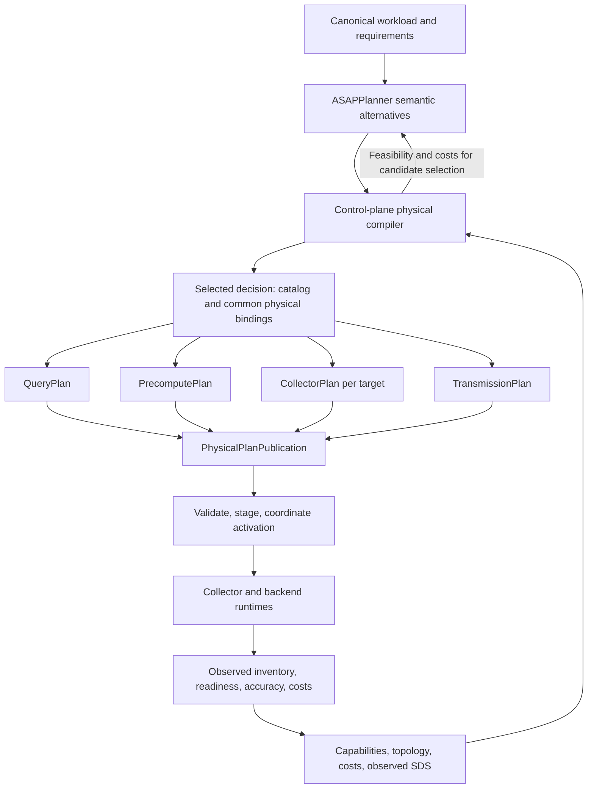
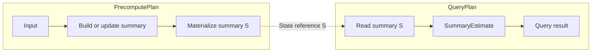

# Planner, physical plans, SDS, and runtime architecture

## Audience, status, and scope

Audience: architects and developers of ASAPPlanner, ASAPQuery-backend, and
ASAPCollector. This document defines the target integration architecture.
The current-code baseline below is separate from the proposed changes; writing
this design does not establish runtime support or change a wire contract.

This document owns the integration boundary and compilation flow. The
[SDS design](summary-catalog-sds-architecture.md) owns descriptor, instance, and
state-lifecycle semantics. The [delivery plan](asapplanner-migration-plan.md)
owns implementation gates. Existing
[Collector system contracts](https://github.com/ProjectASAP/ASAPCollector/tree/main/docs/design_docs)
remain the compatibility baseline until corresponding changes land in both
consumers. Conflicts require a versioned migration, not unilateral reinterpretation.

## Problem and current baseline

Collector and backend must agree on what a summary means, how it is produced,
how updates travel, and how queries consume it. Sharing an envelope decoder
alone does not guarantee agreement across these boundaries.

The inspected backend baseline is `b06385d1c155986c05ccbd011978e43bf3786deb`.
The following are current implementation facts, not the desired dependency graph:

| Area | Existing foundation | Remaining coupling |
| --- | --- | --- |
| Compilation | `CompiledPhysicalPlan` contains catalog, query, precompute, collector, and transmission plans | Transmission compilation reads producers/schemas from PrecomputePlan; catalog is constructed from materializations and then bound back into plans |
| Publication | `PhysicalPlanPublication` validates related plans; backend supports staging/activation | Shared publication validation and runtime installation repeat some cross-plan checks |
| Contracts | `asap_types` contains SDS and installed plan types | Types still depend on Planner representations; Collector maintains separate Go/Rust DTOs |
| Semantic DAG | Planner exports a versioned DAG; backend retains node bindings | `OwnedPostAsapDag` serializes payloads into JSON to avoid process-local `Rc` ownership |
| Runtime policy | Transmission rules carry sampling, delta/GOS, and adaptation | Production semantics and transport controls share one policy structure |
| Sketch ingest | Shared sketch library plus an edge-runtime adapter | Backend imports Collector wrappers for DDSketch/KLL reconstruction; other reconstruction and delta paths remain local |

Implementation references: [compiler](../../control_plane/src/physical/compiler.rs),
[publication](../../crates/asap_types/src/plan_publication.rs),
[producer contracts](../../crates/asap_types/src/producer_plan.rs),
[installed DAG](../../crates/asap_types/src/executable_plan.rs), and
[edge adapter](../../data_plane/src/precompute_engine/operators/edge_runtime_adapter.rs).

## Goals and non-goals

The minimum outcome is one selected semantic decision, one set of physical
bindings, and four consistent runtime projections. Both backend-local and
Collector-produced summaries must use this boundary. Backend ingest must no
longer depend on the Collector execution runtime for shared state codecs.

Preserve supported query semantics, sharing, legacy decoding, completeness,
and recovery behavior during extraction. Neither arbitrary PromQL coverage,
a new optimizer, a universal execution engine, an arbitrary network topology,
nor a repository reorganization is required. A missing capability remains an
explicit rejection or configured exact fallback.

## Inputs, outputs, and end-to-end behavior

Inputs are canonical workload roots, query accuracy and freshness requirements,
Planner alternatives, and scoped deployment evidence: capabilities, topology,
source bindings, retained-state availability, and complete cost estimates.
The output is one validated `PhysicalPlanPublication` and target-specific
installation artifacts derived from it.

1. Planner produces legal semantic alternatives, retaining shared producers and
   distinct query roots. Physical evaluation supplies feasibility and costs.
2. The control plane commits a feasible alternative and its concrete realization.
3. The compiler assigns catalog identities and binds semantic nodes, state,
   producers, consumers, and data-flow edges once.
4. It projects those bindings into the four plans and validates the publication.
5. Targets stage their projections and required catalog content. The coordinator
   authorizes activation only after the required target acknowledgements.
6. Producers maintain state; receivers apply authorized frames; queries use one
   active plan snapshot and states with sufficient coverage and provenance.
7. Runtime evidence is attributed to those bindings and generations. A new
   semantic choice returns to planning rather than changing query behavior locally.

Plan installation and state readiness are separate. A query with missing or
incomplete state follows its configured exact route or returns an explicit
unavailable result; it cannot interpret missing state as an empty population.

## Planner and compiler ownership

Planner owns semantic equivalence, source/population semantics, grouping,
logical windows, summary families and parameters, result guarantees, lifecycle
choices, and maintenance-time versus read-time dependencies. Reusable sharing,
fusion, and rollup rules belong there.

The physical compiler owns concrete implementations, placement, input routing,
state layout, retention realization, runtime identifiers, codecs, transmission
configuration, and deployment commitment. It must prove that an implementation
preserves the selected semantic decision. An unsupported choice returns to
candidate selection or fails explicitly; lowering cannot silently change its
window, sampling semantics, statistic, or guarantees.

Capabilities and costs are distinct. A cheap implementation is not necessarily
feasible. Costs include shared construction once, maintenance, retained memory,
network, storage, recovery/checkpoints, per-consumer merges and readouts, and
query demand over the same horizon. Missing or stale evidence is not zero cost.

The semantic IR export must be typed, versioned, and independent of internal
search ownership such as `Rc`. The target is one export contract shared by
Planner and consumers, with backend physical bindings alongside it. Migrate
`OwnedPostAsapDag` only after round-trip and runtime compatibility are proven;
do not introduce another operator language or require runtimes to import the
optimizer. Runtime evaluation of installed operators remains legitimate.

## Caller contract and lifecycle completeness

[Planner issue #438](https://github.com/ProjectASAP/ASAPPlanner/issues/438)
identifies a separate interface requirement: callers need to know the required
inputs, the consequences of omissions, and the promises of each output. A shared
DAG format alone does not meet that requirement.

At the inspected Planner revision
[`e7fdb2492c42c9f5b34760706a5162aa586d3025`](https://github.com/ProjectASAP/ASAPPlanner/tree/e7fdb2492c42c9f5b34760706a5162aa586d3025),
plain materialization and lifecycle-aware selection/materialization are separate
library operations. `materialize_with_summary_maintenance_lifecycles` attaches
state deployments; `export_summary_maintenance_plan` exports their decisions,
alternatives and costs alongside the graph. Thus, the existence of an exported
DAG does not certify that lifecycle selection or complete deployment costing ran.
This observation does not imply that the backend's pinned Planner revision
already exposes every API from that revision.

### Current public API audit

The following describes the inspected Planner revision above, rather than the
proposed facade. These are library operations, not equivalent end-user workflows.
See [replacement APIs](https://github.com/ProjectASAP/ASAPPlanner/blob/e7fdb2492c42c9f5b34760706a5162aa586d3025/crates/asap-aware-mapping/src/replacement.rs),
[lifecycle APIs](https://github.com/ProjectASAP/ASAPPlanner/blob/e7fdb2492c42c9f5b34760706a5162aa586d3025/crates/asap-aware-mapping/src/summary_maintenance_lifecycle.rs),
[workload types](https://github.com/ProjectASAP/ASAPPlanner/blob/e7fdb2492c42c9f5b34760706a5162aa586d3025/crates/types/src/workload.rs), and
[cost model](https://github.com/ProjectASAP/ASAPPlanner/blob/e7fdb2492c42c9f5b34760706a5162aa586d3025/crates/asap-aware-mapping/src/cost_model.rs).

| Operation | Input and output | What it does not establish by itself |
| --- | --- | --- |
| `search_workload` / `search_workload_with` | Canonical roots, default/explicit strategies -> `PlanSpace` | A selected deployment, workload lifecycle, or application-specific end-to-end accuracy target |
| `search_workload_with_targets` | Roots, strategies, per-root targets and accuracy model -> target-checked candidate space | Physical feasibility, lifecycle commitment or measured deployment cost |
| `PlanSpace::global_selection` | Candidate space and cost model -> structural `GlobalSelection` | Recurrence-aware or lifecycle-aware selection |
| `global_selection_with_recurrence` | Candidate space, cost model, recurrence profiles and optional horizon -> selection/error | Selected state lifecycle commitments |
| `global_selection_with_summary_maintenance_lifecycles` | Candidate space, workload/root associations, time, horizon, capabilities and cost model -> selection/error | Successful physical installation or ready state |
| `GlobalSelection::materialize` | A selected target -> optional semantic summary root/error | Executed summary data or a lifecycle deployment record; “materialize” here constructs IR |
| `plan_summary_maintenance_lifecycles` | An already materialized root plus demand/context -> lifecycle plan/error | Re-ranking all original semantic alternatives |
| `materialize_with_summary_maintenance_lifecycles` | Selection, target and lifecycle context -> optional lifecycle plan/error | A backend physical publication; callers must inspect decisions and available evidence |
| `export_summary_maintenance_plan` | Lifecycle plan -> serializable graph plus deployment/cost information | Any additional optimization, validation or runtime execution |

A late lifecycle pass can evaluate a fixed root but does not retroactively make
an earlier structural selection lifecycle-optimal. A deployment flow must include
lifecycle feasibility/costs before its final candidate commitment. Likewise,
constructing `QueryRequirements` is not enough if a caller then invokes a low-level
search function that never receives those requirements. The orchestrator must
thread per-root targets into the target-aware path.

Concrete defaults have different meanings:

| Current Rust default/omission | Actual behavior | Consequence for integration |
| --- | --- | --- |
| `QueryRequirements::default()` | Implicit exact accuracy; unspecified response latency | Approximation requires explicit permission; no response-time bound is supplied |
| `DataWorkload::default()` | Unknown arrival and unknown evidence values | Does not assume data at rest, zero updates or a measured distribution |
| `Evidence<T>::default()` | No value; unknown source | Missing/freshness-invalid evidence cannot establish a cost or empirical guarantee |
| `SummaryMaintenanceLifecycleCapabilities::default()` | All four runtime lifecycle flags true | This is not capability detection; adapters must pass truthful support explicitly |
| Default per-summary maintenance capabilities | Incremental update, merge and delete flags false | Runtime lifecycle support does not imply the algorithm/state representation supports its required operations |
| Default lifecycle cost inputs | All primitive costs unknown | Default structural costing does not supply a fully costed lifecycle deployment |
| Lifecycle horizon `None` | Horizon-dependent alternatives remain unselectable | One-time/rate comparisons cannot assume an arbitrary amortization horizon |
| `search_workload()` | Built-in strategies and `DefaultCostModel` | Useful for candidate exploration; ranking is not calibrated to the target deployment |

`DefaultCostModel` preserves built-in algorithm order/sizing and uses structural
cost hooks. Custom models and evidence must be supplied for deployment-specific
claims, including candidate generation where strategies consume them, not only
for a final sort. Rust `Default` implementations are not automatically JSON/YAML
omission defaults: several required fields have no `serde(default)`. API/adapter
normalization must document serialized omission behavior separately.

### Who controls what

Application users control query meaning, permitted approximation, workload intent,
and any latency/resource objectives. They should not select internal passes or
assert unsupported runtime capabilities. An explicit application profile can
supply documented defaults, but normalization must report them.

Runtime integrators supply source/type binding, capabilities, available lifecycle
actions, current state inventory, measured cost/evidence providers and the planning
time/horizon policy. They implement physical lowering and execution. Planner
extension developers supply replacement strategies, cost/accuracy models and
capability implementations. Restricting strategies narrows search opportunity;
it must not bypass semantic/accuracy checks. These are distinct control surfaces,
not a requirement for every user to configure every library parameter.

### User guide for entry points, exit points, and controls

The API audit above is architecture evidence, not a replacement for a Planner
user guide. Partial workflows are legitimate uses: a frontend author may need only
pre-ASAP IR, a strategy author may inspect candidate alternatives, and an embedding
application may consume a selected semantic DAG. None must invoke deployment
planning merely to make its intermediate output useful.

ASAPPlanner should own a user guide organized by intended result, with one worked
example for each supported path:

| User intent / exit artifact | What the guide must establish |
| --- | --- |
| Parse and bind a workload into pre-ASAP IR | Supported frontend entry point, source/schema inputs, normalization and semantic checks actually performed |
| Generate post-ASAP candidates | Input IR, strategy configuration, automatically added passes, models consulted during generation, and candidate/rejection output |
| Rank/select and materialize a semantic DAG | Applicable cost/accuracy models, legality checks, selection scope and assumptions; distinguish structural from recurrence-aware selection |
| Plan summary lifecycles | Runtime and per-family capabilities, workload/time evidence, fixed versus searched lifecycle choices, and deployment commitments returned |
| Export a result | Which export preserves which decisions/evidence, schema version and what serialization does not validate |
| Compile and deploy in ASAPQuery | The handoff to the separate physical compiler and its completeness requirements; not another Planner execution API |

For each path, document exact callable APIs at a supported revision, required and
optional inputs, Rust versus serialized defaults, customization points, returned
artifacts, checks performed, checks not performed, and valid next steps. Include
examples that stop at that exit point. Do not present every technically callable
combination as a supported workflow or infer guarantees from a type's name.

Explain four separate control surfaces: optimization strategy policy (which
alternatives to explore), model/evidence providers (how to estimate and compare),
runtime capabilities (what is executable), and requirements (what is acceptable).
Strategy configuration must disclose automatically applied behavior: the current
`search_workload_with` also derives workload-dependent rollup internally, so its
explicit strategy list is not a complete enable/disable switch. Models used during
candidate generation must be distinguished from models supplied only at selection.
Disabling an optimization narrows opportunities; it does not disable correctness
checks or relax requirements. Missing evidence must remain explicit.

Document today's composable APIs first. A unified application facade is a separate
interface improvement, not a prerequisite for explaining existing entry/exit
points. Its eventual explain output should identify effective strategies, automatic
passes, model versions, resolved defaults, unsupported choices, and rejected
candidates. Keep the current API reference, user recipes, and proposed facade
clearly separated so a design proposal is never mistaken for runnable guidance.

### One supported application workflow

For this backend, the target is one application-facing deployment-planning
request/result contract. This is a proposed orchestration boundary, not an
existing new Planner API. Its orchestrator
normalizes inputs, enumerates semantic and lifecycle alternatives, obtains physical
feasibility/cost evidence, validates guarantees, and returns the selected decision
with its evidence. Callers should not need to assemble those stages manually.
Planner supplies reusable semantic search, legality and ranking; the backend
owns application orchestration, physical evaluation and deployment commitment.
Planner's primary output remains `PlanSpace` plus ranked candidates, as defined
in its [design overview](https://github.com/ProjectASAP/ASAPPlanner/blob/main/docs/design_docs/README.md).
The downstream system may feed complete physical evidence back into Planner and
use `global_selection*` as a compatible-choice helper. A selected decision is
required at the physical compilation boundary, not at every legitimate Planner
exit point. Publication remains a separate backend operation, not a side effect
of invoking Planner. The user-facing entry/exit guide is tracked separately in
[Planner PR #440](https://github.com/ProjectASAP/ASAPPlanner/pull/440).

Required stages are semantic normalization/validation, constraint checking,
capability filtering, and recording a complete selected decision (including
applicable lifecycle). Alternative search and ranking can collapse to validation
when only one candidate is legal. Empirical evidence, extra rewrite strategies,
and inventory reuse can be omitted only with the documented reduction in search
or guarantees. Serialization is needed only at a process/persistence boundary.

Low-level APIs may remain available for research, candidate inspection and tests.
Their intermediate results must be distinguished from a complete planning result
and rejected by the production compilation boundary when commitments are missing.
This is one supported deployment workflow with explicit diagnostics, not several
undocumented combinations of optional optimization passes.

### Inputs and omission rules

The following are target normalization rules. They do not document current Rust
field defaults, which must be audited during migration. Every resolved default,
its source, and its effect on the available alternatives must appear in diagnostics.

| Input | Supplied by | Requirement and consequence of omission |
| --- | --- | --- |
| Query roots and resolved source/type semantics | Caller/frontend | Required; ambiguous source or type information is an error |
| Accuracy requirement and evaluation scope | Caller or named application profile | Must resolve explicitly; omission grants no permission for approximate answers. A profile may specify exactness as its default |
| Query demand: one-time/repeating/unknown, cadence and time scope | Caller/workload registry | Required for workload-dependent decisions; unknown demand cannot be treated as zero demand or assumed future reuse |
| Optimization horizon | Caller or explicit profile | Required when comparing one-time costs with rates or amortized reuse; absent horizon prevents those comparisons, not semantic DAG inspection |
| Data arrival/update facts and cost evidence | Deployment evidence provider | Required for affected lifecycle/cost comparisons; missing evidence cannot be priced as zero or infer continuous ingestion from repeating queries |
| Runtime capabilities and allowed lifecycle actions | Physical provider | Required for a deployment candidate; absence cannot mean universal support |
| Existing summary inventory | Runtime/provider | Optional for considering new construction; omission means no existing-state reuse may be assumed |
| Empirical distribution/accuracy evidence | Optional evidence provider | Without it, consider only alternatives justified by available theoretical guarantees and costs; do not invent an empirical fit |
| Latency/resource limits | Caller or profile | Omission establishes no numerical bound or compliance claim; runtime feasibility checks still apply |

The user controls workload intent and requirements. Runtime capabilities and
observed evidence are supplied by their authoritative providers, not arbitrary
user overrides. An unavailable optional optimization may reduce the candidate
set; an unavailable required guarantee or deployment fact yields an explicit
incomplete/infeasible result. No omission silently weakens correctness.

### Output and lifecycle obligations

A complete selected result includes the semantic DAG and query roots, stable
references to shared summary producers, a lifecycle commitment for each stateful
materialization, declared guarantees/assumptions, capability and cost evidence
references, normalized input/default diagnostics, and structured rejection reasons
for relevant alternatives. These may be separate typed fields in one result;
do not overload the semantic DAG with placement or wire-delivery configuration.

Lifecycle completeness specifies whether state is built on demand, prepared,
reused, or maintained, together with its maintenance mode, evaluation schedule,
and output representation. Every stateful deployment needs this commitment.
Planner models possible lifecycles; it does not require every runtime to
implement them. For a particular deployment, the candidate set is the intersection
of modeled lifecycles, runtime capabilities, workload legality, and application
policy. Unsupported modes are excluded before ranking, not merely assigned a
higher cost. An application profile may further restrict runtime support but
cannot grant capabilities the runtime lacks.

For example, a backend may support only building a summary directly from data at
rest, with no incremental maintenance. Planner then considers only compatible
direct-build alternatives. It cannot select continuously maintained incremental
state, even for a recurring query. Recurrence may justify repeated full builds,
but does not create an incremental-update capability. Prepared or retained reuse
is eligible only if the runtime separately supports those actions and the workload
permits them; direct-build support alone does not imply either.

If these constraints leave one legal lifecycle, selection is degenerate: validate
and record that commitment, without searching other lifecycle modes. This remains
a complete lifecycle decision, not an incomplete plan. Build/update mode, execution
schedule, and retention/reuse are distinct dimensions, so direct build alone does
not specify the whole lifecycle. The result records the applicable choices and
assumptions; required cost comparisons use only eligible alternatives. An empty
candidate set produces an explicit infeasible result or a separately supported
raw-execution alternative. A stateless or selected raw-recomputation path can mark
state lifecycle as not applicable. Neither case means an unresolved stateful DAG
is deployable.

Lifecycle choices affect cost ranking and phase legality, so they must participate
before final selection; attaching an arbitrary lifecycle after choosing a winner
cannot establish that the winner is feasible or cost-preferred. A diagnostic DAG
without this step promises only the checks actually performed. It does not promise
state readiness, maintenance cost, deployment feasibility, or an optimized lifecycle.
Even a complete Planner result is not an installed physical publication: the
compiler must preserve its commitments and validate all runtime projections.

Acceptance for #438 requires a documented input/default matrix, one supported
application workflow, and examples for a one-shot query, a recurring query, an
unknown-demand request, a data-at-rest-only runtime with a singleton legal
lifecycle, and a missing-cost/capability case. Each example must show
the returned status, decisions, omissions and guarantees. Compilation must reject
an unresolved lifecycle for stateful deployment. No new facade is claimed to
exist until these examples exercise the actual public API.

## Bind once, project four plans

Use a compiler-internal common binding structure to record:

- Semantic node to physical task mappings, including expansion into multiple tasks.
- Summary definitions, producer partitions, state schemas, window implementations,
  and storage/input/output bindings.
- Data-flow edges with their endpoints and transmission requirements.
- Selected production and transmission policies with guarantee evidence.

This structure addresses repeated decisions currently inferred from a backend
plan. It is not a fifth public plan or a second optimizer IR. Preserve semantic
node provenance and shared producers; one physical producer can serve multiple
query roots without inheriting a particular query's identity.

| Projection | Responsibility | Principal contents |
| --- | --- | --- |
| CollectorPlan | Execute maintenance assigned to an edge target | Inputs, maintenance tasks, producer/partition identity, window implementation, production policy, output bindings |
| PrecomputePlan | Execute backend maintenance and manage state | Raw-input build, remote-state integration, derived summaries, storage, retention and recovery bindings |
| TransmissionPlan | Deliver state across execution locations | Producer/consumer endpoints, schema, encoding, frame semantics, sequence/epoch, checkpoints, cadence and recovery policy |
| QueryPlan | Read and compose results | State bindings, merge/readout, exact residuals, window boundary handling, completeness requirements and fallback |

CollectorPlan and PrecomputePlan may use the same maintenance operator contract
with different executors. They do not need one shared scheduler or implementation.
Derive TransmissionPlan from remote data-flow edges, not from PrecomputePlan.
Initially support the existing Collector-to-backend edges; a backend-local
profile has no remote-summary transmission rules and requires no Collector.
Raw Remote Write ingestion remains an input adapter, not a fabricated summary flow.

Build the catalog and common bindings before projecting runtime plans. Each plan
references immutable catalog definitions instead of independently choosing
algorithm, population, or logical window. Concrete pane layouts and execution
bindings remain physical choices constrained by those definitions.

A self-contained Collector installation artifact can embed the relevant catalog
subset and transmission rules. These are mechanically derived copies from one
publication, validated against its identity/digest. They are not independently
editable authorities. Runtimes need no catalog network lookup on each update.

### Executable subgraphs and materialization boundaries

**Decision:** PrecomputePlan and QueryPlan each own the operations they execute.
The physical compiler explicitly splits the selected DAG at materialization
boundaries and records the state references connecting the subplans. There can
be multiple boundaries: one query can consume several summaries and several
queries can share the same summary.

Today, `PrecomputePlan.executable_dags` stores complete `InstalledPostAsapDag`
documents, including read-time nodes such as `SummaryEstimate`. Bindings mark
execution ownership, and the maintenance runtime evaluates dependencies of
`precompute_sinks` rather than every stored node. This explains current behavior
but is a mismatch between the PrecomputePlan abstraction and its contents.
The target removes query-only operations from its executable representation.

The dashed connection is a state dependency, not a claim that every query triggers
a synchronous precompute execution. State must satisfy the installed schema,
coverage and readiness requirements when read.

A boundary reuses the existing catalog identities and materialization bindings:

| Information | Purpose |
| --- | --- |
| Summary definition reference | Producer and reader identify the same logical summary |
| State schema and representation | Reader interprets the produced state correctly |
| Window, phase and grouping contract | Read covers the intended population and interval without double counting |
| Publication/catalog generation | Prevent incompatible installed plans and state from being combined |
| Semantic node provenance | Relate physical production/read operations to the selected Planner computation |

These are required relationships, not a new duplicate identity registry. Reuse
`MaterializationBinding`, state-schema contracts and catalog references where they
already express the relationship. Concrete stored instances are resolved at
runtime from the definition, extent, group and accepted generation; compilation
does not allocate every future pane instance.

The compiler extracts subgraphs using execution timing, dependencies and explicit
materialization bindings. It must not split by operator name alone. Precompute
subgraphs terminate at materialization sinks and can read prior materializations
to derive new summaries. Query subgraphs start at state reads or explicit exact
inputs and perform read-time operations. In the current semantic contract,
`SummaryEstimate` is read-time and belongs in QueryPlan; maintenance-time exact
finalization is a distinct permitted operation when its input contract is met.
Unsupported phase crossings fail compilation rather than silently moving work.

The complete semantic DAG can remain as publication-level provenance or a compiler
artifact, with semantic-to-physical mappings. It is not executable content owned
by PrecomputePlan and need not be a third visualization section. Runtime plans
must contain their required execution information without traversing query-only
provenance to discover maintenance work.

### Meaning of maintenance and current binding labels

Precompute names the backend plan/engine that produces and maintains summary
state. Maintenance names the execution phase that builds, updates or derives that
state rather than answering a query. It includes initial batch construction and
full rebuilds; it does not imply incremental or continuous ingestion.

The current binding enum classifies semantic nodes as follows. These names remain
unchanged by this documentation proposal:

| Binding | Meaning |
| --- | --- |
| `Materialization` | Maintenance-time node explicitly bound to a stored summary definition |
| `MaintenanceInput` | Maintenance-time source or intermediate operation without its own stored-summary binding |
| `Query` | Read-time node explicitly mapped to a QueryPlan node |
| `QueryInput` | Read-time node without a separate explicit QueryPlan mapping, such as an operation absorbed by a larger query operation |

`MaintenanceInput` is not a data format or necessarily a leaf. For example, in a
supported derived-summary pipeline, stored exact Sum/Count state can be finalized
into average-valued rows and then aggregated into a stored KLL. The finalization
is a maintenance intermediate without its own stored-summary binding; the stored
states have materialization bindings. An inner aggregate is not automatically a
`MaintenanceInput`: if its state is separately materialized, it is a
`Materialization`. Execution still requires the appropriate immutable-input and
runtime capability checks.

Similarly, an ASAP-side descending Sort followed by Limit can lower to one
`TopKSelection` QueryPlan node. Limit maps to that node; the absorbed Sort can be
`QueryInput`. Absorption does not mean the sorting is omitted. Current binding
labels alone are not executable subgraphs; the new compiler projection makes
ownership and boundary reads explicit.

### Visualization contract

The default execution visualization has separate PrecomputePlan and QueryPlan
views, connected by labeled summary references. It shows each subplan's actual
operations, input/output boundaries, shared materializations, and generation.
Multiple query consumers must refer to the same shared summary rather than
suggesting duplicate maintenance. Derived-summary chains remain visible inside
the maintenance view with their state-read boundaries.

While rendering the legacy serialized format, distinguish embedded semantic
context from operations executed by that plan. A read-time `SummaryEstimate`
embedded in PrecomputePlan must be visible in a faithful artifact view and marked
as query-owned context, never depicted as precompute execution. A projected
execution view may exclude that context only when it explicitly says it is showing
the execution projection. The user should not need a separate Semantic Plan page
to understand either subplan. After migration, the executable artifacts and their
two execution views should agree directly.

## SDS, state codecs, and transmission

| Contract | Authority |
| --- | --- |
| SDS descriptors and catalog | Meaning, source/population, fidelity, logical definition and compatible state schema |
| SDS instance/inventory | Concrete extent, groups, provenance, completeness, lifecycle and opaque state reference |
| TransmissionPlan | Authorized state flow between endpoints and its delivery/application rules |
| Sketch library codec | Full-state/delta byte representation, reconstruction and supported state operations |
| Runtime | Scheduling, durable admission/application, storage and serving |

An envelope is not the entire SDS model. Keep payload bytes out of the desired
catalog and observed metadata inventory. Sketch payload schemas remain owned by
the sketch libraries; runtime contracts reference them rather than creating a
second copy. Exact aggregate state also needs an explicit versioned schema.

The target package boundary separates lightweight semantic IR contracts,
runtime contracts, sketch libraries, the physical compiler, and executors.
Runtime contracts contain catalog, plan, publication, and frame contracts and
may use lightweight shared semantic types. They depend on neither optimizer,
Collector runtime, nor backend runtime. Go/Rust bindings must come from an
explicit schema authority, with cross-language fixtures where generation cannot
express semantic validation. Package extraction precedes any new repository.

Move reusable reconstruction from Collector wrappers into sketch-library APIs.
Backend accumulators retain query-specific conversion but consume typed decoded
state, avoiding KLL's reconstruction/serialization/decoding detour. Supported
legacy bare-state reads remain until an explicit retirement gate. Consolidate
remaining codecs per family; the first extraction must not claim new parity for
HLL, CountSketch, or CountMinSketch.

### Identity and update application

Keep semantic node identity, SummaryDefinitionId, producer/partition identity,
concrete instance/physical storage lifetime, publication generation, and frame
sequence/checkpoint identity distinct. Moving a producer or changing cadence
need not change the logical definition, but does require an authorized deployment
transition. Reuse of state across generations requires explicit compatibility.

Every remote state flow must specify:

- Schema/codec and supported full/delta operations, including coverage/group keys.
- Producer partition and epoch, sequence scope, and replay/conflict behavior.
- Whether full state replaces a producer contribution or represents a distinct,
  immutable contribution; how deltas reference and advance a checkpoint.
- Recovery after a gap, unknown checkpoint, restart, or incompatible generation.

A full snapshot of an existing producer contribution cannot be merged into the
global result again as new observations. A receiver must replace/rebuild that
contribution using supported operations, or reject the unsupported update model.
Mergeable sketches are not necessarily subtractable. A delta is applicable only
to its authorized base; missing bases trigger resynchronization, not bare-state
fallback. A malformed framed payload must not evade validation through a legacy
unframed decoder. Duplicate/conflicting-frame decisions must be consistent with
state publication after failure; durable replay guarantees require durable
receipts or an equivalent reconstructable checkpoint protocol.

These are target requirements. The initial migration preserves current wire
behavior and records any unmet requirement as a capability gap, rather than
changing full/delta semantics under an existing version.

## Production, transmission, and query guarantees

Split the responsibilities currently grouped in `RuntimeRulePolicy`:

- Production policy controls sampling/admission and estimator semantics that
  affect state construction. It is projected to the runtime producing that state.
- Transmission policy controls delta suppression, GOS where supported, emission
  cadence, and full checkpoints. It is projected to both endpoints as needed.

The compiler chooses these policies jointly and validates the resulting query
guarantee. Sketch error, sampling error, transport staleness, and incomplete
coverage are different quantities; they cannot be combined by an unconditional
sum of epsilons. State the estimator, assumptions, probability/evaluation scope,
and composition rule. Unknown evidence cannot establish a numerical guarantee.
A query guarantee shared across many outputs/evaluations must cover that declared
scope; shared state does not make errors independent.

Changing sampling semantics requires guarantee and state-compatibility review.
A cadence-only change can retain the semantic definition but still needs an
accepted successor publication. Adaptation is bounded by installed policy and
fresh scoped evidence; it must not mutate an immutable generation in place.

## Publication, activation, and readiness

Keep `PhysicalPlanPublication` as the canonical artifact, rather than adding
another bundle format. Give each publication an unambiguous version/content
identity covering its plans and catalog references. A catalog digest alone does
not identify a change to transmission policy or physical placement.

Use one shared cross-plan validation implementation at compilation and install
boundaries. Runtime-specific preparation still checks actual local resources.
Validate producer/consumer coverage, catalog references, schemas, window phase,
layout, supported codecs, selected policy guarantees, and query state bindings.

Distributed rollout must account for partial failure:

1. Validate and stage each required target; acknowledgements identify the exact
   publication and target projection, not merely receipt of a message.
2. Prepare receivers before permitting new-generation producers to emit. Persist
   the activation decision or use an explicit recoverable coordination protocol.
3. Switch each backend's local active snapshot atomically. Queries pin one
   generation; a local pointer swap is not a distributed atomic commit.
4. Fence in-flight frames by generation. Accept an older frame only through an
   explicitly retained compatible path; otherwise reject/resynchronize it.
5. On failure before activation, discard staged resources and retain the previous
   generation. After partial activation, reconcile or publish a coordinated
   successor; do not assume rolling back one process restores the whole system.

Activation permits execution; it does not prove complete source coverage, warmed
state, or durable recovery. Readiness is derived from observed instances,
watermarks/completion proofs where supported, and pending admitted work.
[Completeness](continuous-summary-completeness.md) and the SDS lifecycle rules
remain required. The design does not assume that live Remote Write supplies
source watermarks or that existing runtimes implement global exactly-once delivery.

## End-to-end examples and acceptance

**Backend-local:** select a supported semantic summary and readout, bind its
maintenance to backend ingestion and its query to local state. Publish no
Collector targets or remote-summary rules. Exact fallback remains available
until the required coverage is ready. Where Planner authorizes two readouts
sharing one state, maintain it once per compatible input partition and generation.

**Distributed:** two quantile queries over the same population, parameters and
window share a Collector sketch producer. The compiler emits one producer,
its remote-state rule, a backend integration binding, and two query readouts.
Sequence/checkpoint validation precedes state publication. Replaying a frame
must not increase the observation count. A failed target stage must not expose
new query bindings. Multiple producers require disjoint or explicitly accounted
input coverage; matching descriptor IDs alone do not prove safe merging.

These examples define required fixtures, not new claims of implemented coverage.
Acceptance must exercise the actual supported Collector producer/decoder and
backend install/ingest/query boundaries, including Go/Rust interoperability.

| Gate | Observable evidence |
| --- | --- |
| Semantic preservation | Selected node/root provenance survives all projections; incompatible grouping/window/lifecycle choices fail before publication |
| Subplan ownership | Precompute executable subgraphs contain no query-only SummaryEstimate; QueryPlan reads explicit compatible state boundaries; shared and derived summaries remain traceable |
| Visualization fidelity | Separate plan views agree with executable ownership; legacy embedded context is explicitly distinguished from executed operations |
| Shared production | N admitted observations cause N producer updates per intended partition, not N multiplied by consumer queries |
| Protocol conformance | Full, delta, duplicate, conflict, gap, epoch restart, unknown-base and legacy fixtures have explicit expected outcomes |
| State readiness | Missing or pending coverage uses configured fallback/unavailability; installation never certifies completeness |
| Generation transition | Failed stage, partial activation, delayed old frames and restart cannot mix query generations or double-apply state |
| Package boundary | Backend production dependencies exclude Collector execution runtime; protocol packages exclude optimizer/executor dependencies |
| Extension | Adding a codec uses one schema authority and endpoint capability registration, with no new plan-specific semantic definition |

Test expectations should be specified before extraction. A reviewer other than
the implementation author should review protocol and rollout cases; this document
has not undergone independent review and reports no new executable test results.

## Alternatives, quality attributes, and risks

Keeping PrecomputePlan as the master representation is initially simpler but
makes edge and transport decisions depend on backend configuration. A small
internal binding stage resolves this without a new public IR. Independently
compiling four plans requires reconciliation after potentially different choices
and is rejected. A universal runtime would unnecessarily couple edge scheduling,
backend storage and query execution; share contracts/codecs instead.

A new all-encompassing protocol repository does not resolve authority by itself.
First extract lightweight packages with one schema owner, then choose repository
placement and release tooling. Moving all of `asap_types` would also move Planner
and application coupling, so it is not the extraction unit.

Maintainability is checked by the dependency graph and schema ownership audit.
Debuggability requires tracing a query root through semantic node, definition,
producer/partition, publication and checkpoint; validation reports the conflicting
identities and expected/actual contracts. Track staged/active versions, readiness,
frame rejection/resync counts, duplicate handling, and fallback reasons. Avoid
unbounded per-series metric labels; use structured diagnostic records for detail.

Performance targets preserve current hot-path behavior: resolve catalog references
at installation, avoid network lookups per update, and remove redundant KLL byte
round trips. Measure compile/install time, payload size, ingest cost and retained
producer-state memory before and after; no speedup is assumed without evidence.
Only authenticated, authorized installation paths may grant producer/flow rights;
payload-provided identifiers do not authorize catalog or policy changes.

The largest risks are codec drift, loss of provenance during binding extraction,
non-invertible sketch replacement, and partial rollout. Versioned adapters and
per-profile acceptance gates limit the rollout scope. Timeline estimates require
fixture and capability inventory first; intermediate success is unchanged wire
output from the new compiler structure, final success is both profiles passing
acceptance with the Collector dependency removed.

Open implementation decisions are the contract schema/binding-generation tool,
publication identity encoding, durable coordinator mechanism, and supported
per-family replacement/recovery model. These must be resolved at their migration
gates; they do not justify enabling unsupported capabilities. Repository placement
can remain unchanged throughout the initial extraction.

## Related documents

- [Migration delivery plan](asapplanner-migration-plan.md)
- [Summary Catalog and SDS](summary-catalog-sds-architecture.md)
- [Physical compiler implementation](../developer_docs/control-plane/physical-compiler.md)
- [Plan publication implementation](../developer_docs/control-plane/plan-publication.md)
- [Catalog-backed runtime](../developer_docs/query-engine/catalog-physical-plan-runtime.md)
- [Compatibility profile](asapquery-compatibility-profile.md)
