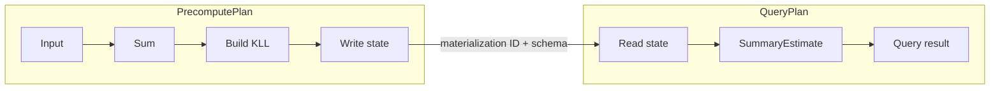

# Planner output to backend physical plans

Status: proposed backend architecture. Audience: developers changing the
Planner-to-backend compilation and execution boundary.

## Scope

This document defines how one selected ASAPPlanner semantic DAG becomes two
backend-executable plans:

- **PrecomputePlan** produces and maintains stored summary state.
- **QueryPlan** reads stored state and computes query results.

The two plans share catalog identities and state contracts defined by the
[Summary Catalog and SDS design](summary-catalog-sds-architecture.md). The
[migration plan](asapplanner-migration-plan.md) describes how to reach this
architecture from the current implementation.

CollectorPlan and TransmissionPlan are outside the current implementation scope.
They may become additional projections of the same selected decision later, but
the backend migration must neither redesign them nor depend on ASAPCollector.

## Problem

The current `PrecomputePlan.executable_dags` can contain the complete selected
semantic DAG. For a query such as:

```text
Input -> Sum -> KLL -> SummaryEstimate -> QueryResult
```

`Input -> Sum -> KLL` is maintenance work. `SummaryEstimate -> QueryResult` is
query-time work. Storing the complete DAG under PrecomputePlan makes ownership
unclear even when bindings prevent query-time nodes from running during
maintenance. It also makes a PrecomputePlan visualization look as though
`SummaryEstimate` executes while state is being built.

The target design records one materialization boundary and derives two explicit
executable subgraphs. Semantic provenance remains available without placing
query-only operators in PrecomputePlan.

## Inputs and outputs

The physical compiler consumes:

- selected Planner DAG roots and their query associations;
- query requirements, including accuracy and response constraints;
- complete lifecycle commitments for the supported backend mode;
- backend capabilities and concrete implementation evidence;
- catalog, schema and deployment-generation inputs.

Capabilities restrict the choices the Planner may consider. For example, a
backend that can only build summaries from data at rest advertises only that
lifecycle. The Planner still models other lifecycle modes, but it must not select
one the backend cannot execute.

The compiler produces one coherent backend publication:

| Output | Responsibility |
| --- | --- |
| Summary Catalog/SDS entries | Define summary semantics, materialization identity, state schema and state references |
| PrecomputePlan | Execute maintenance subgraphs that terminate in stored-state writes |
| QueryPlan | Execute materialization reads, query-time summary operators and exact residuals |
| Provenance mapping | Relate physical nodes and state references to the selected semantic DAG |

These outputs are derived from the same compiler bindings. They must not make
independent choices about summary semantics, grouping, windows or schemas.

## Ownership

| Layer | Owns | Does not own |
| --- | --- | --- |
| ASAPPlanner | Semantic candidates, legality, accuracy reasoning and selection among advertised capabilities | Backend state IDs, storage schema or runtime installation |
| Physical compiler | Concrete implementation commitment, subgraph split, catalog bindings and plan generation | Re-optimizing a selected DAG at query time |
| Precompute runtime | Executing installed maintenance nodes and publishing state | Query result operators or selecting a different materialization |
| Query runtime | Reading bound state and executing installed query nodes | Creating missing summaries or searching the catalog for alternatives |
| SDS/catalog | Identity, schema, state references, readiness and lifecycle metadata | Operator scheduling or candidate ranking |

## Executable subgraphs and materialization boundaries

The compiler first binds every selected summary-producing node to one
materialization definition. It then cuts the selected DAG at stored-state
boundaries.



PrecomputePlan contains:

- source reads accepted by the maintenance runtime;
- exact or summary operators needed to produce stored state;
- reads of completed prior state for supported derived summaries;
- explicit stored-state sinks.

QueryPlan contains:

- explicit reads of materialized state;
- `SummaryEstimate`, merge and other query-time summary operations;
- exact residual subtrees and result composition;
- the configured fallback or unavailable-result behavior.

A semantic node may be represented inside a larger physical operation. The
provenance mapping records that relationship without requiring a one-to-one
physical node.

## Binding meanings

Bindings explain how semantic nodes map to the two physical plans. They do not
create a third execution phase.

| Binding | Meaning | Example |
| --- | --- | --- |
| `Materialization` | The node's output is written as stored summary state by PrecomputePlan | `KLL` in `KLL(sum(data))` |
| `MaintenanceInput` | The node executes in PrecomputePlan as an input or intermediate, but its output is not independently stored | `sum(data)` feeding the KLL builder |
| `Query` | The node maps to an explicit QueryPlan operation | `SummaryEstimate` reading the KLL state |
| `QueryInput` | The node contributes query semantics but is absorbed into another QueryPlan operation | A scalar parameter or predicate compiled into a bound read/operator |

“Maintenance” names an execution phase that constructs or updates state. It can
include initial batch construction, rebuilding, merging and derived-summary
construction; it does not imply incremental processing only. “Precompute” names
the backend plan and engine responsible for that work.

## Shared and derived materializations

Two queries may share a producer only when their bound definition and required
state partition are compatible. Sharing one producer must not multiply updates.
Each QueryPlan retains its own readout and result operators.

A derived materialization is still maintenance work:

```text
PrecomputePlan: Read completed state A -> derive state B -> store B
QueryPlan:      Read state B -> estimate -> result
```

The dependency on A is an explicit state reference with completeness and schema
requirements. QueryPlan does not execute the derivation on demand unless the
selected physical plan explicitly models it as query work.

## Validation and installation

Compilation and backend installation apply the same cross-plan checks:

- every state read resolves to one definition and permitted materialization;
- writer and reader agree on family, parameters, encoding and schema version;
- grouping, time partition, alignment and generation are compatible;
- every executable node is reachable from the correct plan root;
- each subgraph is acyclic and contains only operators supported in that phase;
- query fallback behavior is explicit;
- derived-state inputs satisfy their completeness requirement.

The backend stages the catalog, PrecomputePlan and QueryPlan as one generation.
They become visible atomically. Installation success does not mean state is ready:
until required coverage exists, QueryPlan follows its exact fallback or returns
explicit unavailability. Failed staging leaves the previous generation active.

## Visualization

The plan viewer renders PrecomputePlan and QueryPlan separately and connects them
with labeled state references. It shows materialization ID, state family/schema
and readiness where useful. Query-only nodes never appear inside the executable
PrecomputePlan view.

Legacy artifacts that embed complete semantic DAGs may be shown through a
projected view, but the UI must label that projection and identify which nodes
are maintenance-owned and query-owned. A separate semantic-plan page is not
required to understand the two executable plans.

## End-to-end acceptance cases

The design is complete when tests demonstrate:

1. `Input -> Sum -> KLL` executes only in PrecomputePlan, while
   `SummaryEstimate -> QueryResult` executes only in QueryPlan.
2. One query can read multiple bound summaries.
3. Two queries can share one compatible producer without duplicate updates.
4. A supported derived summary reads completed state and publishes a distinct
   state reference.
5. Wrong schema, grouping, time partition or generation fails before activation.
6. Staging failure, restart and generation switching preserve the previous
   consistent plan and documented fallback behavior.
7. The backend builds and runs these cases without ASAPCollector.

## Decisions and deferred work

We reject keeping the full semantic DAG as PrecomputePlan executable content:
bindings alone do not make plan ownership clear. We also reject compiling the
two plans independently because that permits identity and schema drift.

The selected semantic DAG may remain as provenance or diagnostic metadata. It is
not a third executable plan.

Deferred work includes CollectorPlan and TransmissionPlan compilation, distributed
activation, new transport/checkpoint protocols, Collector adoption of neutral
libraries and a broader ASAPPlanner API redesign.
