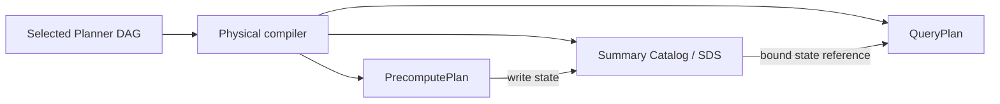

# Planner output to backend physical plans

Status: proposed backend architecture. Audience: developers changing the
Planner-to-backend compilation and execution boundary.

## Purpose and scope

This design splits one selected ASAPPlanner semantic DAG into two executable
backend plans:

- **PrecomputePlan** produces and maintains stored summary state.
- **QueryPlan** reads stored state and computes query results.

Both plans use identities and state contracts from the
[SDS design](summary-catalog-sds-architecture.md) and install as one generation.
The [migration plan](asapplanner-migration-plan.md) defines delivery steps.
CollectorPlan, TransmissionPlan and distributed activation are deferred; this
migration must not introduce a backend dependency on ASAPCollector.

## Document map

1. [Architecture at a glance](#architecture-at-a-glance)
2. [Worked example](#worked-example)
3. [Core concepts and ownership](#core-concepts-and-ownership)
4. [Compiler contract](#compiler-contract)
5. [Compilation rules](#compilation-rules)
6. [Runtime contract](#runtime-contract)
7. [Validation and acceptance](#validation-and-acceptance)
8. [Decisions and deferred work](#decisions-and-deferred-work)

## Architecture at a glance

The current `PrecomputePlan.executable_dags` can contain a complete semantic DAG,
including query-time nodes such as `SummaryEstimate`. Bindings may prevent those
nodes from running during maintenance, but the artifact and its visualization do
not express that ownership clearly.

The compiler instead binds stored summaries once and cuts the DAG at each
materialization boundary:



Semantic provenance remains available, but query-only operators are not
PrecomputePlan executable content.

## Worked example

Query `p99-api-latency` asks for the 99th percentile of five minutes of latency,
grouped by `service` and evaluated every minute. The YAML below is conceptual; it
is not the current serialized API schema.

### Compiler input

```yaml
selected_planner_dag:
  query_id: p99-api-latency
  query_language: clickhouse_sql
  query_expression: >-
    SELECT service, quantile(0.99)(request_latency_seconds)
    FROM metrics
    WHERE timestamp > now() - INTERVAL 5 MINUTE
    GROUP BY service
  root: estimate-p99
  nodes:
    - input: request_latency_seconds
    - group_by: [service]
    - build_summary: {algorithm: kll, k: 200}
    - estimate: {quantile: 0.99}

query_requirements:
  relative_error: 0.01
  response_latency_ms: 200

lifecycle_commitment:
  mode: batch_rebuild_from_data_at_rest
  rebuild_every: 1m
  retain_for: 10m

backend_capabilities_and_evidence:
  supported_modes: [batch_rebuild_from_data_at_rest]
  supported_algorithms: [kll]
  kll_200_state_bytes: 4096
  five_minute_rebuild_cpu_ms: 35

installation_context:
  catalog_version: 12
  state_schema: kll-v1
  plan_generation: 42
```

### Compiler output

```yaml
summary_catalog:
  definitions:
    - id: def-api-latency-kll
      input: request_latency_seconds
      group_by: [service]
      range: 5m
      algorithm: {kind: kll, k: 200}
  materializations:
    - id: mat-api-latency-kll-g42
      definition: def-api-latency-kll
      schema: kll-v1
      generation: 42

precompute_plan:
  generation: 42
  nodes:
    - {id: read-samples, op: ReadInput, metric: request_latency_seconds}
    - {id: group-service, op: GroupBy, labels: [service]}
    - {id: build-kll, op: BuildKll, k: 200}
    - {id: write-kll, op: WriteState,
       materialization: mat-api-latency-kll-g42}
  edges:
    - [read-samples, group-service]
    - [group-service, build-kll]
    - [build-kll, write-kll]

query_plan:
  generation: 42
  query_id: p99-api-latency
  query_language: clickhouse_sql
  query_expression: >-
    SELECT service, quantile(0.99)(request_latency_seconds)
    FROM metrics
    WHERE timestamp > now() - INTERVAL 5 MINUTE
    GROUP BY service
  nodes:
    - {id: read-kll, op: ReadState,
       materialization: mat-api-latency-kll-g42, schema: kll-v1}
    - {id: estimate-p99, op: SummaryEstimate, quantile: 0.99}
    - {id: result, op: QueryResult}
  edges:
    - [read-kll, estimate-p99]
    - [estimate-p99, result]

provenance:
  planner.build_summary: [precompute.build-kll, precompute.write-kll]
  planner.estimate-p99: [query.read-kll, query.estimate-p99]
```

`mat-api-latency-kll-g42` is the join point: PrecomputePlan writes it,
QueryPlan reads it, and SDS defines its meaning and schema. Provenance relates
both physical projections to the selected DAG without making that DAG executable
inside PrecomputePlan.

## Core concepts and ownership

“Maintenance” is the execution phase that constructs or updates state, including
batch construction, rebuilding, merging and derived summaries. “Precompute” names
the plan and engine responsible for that work; it does not imply incremental
maintenance.

Bindings describe the semantic-to-physical mapping:

| Binding | Meaning | Example |
| --- | --- | --- |
| `Materialization` | PrecomputePlan stores this node's output | `KLL` in `KLL(sum(data))` |
| `MaintenanceInput` | PrecomputePlan executes this input/intermediate without storing it independently | `sum(data)` feeding KLL |
| `Query` | The node maps to an explicit QueryPlan operation | `SummaryEstimate` |
| `QueryInput` | Query semantics are absorbed into another physical operation | A quantile parameter compiled into `SummaryEstimate` |

| Layer | Owns |
| --- | --- |
| ASAPPlanner | Semantic candidates, legality, accuracy reasoning and selection among advertised capabilities |
| Physical compiler | Concrete implementation, subgraph split, catalog bindings and plan generation |
| Precompute runtime | Installed maintenance nodes and state publication |
| Query runtime | Bound state reads, query operators, exact residuals and fallback |
| SDS/catalog | Definition, materialization, schema, state reference, readiness and lifecycle metadata |

## Compiler contract

The compiler consumes:

- selected Planner DAG roots and query associations;
- query accuracy and response requirements;
- complete lifecycle commitments for the supported backend mode;
- backend capabilities and concrete implementation evidence;
- catalog, schema and deployment-generation inputs.

Capabilities constrain Planner choices. A data-at-rest-only backend advertises
only batch construction; recurring query demand does not imply incremental
support.

| Output | Responsibility |
| --- | --- |
| Catalog/SDS entries | Summary semantics, materialization identity, schema and state references |
| PrecomputePlan | Maintenance subgraphs ending in state writes |
| QueryPlan | Bound state reads, query operators and exact residuals |
| Provenance | Physical-to-semantic node mapping |

The compiler derives all four outputs from the same bindings. They cannot choose
summary semantics, grouping, time ranges or schemas independently.

## Compilation rules

### Executable subgraphs and materialization boundaries

For every selected stored summary, the compiler:

1. Creates or reuses one compatible summary definition and materialization.
2. Places source reads, maintenance operators, derived-state reads and the state
   sink in PrecomputePlan.
3. Replaces the stored-summary edge in QueryPlan with an explicit state read.
4. Places `SummaryEstimate`, merges, exact residuals and result composition in
   QueryPlan.
5. Records provenance for semantic nodes absorbed into larger physical nodes.

Two queries may share a producer only when their definition and state partition
are compatible. Sharing does not multiply maintenance updates; each query keeps
its own readout operators.

A derived materialization reads completed state explicitly:

```text
PrecomputePlan: Read state A -> derive state B -> store B
QueryPlan:      Read state B -> estimate -> result
```

## Runtime contract

The backend stages the catalog and both plans as one generation and exposes them
atomically. Failed staging leaves the previous generation active.

Installation and readiness are distinct. Until required state coverage exists,
QueryPlan uses its configured exact fallback or returns explicit unavailability.
The query runtime follows installed state references; it does not search the
catalog for alternative summaries.

Visualization renders PrecomputePlan and QueryPlan separately, connected by
labeled materialization references. Legacy full-DAG artifacts may use a projected
view, but it must label maintenance-owned and query-owned nodes.

## Validation and acceptance

Compilation and installation reject unresolved state references, schema/encoding
mismatches, incompatible grouping or time partitions, wrong generations, cycles,
unsupported phase operators and unsatisfied derived-state completeness.

Acceptance tests demonstrate:

1. Summary construction executes only in PrecomputePlan and estimation only in
   QueryPlan.
2. One query can read multiple summaries and two queries can share one producer.
3. Derived summaries honor completion and schema requirements.
4. Invalid cross-plan bindings fail before activation.
5. Staging failure, restart and generation switching preserve consistency and
   documented fallback behavior.
6. The backend builds and runs these cases without ASAPCollector.

## Decisions and deferred work

The full semantic DAG is retained only as provenance or diagnostic metadata;
bindings alone do not make it valid PrecomputePlan executable content. The two
physical plans are not compiled independently because that permits identity and
schema drift.

Deferred work includes CollectorPlan and TransmissionPlan compilation, distributed
activation, new transport/checkpoint protocols, Collector adoption of neutral
libraries and a broader ASAPPlanner API redesign.
