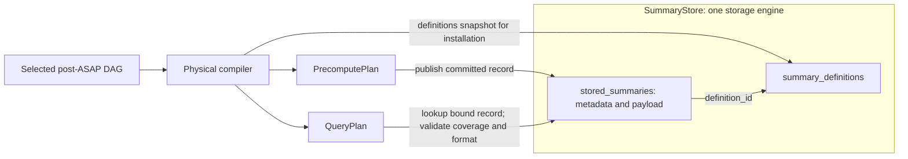

# Planner output to backend physical plans

Status: proposed backend architecture. Audience: developers changing the
Planner-to-backend compilation and execution boundary.

Terminology: [Planner/backend glossary](planner-backend-glossary.md).

## Purpose and scope

This design splits one selected post-ASAP DAG from ASAPPlanner into two executable
backend plans:

- **PrecomputePlan** produces and maintains stored summary state.
- **QueryPlan** reads stored state and computes query results.

Both plans use identities and state contracts from the
[SDS design](summary-catalog-sds-architecture.md) and install as one plan version.
The [migration plan](asapplanner-migration-plan.md) defines delivery steps.
CollectorPlan, TransmissionPlan and distributed activation are deferred; this
migration must not introduce a backend dependency on ASAPCollector.

## Document map

1. [Architecture at a glance](#architecture-at-a-glance)
2. [Design definitions and selection](#design-definitions-and-selection)
   - [Worked example](#worked-example)
3. [Core concepts and ownership](#core-concepts-and-ownership)
4. [Compiler contract](#compiler-contract)
5. [Compilation rules](#compilation-rules)
6. [Runtime contract](#runtime-contract)
7. [Validation and acceptance](#validation-and-acceptance)
8. [Decisions and deferred work](#decisions-and-deferred-work)

## Architecture at a glance

The current `PrecomputePlan.executable_dags` can contain a complete post-ASAP DAG,
including query-time nodes such as `SummaryEstimate`. Bindings may prevent those
nodes from running during maintenance, but the artifact and its visualization do
not express that ownership clearly.

This is a representation defect tracked by
[issue #740](https://github.com/ProjectASAP/ASAPQuery-backend/issues/740).
The target design requires separate executable projections.

The compiler instead binds stored summaries once and cuts the DAG at each
materialization boundary:



SDS is the contract across these bindings, catalog definitions, runtime
instances and payloads; it is not a separate store. Semantic provenance remains
available, but query-only operators are not PrecomputePlan executable content.

## Design definitions and selection

Audience: developers implementing the Planner/backend boundary. The definitions
below describe the target design; the YAML that follows illustrates that design
and is not a serialized Rust API. Implementations should adapt existing types
where they express these requirements rather than introduce duplicate models.

### Existing representation and target boundary

The selected post-ASAP DAG describes the selected computation: source operations,
summary producers, shared dependencies and query readouts. Maintenance decisions
are associated with its summary producers through plan-scoped node identities.

Planner's `SummaryMaintenanceLifecyclePlan` contains a materialized DAG `root`
and a `deployments` collection, with one entry per unique reachable `SummaryAgg`.
Each deployment identifies its `post_asap_node_id` and carries an optional
`SummaryMaintenanceLifecycleGuarantee`, considered alternatives and a selected
window framework. The plan also carries workload demand and costing context.
Thus the lifecycle plan already refers to the computation DAG; it is not a
separate query representation, nor is one whole lifecycle plan required per
producer. If a deployment's guarantee is `None`, Planner selected no feasible
maintenance alternative for that producer. The backend must not invent a
maintenance mode or schedule for it; a query requiring that stored state needs
an explicit supported fallback, or plan installation must fail.

See the Planner
[lifecycle plan types](https://github.com/ProjectASAP/ASAPPlanner/blob/ba1c4436a3410dc03a133363ab5b75649e70f97a/crates/asap-aware-mapping/src/summary_maintenance_lifecycle.rs)
and [guarantee vocabulary](https://github.com/ProjectASAP/ASAPPlanner/blob/ba1c4436a3410dc03a133363ab5b75649e70f97a/crates/types/src/post_asap/summary_maintenance_lifecycle.rs).
These describe the referenced Planner revision, not a claim that every field
below is already supported by the backend's pinned dependency.

The backend currently records physical node ownership with
[`BackendExecutableBinding`](../../crates/asap_types/src/executable_plan.rs).
The target compiler consumes the selected computation and its maintenance
decisions together, validates them against backend support, and emits the two
physical plans plus catalog bindings. A shared producer is maintained once for
all compatible consumers.

### Selected deployment guarantee and schedule/retention

For each logical summary producer, the selected deployment guarantee and its
schedule/retention specify how the producer's state is built and kept available.
These are decisions within `SummaryMaintenanceLifecyclePlan`, not another model.

For example, suppose two queries share a five-minute KLL summary and need a
readout at every UTC minute. The selected deployment says to rebuild that
producer from stored rows at each minute boundary and retain completed snapshots
for ten minutes. The DAG alone identifies the shared KLL computation, but does
not tell the backend to produce every required endpoint or keep its snapshot
available. If the backend independently refreshes every five minutes, four of
five requested endpoints lack matching state; serving an older snapshot as if
it covered the requested interval changes the query result. The requirement is
to carry and validate the existing selected deployment decision, not to add a
new planning object.

| Field in the example | Definition and constraint |
| --- | --- |
| `producer` | Node identity in the selected DAG; must resolve to a stored summary producer. |
| `mode` | Selected construction/update method. `batch_rebuild_from_data_at_rest` reads persisted input and constructs replacement state for each required coverage interval. |
| `refresh.every` | Spacing of scheduled evaluation endpoints, not elapsed time after the preceding build finishes. |
| `refresh.anchor` | Origin of that schedule; `unix_epoch` with `every: 1m` yields UTC minute boundaries. |
| `retention.completed_state_for` | Minimum duration to retain each completed output snapshot after publication. It is independent of input coverage and raw-data retention. |
| `implementation` | Backend implementation selected to fulfill the selected guarantee and schedule/retention. |

For each endpoint `T`, a rebuild reads exactly the logical input interval for
`T` and publishes state labeled with that coverage. Publication after `T` does
not change the interval. Retention expiry makes a snapshot eligible for cleanup
only after readers and dependent producers release it. A missed or unfinished
build leaves that endpoint unready; the configured fallback/unavailability
policy applies. Reusing an older snapshot requires an explicit query freshness
policy and must not silently change query time semantics.

Planner supplies legal maintenance alternatives. The backend supplies executable
implementations and evidence; the control plane commits a feasible selection.
Concrete engine and implementation IDs remain in backend bindings, not Planner
IR. The backend binds each producer to its implementation, placement, state
schema and active plan version, following the
[planner-runtime contract](https://github.com/ProjectASAP/ASAPPlanner/blob/f46cbf6c5738db2f4460d419baa8af5572f5276a/docs/design_docs/architecture/planner-runtime-contract.md).
The compiler validates the selected deployment guarantee and schedule/retention
without silently changing the mode, coverage or sharing. A changed selection is
installed through a new plan version. It need not change the semantic summary
definition when only the physical maintenance policy changes.

### Backend capability

A **backend capability** is an implementation provider's declaration of a
supported combination of algorithm, parameters, maintenance mode, input kind,
window behavior and state schema. It answers whether a proposed realization can
execute faithfully. Independent global lists of algorithms and modes would
incorrectly imply support for every combination.

Each capability record has an `implementation` identity, an `algorithm`
configuration, `maintenance_modes`, `input_kind`, `window_support`, and
`state_schema`. The compiler must match the whole record. The example declares
only KLL with `k: 200`, batch rebuilding from stored rows, and complete snapshots
for the requested logical range. It does not establish incremental maintenance
or arbitrary parameter support. A readout implementation alone does not prove
the corresponding producer is supported.

### Physical cost evidence

**Physical cost evidence** is a scoped estimate or measurement for one
implementation/configuration and maintenance mode. It is supplied by the backend
provider and used when comparing feasible alternatives over the same planning
horizon. It is separate from both capability and the selected deployment
guarantee and schedule/retention.

An evidence record identifies the implementation, algorithm parameters, mode,
input range, sample count, group count and execution profile. It declares whether
numbers are measured or modeled, their provenance and applicability period.
Measured evidence needs a benchmark identity/time; modeled evidence needs a model
version and assumptions. Missing or stale evidence is not zero cost.

`state_bytes_per_group` measures one completed summary payload;
`rebuild_cpu_ms_total` measures CPU time for one rebuild across all declared
groups. CPU time is not wall-clock completion latency. Memory, temporary build
space, retained snapshots, I/O and query readout must also be costed before
claiming a complete deployment cost. A five-minute range alone does not determine
sample count or CPU cost.

### Selection and validation

```text
Selected computation and lifecycle alternatives
    + backend capabilities: supported combinations
    + scoped cost evidence: resource costs of those combinations
        -> selected deployment guarantee and schedule/retention per producer
        -> physical compiler validation
        -> PrecomputePlan + QueryPlan + catalog bindings
```

Before installation, validate producer identity, supported algorithm/mode/schema,
schedule and coverage, retention sufficient for dependent reads, accuracy and
query requirements, and the scope/completeness of cost evidence. Reject an
inconsistent binding instead of inventing missing maintenance policy. Where the
planning interface supports exact fallback, select that explicitly.

The existing binding/compiler path is the migration starting point. Adapters
must map existing Planner guarantees and backend capabilities into these
requirements, reporting unsupported fields. The plan split must preserve those
decisions in writer and reader bindings. New wire schemas and concrete scheduling
support are implementation work; this document defines their required behavior.

## Worked example

Query `p99-api-latency` asks for the 99th percentile of five minutes of latency,
grouped by `service` and evaluated every minute. The YAML below is conceptual; it
is not the current serialized API schema. Resource numbers are fictional,
illustrating units and scope only; they are not benchmark evidence or proof that
this candidate meets accuracy, cost or latency requirements.

### Compiler input

```yaml
selected_planner_dag:
  query_id: p99-api-latency
  query_language: clickhouse_sql
  query_expression: >-
    SELECT service, quantile(0.99)(request_latency_seconds)
    FROM metrics
    WHERE timestamp > :evaluation_time - INTERVAL 5 MINUTE
      AND timestamp <= :evaluation_time
    GROUP BY service
  root: estimate-p99
  nodes:
    - input: request_latency_seconds
    - group_by: [service]
    - id: build-kll
      build_summary: {algorithm: kll, k: 200}
    - estimate: {quantile: 0.99}

query_requirements:
  accuracy: supplied_by_selected_planner_guarantee
  response_latency_ms: 200

selected_deployment:
  producer: build-kll
  implementation: local-kll-batch-v1
  mode: batch_rebuild_from_data_at_rest
  refresh: {every: 1m, anchor: unix_epoch}
  retention: {completed_state_for: 10m}

backend_capabilities:
  - implementation: local-kll-batch-v1
    algorithm: {kind: kll, k: 200}
    maintenance_modes: [batch_rebuild_from_data_at_rest]
    input_kind: stored_rows
    window_support: complete_snapshot_for_requested_range
    state_schema: kll-v1

physical_cost_evidence:
  - implementation: local-kll-batch-v1
    algorithm: {kind: kll, k: 200}
    mode: batch_rebuild_from_data_at_rest
    workload: {input_range: 5m, samples_per_group: 300, groups: 100}
    execution_profile: illustrative-local-worker
    provenance: {kind: illustrative, usable_for_selection: false}
    costs: {state_bytes_per_group: 4096, rebuild_cpu_ms_total: 35}

installation_context:
  catalog_version: 12
  state_schema: kll-v1
  plan_version: 42
```

### Compiler output

```yaml
summary_definitions:
  definitions:
    - id: def-api-latency-kll
      input: request_latency_seconds
      group_by: [service]
      range: 5m
      algorithm: {kind: kll, k: 200}

precompute_plan:
  plan_version: 42
  nodes:
    - {id: read-samples, op: ReadInput, metric: request_latency_seconds}
    - {id: group-service, op: GroupBy, labels: [service]}
    - {id: build-kll, op: BuildKll, k: 200}
    - id: write-kll
      op: WriteState
      reference: {stored_output_id: latency-kll, definition_id: def-api-latency-kll}
      schema: kll-v1
      encoding: kll-binary-v1
      partition_by: [service, window_end]
  edges:
    - [read-samples, group-service]
    - [group-service, build-kll]
    - [build-kll, write-kll]

query_plan:
  plan_version: 42
  query_id: p99-api-latency
  query_language: clickhouse_sql
  query_expression: >-
    SELECT service, quantile(0.99)(request_latency_seconds)
    FROM metrics
    WHERE timestamp > :evaluation_time - INTERVAL 5 MINUTE
      AND timestamp <= :evaluation_time
    GROUP BY service
  nodes:
    - id: read-kll
      op: ReadState
      reference: {stored_output_id: latency-kll, definition_id: def-api-latency-kll}
      expected_schema: kll-v1
      expected_encoding: kll-binary-v1
      partition: {service: all_requested_services, window_end: evaluation_time}
    - {id: estimate-p99, op: SummaryEstimate, quantile: 0.99}
    - {id: result, op: QueryResult}
  edges:
    - [read-kll, estimate-p99]
    - [estimate-p99, result]

provenance:
  planner.build_summary: [precompute.build-kll, precompute.write-kll]
  planner.estimate-p99: [query.read-kll, query.estimate-p99]
```

`latency-kll` is the stored output shared by the writer and reader in plan version
42. The catalog defines its summary semantics; the matching executable bindings
declare format and partition rules. There is no separate catalog materialization
object. Provenance relates
both physical projections to the selected DAG without making that DAG executable
inside PrecomputePlan.

Here `range: 5m` denotes logical coverage `(T - 5m, T]`, not pane size,
refresh cadence, state retention or scrape interval. `ReadInput` is parameterized
by the scheduled endpoint and that range; `WriteState` publishes a completed
snapshot per service and endpoint. `ReadState` selects the snapshot matching the
requested endpoint and checks readiness. The ten-minute retention keeps older
completed snapshots available; it does not turn the summary into a ten-minute
aggregate. The illustrative KLL parameters alone do not establish a particular
accuracy guarantee, and CPU cost alone does not establish the 200 ms latency
requirement.

## Core concepts and ownership

“Maintenance” is the execution phase that constructs or updates state, including
batch construction, rebuilding, merging and derived summaries. “Precompute” names
the plan and engine responsible for that work; it does not imply incremental
maintenance.

Bindings describe the semantic-to-physical mapping:

| Binding | Meaning | Example |
| --- | --- | --- |
| `Materialization` | PrecomputePlan stores this node's output | `KLL` in `KLL(sum(data))` |
| `MaintenanceInput` | PrecomputePlan executes this input/intermediate without storing it independently | `sum(data)` feeding KLL |
| `Query` | The node maps to an explicit QueryPlan operation | `SummaryEstimate` |
| `QueryInput` | Query semantics are absorbed into another physical operation | A quantile parameter compiled into `SummaryEstimate` |

`Materialization` above is the existing backend node-binding variant marking
stored output. It does not create a separate catalog object. The compiler assigns
that output a `stored_output_id` and emits matching writer/reader bindings; see
[field ownership and migration](summary-catalog-sds-architecture.md#core-objects).

| Layer | Owns |
| --- | --- |
| ASAPPlanner | Semantic candidates, legality, accuracy reasoning and selection among advertised capabilities |
| Physical compiler | Concrete implementation, subgraph split, catalog bindings and plan version |
| Precompute runtime | Installed maintenance nodes and state publication |
| Query runtime | Bound state reads, query operators, exact residuals and fallback |
| Definitions snapshot | Compiler-supplied rows validated and registered in `SummaryStore.summary_definitions` at installation |
| Plan read/write bindings | State references, format, partition rules and writer ownership |
| `SummaryStore` | Owns `summary_definitions` and `stored_summaries`; the latter holds committed metadata and payload together |

## Compiler contract

The compiler consumes:

- selected Planner DAG roots and query associations;
- query accuracy and response requirements;
- each selected deployment guarantee and its schedule/retention for the
  supported backend mode;
- backend capabilities and concrete implementation evidence;
- catalog, schema and plan-version inputs.

Capabilities constrain Planner choices. A data-at-rest-only backend advertises
only batch construction; recurring query demand does not imply incremental
support.

| Output | Responsibility |
| --- | --- |
| Definition rows | `summary_definitions` rows referenced by the plans |
| PrecomputePlan | Maintenance subgraphs ending in state writes |
| QueryPlan | Bound state reads, query operators and exact residuals |
| Provenance | Physical-to-semantic node mapping |

The compiler derives all four outputs from the same bindings. They cannot choose
summary semantics, grouping, time ranges or schemas independently.

## Compilation rules

### Executable subgraphs and materialization boundaries

For every selected stored summary, the compiler:

1. Creates or reuses a compatible summary definition and assigns the persisted
   DAG output a `stored_output_id` within the plan version. No standalone catalog
   materialization is created.
2. Places source reads, maintenance operators, derived-state reads and the state
   sink in PrecomputePlan.
3. Replaces the stored-summary edge in QueryPlan with an explicit state read
   referencing the same stored output and definition, with matching format and partition
   rules. Writer identity belongs to the PrecomputePlan binding.
4. Places `SummaryEstimate`, merges, exact residuals and result composition in
   QueryPlan.
5. Records provenance for semantic nodes absorbed into larger physical nodes.

Two queries may share a producer only when their definition and state partition
are compatible. Sharing does not multiply maintenance updates; each query keeps
its own readout operators.

A summary built from completed stored summaries uses explicit source reads and
a separate destination output. For example, five compatible one-minute KLL states
can be merged into a stored five-minute KLL if coverage and accuracy permit it.
A merge used only to answer a query belongs in QueryPlan and creates no stored
destination:

```text
PrecomputePlan: Read state A -> derive state B -> store B
QueryPlan:      Read state B -> estimate -> result
```

## Runtime contract

The backend stages the catalog and both plans as one plan version and exposes them
atomically. Failed staging leaves the previous plan version active.

Installation and readiness are distinct. Until required state coverage exists,
QueryPlan uses its configured exact fallback or returns explicit unavailability.
The query runtime follows installed state references; it does not search the
catalog for alternative summaries.

Visualization renders PrecomputePlan and QueryPlan separately, connected by
labeled state references. Legacy full-DAG artifacts may use a projected
view, but it must label maintenance-owned and query-owned nodes.

## Validation and acceptance

Compilation and installation reject unresolved state references, schema/encoding
mismatches, incompatible grouping or time partitions, wrong plan versions, cycles,
unsupported phase operators and unsatisfied derived-state completeness.

Acceptance tests demonstrate:

1. Summary construction executes only in PrecomputePlan and estimation only in
   QueryPlan.
2. One query can read multiple summaries and two queries can share one producer.
3. Derived summaries honor completion and schema requirements.
4. Invalid cross-plan bindings fail before activation.
5. Staging failure, restart and plan version switching preserve consistency and
   documented fallback behavior.
6. The backend builds and runs these cases without ASAPCollector.

## Decisions and deferred work

The selected post-ASAP DAG is retained only as provenance or diagnostic metadata;
bindings alone do not make it valid PrecomputePlan executable content. The two
physical plans are not compiled independently because that permits identity and
schema drift.

Deferred work includes CollectorPlan and TransmissionPlan compilation, distributed
activation, new transport/checkpoint protocols, Collector adoption of neutral
libraries and a broader ASAPPlanner API redesign.
