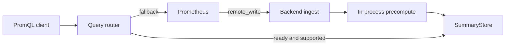

# ASAPQuery compatibility profile

> Status: implemented; wider maintenance capabilities retain separate admission gates.
>
> Reference: [ProjectASAP/ASAPQuery at `9fb051a`](https://github.com/ProjectASAP/ASAPQuery/tree/9fb051aa798361fca8e3012835412cb6fa338a0c)

The `asapquery` profile is a strict, startup-validated subset of
ASAPQuery-backend. It accepts raw Prometheus Remote Write samples, builds
summaries in process, serves supported PromQL and falls back to Prometheus. It
does not depend on ASAPCollector.

## Document map

1. [Profile at a glance](#profile-at-a-glance)
2. [Worked example](#worked-example)
3. [Profile boundary](#profile-boundary)
4. [Planning and runtime contracts](#planning-and-runtime-contracts)
5. [Remote Write contract](#remote-write-contract)
6. [Query and fallback contract](#query-and-fallback-contract)
7. [Activation and readiness](#activation-and-readiness)
8. [Compatibility evidence](#compatibility-evidence)
9. [Completion and extensions](#completion-and-extensions)

## Profile at a glance



Prometheus remains the exact raw-data authority. The backend accelerates only
installed queries whose summary state is complete, fresh and accurate enough.
Unsupported, unsafe, stale or not-yet-ready queries follow the explicit fallback.

Planning uses configured `QueryWorkload` and `DataWorkload`, canonical
ASAPPlanner selection and a backend-only physical compiler:

```text
workloads -> ASAPPlanner -> selected candidate -> backend compiler
                                             -> SummaryCatalog
                                             -> PrecomputePlan
                                             -> QueryPlan
```

The three outputs share plan and materialization identities and activate as one
immutable version.

## Worked example

An operator configures a repeating five-minute sum query and Prometheus sends raw
samples to the backend:

```yaml
profile: asapquery
prometheus_fallback: http://prometheus:9090
query_workload:
  - id: api-request-sum
    expression: sum_over_time(api_requests_total[5m])
    every: 1m
data_workload:
  metric: api_requests_total
  ingestion_rate: 10000
```

Startup compiles a backend-local materialization, installs inactive query routes
and begins accepting Remote Write. Before five minutes of complete coverage, the
query is forwarded to Prometheus. When the materialization becomes ready, the
same request is served from SummaryStore. An unsupported expression such as
`absent(up)` continues to fall back.

```text
request -> active QueryPlan?
        -> supported binding?
        -> complete and fresh state?
        yes: summary result
        no:  semantically equivalent Prometheus request
```

## Profile boundary

Required:

- `POST /api/v1/write` Remote Write v1 with Snappy/protobuf decoding;
- raw scalar samples, stale markers and canonical labels;
- backend-local streaming precompute, windowing and lateness handling;
- in-process SummaryStore and Prometheus-compatible instant/range endpoints;
- startup workload snapshots, canonical Planner invocation and physical compile;
- atomic activation, readiness gating and explicit Prometheus fallback;
- a self-contained compatibility demo and end-to-end test.

Disabled and not startup dependencies:

- ASAPCollector, CollectorPlan, SDKPlan, OpAMP and collector activation;
- OTLP/prebuilt-summary ingestion and external summary producers;
- sampling, GOS, sparse delta transmission and frame ACK protocols;
- non-Prometheus ingest adapters and non-PromQL query protocols;
- durable/cold tiers and distributed placement or merging.

These capabilities may exist in broader ASAPQuery-backend profiles.

## Planning and runtime contracts

| Component | Responsibility |
| --- | --- |
| ASAPPlanner | Query semantics, sharing, abstract candidates, accuracy, lifecycle choices and exact fallback |
| Control plane | Load workloads, advertise backend-local implementations/costs, compile and activate one physical version |
| Remote Write adapter | Decode and validate wire input; emit canonical raw samples |
| Precompute runtime | Route series, maintain windows/accumulators and publish state |
| SummaryStore | Index state by materialization, labels and logical window; track coverage/readiness |
| Query path | Execute the installed QueryPlan or forward an equivalent request to Prometheus |

The backend does not restore ASAPQuery's historical planner or precompute engine.
Historical fixes remain a migration source and require regression tests or an
explicit inapplicability record. The audit includes idle/trailing-window closure,
wall-clock safety, pane eviction, millisecond windows, value routing,
CMS-with-heap parameters and accumulator routing.

A candidate without backend-local materialization and readout support is
unavailable; it never receives optimistic zero cost. Request handling does not
perform planning or choose a substitute materialization.

## Remote Write contract

The adapter performs:

```text
limits -> Snappy decode -> WriteRequest decode -> sample/label validation
       -> stale-marker recognition -> canonical series key -> active plan routing
```

Only v1 scalar samples are supported. The exact Prometheus stale-NaN marker is
recognized, deduplicated and counted, then excluded from numeric aggregation.
Other non-finite values, native histograms and exemplars are rejected.

Within the in-memory dedup horizon, identical series/timestamp/value input is a
duplicate and a conflicting value is rejected. The receiver validates the batch
and reserves all queue capacity before enqueueing. A `204` acknowledges admission
and dedup bookkeeping, not accumulator mutation or durable commit.

| Condition | Result |
| --- | --- |
| Invalid batch | Fail before enqueueing |
| Queue/dedup capacity exhausted | Retryable `503` |
| Body or decoded size limit exceeded | `413` |
| Process restart | No raw WAL or dedup recovery; Prometheus remains authority |

Remote Write provides no producer roster or authoritative watermark. Finite
`POST /api/v1/precompute/drain` closes one input generation; it does not prove
continuous completion. See [summary completeness](continuous-summary-completeness.md).

## Query and fallback contract

The public surface is:

```text
GET or POST /api/v1/query
GET or POST /api/v1/query_range
```

The adapter preserves `query`, `time`, `start`, `end`, `step`, `timeout`, tenant
and authorization semantics. It either executes the active QueryPlan with exact
catalog bindings or forwards a semantically equivalent request to Prometheus.

Parse failure, unsupported expressions, inactive plans, store misses, incomplete
or stale windows and insufficient accuracy are never successful empty summary
results. They fall back or return an error when fallback is unavailable.

The first compatibility level covers raw scalar samples, canonical grouping,
tumbling-window sum, Prometheus `rate` and `increase`, one sketch-backed quantile,
and instant/range evaluation. Other expressions fall back. Expanding this set
requires a versioned compatibility level and conformance tests.

## Activation and readiness

```text
verify fallback -> load workloads -> select -> compile
  -> atomically install catalog + precompute + inactive query routes
  -> accept writes and fall back queries
  -> materialize complete coverage
  -> mark each eligible route serving
```

The lifecycle is `Compiled -> Installed -> Materializing -> Ready -> Serving`.
Installation is the atomic configuration boundary; readiness describes runtime
coverage. A replacement never exposes mixed parameters from old and new plans.
Until the new version is warm, the previous compatible route or Prometheus is
authoritative.

After restart, pre-crash partial windows remain incomplete and cannot combine
with post-restart samples. They require explicit backfill; otherwise serving
starts with the first complete post-restart window.

## Compatibility evidence

| Area | Required executable evidence |
| --- | --- |
| Startup | Collector-free profile validation and fallback health gate |
| Planning | Deterministic workload, selected candidate, catalog and two backend plans |
| Remote Write | Reference decoding, stale markers, limits, dedup and backpressure |
| Precompute/store | Planned families, complete windows and canonical state identity |
| Query | Instant/range summary execution plus captured fallback requests |
| Activation | Stage/activate failure tests and readiness assertions |
| Deployment | `./scripts/e2e.sh asapquery-demo` with no Collector |

The E2E query matrix compares every backend result with the same Prometheus:

| Case | Instant | Range |
| --- | --- | --- |
| `rate(counter[window])` | Required | Every returned step |
| `increase(counter[window])` | Required | Every returned step |
| Planned sum | Required | Required |
| Planned sketch quantile | Required | Required |
| Unsupported expression | Exact fallback | Exact fallback |

Counter fixtures cover reset, irregular spacing and boundary samples. Assertions
include values, labels, timestamps, result type and range-step count; HTTP success
alone is insufficient. The run records workload/Planner artifacts, active IDs,
route decisions, coverage, freshness, error, latency, CPU and memory.

## Completion and extensions

The executable completion command is:

```bash
./scripts/e2e.sh asapquery-demo
```

It must fail when ingestion, planning, activation, coverage, accuracy, counter
semantics, range equivalence or fallback evidence is missing. Starting components
or exposing `/api/v1/write` alone is not completion.

SQL is the first intended query extension. It must translate into canonical
Planner semantics and reuse the same catalog, readiness, store and fallback
contracts. Optional CSV/JSON adapters may emit the same canonical raw-sample
records but cannot choose aggregations or bypass PrecomputePlan.
