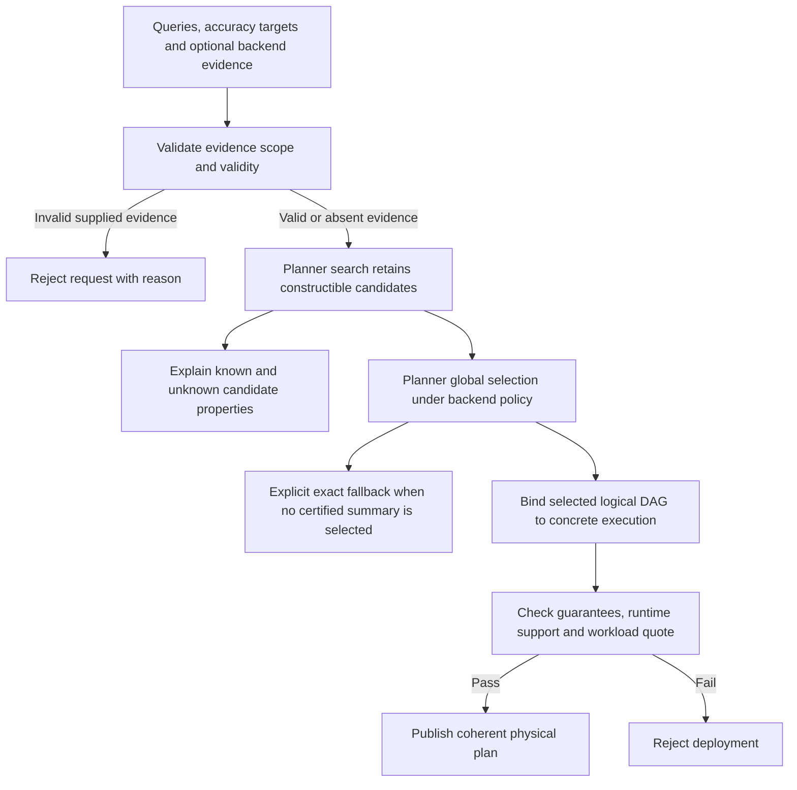
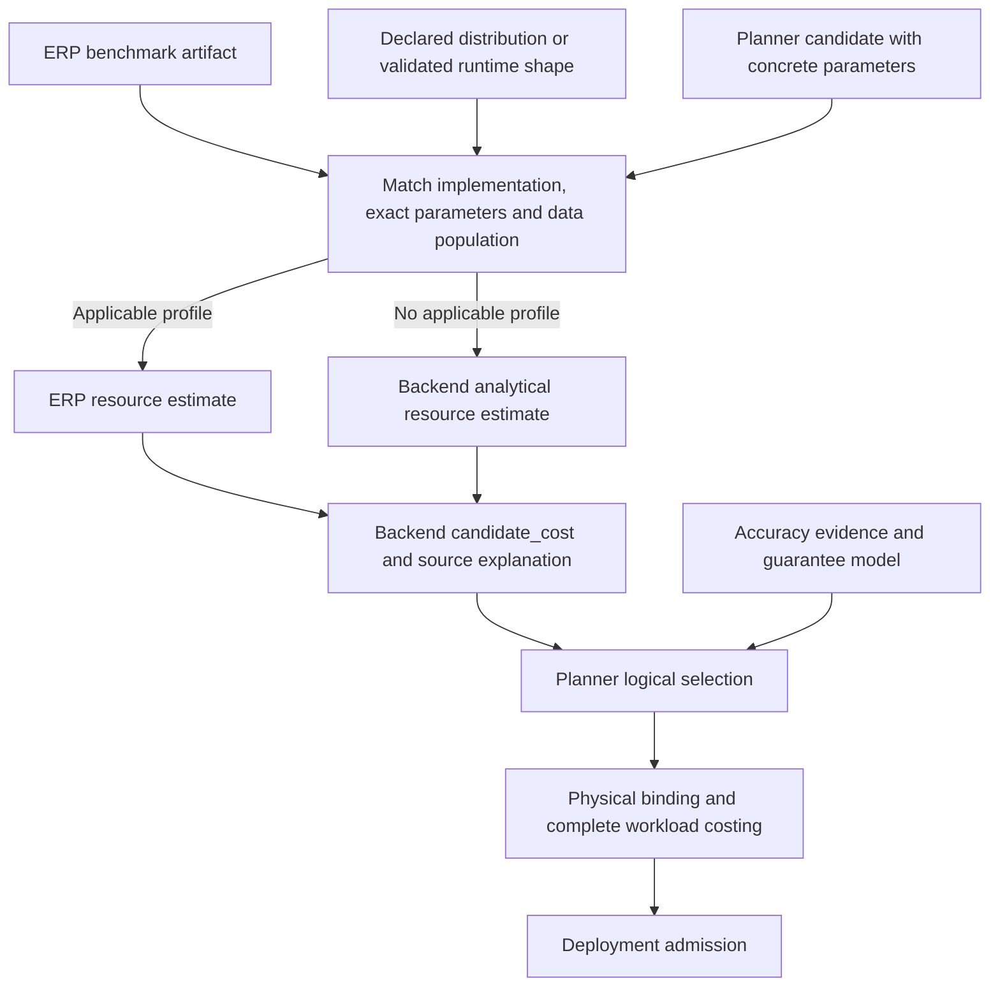

# Evidence-dependent candidate selection and deployment

Status: design implemented by backend PR #761 against ASAPPlanner #455
(`2ec3fc80`). This document defines the backend decision boundary for Planner
issue #454 and backend issue #752. It does not claim that every retained
candidate has a deployable implementation.

## Decision and ownership

Keep constructible candidates visible when external evidence is absent.
Separate candidate existence, logical selection, and deployment admission:
none implies the next. Otherwise the backend either loses a candidate it
could prove valid or deploys one whose guarantee has never been established.

| Decision | Owner | Required behavior |
| --- | --- | --- |
| Construct semantic candidates | Planner | Preserve unknown guarantees; reject known-invalid evidence and impossible shapes |
| Supply external facts | Backend | Bind evidence to the query, data population, snapshot and validity period |
| Derive accuracy and select logical roots | Planner, under backend models and policy | Respect the root accuracy target; missing proof is not certification |
| Bind and admit a deployment | Backend | Verify concrete execution support and complete workload cost evidence |

The backend still invokes Planner's workload search and global selection. It
does not introduce a second semantic optimizer. Physical binding preserves the
selected DAG's operators, grouping, windows and dependencies; a semantic change
requires a new selection. The legacy first-candidate helper remains a witness
API and cannot authorize deployment.

## Decision flow

Exact fallback is part of normal logical planning. A directly supplied summary
plan with missing or unknown readout guarantees fails physical compilation;
there is no promise that every compilation error retries another candidate.
An exact route must itself be available under the deployment's existing policy.

## Evidence contract

Evidence belongs to an exact query text, full data workload and data snapshot.
It also names its source, observation time and validity window. The backend
rejects mismatched, expired, future-dated or invalid records before selection.
Discovery without a workload quote needs an explicit data snapshot; when both
are supplied, their snapshot identities must agree. Queries with individual
certificates are isolated during selection so another query cannot borrow them.

| Family | Facts that can justify a candidate | Missing-proof behavior |
| --- | --- | --- |
| DDSketch quantile ratio | Enforced input bounds and maximum sample count for each exact operand | Ratio remains visible with unknown propagated accuracy |
| Hydra | Shared-grid collision bound and failure probability | Missing bounds remain unknown |
| TopK | Selected lower bound, excluded upper bound and interval failure probability | No membership certificate is invented |
| Relative composition | Applicable non-negativity, cardinality and distribution facts | Unsupported propagation remains unknown |
| HLL / ERP readouts | A valid accuracy model including the required confidence guarantee | RSE or observed maximum error alone cannot certify the readout |

Quantile domains describe an enforced source contract, not observed sample
extrema. Supplied TopK intervals must be complete and strictly separate selected
from excluded items. Omitted facts remain unknown; malformed supplied evidence
is rejected rather than treated as absent. The older TopK evidence interface
remains compatible; the scoped contract is the path for new producers.

The backend validates the supplied record's scope and consistency. It does not
derive a source-domain proof from samples or establish the truth of a producer's
claimed contract. Producing valid external proofs remains an upstream duty.

## Accuracy, runtime and cost remain separate

A known accuracy guarantee does not establish executor support. The physical
compiler checks the executable DAG and runtime policy, and rejects summary
readouts whose guarantee is absent or contains unknown terms. Unknown support
must not be reported as deployment approval.

Missing numerical cost remains unavailable, never zero. The backend implements
Planner's `candidate_cost()` directly; it does not enable uncosted legacy
selection. A cost estimate only supports logical selection. Publication still
requires a complete, applicable workload quote. A cheap candidate cannot bypass
accuracy or runtime admission.

Explain records accuracy status and symbolic guarantee, runtime support status,
cost availability, and the selection reason separately. A selected candidate
is labelled as pending backend binding. Rejected candidates retain their
reported reasons. This distinguishes missing proof, unsupported execution,
missing comparable cost and a candidate that simply lost the ranking.

## ERP and analytical cost models

ERP is the benchmark source for this path. The existing ERP artifact and
runtime-observation input feed both parameter planning and resource estimation;
there is no separate benchmark upload contract for candidate costs.

**Priority is applicable ERP, then analytical, then unavailable.** A larger
measured value still overrides a smaller analytical estimate. ERP matching
uses its existing implementation/runtime filters, exact sketch parameters,
minimum trial count, distribution equality or configured bounded shape match.
Catalog-scoped observations retain their existing population and freshness
validation. A profile for another parameter point or implementation cannot be
substituted. ERP v1 artifacts themselves have no per-record expiry field; do
not confuse runtime-observation freshness with a benchmark expiry guarantee.

Cost lookup does not certify empirical accuracy: measured resource usage can
be useful even when observed error does not meet a target or cannot establish
its failure probability. The cost path reuses ERP profile matching without an
empirical-error threshold; the accuracy path separately checks the requested
guarantee. In particular, an explicit confidence target must not erase ERP
resource measurements merely because ERP v1 cannot prove that confidence.
Existing empirical-only accuracy policy still applies to accuracy decisions.

The first backend model, `backend_state_footprint_v1`, estimates **retained
state bytes per partition** for local candidate selection. It uses ERP's
`memory_bytes` when applicable; otherwise it reuses the backend's existing
analytical retained-state formulas: matrix dimensions and heap capacity,
KLL capacity, HLL registers, fixed accumulator allowance and the current
DDSketch allowance. These are estimates, not measured limits or a complete
workload cost. Reachable shared state nodes are counted once. For multiple
observed populations the ERP proxy uses the largest matched partition, without
pooling the populations. Shared-grid families need their own applicable model;
an independent sketch profile is not a Hydra-grid measurement.

The estimate excludes population counts, pane multiplicity, CPU, transmission
and other deployment costs. An applicable ERP profile also ranks sketch-family
candidates using the same byte estimates, with analytical estimates for the
unmeasured peers. Without an applicable profile, existing family preference
order remains the fallback policy.
It does not mix ERP CPU seconds with analytical bytes or claim to minimize
complete workload cost. Raw rewrites and exact compositions have no state-byte
estimate here; exact composition retains its separate measured recurring-cost
model. Unsupported shapes remain uncosted.

Explain attaches the model, unit, source (`erp`, `analytical`, or `mixed`) and
ERP record IDs to each available estimate. Final deployment selection still
compares complete physical workload quotes over a common horizon, including
all required resource components. Matching an ERP profile does not constitute
such a quote and does not approve publication.

Acceptance covers ERP precedence even when measured cost is higher, matching
parameters/implementation/population, insufficient trials, invalid measurements,
analytical fallback, unavailable shapes, explain provenance, and independent
accuracy and publication gates.

## Example and acceptance behavior

For `quantile_over_time(0.9, data[5m]) / quantile_over_time(0.5, data[5m])`:

1. Without operand-domain evidence, the DDSketch ratio remains inspectable but
   has unknown accuracy. Normal planning preserves exact execution.
2. With valid, scoped operand contracts, Planner can derive the ratio guarantee
   and check the explicit root target. Valid evidence alone does not guarantee
   that the target is met or that this candidate wins selection.
3. A selected candidate still needs physical support and a workload quote
   before publication. A stale or cross-query certificate rejects the request.

Cross-family acceptance includes absent, partial, valid, invalid and stale
evidence, an explicit root accuracy target, unavailable cost, and unsupported
runtime operations. Explain must never call an uncertified candidate approved;
direct physical submission must not bypass the guarantee check.

The current conservative policy changes behavior for HLL and ERP v1: relative
standard error and benchmark maximum error lack a calibrated tail probability.
Those paths use exact execution when no independent valid guarantee exists.
Re-enabling them requires an appropriate proof model, not merely more benchmark
samples or a favorable shape-match score.

Related: [integration architecture](asapplanner-integration.md),
[shape-aware ERP](shape-aware-erp-v1.md),
[Planner evidence contract](https://github.com/ProjectASAP/ASAPPlanner/blob/2ec3fc80caa922c8e1f33aa05f60b7d787e73257/docs/design_docs/architecture/evidence-dependent-candidates.md).
