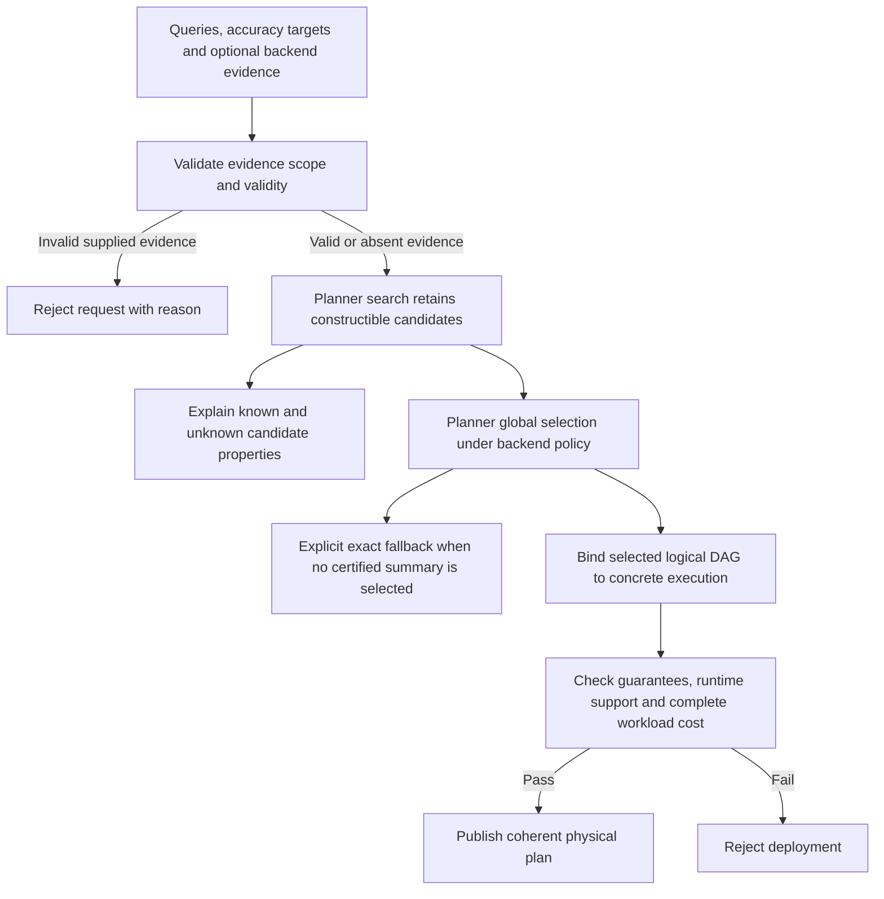

# Evidence-dependent candidate selection and deployment

Status: scoped evidence and native candidate admission implemented by backend
PR #761, building
on the API adaptation in #768, against ASAPPlanner #455
(`2ec3fc80`). This document defines the backend decision boundary for Planner
issue #454 and backend issue #752. It does not claim that every retained
candidate has a deployable implementation.

## Decision and ownership

Keep constructible candidates visible when external evidence is absent.
Separate candidate existence, logical selection, and deployment admission:
none implies the next. Otherwise the backend either loses a candidate it
could prove valid or deploys one whose guarantee has never been established.

| Decision | Owner | Required behavior |
| --- | --- | --- |
| Construct semantic candidates | Planner | Preserve unknown guarantees; reject known-invalid evidence and impossible shapes |
| Supply external facts | Backend | Bind evidence to the query, data population, snapshot and validity period |
| Derive accuracy and select logical roots | Planner, under backend models and policy | Respect the root accuracy target; missing proof is not certification |
| Bind and admit a deployment | Backend | Verify concrete execution support and require complete workload cost evidence |

The backend still invokes Planner's workload search and global selection. It
does not introduce a second semantic optimizer. Physical binding preserves the
selected DAG's operators, grouping, windows and dependencies; a semantic change
requires a new selection. Single-query and workload selection use the same
costed Planner search; the first-candidate helper has been removed.

## Decision flow

```mermaid
flowchart TD
    Input[Queries, accuracy targets and optional backend evidence] --> Validate[Validate evidence scope and validity]
    Validate -->|Invalid supplied evidence| Error[Reject request with reason]
    Validate -->|Valid or absent evidence| Search[Planner search retains constructible candidates]
    Search --> Inspect[Explain known and unknown candidate properties]
    Search --> Select[Planner global selection under backend policy]
    Select --> Exact[Explicit exact fallback when no certified summary is selected]
    Select --> Bind[Bind selected logical DAG to concrete execution]
    Bind --> Admit[Check guarantees, runtime support and complete workload cost]
    Admit -->|Pass| Publish[Publish coherent physical plan]
    Admit -->|Fail| Reject[Reject deployment]
```

Exact fallback is part of normal logical planning. A directly supplied summary
plan with missing or unknown readout guarantees fails physical compilation;
there is no promise that every compilation error retries another candidate.
An exact route must itself be available under the deployment's existing policy.

## Evidence contract

Evidence belongs to an exact query text, full data workload and data snapshot.
It also names its source, observation time and validity window. The backend
rejects mismatched, expired, future-dated or invalid records before selection.
Discovery without a workload quote needs an explicit data snapshot; when both
are supplied, their snapshot identities must agree. Queries with individual
certificates are isolated during selection so another query cannot borrow them.

| Family | Facts that can justify a candidate | Missing-proof behavior |
| --- | --- | --- |
| DDSketch quantile ratio | Enforced input bounds and maximum sample count for each exact operand | Ratio remains visible with unknown propagated accuracy |
| Hydra | Shared-grid collision bound and failure probability | Missing bounds remain unknown |
| TopK | Selected lower bound, excluded upper bound and interval failure probability | No membership certificate is invented |
| Relative composition | Applicable non-negativity, cardinality and distribution facts | Unsupported propagation remains unknown |
| HLL / ERP readouts | A valid accuracy model including the required confidence guarantee | RSE or observed maximum error alone cannot certify the readout |

Quantile domains describe an enforced source contract, not observed sample
extrema. Supplied TopK intervals must be complete and strictly separate selected
from excluded items. Omitted facts remain unknown; malformed supplied evidence
is rejected rather than treated as absent. The older TopK evidence interface
remains compatible; the scoped contract is the path for new producers.

The backend validates the supplied record's scope and consistency. It does not
derive a source-domain proof from samples or establish the truth of a producer's
claimed contract. Producing valid external proofs remains an upstream duty.

## Accuracy, runtime and cost remain separate

A known accuracy guarantee does not establish executor support. The physical
compiler checks the executable DAG and runtime policy, and rejects summary
readouts whose guarantee is absent or contains unknown terms. Unknown support
must not be reported as deployment approval.

Missing numerical cost remains unavailable, never zero. The backend implements
Planner's `candidate_cost()` directly; it does not enable uncosted legacy
selection. A cost estimate only supports logical selection. Publication requires
complete, applicable workload cost quotes. A cheap candidate cannot bypass
accuracy or runtime admission.

Explain records accuracy status and symbolic guarantee, runtime support status,
cost availability, and the selection reason separately. A selected candidate
is labelled as pending backend binding. Rejected candidates retain their
reported reasons. This distinguishes missing proof, unsupported execution,
missing comparable cost and a candidate that simply lost the ranking.

## Example and acceptance behavior

For `quantile_over_time(0.9, data[5m]) / quantile_over_time(0.5, data[5m])`:

1. Without operand-domain evidence, the DDSketch ratio remains inspectable but
   has unknown accuracy. Normal planning preserves exact execution.
2. With valid, scoped operand contracts, Planner can derive the ratio guarantee
   and check the explicit root target. Valid evidence alone does not guarantee
   that the target is met or that this candidate wins selection.
3. A selected candidate still needs physical support and complete workload cost
   quotes before publication. A stale or cross-query certificate rejects the request.

Cross-family acceptance includes absent, partial, valid, invalid and stale
evidence, an explicit root accuracy target, unavailable cost, and unsupported
runtime operations. Explain must never call an uncertified candidate approved;
direct physical submission must not bypass the guarantee check.

The current conservative policy changes behavior for HLL and ERP v1: relative
standard error and benchmark maximum error lack a calibrated tail probability.
Those paths use exact execution when no independent valid guarantee exists.
Re-enabling them requires an appropriate proof model, not merely more benchmark
samples or a favorable shape-match score.

Related: [integration architecture](asapplanner-integration.md),
[shape-aware ERP](shape-aware-erp-v1.md),
[Planner evidence contract](https://github.com/ProjectASAP/ASAPPlanner/blob/2ec3fc80caa922c8e1f33aa05f60b7d787e73257/docs/design_docs/architecture/evidence-dependent-candidates.md).

## Time precision at admission

Source cadence, query lookback, ranges and offsets retain integral millisecond
precision through workload lowering and query publication. A 100 ms source is
not rejected or rewritten to one second before costing. Existing pane layout
contracts still express storage sizes in seconds; rounding a storage sizing
bound must not change the query's read interval. A temporal producer that cannot
implement a fractional range remains unsupported for that binding, while exact
execution preserves the original range. Level-3 acceptance uses the actual
replay cadence and still requires a local executable plan.

Spatial TopK admission keeps the exact population ranking and the Planner's
CountSketch-with-heap physical candidate separate. The heap requires scoped
score separation and an enforced `topk_max_distinct_items` bound; an estimated
workload cardinality is insufficient. Missing evidence leaves the candidate
visible but ineligible for installation. A complete provider quote can
choose either candidate; neither is forced by operator name.

Rate TopK follows the same admission and pricing boundary. Nonnegative finalized
counter rates admit CMS as well as CountSketch when the scoped accuracy evidence
is sufficient. Exact ranking remains available. The installed physical program
consumes the complete per-series Rate vector from bound counter SDS; Backend
quotes can select any of the three programs. Operator support alone does not supply accuracy proof.

A fixed-window Rate heap candidate places Rate finalization and heap construction
in precompute and persists the heap. Query-time construction remains a separate
candidate. This placement requires a complete, durable counter population for the
same window and does not authorize merging rates across windows. The initial
runtime realization uses the finite-source completion barrier. Candidate admission
must reject deployments unable to satisfy that completion requirement.

For grouped Rate, the exact grouped Sum also has query-time and precompute
physical candidates. A stored complete-window Sum does not combine raw counters
across series before Rate. Its producer cadence must satisfy the query recurrence;
selecting a 60-second lookback cannot silently reduce five-second evaluations to
one output per minute. Overlapping full windows remain independent stored results.
