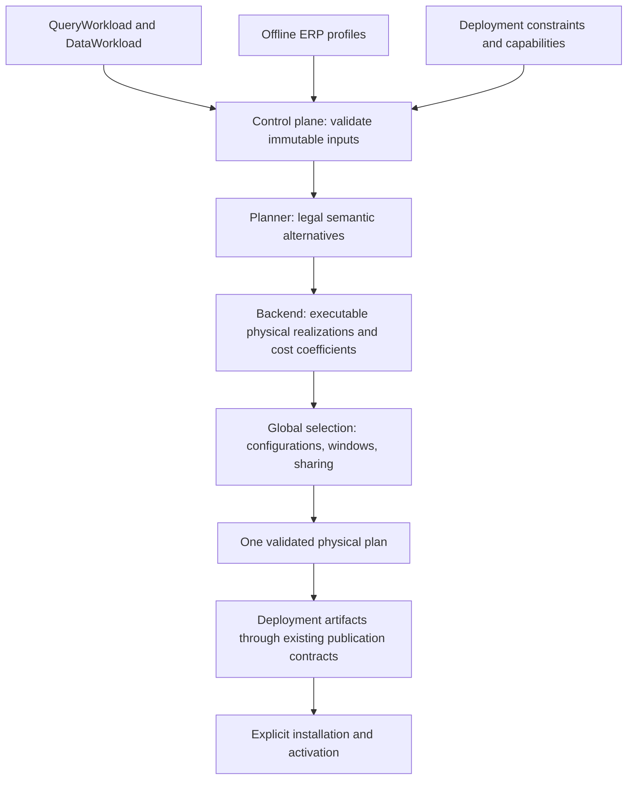

# Offline ERP planning: physical selection to deployment

Status: proposed. Audience: Planner and backend designers and implementers.
This proposal describes a new planning path; it does not claim that the current
backend implements it or replace the canonical cross-component contracts.

## Decision and scope

Accept a fixed query workload, data workload, offline error–resource–performance
profiles, and deployment constraints. Select one executable physical plan, then
produce its deployment plan through the existing publication contracts.

ERP retains its existing Error–Resource Profile name. Its measurements include
accuracy, memory, and operation performance. Profiles are produced offline;
planning neither benchmarks sketches nor requires live runtime observations.

There is no automatic replanning, drift-triggered selection, runtime profile
refresh, migration optimizer, or feedback loop in this version. A later explicit
planning request is a separate invocation. Existing observation and replanning
paths are not removed, but are not dependencies of this path. Ordinary query
execution and maintenance continue after installation.

The result is one plan, not a Pareto frontier. The initial objective is minimum
modeled steady-state CPU under explicit accuracy and deployment constraints.



Candidate generation and feasibility checking may involve both Planner and
backend. The diagram is a responsibility boundary, not a requirement to fully
enumerate complete plans or commit to one semantic alternative before costing.

## Current behavior and proposed change

The backend already accepts ERP inputs, selects empirical parameters with
theoretical/exact fallback, compiles physical alternatives, and compares priced
workload candidates. Relevant implementation anchors are
[the ERP adapter](../../control_plane/src/physical/erp.rs),
[physical compilation](../../control_plane/src/physical/compiler.rs),
[workload pricing and selection](../../control_plane/src/physical/workload_cost.rs),
and [publication conversion](../../control_plane/src/physical/publication.rs).

Today, ERP parameter selection returns one preferred configuration for a
selection context. The current backend-local path also requires workload cost
evidence and compares a bounded inventory of compiled alternatives. Supplying
atomic ERP measurements alone does not price every physical component.

[sketch-bench PR #129](https://github.com/ProjectASAP/sketch-bench/pull/129)
provides a useful MILP starting point: choose one deployment per repeating query,
charge a shared deployment's ingestion once, and avoid enumerating all query to
deployment assignments. The reviewed implementation is revision `82ca7a5`.

This proposal preserves multiple admissible configurations and physical
realizations until global selection. The MILP is a selection mechanism within
the existing Planner/backend boundary, not a replacement for semantic legality,
accuracy propagation, executable binding, or publication validation. It does
not become a second authoritative selector after another stage has discarded
the alternatives it needs.

## Immutable inputs and outputs

Each invocation binds the following inputs to a reproducible planning snapshot:

| Input | Required meaning |
| --- | --- |
| QueryWorkload | Query semantics, accuracy requirements, recurrence, lookback, and evaluation phase |
| DataWorkload | Source identity, population partitioning, aggregate arrival rates, group counts, and offline distribution descriptors or supported shape evidence |
| Offline profiles | Artifact/version and record IDs, algorithm/implementation/configuration, accuracy metric and measurement scope, resource costs, units, and measurement provenance |
| Deployment context | Backend-local or collector target, runtime capabilities, retention policy, exact-execution availability, and requested resource bounds |
| Planning policy | Accuracy/fallback mode, CPU objective, common costing horizon, solver limits, and evidence applicability policy |

Missing rates, cardinalities, or component prices remain unknown; they are not
silently zero. Group count means physical populations, not distinct sketch item
keys. Source descriptors and shape evidence are supplied offline and remain
fixed for the invocation. Profile applicability includes implementation and
measurement environment compatibility, trial sufficiency, data shape/volume,
and any declared validity constraints. Offline does not mean universally valid.

Output contains the selected physical plan, validated deployment artifacts, and
a selection report. The report records snapshot/profile IDs, input and model
versions, configuration and realization identities, sharing, CPU breakdown,
memory scope, accuracy evidence, fallback reasons, and solver status/gap. Store
the selected mapping so a tied optimum can be audited without assuming identical
solver tie-breaking across versions.

This is a logical contract, not a new HTTP schema or a replacement workload
type. Reuse the existing canonical workload and publication types; specify
necessary request extensions during implementation.

## Candidate construction and evidence

1. Planner produces legal semantic alternatives, including permitted exact or
   mixed execution. Do not map arbitrary query text directly to the PR's four
   capability enum values.
2. The ERP adapter exposes all admissible configurations for the relevant
   readout, reusing its existing matching and runtime checks. Retain typed
   parameters and evidence IDs through selection. Choosing the cheapest
   configuration separately for each query can lose a better shared solution.
3. Backend derives executable window/layout alternatives from recurrence,
   evaluation phase, retention requirements, and deployment capabilities.
4. Construct assignment eligibility and resource coefficients for these
   alternatives. Prune only when replacement preserves every consumer's
   semantics, evidence, feasibility, and all modeled costs and constraints.

ERP resource fields map naturally to the prototype's atomic costs:

| ERP field | Prototype field |
| --- | --- |
| `memory_bytes` | `mem_bytes_per_instance` |
| `update_cpu_seconds` | `insert_cpu_secs` |
| `merge_cpu_seconds` | `merge_cpu_secs` |
| `query_cpu_seconds` | `query_cpu_secs` |

This projection does not replace the ERP record. Its distribution, implementation,
readout units, trial counts, and evidence provenance remain authoritative.
For example, the prototype's KLL example checks `mean_rank_err`; the backend's
KLL ERP readout uses `max_rank_err`. These are not interchangeable. Empirical
error magnitudes do not establish an explicit failure probability.

Accuracy must apply to the final readout, including the selected data volume and
merge topology. Single-instance measurements are insufficient evidence for an
unvalidated merged result. Use applicable merged-result evidence or a supported
compositional/theoretical contract; otherwise exclude that approximate candidate.

Sharing requires compatible source, filters/update expression, population
partitioning, retained labels, sketch configuration, window alignment and phase,
and runtime policy. Reuse backend semantic/materialization identities. Equal
capability and label names alone, as in the prototype's grouping, are insufficient.

## Global physical selection

For the initial supported independent-readout subset, let `z[i,d]` choose an
eligible deployment for readout `i` and `u[d]` activate deployment `d`:

```text
sum_d z[i,d] = 1
z[i,d] <= u[d]
u[d] <= sum_i z[i,d]
minimize sum_d u[d] * ingest_cpu[d]
       + sum_i,d z[i,d] * read_and_merge_cpu[i,d]
       + CPU of other selected required physical components
```

Steady-state terms use CPU-seconds per wall-second. Multiply by a common horizon
only when adapting to horizon-based quotes. Ingestion is charged once per
activated physical deployment; query work is charged at each consumer's cadence.
Do not reuse ERP's already aggregated selection cost and charge the same work
again. Exact/residual costs must use the same workload and units. Query-result
reuse is out of scope; sharing sketch state does not waive readout work.

For general Planner DAGs, assignment variables must also preserve alternative
exclusivity and component dependencies. The prototype's one-deployment-per-RQE
constraint is not sufficient for arbitrary mixed DAGs. Unsupported structures
remain on an explicitly reported existing planning path, or are rejected under
a strict policy; do not claim a global optimum over them.

All hard constraints apply before a plan is called selected. A requested total
deployment memory cap must include retained states, overlap, merge buffers, and
the specified concurrency model. The prototype's maximum single-query working
set is not this cap. CPU-derived query latency is labeled as a modeled bound,
not measured end-to-end latency. If evidence cannot establish a requested bound,
the candidate is unavailable under that bound.

The initial objective does not optimize network/storage or deployment build
cost. Account for their feasibility and any explicit limits using backend
evidence, and report them separately. Missing required evidence is not a free
component. Preserve workload manifest/pricing checks; adapting ERP costs must
not bypass them or cause another selector to silently choose a different plan.

Solver infeasibility produces a structured no-plan result. On a solver limit,
an explicitly allowed feasible incumbent may be returned with its gap and
non-optimal status; otherwise return no plan. Report candidate coverage and
claim optimality only within the encoded feasible inventory. Final compilation
failure is a planning failure, not permission to publish or silently substitute.

## Window realization and deployment compilation

The prototype models sketch window `x`, slide `y`, query lookback `S`, and
interval `T`, with `x % y == 0`, `S % x == 0`, and `T % y == 0`.
An overlapping deployment updates `x / y` states per arrival and merges `S / x`
non-overlapping instances per query. Backend eligibility must additionally
validate time units, phase, coverage, supported layout, and target capabilities.

Do not copy `x` into `WindowRealizationCandidate.window_secs`: current backend
validation requires that field to equal the query lookback. A shorter sketch
window must be represented through a supported physical layout and its read
composition. Initially admit only layouts that the current executor can realize;
the prototype's overlap support does not prove runtime support.

After selection, physical compilation preserves the chosen parameters, layout,
sharing, and evidence identities. Validation may reject a mismatch, but must not
rerun local ERP selection and overwrite the winner.

Here, deployment plan means the existing publication/install artifacts:
`SummaryCatalog`, `PrecomputePlan`, target-specific `CollectorPlan` entries,
`TransmissionPlan`, and `QueryPlan`, with storage routing handled by the existing
install contract. Backend-local deployments do not invent collector plans.
Use `CompiledPhysicalPlan::to_publication_artifact()` and existing installation
validation rather than introducing a parallel deployment schema.

Planning returns artifacts; installation is an explicit subsequent action.
Activation, materialization readiness, completeness, and exact routing retain
their existing runtime contracts. Neither planning nor installation starts an
automatic optimization feedback loop.

## Fallback policy

Fallback is decided during this invocation. In empirical mode an ERP miss may
choose permitted exact execution. Hybrid mode may also admit supported
theoretical configurations. Alternatives require valid cost evidence and must
satisfy the query and deployment constraints. If no allowed alternative exists,
return no plan with the failed requirements. No mode labels theoretical sizing
as empirical evidence. Runtime exact routing already encoded in the chosen plan
is execution behavior, not replanning.

## Example and acceptance criteria

Consider same-source, same-filter KLL queries over one hour and one day, each
evaluated every minute at a common phase. Offline profiles offer several KLL
configurations; offline data facts supply rates and population counts. Planner
validates readout semantics, ERP filters applicable evidence, and backend offers
supported shared and separate layouts. Global selection chooses the lowest-CPU
feasible combination and compilation emits the corresponding maintenance and
query plans. Without evidence for the merged readouts, that shared alternative
is excluded. No live observation is needed and no later rate change triggers
replanning.

Implementation acceptance requires:

- A fixed offline snapshot produces one physical plan, deployment artifacts,
  and an auditable report without any runtime-samples/observer dependency.
- On a small inventory, MILP cost agrees with exhaustive search, including a
  case where global sharing wins over individually cheapest configurations.
- Incompatible sources, filters, partitioning, or phases cannot share state.
- Accuracy metric mismatch, unsupported merge evidence, explicit delta without
  sufficient evidence, and ERP misses follow the declared fallback policy.
- Requested bounds and missing component prices fail closed; unknown costs do
  not win. Solver-limit and infeasible outcomes are reported distinctly.
- Selected parameters and sharing survive compilation/publication unchanged.
  An installed finite-input test checks results against an exact oracle and
  verifies the selected maintenance/read paths, including window boundaries.
- Deployment does not register a replan trigger; a subsequent runtime observation
  does not alter the selected generation through this path.

Land the implementation in stages: preserve ERP alternatives and provenance;
adapt a restricted aligned recurring-query subset to executable realizations;
integrate MILP and physical cost validation; then validate publication and
execution end to end. An offline comparison harness can validate the selector
during development, but the intended deliverable includes deployment artifacts.

## Related contracts

- [Planner integration architecture](asapplanner-integration.md)
- [Summary Catalog and SDS architecture](summary-catalog-sds-architecture.md)
- [Existing ERP deployment adapter](../../control_plane/docs/design-erp-deployment.md)
- [Planning terminology and architecture](../developer_docs/control-plane/planning-terminology.md)
- [Shape-aware ERP](shape-aware-erp-v1.md), an existing live-observation path that
  this offline proposal does not require
