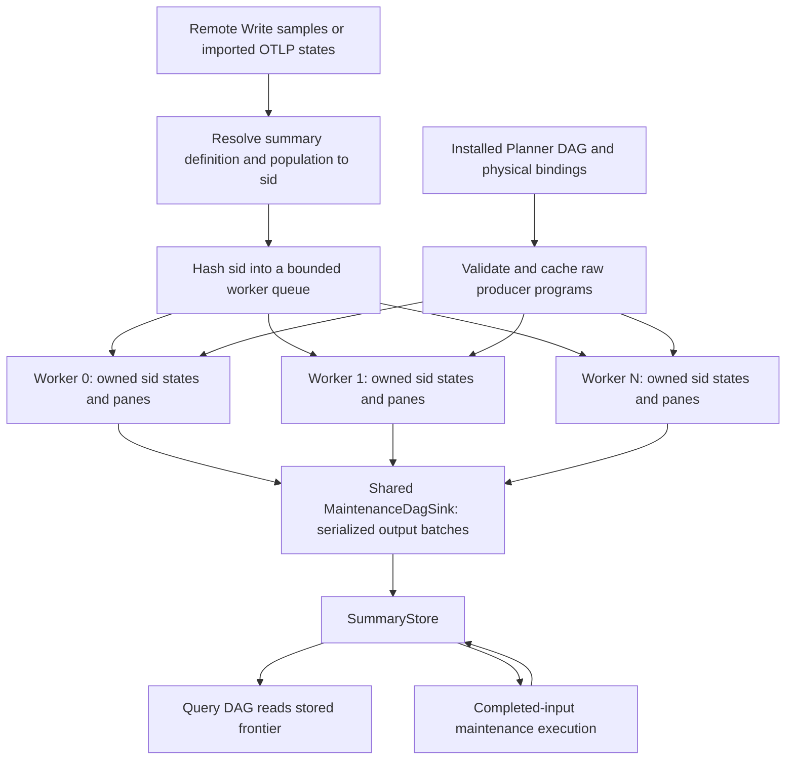

# Precompute execution from post-ASAP IR

Audience: backend developers and reviewers of issue #762 / PR #763.

The selected ASAPPlanner post-ASAP DAG owns computation semantics. The backend installs physical bindings and executes two projections: raw-source producers in streaming workers, and maintenance subgraphs over materialized inputs. **Current parallelism is across worker-owned state partitions. A single maintenance subgraph executes its nodes sequentially in dependency order. There is no general parallel DAG task scheduler in this implementation.**

## 1. What is installed

`PrecomputePlan` contains the selected executable DAG documents, Planner node IDs, dependency edges, operator payloads, and `BackendExecutableBinding` records. Bindings identify stored summary definitions and precompute sinks; physical materializations attach window, population, routing, and storage metadata. Query execution uses the corresponding query projection and reads stored summaries at these explicit boundaries.

`PrecomputeMaterialization` cannot independently authorize execution. The former standalone `AggregationConfig` type is removed. Flat `aggregations` / `aggregation_configs` documents are rejected. Publish a complete physical plan through `/api/v1/physical-plan` and activate its generation; standalone streaming-config updates return 410.

During installation, `StreamingConfig::from_precompute_plan` validates materializations and builds a shared `RawDagProgram` for each raw Remote Write producer. `RawDagProgram::from_plan` finds its bound Planner node and checks:

- the node is `SummaryAgg`, with exactly one `Input` dependency from a supported raw source;
- source metric, filter, window, and reduction match the physical routing binding;
- family, parameters, and update expression match the stored summary identity;
- the runtime supports the selected input expression and kernel layout.

The immutable program is cached by producer fingerprint and shared through `Arc`. Installation does not build a generic task for every raw DAG node. It validates and fuses the supported source → `SummaryAgg` path into a streaming kernel. Other raw paths are rejected rather than silently flattened. Imported OTLP summary states enter at an existing materialized frontier and do not require a local raw-source kernel.

Code: [raw program binding](../../data_plane/src/precompute_engine/raw_dag.rs), [installation](../../data_plane/src/storage_engines/types/streaming_config.rs), [operator construction](../../data_plane/src/precompute_engine/accumulator_factory.rs).

## 2. Raw execution and state ownership



The router chooses `xxh64(sid) % num_workers`. A `sid` identifies a physical summary/population state; all its panes and updates go to the same worker. It is not the Planner node ID. Distinct populations of one producer can therefore execute on different workers, while different producers may hash to the same worker.

Each worker owns its `GroupState`, active panes, late-data state, and previous counter samples. It consumes messages sequentially. For raw input it obtains the installed program, evaluates the Planner update expression, and calls the selected typed kernel for every affected physical pane. For imported summary input it merges supplied state into the pane. Closure emits `PrecomputedOutput` with definition, population, window, and generation/lineage metadata.

Exact `SummaryAgg` families are Sum, Count, Min, Max, Rate, and Increase. Grouping changes state layout, not family identity. `ExactAccumulator` preserves the family across updates, merge, serialization and readout. Rate and Increase can share internal counter arithmetic, but cannot read or merge each other's state. Backfill uses the same raw program and update evaluator.

A grouped reduction is already partitioned by its validated output population before the worker updates state. There is no partial-aggregate exchange followed by a parallel reducer in the raw worker pool. Consequently, one hot output population remains a single-worker bottleneck even if it receives many source series.

Code: [engine task creation](../../data_plane/src/precompute_engine/engine.rs), [routing](../../data_plane/src/precompute_engine/series_router.rs), [worker execution](../../data_plane/src/precompute_engine/worker.rs), [exact state](../../data_plane/src/precompute_engine/operators/exact_accumulator.rs).

## 3. When a maintenance DAG can run

A materialized input is an execution frontier: its upstream computation has already run. The maintenance evaluator consumes that state and stops traversal at the frontier; it must not scan raw inputs again.

There are two production entry paths:

1. `MaintenanceDagSink::emit_batch` wraps worker output. It identifies matching installed sinks and uses the emitted source state as a frontier. This live path does not support an unsynchronized foreign source or a cross-group shuffle. Targets marked with `derived_input` are skipped here because additive worker fragments are not complete inputs.
2. Finite Remote Write `drain` closes admission, waits for worker drain barriers, waits for durable summary sealing, checks the catalog generation, and calls `execute_finite_maintenance`. That path collects complete windows/populations and aligned source cohorts before executing derived targets. Missing panes or incomplete cohorts cannot be treated as ready input. This is a finite completion trigger, not a continuous background DAG scheduler.

The multi-source coordinator separately stages partition-scoped inputs and watermark barriers against the installed roster and producer epochs. `ready_batches` requires all participating partitions and their barriers to cover the output interval. It establishes readiness; it does not launch parallel operator tasks. Immutable maintenance publication also binds all consumed input identities to the output lineage, so restart/retry can recover the same result instead of adding it twice.

Code: [maintenance adapter and entry points](../../data_plane/src/precompute_engine/maintenance_runtime.rs), [finite drain](../../data_plane/src/drivers/ingest/prometheus_remote_write.rs), [multi-source readiness](../../data_plane/src/precompute_engine/multisource_coordinator.rs), [immutable storage publication](../../data_plane/src/storage_engines/sketch_db/index/maintenance.rs).

## 4. How one subgraph executes

`execute_precompute_sink` executes one sink and its reachable dependencies using a synchronous depth-first traversal. The traversal evaluates a node only after its inputs, which gives a topological execution order without requiring wire order to be topological.

```text
execute_sink(sink, commit_key):
    validate DAG bindings and sink identity
    if commit_key already has a result: return it
    values = {}                       # one invocation's node-result cache
    visit(sink):
        if node is in values: return cached value
        reject a cycle or a query-time node
        if a materialized frontier supplies this node:
            cache frontier; stop traversing this dependency
        otherwise:
            visit each dependency in operator input order
            execute typed operator with the resulting inputs
            cache result by Planner node ID
    commit_if_absent(commit_key, values[sink])
```

Binary inputs are ordered by `Left` and `Right` edge roles, not by the serialized edge list. The operator adapter dispatches on the actual Planner payload, including supported summary merges, maintenance-time binary operations, exact-state finalization, and summary aggregation. It validates the state/row shape needed by each operator. An unsupported operator fails instead of selecting a fallback accumulator.

For a diamond `A → B`, `A → C`, `B,C → D`, one invocation computes A once and shares its immutable `Arc` result with B and C. **B and C are still evaluated sequentially.** The node-result cache belongs to this invocation; it does not promise that an intermediate shared by two separately invoked sinks is computed only once globally. Explicit stored frontiers and lineage-based publication provide reuse across invocations.

Only the requested sink is committed by this call. Other materialization sinks have their own invocation and commit key. The key includes plan/version, target definition, window and input lineage. Live batch receipts and durable immutable output publication have different lifetimes: live receipts are bounded, while immutable output recovery uses the store's durable publication protocol. Neither is a blanket exactly-once guarantee for arbitrary raw transport replay.

Code: [sub-DAG evaluator](../../data_plane/src/precompute_engine/subdag_scheduler.rs).

## 5. Parallelism, ordering and backpressure

| Work | Current execution boundary |
|---|---|
| Different `sid` partitions | Can run concurrently on different Tokio worker tasks. `precompute_num_workers` defaults to 4. These are tasks on the Tokio runtime, not one dedicated OS thread per worker. |
| Updates/panes of one `sid` | Sequential within its owning worker; no concurrent mutation of its accumulator. |
| Routing to different workers | Batch routing sends to worker queues concurrently; messages to a given queue are submitted sequentially. Concurrent senders do not establish a global event-time order. |
| Nodes within one maintenance sink | Sequential dependency traversal; shared results are memoized within that invocation. |
| Live worker output batches | Serialized by the shared `MaintenanceDagSink::batch_guard`, including maintenance evaluation and downstream publication. Even the no-matching-sink forwarding path holds this lock. |
| Finite derived maintenance | Iterates installed DAGs, sinks, populations and windows synchronously in the drain call. No parallel ready-node or sink pool is launched. |
| Query readout | Runs through the query projection against stored state; it does not mutate the worker's active accumulator. |

Queues are bounded by `channel_buffer_size` (default 10,000). Awaiting sends applies backpressure; the atomic admission route reserves all required queue slots before admission and returns an error if it cannot reserve them. A periodic flush task sends worker messages; it does not itself process samples. Drain barriers wait behind queued work before acknowledging completion.

The shared output lock protects batch retry/publication ordering, but limits throughput when many workers close panes at once. CPU-heavy kernels and maintenance evaluation execute synchronously in their calling task; they are not automatically offloaded to a CPU pool. Increasing the worker count therefore does not imply proportional speedup, and a single large maintenance DAG does not become parallel.

A future node-parallel executor would need an indegree-based ready queue, bounded CPU execution, immutable intermediate ownership, and commit coordination scoped to each target/window/lineage instead of the current whole-batch lock. It would also need deterministic failure/retry and generation-switch tests. Those mechanisms are **not implemented by PR #763** and must not be assumed when assessing its performance.

## 6. Validation and supported boundaries

Catalog schema 3 carries Planner family in SDS. Installation rejects disagreement between DAG and storage descriptors, and storage admission rejects wrong exact families. `PlannerExactAccumulatorV1` persists family and layout. Unknown configurations cannot fall back to Sum; config-based kernel construction exists only in isolated unit-test fixtures.

Tests cover a Planner-selected DAG through raw worker execution and query readout, six exact families through disk eviction/restart, invalid installations, shared-node evaluation within one invocation, immutable one-source/two-source/group maintenance, and native Remote Write/HTTP query execution. Transport oracle tests supply imported sketch states through complete physical-plan fixtures; they do not claim to validate raw Planner selection. These correctness tests do not establish parallel speedup.

Shared Hydra kernels, unsupported raw expressions, and raw table execution are rejected. General cross-group exchanges, arbitrary continuously scheduled multi-source DAGs, and node-parallel maintenance execution are not supplied by this implementation.
