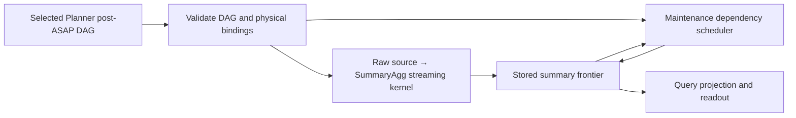

# Precompute execution from post-ASAP IR

Audience: backend developers and reviewers of issue #762.

The execution installation is `PrecomputePlan`: selected Planner DAGs, their node bindings, and physical window/storage placement. The former standalone `AggregationConfig` type is removed. `PrecomputeMaterialization` describes storage and routing; it is not independently executable. The streaming configuration serializes the DAG plan and derives its routing index after validation. Flat `aggregations` / `aggregation_configs` documents are rejected. Publish the complete physical plan through `/api/v1/physical-plan` and activate its generation; partial streaming configuration updates are removed.

For a raw producer, installation checks its `SummaryAgg` payload, input edge, source selection, reduction, family, and supported update expressions. The worker executes that validated projection with Planner-owned family and update parameters. Ingestion retains physical window management and routes populations using the validated binding. Shared producers have one installed program and one state per population/window. An unsupported raw path fails installation; the worker cannot choose Sum as a fallback. Backfill uses the same program and update evaluator. Derived summaries continue through the production maintenance scheduler, which observes stored frontiers, dependency roles and shared-node memoization.

`SummaryAgg` is the operator; Sum, Count, Min, Max, Rate and Increase are its exact families. `ExactAccumulator` retains the family and population layout across updates, reset, merge and serialization. Counter arithmetic can be shared internally, while a Rate state still rejects Increase readout or merge. Keyed layout does not introduce `MultipleX` Planner families. Config-based dispatch remains only in isolated kernel test fixtures and cannot execute in a production build.

Catalog schema version 4 separates semantic definitions from deployed output identities and carries the Planner family in SDS. Writer and reader bindings identify both the deployed output and its semantic definition; installation and recovery validate their agreement. Installation rejects disagreement between DAG and storage descriptors; storage admission rejects wrong exact families. The persisted `PlannerExactAccumulatorV1` encoding includes family and population layout. Tests cover a real Planner-selected DAG through worker execution and query readout, all six exact families through disk eviction/restart, invalid installations, and the native backend process Remote Write/HTTP query suite.

The runtime supports explicit subsets of Planner operators. Shared Hydra grouping and unsupported raw input programs are rejected rather than silently assigned another algorithm. Existing imported collector state and isolated payload kernels are not alternate executable configuration formats.
