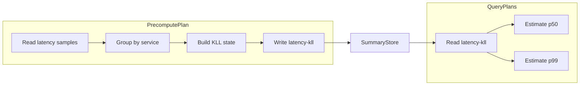
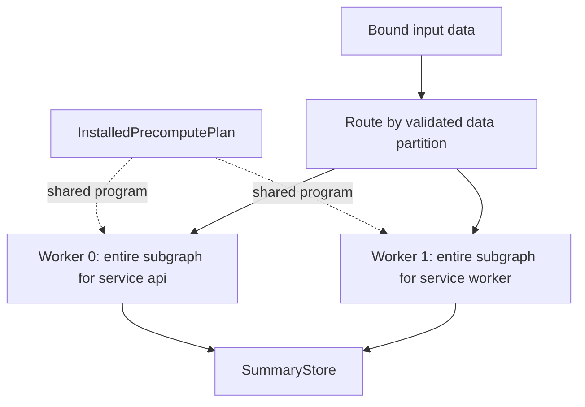
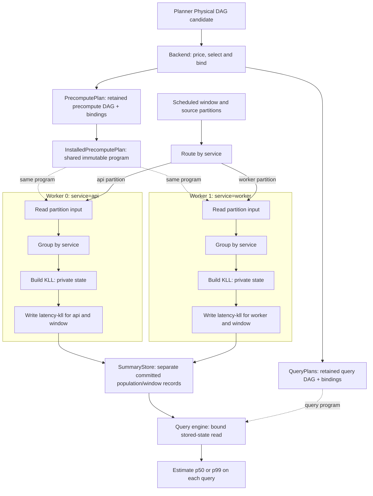

# Precompute DAG execution

Audience: backend designers and developers.

Status: target design. The [physical handoff](physical-candidate-handoff.md)
tracks the remaining migration from Backend computation representations.

This document specifies the precompute engine design: how it receives a
Planner-provided physical candidate selected by Backend, runs its DAGs over
data partitions, and publishes the
stored outputs consumed by query plans. The [plan split](asapplanner-integration.md)
and [SDS contract](summary-catalog-sds-architecture.md) define the compiler and
storage contracts used here.

## 1. Intuition: compute once, reuse across queries, amortize the cost

Precompute performs shared work ahead of query execution and stores its selected
outputs. Later queries reuse those outputs repeatedly, amortizing the cost of
constructing and maintaining them across the queries they serve. The purpose is
to reduce both total resource cost and query latency: repeated queries avoid
repeating expensive input scans and computation, while the work left on the
query path is a stored-state read and the remaining query operators.

For example, repeated p50 and p99 requests for request latency by service over
the same five-minute range can share one Planner-selected KLL producer.
Precompute builds the KLL state once per service and scheduled window. Every
compatible request then reads that stored state and applies its percentile
readout, rather than scanning the samples and rebuilding the summary for each
request. Reuse applies both to repeated executions of a query and to different
queries that share the selected output.

Over a workload, the resource cost is the cost of construction, maintenance and
storage plus the reads and remaining query computation. Reuse must save enough
repeated work to offset those costs; this is what makes precomputation worthwhile.
Once the required output is ready, query latency excludes its construction work.
“Compute once” refers to a particular output, population and window: subsequent
windows still require construction or updates under the selected schedule.

Planner compiles candidate Physical DAGs with explicit stored-output boundaries.
Backend selects a feasible candidate and binds those boundaries:


```mermaid
flowchart LR
  subgraph P[PrecomputePlan]
    I[Read latency samples] --> G[Group by service]
    G --> K[Build KLL state]
    K --> W[Write latency-kll]
  end
  W --> S[SummaryStore]
  subgraph Q[QueryPlans]
    R[Read latency-kll] --> P50[Estimate p50]
    R --> P99[Estimate p99]
  end
  S --> R
```

These labels describe the computation, not a separate backend operator language.
The executable nodes preserve Planner operator semantics and their provenance;
the compiler adds concrete source and storage bindings.

A worker runs the **whole precompute subgraph for its assigned data partition**.
For this example, one worker handles `service=api` and another can handle
`service=worker`. Both execute the same graph. The shared Planner runtime executes dependencies within a DAG run; Backend
workers may process independent partitions concurrently. A worker is an execution task, not necessarily a dedicated OS
thread.

Only outputs selected for persistence become stored summaries. Intermediate
values remain in worker memory unless the plan explicitly stores them. A single
precompute subgraph can have several stored outputs, and several query plans
can read the same output.

## 2. Inputs and outputs

The Backend deployment compiler receives Planner Physical DAG candidates and
their lifecycle requirements. It selects a feasible candidate using workload
costs and binds concrete inputs and stored outputs. The installed plan version
contains definition rows, a PrecomputePlan and matching QueryPlans. Backend
does not lower Post-ASAP operations or choose unpriced computation at installation.

| Input to the precompute engine | Purpose |
| --- | --- |
| `PrecomputePlan` | Defines the precompute subgraph, node IDs, operator parameters, dependency edges, input bindings and stored-output bindings. Carries the selected deployment guarantee and schedule/retention. |
| Definition rows | Describe the input, Planner family, parameters, grouping and time semantics of each selected stored output. Installed in `SummaryStore.summary_definitions`. |
| Source data | Raw samples or rows, or explicitly referenced committed summary state. The plan determines which input type each node accepts. |
| Execution triggers | Input arrival, scheduled evaluation endpoints, and input-completion signals, according to the selected maintenance mode. |
| `PrecomputeEngineConfig` | Supplies worker count, queue capacity and operational settings such as flush polling interval. These settings cannot change computation, logical windows or the selected schedule/retention. |

The engine produces committed `StoredSummary` records for the selected outputs.
It also reports completion or failure for scheduled work and drain requests.
Installing a plan does not imply that its output records are ready.

A QueryPlan consumes these records through a `StoredOutputReference`. That
reference names a stored output and definition within the installed plan
version; population and window selection identify the records to read.

## 3. Install the plan once

The backend derives an immutable `InstalledPrecomputePlan` from the supplied
PrecomputePlan. This runtime representation avoids validating the graph and
binding operators again for every input batch.

Installation performs four steps:

1. Validate the graph and operator input/output types, including ordered edge
   roles for operators with multiple inputs. Validate source, definition and
   stored-output bindings together with the matching QueryPlans.
2. Decode and validate the retained Planner Physical DAG. Preserve its operators,
   parameters, dependency edges, shared producers and roots. Bind typed input
   contracts without recompiling operators or deriving another execution graph.
3. Derive a partitioning rule that keeps all required dependencies and
   reductions local to a worker, as described below. Check that execution can
   satisfy the selected deployment guarantee and schedule/retention.
4. Build node and source-routing indexes, register the validated definition
   rows, and activate the coherent plan version for routing and execution.

A retained graph may have several stored-output roots. Outputs with the same
input frontiers, window extent, cadence and phase execute together against one
immutable input snapshot. The runtime consumes every root concurrently under
one memory budget, so a shared producer executes once. Both finite-input
publication and continuous revision publication use these results. Outputs
with different window contracts require separate runs. Recovery validates all
roots and their bindings; it must not silently select only the first root.

Window extent and publication cadence are independent. A 60-second window
published every 10 seconds includes the ranges 0–60, 10–70 and 20–80 seconds.
Continuous revisions recompute each affected window on that cadence, preserving
the selected phase; they must not publish only disjoint 60-second windows.

Unsupported operators, incompatible bindings, cycles and unsatisfied deployment
requirements fail installation before the plan becomes active.

| Object | Lifetime and contents |
| --- | --- |
| `PrecomputePlan` | Compiler-supplied computation and bindings for one plan version. |
| `InstalledPrecomputePlan` | Retained Planner Physical DAGs, deployment bindings, routing indexes and validated partitioning rule. Shared by the router and workers. |
| Worker execution state | Mutable node state, input ordering buffers, windows and intermediate results for that worker's assigned partitions. |

`InstalledPrecomputePlan` is internal runtime data, not another serialized
configuration or independently installable plan. All execution lookup tables
come from the validated DAG and its bindings. There is no separately maintained
aggregation list. Physical optimization belongs to Planner; Backend does not
fuse, split or substitute operators after candidate pricing.

## 4. Route data so each worker can execute the whole subgraph

Partitioning is a property of the entire precompute subgraph. All inputs that a
node must combine must reach the same worker. The router applies the installed
partitioning rule to canonical input labels and assigns that partition to a
worker for the lifetime of the active execution state.

| Computation | Required data placement |
| --- | --- |
| KLL or Sum grouped by service | Keep all inputs for one service together. |
| Per-series Rate | Keep each series together and preserve its sample-time semantics. |
| Per-series Rate followed by Sum by service | Partition by service; keep separate Rate state for each series within the worker, then reduce locally. |
| Global Sum | Place all inputs on one worker in the simple execution model. |

For Rate followed by Sum, distributing individual series independently could
put two series of the same service on different workers. Neither worker could
then compute the complete service result. Partitioning by service satisfies
both the per-series state requirement and the downstream reduction.

The simple design uses one validated partitioning rule for the installed
precompute subgraph. If independent partitions cannot be established, use one
worker when the deployment requirements permit it; otherwise reject the plan.
There is no implicit shuffle or cross-worker partial-result merge. A hot
partition therefore remains limited by its owning worker.

Partition ownership is separate from stored-output identity. Hashing a stored
output ID does not establish that its input dependencies are local. Multiple
stored outputs can share one data partition and one worker.


```mermaid
flowchart TD
  I[Bound input data] --> R[Route by validated data partition]
  P[InstalledPrecomputePlan] -. shared program .-> A
  P -. shared program .-> B
  R --> A[Worker 0: entire subgraph for service api]
  R --> B[Worker 1: entire subgraph for service worker]
  A --> S[SummaryStore]
  B --> S
```

Worker queues are bounded. Admission applies backpressure when a destination
queue is full; an atomic input batch must reserve its required queue capacity
before being acknowledged. Sequential queue consumption does not itself sort
event timestamps. Input ordering, allowed lateness and counter-reset handling
must follow the bound operators' time semantics.

## 5. Execute ready work inside the owning worker

Each worker holds the same installed program and separate mutable state. An
input batch updates only the state for its assigned data partition. A scheduled
evaluation identifies the logical window whose outputs are due. Nodes run when
the inputs required for that evaluation are available.

The following diagram expands the KLL example for one scheduled window. The
router assigns partition work; each worker reads only its bound partition and
executes every required node of the same installed precompute subgraph. Dashed
arrows denote shared immutable program access; solid arrows denote work or data.


```mermaid
flowchart TB
  D[Planner Physical DAG candidate] --> C[Backend: price, select and bind]
  C --> P[PrecomputePlan: retained precompute DAG + bindings]
  C --> QP[QueryPlans: retained query DAG + bindings]
  P --> IP[InstalledPrecomputePlan: shared immutable program]
  T[Scheduled window and source partitions] --> R[Route by service]

  subgraph W0[Worker 0: service=api]
    direction TB
    A0[Read partition input] --> A1[Group by service]
    A1 --> A2[Build KLL: private state]
    A2 --> A3[Write latency-kll for api and window]
  end
  subgraph W1[Worker 1: service=worker]
    direction TB
    B0[Read partition input] --> B1[Group by service]
    B1 --> B2[Build KLL: private state]
    B2 --> B3[Write latency-kll for worker and window]
  end

  IP -. same program .-> A0
  IP -. same program .-> B0
  R -->|api partition| A0
  R -->|worker partition| B0
  A3 --> S[SummaryStore: separate committed population/window records]
  B3 --> S
  S --> QR[Query engine: bound stored-state read]
  QP -. query program .-> QR
  QR --> E[Estimate p50 or p99 on each query]
```

Worker 0 and Worker 1 can run concurrently. Within each worker the arrows
establish dependency order: KLL construction follows its input computation,
and publication follows completion of the required state. Neither worker owns
an exclusive operator stage; both execute Read, Group, KLL and Write. They share
the program but not mutable KLL state. The two records use the same plan version,
stored-output ID and definition, with different population keys. Query execution
starts from the committed output rather than running this precompute path again.

The selected maintenance mode determines how state is constructed. An
incremental operator updates its window state as input arrives. A batch operator
reads the bound range and builds its result at the scheduled endpoint. The
runtime cannot replace one mode with another merely because both produce the
same family of summary.

Within one evaluation, the worker follows this workflow:

### Shared physical operator execution

The shared library lives in ASAPPlanner alongside post-ASAP IR. Backend pins
that library and IR to the same revision.
Installed precompute DAGs execute through its `PhysicalDag` runtime. The backend supplies
storage frontiers, declared edge order, window completeness and durable commit
keys. It does not own a second dependency walker.

Completed-window execution binds immutable population/window state to the
retained graph. Native summary build, merge, finalization and aligned binary
operators execute inside the shared runtime. Backend converts stored input and
output representations without interpreting operator payloads.

One run context supplies cancellation and a memory budget to sources, operators
and retained outputs. Resource exhaustion and cancellation retain their error
types. A failed worker closes admission and stops publishing; drain reports the
original failure and shutdown does not flush additional state. Recovery requires
restarting the failed execution.

Raw ingestion retains per-window accumulator state through shared-library
updaters; worker routing and window completion remain backend responsibilities.
Storage publication occurs only after successful DAG execution. It is separate
from the library's request-local caching of intermediate results.

```text
execute(partition, evaluation_window, input_revision):
    pin eligible input records for every required boundary
    validate identities, coverage and revision compatibility
    bind typed sources to the retained Planner Physical DAG
    execute all selected roots in one shared-runtime run
    validate output contracts
    publish successful outputs through their installed stored-output bindings
```

A shared upstream node is evaluated once for the same partition, window and
input revision, even when several downstream sinks consume it. Its result stays
available until those consumers finish. A later input revision or evaluation
window requires fresh evaluation; the cache is not keyed only by node ID across
unrelated work.

Readiness belongs to dependencies, not merely to elapsed wall-clock time. For a
node consuming several sources, all required sources must satisfy the bound
window and population-completion rules. A flush timer cannot make missing input
complete. On a finite input run, admission closes and completion barriers follow
all accepted input; workers then finish eligible downstream work and acknowledge
drain only after the required output commits finish.

A derived summary reads explicitly referenced committed source records and
checks their coverage before executing downstream operators. That read is a
frontier: the worker does not repeat the source records' upstream computation.
Derived work follows the same partition ownership and worker execution model.

For the initial deployment, derived graphs use one owning worker and execute
serially. Cross-worker shuffle and parallel grouped maintenance are outside this
scope. Independent raw-input partitions may still execute on separate workers.

### Continuous local input: revision snapshots

The first continuous-input deployment receives Remote Write directly in Backend.
A window may be revised under the maintenance lifecycle of the physical candidate
selected by Backend from Planner-provided candidates. Each evaluation consumes a
fixed input revision; its dependent outputs must describe
compatible snapshots. Later input can produce a new revision of the same stored
output without installing a new plan version.

```text
Window W, input revision r1: values [2, 3]     -> Sum(W, r1) = 5
Late input creates revision r2: values [2, 3, 4] -> Sum(W, r2) = 9
```

Publishing r1 does not assert that no more events for W can arrive. A downstream
recomputation must replace or version the previous result according to the
selected contract; adding the complete r2 result to r1 would count old input
twice. Queries cannot combine dependent outputs from incompatible revisions.
An external producer/partition completion protocol is not required for this
initial local-input design.

The query selects the latest compatible input snapshot that satisfies its
selected freshness requirement. Physical record versions need not have identical
counters: an unchanged output may remain valid for a newer snapshot. An output
whose dependencies changed cannot be carried forward until its replacement is
ready. For two affected outputs:

| Available records | Query needs A | Query needs A and B |
| --- | --- | --- |
| A:r1, B:r1 | Read r1 | Read r1 |
| A:r1/r2, B:r1; B:r2 pending | Read r2 | Read r1 if fresh enough |
| A:r1/r2, B:r1/r2 | Read r2 | Read r2 |
| Only common r1 exceeds freshness | A may use r2 | No eligible snapshot |

Independent publication is permitted. Query eligibility is checked for the
whole required read set before execution, and that read set stays pinned for
the query. Concurrent publication or retention cannot switch one branch to a
different snapshot. An unavailable snapshot follows the installed QueryPlan's
availability policy; cancellation and resource errors remain execution failures.

### Bounded corrections and recovery

Deployment requirements include a finite correction horizon. Planner enumerates
legal summary maintenance lifecycle choices and compiles them into physical
candidates. A candidate supporting corrections must retain enough input to
recompute affected windows. Backend selects a feasible physical candidate, binds
its inputs and stored outputs, and enforces its retention and correction
requirements. Here, maintenance describes the lifecycle; the executable graph is
the precompute Physical DAG, following Planner’s terminology. The deduplication cache lifetime,
flush timer, and maximum observed event timestamp are not substitutes for this
contract.

Admission validates the complete Remote Write request against the retained
correction range before enqueuing any of it. An out-of-range write is rejected
explicitly, including an unseen series in an old window. A rejected batch must
not advance the input revision, update deduplication state, or partially modify
stored results. Keeping output bytes alone does not establish that the inputs
needed for a correction remain available.

A successful input snapshot identifies a durable, fixed set of accepted input.
Source capture must exclude later admissions and retain dependency membership,
including all contributing populations. Derived execution may overlap later
admission, but must use the captured snapshot rather than rereading mutable live
state. Every affected sink is evaluated against that same snapshot; shared
ancestors execute once for the selected sinks.

Recovery restores the installed generation, input revision, retained correction
boundary, and committed result versions before accepting input or serving reads.
A partially published newer revision does not invalidate an older compatible
snapshot that remains fresh enough. Retrying the same input snapshot must not
add a full recomputed result to its prior version or publish it twice. Starting
a new plan version does not implicitly inherit this revision history.

| Acceptance case | Required behavior |
| --- | --- |
| Late value 4 joins values 2 and 3 | r2 reads 9, never 14; r1 remains 5 while eligible |
| A:r2 commits and B:r2 fails | A+B reads compatible r1 if fresh; never A:r2 with affected B:r1 |
| A changes but B's dependency set does not | Unchanged B may serve the newer compatible snapshot |
| Old common revision exceeds freshness | The query cannot serve it as an eligible summary hit |
| One sample in a batch exceeds the correction range | Reject the complete batch before any admission |
| Crash between sibling publications | Recover committed versions and resume without duplicate publication |
| Restart with the same plan version | Preserve the correction boundary and revision eligibility |
| Install a new plan version | Require its own input/history and warm-up |

The local Remote Write implementation captures and checkpoints accepted input
before execution. Installation first verifies that each selected raw producer has
a supported native recovery codec; unsupported storage formats fail before input
admission. It publishes each stored output independently, using Planner's native
typed state codec. A query pins one compatible snapshot before preparing
its inputs; the same snapshot supplies every branch and every range-query step.
The store exposes committed records through an immutable read view, never through
the additive producer-write path.

This initial realization serially replays bounded retained input through the
selected operators. It deliberately trades update cost for simple correction
semantics; it is not an incremental-update optimization. Input retention covers
the larger of the correction horizon, installed query lookback and configured
output retention, plus overlapping windows and query freshness. The correction
horizon bounds sample age against Backend's admission clock. Whole requests with
an older or future-dated sample are rejected before durable admission.

A periodic capture closes newly elapsed windows even without a later sample. It
only describes locally accepted input as of that capture; it does not claim that
all upstream events have arrived. A late event inside the horizon creates another
revision. A failed capture stops execution; pending durable input can be retried
or recovered without replacing already committed randomized sketch bytes.

Enable this path with `--remote-write-revision-dir`. Deployment configuration sets
`--remote-write-correction-horizon-ms`, `--remote-write-revision-freshness-ms` and
`--remote-write-revision-max-bytes`. The last separately bounds serialized
checkpoint size and operator workspace; exceeding it returns an explicit resource error. The checkpoint is
one atomically replaced, fsynced file per plan version, protected by a single-writer
lock. Both raw input history and eligible output history are bounded. The existing
finite-input path remains available when continuous revisions are not configured;
its drain barrier cannot seal a continuous input.

Process E2E tests exercise one- and two-source Planner-generated DAGs through HTTP
Remote Write, derived summary construction, bound queries, late corrections,
retries, whole-batch rejection, same-version restart and new-version warm-up.
Storage regression tests cover partial publication, fresh common-snapshot
selection, pinned readers, recovery and explicit memory/cancellation failures.
Cross-worker shuffle and cross-producer completion protocols remain outside this
local-input realization.

## 6. Publish the selected DAG outputs

One `SummaryStore` owns two logical tables:

| Table | Record contents |
| --- | --- |
| `summary_definitions` | `SummaryDefinition`: canonical input, Planner family, parameters, grouping and time semantics. Shared across compatible records. |
| `stored_summaries` | `StoredSummary`: record key, definition ID, actual format and coverage, and payload. |

The compiler assigns a `stored_output_id` to each output selected for
persistence. The precompute writer and query readers carry the same
`StoredOutputReference`. The reference is a plan binding, not a third catalog
object.

A concrete stored record has the key:

```text
(plan_id, plan_version, stored_output_id, population_key, window)
```

`population_key` preserves canonical label names and values. `window` identifies
the intended time partition and its boundary convention; actual coverage is
validated separately. Worker IDs and transient runtime handles are not record
identities. A store may use a local numeric row handle for indexing or wire
compression; that handle cannot select another output, definition or plan
version. The writer supplies a `StoredSummaryKey` and the reader supplies the
same selected `StoredOutputReference` within its installed plan version.
Durable metadata retains this binding so recovery validates it before exposing
payloads. V1 does not implicitly reuse records from another plan version.
The durable binding format is version 5; earlier SID metadata is rejected rather
than inferred to refer to a selected output.

Before publication, validate that the output matches its bound definition,
format, population and window. Payload and identifying metadata become visible
as one committed record. A reader must not observe metadata pointing to an
uncommitted payload. Repeating the publication of the same completed result must
not add that result twice; conflicting writes must not silently overwrite a
record under the same key. Any permitted replacement follows the selected
update policy and preserves coherent reads.

Sibling outputs may commit independently. A query needing several outputs must
wait for the required set at compatible revisions; it cannot read a partially
published evaluation during a quiet interval between commits. Publication
receipts and the query-wide revision fence must cover all dependent branches.

QueryPlan and derived precompute readers perform indexed lookup using the
installed reference and requested population/window. They check definition,
format, plan version and coverage before consuming a record. Missing or
incomplete state remains unavailable; query fallback is governed by QueryPlan.

## 7. Worked example: one KLL producer, two percentile readers

Use the latency example with this selected deployment:

- Plan version `42`; group input by `service`.
- Build KLL with `k=200` over `(T - 5m, T]`.
- Rebuild from data at rest every minute, aligned to the Unix epoch.
- Retain completed summaries for ten minutes.
- Store output `latency-kll`, defined by `def-api-latency-kll`.

The following YAML illustrates the bindings and stored record, not a Rust wire
schema:

```yaml
plan_version: 42
writer_reference:
  stored_output_id: latency-kll
  definition_id: def-api-latency-kll
reader_references:
  p50: {stored_output_id: latency-kll, definition_id: def-api-latency-kll}
  p99: {stored_output_id: latency-kll, definition_id: def-api-latency-kll}

summary_definitions:
  def-api-latency-kll:
    input: {metric: request_latency_seconds, value: sample_value}
    family: {kind: Sketch, algorithm: KLL, parameters: {k: 200}}
    group_by: [service]
    time_semantics: {range: 5m, bounds: "(start, end]"}
    output_type: kll_state

stored_summaries:
  - key:
      plan_version: 42
      stored_output_id: latency-kll
      population_key: {service: api}
      window: {start_exclusive: '12:00', end_inclusive: '12:05'}
    definition_id: def-api-latency-kll
    format: {schema: kll-v1, encoding: kll-binary-v1}
    coverage: {start_exclusive: '12:00', end_inclusive: '12:05'}
    payload: <encoded KLL state>
```

At the `12:05` evaluation endpoint:

1. The schedule triggers construction for `(12:00, 12:05]`. The bound source
   supplies the required data and completion evidence for that range.
2. Routing sends `service=api` data to its owning worker. That worker executes
   the read, grouping and KLL construction nodes for the partition. Another
   worker can execute the same graph for `service=worker` concurrently.
3. The first worker commits the record illustrated above. The other worker
   commits a separate record with `population_key: {service: worker}`.
4. Both percentile QueryPlans select the `service=api` record for endpoint
   `12:05`. They read the same KLL state and apply their different estimates.

At `12:06`, the same graph builds new records for `(12:01, 12:06]`. The definition,
stored-output ID and plan version stay the same; the window part of the key
changes. Ten-minute retention controls how long completed records remain
available, not how much input each KLL summarizes. Building a percentile result
at query time does not create another stored output.

## 8. Plan changes, recovery and validation

Routing, operator bindings and output references belong to one coherent plan
version. Accepted work retains that version until completion. Activation drains
or isolates incompatible old worker state before new work uses a different
partition assignment. Changing worker count requires coordinated reassignment;
changing a hash modulus while state is active is insufficient.

A newly activated version is cold until its own stored outputs are available.
Queries must not substitute the previous version's payload to hide that gap.
Continuous warm service across activation requires an explicit readiness or
state-migration protocol; atomic plan publication alone does not provide it.

Recovery validates persisted record identities, definitions, formats and
coverage before exposing them to readers. A matching definition alone does not
authorize reuse across plan versions. Runtime caches and routing indexes are
rebuilt from the installed plan. Input replay and durable operator-state
checkpointing require an explicit source/update contract; record publication
alone does not guarantee exactly-once ingestion.

Acceptance checks follow the workflow:

| Check | Required observation |
| --- | --- |
| Planner-to-runtime binding | Node semantics, edge roles, families and stored-output references agree; invalid plans fail installation. |
| One worker versus several | Identical results for grouped Sum, per-series Rate and Rate followed by service reduction, including counter resets and window boundaries. |
| Partition locality | Every dependency needed for a partition stays with its owner; a rule splitting a required reduction is rejected. |
| Shared computation | A common upstream node runs once per evaluation/input revision across its consumers, including multiple stored sinks. |
| Readiness and backpressure | Incomplete inputs do not produce readable complete records; admission and drain honor queued work and commits. |
| Store and query integration | Writer and reader use the same composite identity; format, coverage and version mismatches fail validation. |
| Restart and activation | Committed records recover coherently; retries do not duplicate completed publication; old and new plan state do not mix. |

The simple execution model does not require node-level parallel scheduling,
cross-worker shuffle, or separate metadata and payload services. Its unit of
parallel work is a complete precompute subgraph over an independent data
partition.
