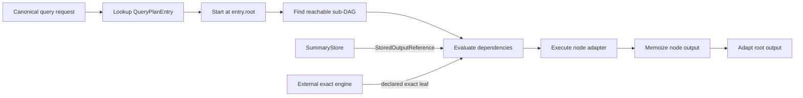
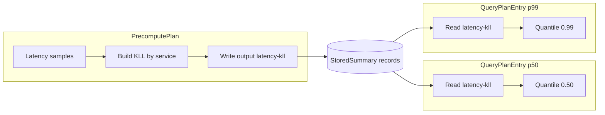

# QueryPlan DAG execution

Audience: backend designers and developers.

This document describes how the backend executes an installed `QueryPlan`.
The [plan split](asapplanner-integration.md) defines why query-time work is
separate from maintenance, and the
[SDS contract](summary-catalog-sds-architecture.md) defines the stored records
read by the plan.

## Runtime contract

The physical compiler publishes one `QueryPlanEntry` for each installed query.
An entry contains a root, typed nodes, dependency IDs, evaluation-time rules,
and an explicit fallback policy. The query engine executes the nodes reachable
from that root. It does not parse the incoming expression into another runtime
program and does not execute `selected_dags`; those documents retain Planner
semantic provenance for validation and debugging.

The request first resolves a canonical query identity in the active, immutable
physical-plan snapshot. The Summary Catalog, PrecomputePlan and QueryPlan in
that snapshot have the same plan ID and version. A lookup miss is a capability
miss and follows the installed routing policy.

Installation rejects missing inputs, cycles, unreachable nodes, invalid output
bindings, unsupported provenance versions, and a reader whose window contract
or `StoredOutputReference` differs from its PrecomputePlan writer. Runtime
errors retain the query ID and node ID.

## Execution layers

V1 uses one plan and three value adapters rather than three semantic programs.

| Adapter | Nodes and values | Scheduling |
| --- | --- | --- |
| Stored-summary adapter | `ReadMaterialization`, state merge, exact/sketch readout, scalar arithmetic and reduction | Reachable nodes run in topological order. Each node runs once for the requested root. |
| PromQL/MetricsQL residual adapter | Logical aggregation, binary, temporal, subquery, candidate reranking and prepared exact leaves | Demand evaluation memoized by `(node_id, evaluation_time)`. The time key is required because a subquery evaluates one dependency at several timestamps. |
| ClickHouse relation adapter | External relations, filters, projections and joins around stored-summary sub-DAGs | Demand evaluation memoized by `node_id`. Each edge validates its declared relation schema. Stored-summary sub-DAGs delegate to the topological adapter. |

All adapters start from a `QueryPlanEntry` node. The language adapters only
represent different runtime value types. They cannot select a replacement
definition or reconstruct an operator from the request text.

## StoredSummary reads

A `ReadMaterialization` carries the exact `StoredOutputReference` published for
its writer. V1 derives its output ID from the definition ID because the current
store index is definition keyed. The read proceeds as follows:

1. Validate the output reference and its definition identity.
2. Use the active catalog generation and definition to select only visible
   stored summaries. A previous generation is visible only after an explicit
   compatible-definition decision during activation.
3. Reject unpublished input, a request outside the bound pane/full-window
   phase, missing required panes, or an unavailable population.
4. Check the installed catalog descriptor against the requested readout family.
5. Decode payloads using their stored descriptor and merge only compatible
   states according to the plan's grouping contract.

The query engine performs an ID lookup in the SummaryStore index. It does not
search the catalog at serving time for an alternative summary. Instance
metadata and payload are one logical `StoredSummary`; the physical
`SummaryStateReference` used by the storage engine is not a QueryPlan edge.

Readiness is conservative. Until the store represents completed empty panes,
a missing additive pane is not assumed to be zero. A coverage or format miss
therefore triggers the entry's installed fallback behavior instead of returning
a partial accelerated answer.

## Dependency ordering and reuse

Each evaluation derives only the sub-DAG reachable from the requested root.
Dependencies complete before their consumer. Output memoization makes a diamond
graph execute its shared node once within that evaluation.

PromQL subqueries are the exception to a plain node-only memo key. The same
node has a different result at each evaluation timestamp, so their memo key is
`(node_id, evaluation_time)`. Repeated access at the same timestamp reuses the
value. Prepared external leaves use the same identity and are issued before
local residual evaluation so network I/O does not hide inside a synchronous
operator.

Memoization is request local. It is discarded after the root result is adapted;
the SummaryStore is the cross-request reuse boundary. A summary revision fence
prevents a response from combining payloads changed during one evaluation.

## Exact work and fallback

An `ExternalExact` node is an ordinary typed DAG leaf. Its expression, output
shape, parameters and input contracts are installed with the plan. The engine
may prepare it through Prometheus, MetricsQL or ClickHouse only when forwarding
is enabled. Candidate-dependent leaves first evaluate their installed candidate
sub-DAG and pass the resulting membership set to the exact request.

Fallback is not an implicit parser retry inside the executor. An
`ExactFallback` node fails deliberately, and the entry's `FallbackPolicy`
determines whether the router may call the exact backend. Invalid graphs,
incompatible stored state and unsupported nodes fail closed with a scoped
reason.

## Shared KLL example

Two installed query entries can read one precomputed output while keeping
different query roots:

`Read50`, `Read99` and `Write` carry the same `StoredOutputReference`. Each
request reads the ready population/window records and executes only its own
readout sub-DAG. No query rebuilds the KLL and no serving-time catalog search
chooses a different summary.

Within one entry, two parents may also share a read or relational node. The
request-local memo returns its existing value to the second parent. Across the
p50 and p99 requests, payload reuse comes from SummaryStore rather than a
cross-request executor cache.

## Concurrency, cancellation and limits

Requests execute concurrently and own separate memo maps and intermediate
values. The active physical plan and committed stored summaries are shared
through immutable snapshots or synchronized store indexes. No mutable execution
context is shared between requests.

V1 evaluates ready nodes sequentially inside one request. Independent requests
still run concurrently. Parallel execution of independent nodes is unnecessary
for correctness and remains future work. External I/O uses the request client's
timeout; cancellation drops the request-local evaluation and its prepared
values. Logical subqueries enforce depth and evaluation budgets to bound memory
and work.

Large relation intermediates and a unified resource budget across all three
adapters remain follow-up work. The current implementation also does not cache
root results across requests, add a distributed query scheduler, or reuse stored
payloads across plan versions without the activation-time compatibility check.

## End-to-end sequence

1. The control plane installs and activates one coherent physical plan.
2. The serving endpoint canonicalizes the request only to find its installed
   entry; it does not compile a new execution graph.
3. The engine validates the entry against the active catalog generation.
4. Declared external leaves are prepared when allowed.
5. The appropriate value adapter evaluates the reachable sub-DAG with
   request-local memoization.
6. `ReadMaterialization` nodes resolve their bound ready stored summaries.
7. Node failures carry query/node context and follow the installed fallback
   policy.
8. A revision fence confirms that stored input did not change during execution.
9. The root value is adapted to the Prometheus/MetricsQL or ClickHouse response.
