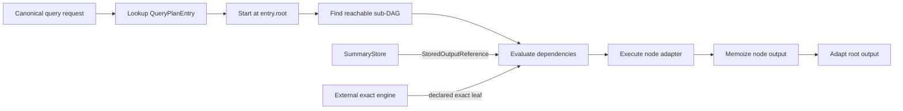
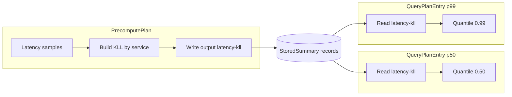

# QueryPlan DAG execution

Audience: backend designers and developers.

This document describes how the backend executes an installed `QueryPlan`.
The [plan split](asapplanner-integration.md) defines why query-time work is
separate from maintenance, and the
[SDS contract](summary-catalog-sds-architecture.md) defines the stored records
read by the plan.

## Runtime contract

The physical compiler publishes one `QueryPlanEntry` for each installed query.
An entry contains a root, typed nodes, dependency IDs, evaluation-time rules,
and an explicit fallback policy. The query engine executes the nodes reachable
from that root. It does not parse the incoming expression into another runtime
program and does not execute `selected_dags`; those documents retain Planner
semantic provenance for validation and debugging.

The request first resolves a canonical query identity in the active, immutable
physical-plan snapshot. The Summary Catalog, PrecomputePlan and QueryPlan in
that snapshot have the same plan ID and version. A lookup miss is a capability
miss and follows the installed routing policy.

Installation rejects missing inputs, cycles, unreachable nodes, invalid output
bindings, unsupported provenance versions, and a reader whose window contract
or `StoredOutputReference` differs from its PrecomputePlan writer. Runtime
errors retain the query ID and node ID.

## Execution layers

V1 uses one plan and three value adapters rather than three semantic programs.

| Adapter | Nodes and values | Scheduling |
| --- | --- | --- |
| Stored-summary adapter | `ReadMaterialization`, state merge, exact/sketch readout, scalar arithmetic and reduction | Reachable nodes run in topological order. Each node runs once for the requested root. |
| PromQL/MetricsQL residual adapter | Logical aggregation, binary, temporal, subquery, candidate reranking and prepared exact leaves | Demand evaluation memoized by `(node_id, evaluation_time)`. The time key is required because a subquery evaluates one dependency at several timestamps. |
| ClickHouse relation adapter | External relations, filters, projections and joins around stored-summary sub-DAGs | Demand evaluation memoized by `node_id`. Each edge validates its declared relation schema. Stored-summary sub-DAGs delegate to the topological adapter. |

All adapters start from a `QueryPlanEntry` node. The language adapters only
represent different runtime value types. They cannot select a replacement
definition or reconstruct an operator from the request text.

## Shared physical operator library

`crates/asap-physical-operators` owns the concrete accumulator kernels, typed
state/update traits, Planner-family factory, scalar arithmetic, row membership filtering, grouped TopK, and installed
QueryPlan DAG traversal. Both maintenance and query execution import this crate
directly; the old data-plane operator/factory modules are removed. A deployment
such as asap-fusion can depend on the library without importing `data_plane` or
`control_plane`, and without taking a dependency on this backend's Arrow version.

The compiler calls the library's allocation-free `validate_summary_kernel`
when binding a `SummaryAgg`. Runtime construction uses the same validation.
Unsupported family/layout combinations and invalid parameters are rejected
before the accumulator runs. This is a summary-kernel capability check, not a
claim that every Planner payload has a complete local implementation.

Kernels do not own execution placement. Their state can be constructed during
maintenance or during a query, and the same merge/readout implementation handles
raw-only, partially precomputed and fully precomputed inputs. The independent
library integration test exercises these three boundaries with KLL. This test
checks operator reuse; it does not claim that the backend's currently forbidden
raw Scan has become an installed query source.

Storage reads, population/window selection, expression-to-update evaluation,
transport, language result adaptation and scheduling policy remain deployment
responsibilities. In particular, Planner's current restrictions on summary construction
still limit which query-time summary DAGs can be exported. Completing
that contract requires Planner placement support and backend raw-source binding;
classifying an enum variant is not proof of local executability.

## Physical operator coverage and acceptance contract

Coverage describes this PR and the immutable Planner revision in `Cargo.toml`.
**This PR does not yet meet the universal local-execution contract.**
An exhaustive phase match proves ownership only. A reusable kernel proves an
algorithm implementation exists; neither proves that a concrete installed plan
can obtain its inputs and execute every node locally.

The target contract is: compilation accepts a local query plan only if every
reachable operator has a concrete implementation for its parameters, input and
output schemas/states, grouping, time scope and placement. Raw-only, partial
precomputation and full precomputation must obey the same contract. An explicitly
external plan may remain useful, but is not evidence of local coverage.

### All Planner executable payloads

“Backend” below describes implemented paths and their restrictions, not a promise
that every instance of the payload is accepted. Shared kernels do not include
backend storage, relational adapters or arbitrary expression evaluation.

| Payload | Execution phase | Backend implementation / limitation | Shared library |
| --- | --- | --- | --- |
| `Fallback` | Ingestion time or query time | Selected ingestion source boundary, prepared external exact subtree, or explicit whole-query fallback. No general local raw-query executor. | No source/SQL/PromQL executor |
| `Binary` | Ingestion time or query time | Maintenance arithmetic requires immutable completed, aligned row inputs; query scalar/vector arithmetic uses the relevant value adapter. Not arbitrary row/vector coercion. | Float64 Add/Sub/Mul/Div/Mod/Pow/Atan2; alignment and vector semantics remain backend-local |
| `MembershipFilter` | Ingestion time or query time | Query vector semijoin is implemented, with pruning completeness checked separately from ranking. No ingestion adapter yet. | Generic row membership filter; ordinary grouped TopK is a separate kernel |
| `Value` | Ingestion time or query time | Operation-specific subset; see next table. | Exact accumulator kernels only; no general Value dispatcher |
| `RelationalJoin` | Ingestion time or query time | Query ClickHouse relation adapter implements inner/left/right/full/cross/semi/anti joins within supported predicate/schema/value semantics. No generic maintenance join implementation. This is not a claim of all ClickHouse settings/NULL semantics. | Not extracted |
| `SummaryAgg` | Ingestion time or query time | Raw-ingestion specialization and restricted maintenance row-to-state aggregation. Factory validates family/layout/parameters. Maintenance DAG path needs a typed update evaluator, immutable inputs and installed materialization; it does not support arbitrary item expressions or output populations. No installed query-time builder. | Construction/update kernels for families below; placement-neutral |
| `SummaryJoin` | Ingestion time or query time | Ownership classified; no dispatch implementation in maintenance runtime. | No registered SummaryJoin kernel |
| `SummarySubtract` | Ingestion time or query time | Ownership classified; unsupported by maintenance runtime. | No registered SummarySubtract kernel |
| `SummaryDelete` | Ingestion time or query time | Ownership classified; no dispatch implementation in maintenance runtime. | No registered SummaryDelete kernel |
| `SummaryEstimate` | Ingestion time or query time | Typed sketch readout over compatible stored states, with family, window and population restrictions. | Underlying sketch query kernels; store/readout adapter remains backend-local |
| `SummaryMerge` | Ingestion time or query time | Planner and backend support both phases. Query merges can consume stored ingestion results and query-produced states; ingestion merges cannot depend on future query results. | Compatible-state merge kernels; no universal cross-family merge |

A physical operator defines **what computation happens**. The plan decides
**when it happens: ingestion time or query time**. This rule applies to every
physical computation operator. Ingestion time includes background processing
of arriving data; it need not run inline with each sample. The phase column
states the design contract. The implementation column records current gaps;
it must not turn those gaps into permanent restrictions on an operator.

The phase API uses `IngestionTime` and `QueryTime`, serialized as
`ingestion_time` and `query_time`. There are no aliases for the former names.

### Candidate pruning is a composed subgraph

The fused candidate-ranking operator is removed from Planner and QueryPlan.
The graph contains independently executable operations:

1. Read membership keys from a summary.
2. Obtain authoritative values, optionally pushing the membership restriction
   into an explicitly bound external request.
3. Apply `MembershipFilter`, a semijoin that preserves value-row order and
   multiplicity. Membership scores never replace authoritative values.
4. Apply the ordinary grouped TopK operator.

`MembershipFilter` has no k, grouping or ranking behavior. The shared library
provides separate `rows::membership_filter` and `rows::grouped_topk` kernels,
which other deployments can compose. A missing authoritative value fails a
certified membership plan; best-effort pruning remains explicitly approximate.
The pruning certificate stays on the filter. Exact reranking does not prove
that omitted keys could not have won. Planner still rejects uncertified pruning
for an exact request.

External expression binding verifies the selected exact subtree against its
native expression; it does not substitute the original top-level TopK child.
Planner exports and costs filtering and ranking separately. Executable DAG wire
version 3 requires updated consumers; no fused-operator compatibility path is
retained. Backend owned-DAG schema version 3 and ingestion-DAG schema version 4
reject incompatible installed documents.

### Every ValueOperation

| Operation | Implemented path | Limits / missing coverage |
| --- | --- | --- |
| `MaintainPopulation` | Specialized remote-write current-series maintenance | Not a general table-row update executor; not shared-library functionality |
| `ReadPopulation` | Compiled current-series readout with installed identity/capacity | Specialized maintained population, not arbitrary raw Scan |
| `Exact(Aggregate)` | Relation adapter and supported logical aggregate lowering | Relation measures Count/Sum/Avg/Min/Max; numeric Sum/Avg/Min/Max require non-null Int64/Float64 and finite valid values. Per-entity reduction and grouping-without unsupported there. No universal AggIntent implementation |
| `FinalizeExactAccumulator` | Typed exact readout; maintenance finalization of immutable completed windows | Supported exact families below; not an arbitrary state conversion |
| `Project` | Query relation adapter | Supported expression/value subset; no general maintenance implementation |
| `Filter` | Query relation predicate adapter | Supported expression/value subset; no general maintenance implementation |
| `Sort` | Query relation adapter; supported logical sorting | Relation partitioned sorting, NaN or unsupported sort-key types rejected |
| `Limit` | Query relation adapter with offset; specialized logical lowering | Not a generic maintenance operator |
| `Extension` | No general executor | Unsupported value operations can lower to explicit ExactFallback; this is not local support |

### Summary-family and readout coverage

The Planner-family factory accepts only `PerSubpopulationInstance` grouping and
matching family/parameter variants. The presence of a low-level accumulator does
not automatically register a Planner binding. Supported kernels expose update,
compatible-state merge and family-specific query operations; decoding, window
coverage and readout compatibility still require the backend adapter.

| Family / algorithm | Factory admission | Intended readout and restrictions |
| --- | --- | --- |
| Exact Sum, Count, Min, Max | Supported matching ExactParams | Corresponding exact readout; keyed/scalar update shape must match |
| Exact Increase, Rate | Supported matching ExactParams | Counter/time-aware readout; not plain scalar sum/division semantics |
| Exact IRate | Unsupported | No matching factory/readout binding |
| KLL | k in 8..65535 | Quantile |
| DDSketch | finite 0 < alpha < 1 | Quantile; backend continuous-percentile adapter uses interpolated readout |
| HLL | precision 4..18, local Regular HLL implementation | Cardinality; kernel availability does not supply an accuracy/failure-probability proof |
| CMS, CountSketch | Positive width/depth, checked allocation size | PointCount: supported key/value shape or sample-total readout; no heap TopK |
| CMSWithHeap, CountSketchWithHeap | Same matrix checks plus positive heap size | PointCount and ranked heap TopK; approximate membership is not guaranteed complete exact TopK |
| UnivMon | Positive heap/columns, rows 1..20, layers 1..64, checked dimensions | Cardinality, FrequencyL2, FrequencyEntropy and sample-total PointCount; no general keyed readout |
| KMV, Theta | Unsupported | Planner algorithm existence is not runtime support |
| Plain, Sample, Wavelet, StatModel | Not summary-factory kernels | Plain rows may be relation values, not a SummaryAgg accumulator |
| Shared grouping / Hydra KLL | Not admitted by current Planner-family factory | Low-level Hydra code exists; no installed shared-grouping coverage claim |

All six SketchQuery variants are accounted for: Quantile, Cardinality,
PointCount, TopK, FrequencyL2 and FrequencyEntropy. They are family-specific,
not a Cartesian product with every sketch. PointCount requires the supported
SampleValue/None or named/qualified-key/Some(value) shape; heapless sketches
cannot enumerate TopK. Native matrix construction checks are distinct from
packed-wire decoder limits. The SummaryAgg capability check does not validate
all subsequent readout combinations or certify approximation guarantees.

### Installed QueryPlan and residual coverage

| Installed node(s) | Local execution status |
| --- | --- |
| Scalar, Binary, ReduceSum | Implemented scalar/grouped value paths |
| ReadMaterialization | Bound catalog/store read; requires available compatible population/windows |
| SummaryEstimate, ExactReadout, SummaryMerge | Implemented for supported typed states/readouts; not raw-source construction |
| MembershipFilter | Value-preserving membership semijoin; ordinary Logical TopKSelection ranks its output |
| Relational, RelationalJoin | Backend ClickHouse value adapter subset described above; not in shared library |
| Logical | Residual operator subset listed below |
| ExternalExact | Declared external computation, possibly dependent on candidates; not local coverage |
| ExactFallback | Deliberate failure handed to installed fallback policy; not an implementation |

Residual operator inventory:

- `CurrentSeries`: local read of an installed maintained population.
- `ExactSubquery`, `CandidateExactSubquery`: prepared external exact results.
- `Scan`: explicitly rejected in deployed plans (`local raw Scan is forbidden`).
- `UnaryNegate`, `VectorToScalar`: implemented typed scalar/vector operations.
- `Aggregate`: Sum, Max, Min, Avg, Count; `TopKSelection`: grouped value ranking.
- `Binary`: Add/Sub/Mul/Div/CheckedDiv/FiniteDiv/Mod/Pow and
  Equal/NotEqual/Less/LessEqual/Greater/GreaterEqual; typed matching and domain
  restrictions apply, not arbitrary PromQL binary syntax.
- `Temporal`: Rate, Increase, Avg, Max, Min, Sum, Count over supported inputs.
- `Sort`, `HistogramQuantile`, `Subquery`: implemented residual paths; subqueries
  require bounded time grids and memoization by node and evaluation time.

The shared synchronous/asynchronous DAG walker schedules and memoizes nodes. It
requires a runtime adapter; it is not an implementation of the entire inventory.
Relational and PromQL adapters remain in data_plane, so asap-fusion cannot yet
obtain a complete query engine by importing the shared crate alone.

### Precomputation boundary: present status and required acceptance

| Plan placement | Present evidence | Remaining requirement |
| --- | --- | --- |
| Raw only | Independent KLL consumer constructs and queries state directly | Backend local raw source plus query-time summary construction/lowering; currently not supported as a general installed query plan |
| Partially precomputed | KLL consumer merges prebuilt prefix with query-built suffix; backend can combine supported stored and residual nodes | General stored-state + raw-suffix query DAG, typed update evaluation, compatible scope/merge checks and process acceptance |
| Fully precomputed | Backend stored read/merge/readout paths and process tests | Valid only for supported family/schema/window/operator combinations; storage readiness remains a runtime requirement |

To complete the requested contract, Planner must express valid query-time summary
placement; the backend must bind local raw inputs and query-time builders; and
installation must check every reachable operator against concrete adapter
capabilities, including expressions, family/readout combinations and edge states.
SummaryJoin/Subtract/Delete require actual defined implementations or explicit
compile-time rejection in local plans. External execution must be declared as a
different deployment capability, not silently counted as local support.

Acceptance must execute the same supported query under all three placements with
external forwarding disabled, check results against the raw exact computation
(and declared approximation guarantees where applicable), and reject unsupported
operators/parameters at installation. Include grouped/temporal, empty/missing
window, mixed-state compatibility and query-time summary cases. No percentage
coverage or universal executability is claimed until these tests exist and pass.

### Evidence and verification limits

Source map (paths relative to repository root):

- `control_plane/src/physical/executable_binding.rs`: phase ownership and SummaryAgg admission; ownership is not whole-graph capability validation.
- `control_plane/src/query_plan.rs`, `control_plane/src/physical/maintained_population.rs`: lowering and specialized population handling.
- `crates/asap-physical-operators/src/capability.rs`, `factory.rs`, `query_dag.rs`: shared admission, construction and adapter-driven scheduling.
- `data_plane/src/precompute_engine/raw_dag.rs`, `maintenance_runtime.rs`: raw specialization, implemented maintenance dispatch and unsupported branches.
- `data_plane/src/query_engines/asap_query_engine/{post_asap_readout,logical_dag,summary_executor,exact_subqueries}.rs`: query adapters and raw/external boundaries.
- `data_plane/src/query_engines/asap_clickhouse_query_engine/relational_adapter.rs` and its `aggregate.rs`: relation subset and rejection conditions.
- `crates/asap_types/src/query_plan.rs` and `query_plan/residual.rs`: complete installed node/operator inventory.

Shared-library tests cover kernels, a KLL three-boundary consumer, invalid KLL
parameters and native CountSketch dimensions. Backend tests cover supported DAG,
maintenance, readout and relation paths. Passing these suites is not a proof that
every Planner payload or parameter combination is locally executable. Inherited
level-1 grouped-Sum/quantile-ratio failures and #759's strict local-execution gate
remain unresolved; external exact success does not satisfy that gate.

## StoredSummary reads

A `ReadMaterialization` carries the exact `StoredOutputReference` published for
its writer. V1 derives its output ID from the definition ID because the current
store index is definition keyed. The read proceeds as follows:

1. Validate the output reference and its definition identity.
2. Use the active catalog generation and definition to select only visible
   stored summaries. A previous generation is visible only after an explicit
   compatible-definition decision during activation.
3. Reject unpublished input, a request outside the bound pane/full-window
   phase, missing required panes, or an unavailable population.
4. Check the installed catalog descriptor against the requested readout family.
5. Decode payloads using their stored descriptor and merge only compatible
   states according to the plan's grouping contract.

The query engine performs an ID lookup in the SummaryStore index. It does not
search the catalog at serving time for an alternative summary. Instance
metadata and payload are one logical `StoredSummary`; the physical
`SummaryStateReference` used by the storage engine is not a QueryPlan edge.

Readiness is conservative. Until the store represents completed empty panes,
a missing additive pane is not assumed to be zero. A coverage or format miss
therefore triggers the entry's installed fallback behavior instead of returning
a partial accelerated answer.

## Dependency ordering and reuse

Each evaluation derives only the sub-DAG reachable from the requested root.
Dependencies complete before their consumer. Output memoization makes a diamond
graph execute its shared node once within that evaluation.

PromQL subqueries are the exception to a plain node-only memo key. The same
node has a different result at each evaluation timestamp, so their memo key is
`(node_id, evaluation_time)`. Repeated access at the same timestamp reuses the
value. Prepared external leaves use the same identity and are issued before
local residual evaluation so network I/O does not hide inside a synchronous
operator.

Memoization is request local. It is discarded after the root result is adapted;
the SummaryStore is the cross-request reuse boundary. A summary revision fence
prevents a response from combining payloads changed during one evaluation.

## Exact work and fallback

An `ExternalExact` node is an ordinary typed DAG leaf. Its expression, output
shape, parameters and input contracts are installed with the plan. The engine
may prepare it through Prometheus, MetricsQL or ClickHouse only when forwarding
is enabled. Candidate-dependent leaves first evaluate their installed candidate
sub-DAG and pass the resulting membership set to the exact request.

Fallback is not an implicit parser retry inside the executor. An
`ExactFallback` node fails deliberately, and the entry's `FallbackPolicy`
determines whether the router may call the exact backend. Invalid graphs,
incompatible stored state and unsupported nodes fail closed with a scoped
reason.

## Shared KLL example

Two installed query entries can read one precomputed output while keeping
different query roots:

`Read50`, `Read99` and `Write` carry the same `StoredOutputReference`. Each
request reads the ready population/window records and executes only its own
readout sub-DAG. No query rebuilds the KLL and no serving-time catalog search
chooses a different summary.

Within one entry, two parents may also share a read or relational node. The
request-local memo returns its existing value to the second parent. Across the
p50 and p99 requests, payload reuse comes from SummaryStore rather than a
cross-request executor cache.

## Concurrency, cancellation and limits

Requests execute concurrently and own separate memo maps and intermediate
values. The active physical plan and committed stored summaries are shared
through immutable snapshots or synchronized store indexes. No mutable execution
context is shared between requests.

V1 evaluates ready nodes sequentially inside one request. Independent requests
still run concurrently. Parallel execution of independent nodes is unnecessary
for correctness and remains future work. External I/O uses the request client's
timeout; cancellation drops the request-local evaluation and its prepared
values. Logical subqueries enforce depth and evaluation budgets to bound memory
and work.

Large relation intermediates and a unified resource budget across all three
adapters remain follow-up work. The current implementation also does not cache
root results across requests, add a distributed query scheduler, or reuse stored
payloads across plan versions without the activation-time compatibility check.

## End-to-end sequence

1. The control plane installs and activates one coherent physical plan.
2. The serving endpoint canonicalizes the request only to find its installed
   entry; it does not compile a new execution graph.
3. The engine validates the entry against the active catalog generation.
4. Declared external leaves are prepared when allowed.
5. The appropriate value adapter evaluates the reachable sub-DAG with
   request-local memoization.
6. `ReadMaterialization` nodes resolve their bound ready stored summaries.
7. Node failures carry query/node context and follow the installed fallback
   policy.
8. A revision fence confirms that stored input did not change during execution.
9. The root value is adapted to the Prometheus/MetricsQL or ClickHouse response.
