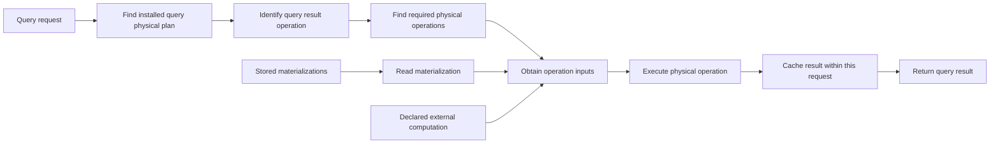
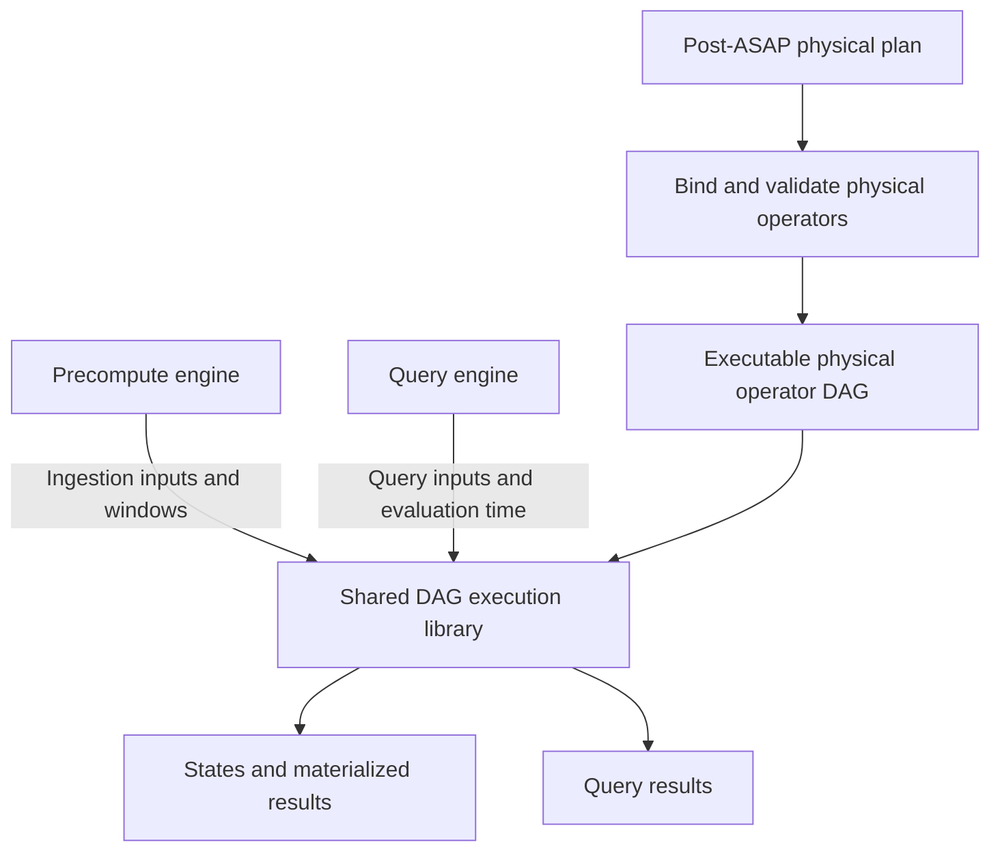
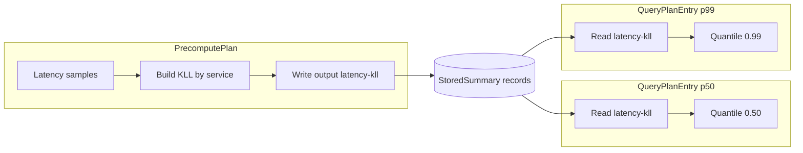

# QueryPlan DAG execution

Audience: system designers and deployment implementers.

This document describes how the backend executes an installed `QueryPlan`.
The [plan split](asapplanner-integration.md) defines why query-time work is
separate from ingestion-time work, and the
[SDS contract](summary-catalog-sds-architecture.md) defines the stored records
read by the plan.

## Runtime contract

The physical compiler publishes one `QueryPlanEntry` for each installed query.
An entry contains a root, typed nodes, dependency IDs, evaluation-time rules,
and an explicit fallback policy. The query engine executes the nodes reachable
from that root. It does not parse the incoming expression into another runtime
program and does not execute `selected_dags`; those documents retain Planner
semantic provenance for validation and debugging.

The request first resolves a canonical query identity in the active, immutable
physical-plan snapshot. The Summary Catalog, PrecomputePlan and QueryPlan in
that snapshot have the same plan ID and version. A lookup miss is a capability
miss and follows the installed routing policy.

The installed query physical plan is represented by `QueryPlanEntry`; its `root`
identifies the operation producing the query result. Required input operations
execute before their consumers. The execution adapter invokes the implementation
of each physical operation, and request-local caching avoids repeated evaluation
of shared dependencies. Operations evaluated at multiple query times are cached
separately for each evaluation time.

“Read materialization” is the operation listed in the coverage table. It obtains
stored state from `SummaryStore` through a `StoredOutputReference`. Declared
external computation supplies an explicitly bound input; it is not a local
physical operation implementation.

Installation rejects missing inputs, cycles, unreachable nodes, invalid output
bindings, unsupported provenance versions, and a reader whose window contract
or `StoredOutputReference` differs from its PrecomputePlan writer. Runtime
errors retain the query ID and node ID.

## Shared DAG execution

**Decision: ASAP owns an independently implemented shared DAG runtime and
physical operators. Both engines use the same runtime. DataFusion is a design
reference, not the execution framework.**

The shared library executes a physical operator DAG for both the precompute
engine and the query engine. It is designed around that execution contract,
not around the backend's function or module boundaries. The independent runtime
and native batch operators are implemented. Both installed query execution and
ingestion execution use this runtime; their existing storage and value adapters
are still being replaced by native batch operator bindings.

The intended boundary is that the compiler binds each operation to a concrete
implementation and checks its input and output types before accepting the plan.
Both engines execute the result through the same library. Computation semantics
belong in that library; replacing the remaining backend adapters with native
operator bindings is still required to complete this boundary.

An operation defines its computation, typed inputs and outputs, and requirements
such as input ordering and grouping. An execution instance owns the changing
state for one run. Keeping the plan separate from running state allows the same
plan to serve concurrent queries and ingestion windows without sharing mutable
accumulators accidentally.

Operations consume and produce batches incrementally where their semantics
allow it. Filter and Project can emit results as batches arrive. Sorting a
complete group must wait until that group's input is complete. Grouped Limit
counts across batches, not separately within each batch. For ingestion, the
engine supplies window completion; for a query, the engine supplies the
requested input range. These requirements do not make an operator exclusive to
one execution phase.

### Engine responsibilities

| Component | Responsibility |
| --- | --- |
| Shared DAG execution library | Physical operator implementations, typed expressions, state construction/merge/readout, dependency execution, shared intermediate results, cancellation, and execution resource accounting |
| Precompute engine | Connect ingestion sources, assign data to the intended windows, supply completion signals, and persist or restore operator state and materialized results |
| Query engine | Bind request parameters and evaluation times, connect stored or declared external inputs, invoke the shared DAG, and format results |
| Deployment integration | Supply source/sink implementations, storage, scheduling resources, and durability policy |

The library does not depend on either engine. Another deployment such as
asap-fusion can bind its own sources and sinks to the same physical operators.
Every computation operator may run at ingestion time or query time; the plan
chooses when, and the engine supplies the appropriate inputs and execution scope.

### Shared dependencies

A DAG can have several consumers of the same operation. The execution library
must represent that shared identity explicitly. Reusing a plan object alone does
not establish that its computation runs once.

Within a query, **request-local caching of intermediate results** prevents
repeated evaluation of a shared dependency. Time-dependent results are separated
by evaluation time. During ingestion, sharing is scoped to the same execution
and input window. Results from distinct requests or windows are never mixed.

For streaming output, the runtime delivers the same produced batches to each
consumer. Buffering is bounded and participates in the execution memory budget;
a slow consumer cannot cause unlimited retention. Cancelling one consumer does
not stop a producer still needed by another. Cancelling the whole execution wakes consumers; the next poll or dropping the
execution releases producer streams and queued results. Already delivered values
remain owned and accounted for until their consumers release them.

### Implemented execution boundaries

An execution runs on the caller's worker; the library does not create a thread
pool. Its streams may await deployment I/O, and every consumer of a shared
producer must be polled concurrently. It currently uses worker-local execution
state, so a running execution cannot migrate between threads. Separate runs have
separate producers, buffers and accumulators.

Each producer has a configurable batch-buffer limit. Outputs and native blocking
state use a configurable estimated byte budget, including values retained by a
consumer after queue eviction. This is execution accounting, not a hard process
RSS limit: source-owned input, temporary allocation peaks and allocator overhead
are outside the guarantee. Sort, exact aggregation and semi-join currently
materialize their inputs and fail when the budget is exceeded; they do not spill.
Summary construction updates its accumulators incrementally. Plan depth is
limited to 128 to bound recursive stream polling.

A native post-ASAP binding rejects unknown operations, unsupported expressions,
invalid parameters and incompatible schemas before starting sources. Deployments
explicitly bind storage or ingestion frontiers; those bindings do not authorize
a local raw Scan. The native binder covers a subset of Planner, and the installed
backend binder remains separate while its value adapters are migrated. Neither
binder may count external execution as native operator coverage.

## Shared physical operator library

The library's unit of composition is an executable physical operator. Each
operator exposes its input dependencies, output schema, execution requirements,
and a way to start execution. Filter, Project, Aggregate, Join, Sort, Limit,
and summary operations participate in this same contract.

Typed scalar expressions are separate from operations over batches. A literal,
negation, or comparison can be evaluated inside Project or Filter without
inventing a separate DAG node for every expression. Where Planner represents a
standalone scalar-producing operation, it uses the same expression semantics.
All accepted value types and nullability rules follow Planner's contract.

Existing mathematical algorithms may supply internal kernels, but their current
backend wrappers do not define the new operator API. Moving helper functions
into a crate is not sufficient: both engines must instantiate and execute the
shared operators through the shared DAG runtime. Removed backend-specific
execution paths must not survive as compatibility branches.

## DataFusion reuse vs. independent implementation

The alternatives are to build on DataFusion's execution framework and general
operators, adding ASAP-specific operators, or to implement ASAP's own DAG runtime
and physical operators. This design selects independent implementation.

| Concern | Reuse DataFusion | Independent ASAP implementation |
| --- | --- | --- |
| General computations | Reuse existing expressions, projection, filtering, joins, sorting, and aggregation where their semantics match Planner | Implement and test the supported operations and expression semantics against Planner's contract |
| Execution model | Adopt its physical-plan interfaces and batch streams; integrate ASAP-specific execution requirements | Define node identity, typed edges, execution instances, and multi-consumer behavior as the library's core contract |
| Shared dependencies | Shared references to a plan object do not by themselves guarantee shared execution; additional coordination is needed | One producer execution per node, input partition, and evaluation scope, with explicit result delivery to all consumers |
| Summary state | Supply custom accumulators/operators and integrate the required state lifecycle | Treat summary construction, updates, merge, readout, snapshots, and restoration as native operator capabilities |
| Ingestion and query execution | Adapt both engines to DataFusion while adding ASAP's window and persistence behavior | Use the same runtime and operators in both engines; engines supply their inputs, execution scope, and persistence integration |
| Resource management | Reuse framework facilities where applicable, while accounting for ASAP-specific state and sharing | Implement bounded buffering, memory accounting, backpressure, cancellation, and cleanup |
| Dependencies and maintenance | Accept DataFusion/Arrow interface and version constraints | Own the execution API and its maintenance; accept greater implementation and verification work |

DataFusion's
[ExecutionPlan interface](https://docs.rs/datafusion/latest/datafusion/physical_plan/trait.ExecutionPlan.html)
represents input dependencies through shared plan references and starts execution
by returning a batch stream. This permits shared references in the plan
representation; it does not establish a general execute-once guarantee for a
producer with multiple consumers. ASAP's decision is therefore not based on a
claim that DataFusion cannot represent a shared node. It is based on making
shared execution and the summary-state lifecycle explicit parts of ASAP's own
runtime contract.

ASAP needs both a finite query execution and ingestion execution over successive
windows. The same summary producer may feed several computations or sinks.
The runtime must coordinate those consumers without duplicating updates,
mixing evaluation times, or cancelling work still needed elsewhere. Persisted
state also requires explicit snapshot and restoration semantics. DataFusion's
[Accumulator interface](https://docs.rs/datafusion/latest/datafusion/logical_expr/trait.Accumulator.html)
provides update, merge, and result operations, but its intermediate-state export
can consume state; that interface alone is not an ingestion checkpoint protocol.

Independent implementation gives ASAP direct control over these behaviors and
keeps the shared library usable by other deployments. The cost is substantial:
ASAP must implement and test the general operators, type and null semantics,
stream lifecycle, and resource controls rather than assume a framework supplies
them. The coverage table must continue to report incomplete implementations.

DataFusion remains a reference for separating immutable operator definitions
from execution state, batch-stream processing, typed
[physical expressions](https://docs.rs/datafusion/latest/datafusion/physical_expr/trait.PhysicalExpr.html),
and operator input/output requirements. Existing sketch algorithms and suitable
low-level libraries may be reused internally. This does not authorize retaining
the current backend executor as a second execution path. Choosing a batch memory
format is separate from choosing the DAG runtime; independence does not require
reimplementing every buffer or mathematical primitive.

Acceptance of the new runtime must include a shared producer with two consumers,
consumers progressing at different rates, cancellation of one consumer, failure
propagation, and isolation between query times and ingestion windows. Stateful
operators must also survive snapshot and restoration without applying a committed
input twice. The execute-once guarantee within one execution does not by itself
prove correct recovery after a restart. These tests complement operator result
checks and must run through both engines' integration with the shared library.

## Physical operator coverage and acceptance contract

Coverage describes this PR and the immutable Planner revision in `Cargo.toml`.
**The shared DAG runtime and the native operator subset below are implemented.
The backend does not yet meet the universal local-execution contract.**
An exhaustive phase match proves ownership only. A reusable kernel proves an
algorithm implementation exists; neither proves that a concrete installed plan
can obtain its inputs and execute every node locally.

The target contract is: compilation accepts a local query plan only if every
reachable operator has a concrete implementation for its parameters, input and
output schemas/states, grouping, time scope and placement. Raw-only, partial
precomputation and full precomputation must obey the same contract. An explicitly
external plan may remain useful, but is not evidence of local coverage.

### Physical operation coverage

A physical operation defines **what computation happens**. The plan chooses
**ingestion time or query time**. This applies to every computation operation;
ingestion time includes background processing of arriving data. Current adapter
gaps are implementation work, not permanent restrictions on execution time.

The table lists each operation once, regardless of whether the code represents
it inside `ValueOperation`, `Logical`, or another wrapper. “Backend integration”
means an implemented path for the stated subset, not universal support.

| Physical operation | Purpose | Shared library implementation | Backend integration | Missing coverage |
| --- | --- | --- | --- | --- |
| Raw Scan | Read raw input rows | None | Rejected in installed local query plans | Local raw source; deferred from this PR |
| Read materialization | Load previously computed state | State decoding kernels; no storage adapter | Catalog/store binding for compatible populations and windows | General raw input access; unavailable or incompatible state cannot be read |
| Maintain current-series state | Update the maintained values and timestamps for incoming time series. | None | Specialized remote-write ingestion path | General table-row updates and shared implementation |
| Read current-series state | Read values from the maintained time-series state for query execution. | None | Current-series readout using the installed state identity and capacity | Arbitrary raw-table reading |
| Scalar | Produce a scalar value | Typed native source, including nullable values | Installed scalar adapter on the shared runtime | Bind installed scalar nodes directly to the native batch source |
| Binary | Combine or compare two inputs | Native matching-type Int64/Float64 arithmetic expressions, checked integer arithmetic, comparisons and boolean expressions; Float64 arithmetic kernels | Query arithmetic, CheckedDiv/FiniteDiv and comparisons; ingestion arithmetic on immutable completed, aligned rows | General coercion, arbitrary PromQL matching and unsupported value domains |
| Unary negate | Negate a value | Native Int64/Float64 expression with null propagation and checked integer overflow | Typed query scalar/vector adapter | Connect installed value paths to the native expression binding |
| Vector to scalar | Convert a vector to a scalar | Native Float64 batch operator; zero or multiple rows produce NaN | Typed query adapter | Connect installed value paths to the native batch operator |
| Exact aggregate | Compute Count/Sum/Avg/Min/Max, including ReduceSum | Native grouped batches: checked Int64 Sum, Float64 Sum/Avg, Int64 Count, ordered Min/Max, nullable inputs; exact state kernels | Relation and query adapters | Connect installed adapters to native batches; no universal AggIntent, per-entity or unresolved grouping-without binding; blocking execution has no spill |
| Finalize exact accumulator / ExactReadout | Obtain an exact result from typed state | Native validated readout for the six supported exact families; Int64 Count and Float64 numeric results | Typed query readout and ingestion finalization | Native batch integration; arbitrary state conversion and other exact families |
| Project | Select or calculate output columns | Native typed expressions and batch projection; Planner plain scalar and collection values are preserved | Query relation adapter | Complete expression vocabulary and installed native batch binding |
| Filter | Keep rows satisfying a predicate | Native batch predicate evaluation; three-valued boolean logic, equality/less-than, null checks | Query relation adapter | Other predicates, coercions and installed native batch binding |
| Relational join, including semi-join | Match rows by a predicate; semi-join retains matching left rows | Native batch semi-join with explicit matching columns; value order and left multiplicity preserved; other joins remain backend-local | Relation adapter supports inner/left/right/full/cross/semi/anti joins within its predicate/schema subset; vector candidate pruning currently uses a dedicated membership adapter; general semi-join replacement pending | General ingestion join adapter and unrestricted SQL/NULL semantics |
| Sort | Order input rows or values | Native stable grouped sort with null placement; NaN follows numeric values | Query relation and logical adapters | Installed native batch binding; unsupported key types and spill-to-disk |
| Limit | Keep a bounded slice of input | Native offset/limit per group across batches; global Limit stops consuming after its slice | Query relation offset/limit and specialized logical lowering | Planner grouped-Limit transport and installed native batch binding; Limit does not rank or match candidate keys |
| Union | Combine input streams with the same schema | Native stream union; polls all inputs | Native Planner binding uses it for multi-input summary merge | General installed batch binding |
| SummaryAgg | Construct summary state from input | Native incremental grouped builder for exact Sum/Count/Min/Max/Rate/Increase, KLL, DDSketch and HLL; non-null Float64 updates, timestamped counters | Ingestion specialization and restricted row-to-state adapter | Installed native builder; Int64 updates, keyed updates and other families in the native batch interface |
| SummaryMerge | Combine compatible summary states | Native grouped state merge; multiple input streams compose through Union; family and parameters checked | Ingestion and query adapters | Installed native batch binding; cross-family conversion is not a merge |
| SummaryEstimate | Query a summary for an approximate result | Native KLL quantile, DDSketch quantile/count and HLL cardinality/count; parameters checked before execution | Typed stored-state readout | Other family/readout combinations in native batches; window/population compatibility and accuracy evidence remain required |
| SummaryJoin | Combine summary inputs using summary join semantics | No registered kernel | No runtime dispatch | Concrete kernel and adapters |
| SummarySubtract | Subtract summary state | No registered kernel | Unsupported in ingestion runtime | Concrete kernel and adapters |
| SummaryDelete | Remove contributions from summary state | No registered kernel | No runtime dispatch | Concrete kernel and adapters |
| Temporal computation | Compute Rate/Increase/Avg/Max/Min/Sum/Count over time | Relevant exact accumulator kernels, not a complete temporal adapter | Query paths over supported inputs | General input/state combinations and ingestion adapter |
| Histogram quantile | Calculate a quantile from histogram buckets | No separate histogram adapter | Query path | General ingestion adapter |
| Subquery | Evaluate an expression over a time grid | Shared DAG execution and request-local caching of intermediate results | Backend expands each operation and evaluation time into a node in the shared runtime; bounded grids and explicit source frontiers | Shared time-grid construction and general ingestion adapter |
| Extension | Execute an additional value operation | No general executor | Unsupported operations may route to explicit fallback | A concrete local implementation for each admitted extension |

Grouped TopK is represented in the target plan as Sort followed by Limit within
each group. The native library supports this composition. The installed dedicated TopK
plan node must still be replaced, and Planner Limit needs an explicit grouping
contract. A global Limit is not equivalent. An
optimized kernel may execute the composition without changing its meaning.
Candidate completeness remains a condition on pruning, not on ranking.

The current-series operations maintain and read a set of time series and their
current values; they do not provide a general raw-table scan or full historical
read. Their code names are `MaintainPopulation` for updates and `ReadPopulation`
/ `CurrentSeries` for reads.

External computation (`ExternalExact`, `ExactSubquery`,
`CandidateExactSubquery`) and fallback are routing choices, not local physical
operation implementations. They do not fill any missing coverage in this table.
The shared runtime owns dependency execution, bounded batch delivery and
request-local caching of intermediate results. Installed-plan adapters still
provide some computation semantics; the table identifies these migration gaps.
Importing the library does not provide backend sources or a complete query engine.

**Deferred raw-data support:** this PR does not implement local raw Scan or
claim complete local execution when only raw data is stored. External fallback
and independent DAG tests with supplied batches do not satisfy that capability.

### Candidate pruning is a composed subgraph

The fused candidate-ranking operator is removed from Planner and QueryPlan.
The target graph uses a general semi-join in place of the current dedicated
`MembershipFilter` adapter. That code change is pending separately from this
runtime implementation. The graph contains these operations:

1. Read membership keys from a summary.
2. Obtain authoritative values, optionally pushing the membership restriction
   into an explicitly bound external request.
3. Apply a general semi-join with explicit matching keys that preserves value-row order and
   multiplicity. Membership scores never replace authoritative values.
4. Sort authoritative values and apply Limit independently within each group.

The semi-join has no k, grouping or ranking behavior. The native DAG library
implements semi-join, grouped Sort and grouped Limit as composable operators.
Installed vector adapters still use specialized membership and ranking kernels;
replacing their plan representation and bindings remains separate work. A missing authoritative value fails a
certified membership plan; best-effort pruning remains explicitly approximate.
The pruning certificate stays on the semi-join. Exact reranking does not prove
that omitted keys could not have won. Planner still rejects uncertified pruning
for an exact request.

External expression binding verifies the selected exact subtree against its
native expression; it does not substitute the original top-level TopK child.
Planner represents and costs filtering and ranking separately. Incompatible
installed plans are rejected; removed operators have no compatibility path.

### Summary-family and readout coverage

The native batch interface currently admits exact Sum/Count/Min/Max/Rate/Increase,
KLL, DDSketch and HLL states. The broader low-level factory inventory below does
not imply native DAG bindings for every listed family.

The Planner-family factory accepts only `PerSubpopulationInstance` grouping and
matching family/parameter variants. The presence of a low-level accumulator does
not automatically register a Planner binding. Supported kernels expose update,
compatible-state merge and family-specific query operations; decoding, window
coverage and readout compatibility still require the backend adapter.

| Family / algorithm | Factory admission | Intended readout and restrictions |
| --- | --- | --- |
| Exact Sum, Count, Min, Max | Supported matching ExactParams | Corresponding exact readout; keyed/scalar update shape must match |
| Exact Increase, Rate | Supported matching ExactParams | Counter/time-aware readout; not plain scalar sum/division semantics |
| Exact IRate | Unsupported | No matching factory/readout binding |
| KLL | k in 8..65535 | Quantile |
| DDSketch | finite 0 < alpha < 1 | Quantile; backend continuous-percentile adapter uses interpolated readout |
| HLL | precision 4..18, local Regular HLL implementation | Cardinality; kernel availability does not supply an accuracy/failure-probability proof |
| CMS, CountSketch | Positive width/depth, checked allocation size | PointCount: supported key/value shape or sample-total readout; no heap TopK |
| CMSWithHeap, CountSketchWithHeap | Same matrix checks plus positive heap size | PointCount and ranked heap TopK; approximate membership is not guaranteed complete exact TopK |
| UnivMon | Positive heap/columns, rows 1..20, layers 1..64, checked dimensions | Cardinality, FrequencyL2, FrequencyEntropy and sample-total PointCount; no general keyed readout |
| KMV, Theta | Unsupported | Planner algorithm existence is not runtime support |
| Plain, Sample, Wavelet, StatModel | Not summary-factory kernels | Plain rows may be relation values, not a SummaryAgg accumulator |
| Shared grouping / Hydra KLL | Not admitted by current Planner-family factory | Low-level Hydra code exists; no installed shared-grouping coverage claim |

All six SketchQuery variants are accounted for: Quantile, Cardinality,
PointCount, TopK, FrequencyL2 and FrequencyEntropy. They are family-specific,
not a Cartesian product with every sketch. PointCount requires the supported
SampleValue/None or named/qualified-key/Some(value) shape; heapless sketches
cannot enumerate TopK. Native matrix construction checks are distinct from
packed-wire decoder limits. The SummaryAgg capability check does not validate
all subsequent readout combinations or certify approximation guarantees.

### Precomputation boundary: present status and required acceptance

| Precomputation mode | Definition | Current support / remaining gaps |
| --- | --- | --- |
| No precomputation | The query starts from raw data and performs all required computation at query time. | Native DAGs can construct and query summaries from supplied batches. Installed plans still need native builder bindings; the local raw source is deferred from this PR. |
| Partial precomputation | The query reuses previously computed results or states and performs the remaining computation at query time. Inputs may combine stored states, stored values, and raw data. | Supported stored-state and query-time operations can be combined. General plans requiring local raw input or query-time summary construction remain incomplete. |
| Full precomputation | All data-dependent computation needed for the query result has been performed before the query arrives. Query execution retrieves the prepared result and formats the response. | Supported only where the prepared result matches the requested query and time scope and is available. Reading stored summaries followed by merging, estimation, aggregation or ranking is partial precomputation. |

These definitions are independent of any particular algorithm. The KLL consumer
tests are examples of constructing, merging, and querying state across different
precomputation boundaries. They execute native operator DAGs as well as reusable kernels, not
complete backend support for all three modes. In particular, a test that queries
a prebuilt KLL state still performs estimation at query time; it does not
demonstrate full precomputation of the query result.

The remaining work below describes the target contract, not a requirement to
implement local raw Scan in this PR. Planner must express valid query-time summary
placement; the backend must bind local raw inputs and query-time builders; and
installation must check every reachable operator against concrete adapter
capabilities, including expressions, family/readout combinations and edge states.
SummaryJoin/Subtract/Delete require actual defined implementations or explicit
compile-time rejection in local plans. External execution must be declared as a
different deployment capability, not silently counted as local support.

Acceptance must execute the same supported query under all three placements with
external forwarding disabled, check results against the raw exact computation
(and declared approximation guarantees where applicable), and reject unsupported
operators/parameters at installation. Include grouped/temporal, empty/missing
window, mixed-state compatibility and query-time summary cases. No percentage
coverage or universal executability is claimed until these tests exist and pass.

### Evidence and verification limits

Shared-library tests cover native DAGs, shared producers, backpressure, cancellation,
resource accounting, isolated runs, typed expressions, grouped Sort/Limit, semi-join,
summary construction/merge/readout at both phases, source schema validation and
unsupported binding rejection. KLL examples cover all three state-input boundaries.
Kernel tests additionally cover invalid KLL parameters and native CountSketch dimensions. Backend tests cover supported DAG,
maintenance, readout and relation paths. Passing these suites is not a proof that
every Planner payload or parameter combination is locally executable. Inherited
level-1 grouped-Sum/quantile-ratio failures and #759's strict local-execution gate
remain unresolved; external exact success does not satisfy that gate.

## StoredSummary reads

A `ReadMaterialization` carries the exact `StoredOutputReference` published for
its writer. V1 derives its output ID from the definition ID because the current
store index is definition keyed. The read proceeds as follows:

1. Validate the output reference and its definition identity.
2. Use the active catalog generation and definition to select only visible
   stored summaries. A previous generation is visible only after an explicit
   compatible-definition decision during activation.
3. Reject unpublished input, a request outside the bound pane/full-window
   phase, missing required panes, or an unavailable population.
4. Check the installed catalog descriptor against the requested readout family.
5. Decode payloads using their stored descriptor and merge only compatible
   states according to the plan's grouping contract.

The query engine performs an ID lookup in the SummaryStore index. It does not
search the catalog at serving time for an alternative summary. Instance
metadata and payload are one logical `StoredSummary`; the physical
`SummaryStateReference` used by the storage engine is not a QueryPlan edge.

Readiness is conservative. Until the store represents completed empty panes,
a missing additive pane is not assumed to be zero. A coverage or format miss
therefore triggers the entry's installed fallback behavior instead of returning
a partial accelerated answer.

## Dependency ordering and reuse

Each evaluation derives only the sub-DAG reachable from the requested root.
Dependencies complete before their consumer. Request-local caching of intermediate results makes a diamond
graph execute its shared node once within that evaluation.

PromQL subqueries are the exception to a cache key containing only the operation identity. The same
node has a different result at each evaluation timestamp, so their cache key is
`(node_id, evaluation_time)`. Repeated access at the same timestamp reuses the
value. Prepared external leaves use the same identity and are issued before
local query-time evaluation so network I/O does not hide inside a synchronous
operator.

The cache is request local. It is discarded after the root result is adapted;
the SummaryStore is the cross-request reuse boundary. A summary revision fence
prevents a response from combining payloads changed during one evaluation.

## Exact work and fallback

An `ExternalExact` node is an ordinary typed DAG leaf. Its expression, output
shape, parameters and input contracts are installed with the plan. The engine
may prepare it through Prometheus, MetricsQL or ClickHouse only when forwarding
is enabled. Candidate-dependent leaves first evaluate their installed candidate
sub-DAG and pass the resulting membership set to the exact request.

Fallback is not an implicit parser retry inside the executor. An
`ExactFallback` node fails deliberately, and the entry's `FallbackPolicy`
determines whether the router may call the exact backend. Invalid graphs,
incompatible stored state and unsupported nodes fail closed with a scoped
reason.

## Shared KLL example

Two installed query entries can read one precomputed output while keeping
different query roots:

`Read50`, `Read99` and `Write` carry the same `StoredOutputReference`. Each
request reads the ready population/window records and executes only its own
readout sub-DAG. No query rebuilds the KLL and no serving-time catalog search
chooses a different summary.

Within one entry, two parents may also share a read or relational node. The
request-local cache returns its existing value to the second parent. Across the
p50 and p99 requests, payload reuse comes from SummaryStore rather than a
cross-request executor cache.

## Concurrency, cancellation and limits

Requests execute concurrently and own separate result caches and intermediate
values. The active physical plan and committed stored summaries are shared
through immutable snapshots or synchronized store indexes. No mutable execution
context is shared between requests.

The current backend evaluates ready nodes sequentially inside one request. Independent requests
still run concurrently. Parallel execution of independent nodes is unnecessary
for correctness and remains future work. External I/O uses the request client's
timeout; cancellation drops the request-local evaluation and its prepared
values. Query-time subqueries enforce depth and evaluation budgets to bound memory
and work.

Large relation intermediates and a unified execution resource budget remain follow-up work. The current implementation also does not cache
root results across requests, add a distributed query scheduler, or reuse stored
payloads across plan versions without the activation-time compatibility check.

## End-to-end sequence

1. The control plane installs and activates one coherent physical plan.
2. The serving endpoint canonicalizes the request only to find its installed
   entry; it does not compile a new execution graph.
3. The engine validates the entry against the active catalog generation.
4. Declared external leaves are prepared when allowed.
5. The target shared runtime executes the reachable physical operator DAG with
   request-local caching of intermediate results.
6. `ReadMaterialization` nodes resolve their bound ready stored summaries.
7. Node failures carry query/node context and follow the installed fallback
   policy.
8. A revision fence confirms that stored input did not change during execution.
9. The root value is adapted to the Prometheus/MetricsQL or ClickHouse response.
