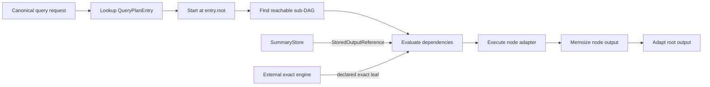
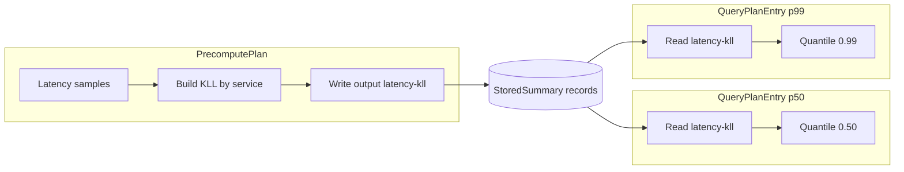

# QueryPlan DAG execution

Audience: backend designers and developers.

This document describes how the backend executes an installed `QueryPlan`.
The [plan split](asapplanner-integration.md) defines why query-time work is
separate from maintenance, and the
[SDS contract](summary-catalog-sds-architecture.md) defines the stored records
read by the plan.

## Runtime contract

The physical compiler publishes one `QueryPlanEntry` for each installed query.
An entry contains a root, typed nodes, dependency IDs, evaluation-time rules,
and an explicit fallback policy. The query engine executes the nodes reachable
from that root. It does not parse the incoming expression into another runtime
program and does not execute `selected_dags`; those documents retain Planner
semantic provenance for validation and debugging.

The request first resolves a canonical query identity in the active, immutable
physical-plan snapshot. The Summary Catalog, PrecomputePlan and QueryPlan in
that snapshot have the same plan ID and version. A lookup miss is a capability
miss and follows the installed routing policy.

Installation rejects missing inputs, cycles, unreachable nodes, invalid output
bindings, unsupported provenance versions, and a reader whose window contract
or `StoredOutputReference` differs from its PrecomputePlan writer. Runtime
errors retain the query ID and node ID.

## Execution layers

V1 uses one plan and three value adapters rather than three semantic programs.

| Adapter | Nodes and values | Scheduling |
| --- | --- | --- |
| Stored-summary adapter | `ReadMaterialization`, state merge, exact/sketch readout, scalar arithmetic and reduction | Reachable nodes run in topological order. Each node runs once for the requested root. |
| PromQL/MetricsQL query-time adapter | Logical aggregation, binary, temporal, subquery, candidate reranking and prepared exact leaves | Demand evaluation memoized by `(node_id, evaluation_time)`. The time key is required because a subquery evaluates one dependency at several timestamps. |
| ClickHouse relation adapter | External relations, filters, projections and joins around stored-summary sub-DAGs | Demand evaluation memoized by `node_id`. Each edge validates its declared relation schema. Stored-summary sub-DAGs delegate to the topological adapter. |

All adapters start from a `QueryPlanEntry` node. The language adapters only
represent different runtime value types. They cannot select a replacement
definition or reconstruct an operator from the request text.

## Shared physical operator library

`crates/asap-physical-operators` owns the concrete accumulator kernels, typed
state/update traits, Planner-family factory, scalar arithmetic, row membership filtering, grouped TopK, and installed
QueryPlan DAG traversal. Both maintenance and query execution import this crate
directly; the old data-plane operator/factory modules are removed. A deployment
such as asap-fusion can depend on the library without importing `data_plane` or
`control_plane`, and without taking a dependency on this backend's Arrow version.

The compiler calls the library's allocation-free `validate_summary_kernel`
when binding a `SummaryAgg`. Runtime construction uses the same validation.
Unsupported family/layout combinations and invalid parameters are rejected
before the accumulator runs. This is a summary-kernel capability check, not a
claim that every Planner payload has a complete local implementation.

Kernels do not own execution placement. Their state can be constructed during
maintenance or during a query, and the same merge/readout implementation handles
raw-only, partially precomputed and fully precomputed inputs. The independent
library integration test exercises these three boundaries with KLL. This test
checks operator reuse; it does not claim that the backend's currently forbidden
raw Scan has become an installed query source.

Storage reads, population/window selection, expression-to-update evaluation,
transport, language result adaptation and scheduling policy remain deployment
responsibilities. In particular, Planner's current restrictions on summary construction
still limit which query-time summary DAGs can be exported. Completing
that contract requires Planner placement support and backend raw-source binding;
classifying an enum variant is not proof of local executability.

## Physical operator coverage and acceptance contract

Coverage describes this PR and the immutable Planner revision in `Cargo.toml`.
**This PR does not yet meet the universal local-execution contract.**
An exhaustive phase match proves ownership only. A reusable kernel proves an
algorithm implementation exists; neither proves that a concrete installed plan
can obtain its inputs and execute every node locally.

The target contract is: compilation accepts a local query plan only if every
reachable operator has a concrete implementation for its parameters, input and
output schemas/states, grouping, time scope and placement. Raw-only, partial
precomputation and full precomputation must obey the same contract. An explicitly
external plan may remain useful, but is not evidence of local coverage.

### Physical operation coverage

A physical operation defines **what computation happens**. The plan chooses
**ingestion time or query time**. This applies to every computation operation;
ingestion time includes background processing of arriving data. Current adapter
gaps are implementation work, not permanent restrictions on execution time.

The table lists each operation once, regardless of whether the code represents
it inside `ValueOperation`, `Logical`, or another wrapper. “Backend integration”
means an implemented path for the stated subset, not universal support.

| Physical operation | Purpose | Shared library implementation | Backend integration | Missing coverage |
| --- | --- | --- | --- | --- |
| Raw Scan | Read raw input rows | None | Rejected in installed local query plans | Local raw source; deferred from this PR |
| Read materialization | Load previously computed state | State decoding kernels; no storage adapter | Catalog/store binding for compatible populations and windows | General raw input access; unavailable or incompatible state cannot be read |
| Maintain population | Update the current-series population | None | Specialized remote-write ingestion path | General table-row updates and shared implementation |
| Read population / CurrentSeries | Read current values from a maintained population | None | Installed population identity/capacity and current-series readout | Arbitrary raw-table reading |
| Scalar | Produce a scalar value | No separate scalar-source executor | Typed scalar path | General expression evaluation |
| Binary | Combine or compare two inputs | Float64 Add/Sub/Mul/Div/Mod/Pow/Atan2 kernels | Query arithmetic, CheckedDiv/FiniteDiv and comparisons; ingestion arithmetic on immutable completed, aligned rows | General coercion, arbitrary PromQL matching and unsupported value domains |
| Unary negate | Negate a value | No separate adapter | Typed query scalar/vector path | General ingestion adapter |
| Vector to scalar | Convert a vector to a scalar | No separate adapter | Typed query path | General ingestion adapter |
| Exact aggregate | Compute Count/Sum/Avg/Min/Max, including ReduceSum | Exact accumulator kernels | Relation and query aggregate adapters | No universal aggregate implementation; relation numeric measures require non-null Int64/Float64 and finite valid values; relation per-entity reduction and grouping-without unsupported |
| Finalize exact accumulator / ExactReadout | Obtain an exact result from typed state | Exact-family readout kernels | Typed query readout and ingestion finalization of immutable completed windows | Arbitrary state conversion and unsupported exact families |
| Project | Select or calculate output columns | No general expression executor | Query relation adapter | Unsupported expressions/types and general ingestion adapter |
| Filter | Keep rows satisfying a predicate | No general predicate executor | Query relation adapter | Unsupported predicates/types and general ingestion adapter |
| Relational join, including semi-join | Match rows by a predicate; semi-join retains matching left rows | Row membership kernel; general semi-join replacement pending; other joins remain backend-local | Relation adapter supports inner/left/right/full/cross/semi/anti joins within its predicate/schema subset; vector candidate pruning currently uses a dedicated membership adapter; general semi-join replacement pending | General ingestion join adapter and unrestricted SQL/NULL semantics |
| Sort | Order input rows or values | No general sorting adapter | Query relation and logical sorting | Relation partitioned sorting, NaN and unsupported key types; general ingestion adapter |
| Limit | Keep a bounded slice of input | No separate adapter | Query relation offset/limit and specialized logical lowering | General ingestion adapter; does not rank or match candidate keys |
| Grouped TopK | Rank values and select the best k per group | Grouped TopK kernel | Query TopK selection after authoritative values are obtained | General ingestion adapter; ranking does not prove candidate completeness |
| SummaryAgg | Construct summary state from input | Supported-family construction/update kernels | Raw-ingestion specialization and restricted row-to-state ingestion aggregation | Installed query-time builder; arbitrary item expressions/output populations; typed update evaluation required |
| SummaryMerge | Combine compatible summary states | Compatible-state merge kernels | Ingestion and query state merge | Universal cross-family merge is not supported |
| SummaryEstimate | Query a summary for an approximate result | Family-specific sketch query kernels | Typed stored-state readout | Unsupported family/readout combinations; window/population compatibility and accuracy evidence remain required |
| SummaryJoin | Combine summary inputs using summary join semantics | No registered kernel | No runtime dispatch | Concrete kernel and adapters |
| SummarySubtract | Subtract summary state | No registered kernel | Unsupported in ingestion runtime | Concrete kernel and adapters |
| SummaryDelete | Remove contributions from summary state | No registered kernel | No runtime dispatch | Concrete kernel and adapters |
| Temporal computation | Compute Rate/Increase/Avg/Max/Min/Sum/Count over time | Relevant exact accumulator kernels, not a complete temporal adapter | Query paths over supported inputs | General input/state combinations and ingestion adapter |
| Histogram quantile | Calculate a quantile from histogram buckets | No separate histogram adapter | Query path | General ingestion adapter |
| Subquery | Evaluate an expression over a time grid | DAG memoization support, not the subquery executor | Query path with bounded grids and memoization by node/evaluation time | Unbounded grids and general ingestion adapter |
| Extension | Execute an additional value operation | No general executor | Unsupported operations may route to explicit fallback | A concrete local implementation for each admitted extension |

External computation (`ExternalExact`, `ExactSubquery`,
`CandidateExactSubquery`) and fallback are routing choices, not local physical
operation implementations. They do not fill any missing coverage in this table.
The shared DAG walker schedules and memoizes nodes but still needs backend
adapters; importing the library alone does not provide a complete query engine.

**Deferred raw-data support:** this PR does not implement local raw Scan or
claim complete local execution when only raw data is stored. External fallback
and the independent raw-input kernel tests do not satisfy that capability.

The phase API uses `IngestionTime` and `QueryTime`, serialized as
`ingestion_time` and `query_time`, without aliases for former names.

### Candidate pruning is a composed subgraph

The fused candidate-ranking operator is removed from Planner and QueryPlan.
The target graph uses a general semi-join in place of the current dedicated
`MembershipFilter` adapter. That code change is pending separately from this
documentation update. The graph contains these operations:

1. Read membership keys from a summary.
2. Obtain authoritative values, optionally pushing the membership restriction
   into an explicitly bound external request.
3. Apply a general semi-join with explicit matching keys that preserves value-row order and
   multiplicity. Membership scores never replace authoritative values.
4. Apply the ordinary grouped TopK operator.

The semi-join has no k, grouping or ranking behavior. The shared library currently provides `rows::membership_filter` and
`rows::grouped_topk`; the pending change replaces the former with a general
`rows::semi_join` kernel that other deployments can compose with ranking. A missing authoritative value fails a
certified membership plan; best-effort pruning remains explicitly approximate.
The pruning certificate stays on the semi-join. Exact reranking does not prove
that omitted keys could not have won. Planner still rejects uncertified pruning
for an exact request.

External expression binding verifies the selected exact subtree against its
native expression; it does not substitute the original top-level TopK child.
Planner exports and costs filtering and ranking separately. Executable DAG wire
version 3 requires updated consumers; no fused-operator compatibility path is
retained. Backend owned-DAG schema version 3 and ingestion-DAG schema version 4
reject incompatible installed documents.

### Summary-family and readout coverage

The Planner-family factory accepts only `PerSubpopulationInstance` grouping and
matching family/parameter variants. The presence of a low-level accumulator does
not automatically register a Planner binding. Supported kernels expose update,
compatible-state merge and family-specific query operations; decoding, window
coverage and readout compatibility still require the backend adapter.

| Family / algorithm | Factory admission | Intended readout and restrictions |
| --- | --- | --- |
| Exact Sum, Count, Min, Max | Supported matching ExactParams | Corresponding exact readout; keyed/scalar update shape must match |
| Exact Increase, Rate | Supported matching ExactParams | Counter/time-aware readout; not plain scalar sum/division semantics |
| Exact IRate | Unsupported | No matching factory/readout binding |
| KLL | k in 8..65535 | Quantile |
| DDSketch | finite 0 < alpha < 1 | Quantile; backend continuous-percentile adapter uses interpolated readout |
| HLL | precision 4..18, local Regular HLL implementation | Cardinality; kernel availability does not supply an accuracy/failure-probability proof |
| CMS, CountSketch | Positive width/depth, checked allocation size | PointCount: supported key/value shape or sample-total readout; no heap TopK |
| CMSWithHeap, CountSketchWithHeap | Same matrix checks plus positive heap size | PointCount and ranked heap TopK; approximate membership is not guaranteed complete exact TopK |
| UnivMon | Positive heap/columns, rows 1..20, layers 1..64, checked dimensions | Cardinality, FrequencyL2, FrequencyEntropy and sample-total PointCount; no general keyed readout |
| KMV, Theta | Unsupported | Planner algorithm existence is not runtime support |
| Plain, Sample, Wavelet, StatModel | Not summary-factory kernels | Plain rows may be relation values, not a SummaryAgg accumulator |
| Shared grouping / Hydra KLL | Not admitted by current Planner-family factory | Low-level Hydra code exists; no installed shared-grouping coverage claim |

All six SketchQuery variants are accounted for: Quantile, Cardinality,
PointCount, TopK, FrequencyL2 and FrequencyEntropy. They are family-specific,
not a Cartesian product with every sketch. PointCount requires the supported
SampleValue/None or named/qualified-key/Some(value) shape; heapless sketches
cannot enumerate TopK. Native matrix construction checks are distinct from
packed-wire decoder limits. The SummaryAgg capability check does not validate
all subsequent readout combinations or certify approximation guarantees.

### Precomputation boundary: present status and required acceptance

| Precomputation mode | Definition | Current support / remaining gaps |
| --- | --- | --- |
| No precomputation | The query starts from raw data and performs all required computation at query time. | General local raw input and query-time summary construction are not supported in installed plans; deferred from this PR. |
| Partial precomputation | The query reuses previously computed results or states and performs the remaining computation at query time. Inputs may combine stored states, stored values, and raw data. | Supported stored-state and query-time operations can be combined. General plans requiring local raw input or query-time summary construction remain incomplete. |
| Full precomputation | All data-dependent computation needed for the query result has been performed before the query arrives. Query execution retrieves the prepared result and formats the response. | Supported only where the prepared result matches the requested query and time scope and is available. Reading stored summaries followed by merging, estimation, aggregation or ranking is partial precomputation. |

These definitions are independent of any particular algorithm. The KLL consumer
tests are examples of constructing, merging, and querying state across different
precomputation boundaries. They demonstrate reusable kernel behavior, not
complete backend support for all three modes. In particular, a test that queries
a prebuilt KLL state still performs estimation at query time; it does not
demonstrate full precomputation of the query result.

The remaining work below describes the target contract, not a requirement to
implement local raw Scan in this PR. Planner must express valid query-time summary
placement; the backend must bind local raw inputs and query-time builders; and
installation must check every reachable operator against concrete adapter
capabilities, including expressions, family/readout combinations and edge states.
SummaryJoin/Subtract/Delete require actual defined implementations or explicit
compile-time rejection in local plans. External execution must be declared as a
different deployment capability, not silently counted as local support.

Acceptance must execute the same supported query under all three placements with
external forwarding disabled, check results against the raw exact computation
(and declared approximation guarantees where applicable), and reject unsupported
operators/parameters at installation. Include grouped/temporal, empty/missing
window, mixed-state compatibility and query-time summary cases. No percentage
coverage or universal executability is claimed until these tests exist and pass.

### Evidence and verification limits

Source map (paths relative to repository root):

- `control_plane/src/physical/executable_binding.rs`: phase ownership and SummaryAgg admission; ownership is not whole-graph capability validation.
- `control_plane/src/query_plan.rs`, `control_plane/src/physical/maintained_population.rs`: lowering and specialized population handling.
- `crates/asap-physical-operators/src/capability.rs`, `factory.rs`, `query_dag.rs`: shared admission, construction and adapter-driven scheduling.
- `data_plane/src/precompute_engine/raw_dag.rs`, `maintenance_runtime.rs`: raw specialization, implemented maintenance dispatch and unsupported branches.
- `data_plane/src/query_engines/asap_query_engine/{post_asap_readout,logical_dag,summary_executor,exact_subqueries}.rs`: query adapters and raw/external boundaries.
- `data_plane/src/query_engines/asap_clickhouse_query_engine/relational_adapter.rs` and its `aggregate.rs`: relation subset and rejection conditions.
- `crates/asap_types/src/query_plan.rs` and `query_plan/residual.rs`: complete installed node/operator inventory.

Shared-library tests cover kernels, a KLL three-boundary consumer, invalid KLL
parameters and native CountSketch dimensions. Backend tests cover supported DAG,
maintenance, readout and relation paths. Passing these suites is not a proof that
every Planner payload or parameter combination is locally executable. Inherited
level-1 grouped-Sum/quantile-ratio failures and #759's strict local-execution gate
remain unresolved; external exact success does not satisfy that gate.

## StoredSummary reads

A `ReadMaterialization` carries the exact `StoredOutputReference` published for
its writer. V1 derives its output ID from the definition ID because the current
store index is definition keyed. The read proceeds as follows:

1. Validate the output reference and its definition identity.
2. Use the active catalog generation and definition to select only visible
   stored summaries. A previous generation is visible only after an explicit
   compatible-definition decision during activation.
3. Reject unpublished input, a request outside the bound pane/full-window
   phase, missing required panes, or an unavailable population.
4. Check the installed catalog descriptor against the requested readout family.
5. Decode payloads using their stored descriptor and merge only compatible
   states according to the plan's grouping contract.

The query engine performs an ID lookup in the SummaryStore index. It does not
search the catalog at serving time for an alternative summary. Instance
metadata and payload are one logical `StoredSummary`; the physical
`SummaryStateReference` used by the storage engine is not a QueryPlan edge.

Readiness is conservative. Until the store represents completed empty panes,
a missing additive pane is not assumed to be zero. A coverage or format miss
therefore triggers the entry's installed fallback behavior instead of returning
a partial accelerated answer.

## Dependency ordering and reuse

Each evaluation derives only the sub-DAG reachable from the requested root.
Dependencies complete before their consumer. Output memoization makes a diamond
graph execute its shared node once within that evaluation.

PromQL subqueries are the exception to a plain node-only memo key. The same
node has a different result at each evaluation timestamp, so their memo key is
`(node_id, evaluation_time)`. Repeated access at the same timestamp reuses the
value. Prepared external leaves use the same identity and are issued before
local query-time evaluation so network I/O does not hide inside a synchronous
operator.

Memoization is request local. It is discarded after the root result is adapted;
the SummaryStore is the cross-request reuse boundary. A summary revision fence
prevents a response from combining payloads changed during one evaluation.

## Exact work and fallback

An `ExternalExact` node is an ordinary typed DAG leaf. Its expression, output
shape, parameters and input contracts are installed with the plan. The engine
may prepare it through Prometheus, MetricsQL or ClickHouse only when forwarding
is enabled. Candidate-dependent leaves first evaluate their installed candidate
sub-DAG and pass the resulting membership set to the exact request.

Fallback is not an implicit parser retry inside the executor. An
`ExactFallback` node fails deliberately, and the entry's `FallbackPolicy`
determines whether the router may call the exact backend. Invalid graphs,
incompatible stored state and unsupported nodes fail closed with a scoped
reason.

## Shared KLL example

Two installed query entries can read one precomputed output while keeping
different query roots:

`Read50`, `Read99` and `Write` carry the same `StoredOutputReference`. Each
request reads the ready population/window records and executes only its own
readout sub-DAG. No query rebuilds the KLL and no serving-time catalog search
chooses a different summary.

Within one entry, two parents may also share a read or relational node. The
request-local memo returns its existing value to the second parent. Across the
p50 and p99 requests, payload reuse comes from SummaryStore rather than a
cross-request executor cache.

## Concurrency, cancellation and limits

Requests execute concurrently and own separate memo maps and intermediate
values. The active physical plan and committed stored summaries are shared
through immutable snapshots or synchronized store indexes. No mutable execution
context is shared between requests.

V1 evaluates ready nodes sequentially inside one request. Independent requests
still run concurrently. Parallel execution of independent nodes is unnecessary
for correctness and remains future work. External I/O uses the request client's
timeout; cancellation drops the request-local evaluation and its prepared
values. Query-time subqueries enforce depth and evaluation budgets to bound memory
and work.

Large relation intermediates and a unified resource budget across all three
adapters remain follow-up work. The current implementation also does not cache
root results across requests, add a distributed query scheduler, or reuse stored
payloads across plan versions without the activation-time compatibility check.

## End-to-end sequence

1. The control plane installs and activates one coherent physical plan.
2. The serving endpoint canonicalizes the request only to find its installed
   entry; it does not compile a new execution graph.
3. The engine validates the entry against the active catalog generation.
4. Declared external leaves are prepared when allowed.
5. The appropriate value adapter evaluates the reachable sub-DAG with
   request-local memoization.
6. `ReadMaterialization` nodes resolve their bound ready stored summaries.
7. Node failures carry query/node context and follow the installed fallback
   policy.
8. A revision fence confirms that stored input did not change during execution.
9. The root value is adapted to the Prometheus/MetricsQL or ClickHouse response.
