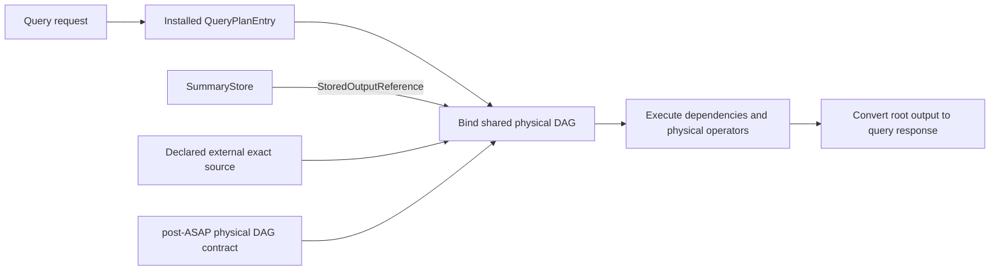

# Shared physical DAG execution

## Decision and ownership

ASAPPlanner owns `asap-physical-operators`, its independent DAG runtime and the
post-ASAP IR that defines its computation contract. Precompute engine and query
engine consume the same library. Changes to an IR operation and its execution
implementation can be reviewed in one Planner PR.

The backend owns source binding, window selection, catalog and storage access,
publication, and protocol conversion. It does not maintain copies of the shared
runtime or generic computation algorithms. JSON and Arrow conversion at the SQL
boundary does not make Arrow the internal representation of every summary.

The [shared library design](https://github.com/ProjectASAP/ASAPPlanner/blob/feat/shared-physical-operators/docs/design_docs/physical-operators.md)
contains the architecture and DataFusion comparison. DataFusion provides mature
Arrow operators; ASAP's independent runtime directly owns shared producers and
custom summary state formats. Those states need not fit Arrow RecordBatch.

## Execution model

A plan is a DAG of typed operations. A producer can have multiple consumers and
executes once per run. Each consumer sees its output independently. The runtime
owns dependency scheduling, bounded buffering, cancellation and request-local
caching of intermediate results. Separate query evaluation times and ingestion
windows have separate execution state.

Every computation operation can execute at ingestion time or query time.
The phase belongs to the plan, not the operator kind. Ingestion time includes
background work triggered by incoming data. Sources and publication remain
engine responsibilities; phase assignment alone does not provide a missing
source or implementation.

The installed plan carries deployment bindings and source references. Planner
operations retain Planner types, parameters, expressions and grouping semantics.
SQL relation nodes bind through the shared Planner binder and execute in one
shared DAG. Their storage frontiers execute together as multiple roots, sharing
upstream work and the enclosing cancellation and memory budget. PromQL bindings convert labeled vectors and windows to native
batches; common arithmetic, aggregation, sorting, limiting and temporal
computation execute in the library. Metric-name presentation and protocol
matching remain deployment bindings.

## Physical operator coverage and acceptance contract

An accepted local plan must have an implementation for every reachable
operation, including its types, parameters, grouping and state requirements.
Relation binding checks the same native implementations at installation and
execution. Unsupported operations must be rejected explicitly. Declaring an
external source is a separate deployment choice, not evidence of local support.

This table lists each operation once. Shared computation can be used in either
phase; the backend column identifies the available deployment bindings.

| Physical operation | Purpose | Shared library implementation | Backend integration | Missing coverage |
| --- | --- | --- | --- | --- |
| Raw Scan | Read raw input rows | Engines can supply typed batch sources | Local raw Scan is rejected | Local raw source is explicitly deferred |
| Read materialization | Load previously computed state | Shared decoding and delta reconstruction | Catalog/store references, population and window checks | Missing or incompatible state is a runtime error |
| Maintain current-series state | Update values and timestamps of maintained time series | No general table update operation | Remote-write storage path | General row updates; this is not a raw-table executor |
| Read current-series state | Read maintained current values | Typed source interface | Installed identity/capacity and time scope | Arbitrary raw-table reading |
| Scalar | Produce a scalar | Typed source, including nullable values | Query scalar source | General ingestion literal binding |
| Binary | Combine or compare values | Planner numeric/comparison kinds, typed expressions and checked-division domains | Query native Project; ingestion uses shared arithmetic kernels | Arbitrary vector matching and unsupported domains |
| Unary negate | Negate a value | Int64/Float64 expression, null propagation and checked integer overflow | Query native Project | General ingestion expression binding |
| Vector to scalar | Convert an instant vector to a scalar | Native Float64 operator; zero or multiple rows yield NaN | Query native batch binding | General ingestion value binding |
| Exact aggregate | Compute Count/Sum/Avg/Min/Max, including ReduceSum | Native grouped aggregation; checked Int64 Sum, Float64 Sum/Avg, Int64 Count, ordered Min/Max and nullable inputs | Query vector and SQL relation bindings use shared computation | Other aggregate intents, unresolved grouping-without and per-entity relation lowering; no spill |
| Finalize exact accumulator / ExactReadout | Obtain an exact result from state | Shared state merge/finalization and typed batch readout | Ingestion finalization and stored-query readout use shared kernels | Arbitrary state conversion and unsupported exact families |
| Project | Select or compute output columns | Planner scalar expressions and native projection | SQL native DAG; vector expression binding | Unsupported expression functions/types |
| Filter | Keep rows satisfying a predicate | Planner predicates, three-valued boolean logic and native filtering | SQL native DAG | Unsupported predicates/coercions |
| Relational join, including semi-join | Match rows; semi-join retains matching left rows | Inner/left/right/full/cross/semi/anti joins; typed predicates and nullable outer outputs | SQL native DAG; candidate vectors use general semi-join with explicit keys | General ingestion source binding; SQL candidate-pruning source binding |
| Sort | Order rows or values | Stable grouped sort with null placement | Query vector and SQL native Sort | Sort expressions must be projected first; unsupported key types; no spill |
| Limit | Keep a bounded slice per group | Grouped offset/limit across batches | Planner grouped Limit; query vector and SQL native binding | Limit does not rank or match candidate keys |
| Union | Combine compatible input streams | Fair polling of native input streams | Multi-input summary merge | General installed batch-source binding |
| SummaryAgg | Construct summary state | Native builders for exact Sum/Count/Min/Max/Rate/Increase, KLL, DDSketch and HLL; other admitted families have shared update kernels | Ingestion DAG and per-window update paths | General query builder binding; native Int64/keyed updates and other batch families |
| SummaryMerge | Combine compatible summary states | Native grouped merge and shared stored-state merge kernels | Ingestion native DAG; query selects panes and invokes shared state kernels | Cross-family conversion is not a merge; not every stored encoding has a native batch binding |
| SummaryEstimate | Read an approximate result | Shared Planner SketchQuery dispatch; native KLL/DDSketch/HLL batch readout | Stored-state query readout uses shared kernels | Unsupported family/readout combinations; accuracy evidence remains required |
| SummaryJoin | Combine summaries using summary join semantics | No registered implementation | Rejected | Concrete semantics and implementation |
| SummarySubtract | Subtract summary state | No registered implementation | Rejected | Concrete semantics and implementation |
| SummaryDelete | Remove state contributions | No registered implementation | Rejected | Concrete semantics and implementation |
| Temporal computation | Compute Rate/Increase/Sum/Avg/Min/Max/Count over a window | Native window operator using Planner intents; reset-aware rates, Int64 Count | Query range vectors bind to native batches | Other temporal intents; general ingestion window binding |
| Histogram quantile | Interpolate a quantile from histogram buckets | Native window operator using Planner HistogramQuantile intent | Query bucket input binds to native batches | General ingestion histogram source binding |
| Subquery | Evaluate an expression over a time grid | Shared DAG execution and request-local caching of intermediate results | Backend binds a bounded grid of operation/evaluation-time nodes | General ingestion time-grid binding |
| Extension | Execute an additional operation | No universal executor | Unsupported extensions are rejected | A registered implementation for each admitted extension |

Stored-state codecs and readout kernels are library capabilities; they do not
imply that every family has a native batch builder. Parameter, schema, population
and window compatibility remain mandatory. Availability of an approximate
kernel does not prove its accuracy guarantee.

## Candidate pruning and grouped ranking

Candidate pruning is a composed subgraph:

1. Read candidate keys from a summary.
2. Obtain authoritative values from a declared source.
3. Apply a general semi-join on explicit matching keys.
4. Sort by score and apply Limit independently within each group.

There is no dedicated MembershipFilter or grouped TopK physical operator.
A global Limit is not a grouped Limit. Candidate completeness belongs to the
pruning certificate; exact scoring and sorting cannot prove that an omitted key
would not have won. Missing authoritative values fail certified pruning.
Best-effort pruning remains explicitly approximate.

## Precomputation boundary

| Precomputation mode | Definition | Backend acceptance |
| --- | --- | --- |
| No precomputation | Start from raw data and perform all required computation at query time | Deferred until local raw sources and query-time summary construction are bound |
| Partial precomputation | Reuse stored results or states and compute the remaining query work at query time | Supported stored-state/value DAGs; plans requiring local raw input remain deferred |
| Full precomputation | All data-dependent computation of the query result is completed before the request | Retrieve a prepared result matching the requested query and time scope |

These definitions are algorithm-independent. KLL tests are examples, not the
definition of any mode. Reading a prebuilt KLL state and estimating its quantile
at query time is partial precomputation of the result.

## Acceptance

Library tests exercise shared-producer diamonds, multiple consumers,
backpressure, cancellation, memory accounting, both execution phases, typed
expressions, joins, grouped Sort/Limit and window computations. Backend tests
exercise installed source bindings, stored-state reconstruction, query results,
and rejection of unsupported plans. Tests compare computations against exact
results or declared approximation guarantees as appropriate.

Local raw Scan and a universal implementation of every Planner aggregate or
extension are not part of this migration. They must not be presented as complete
through fallback routing or by tests supplied with already decoded raw batches.
