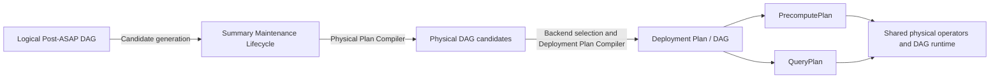
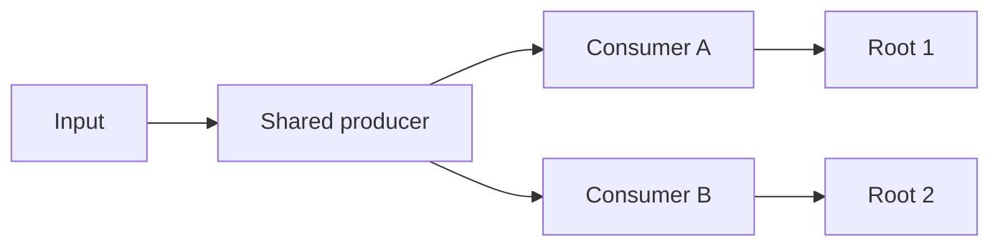

# Query DAG Execution

## 1. Overview

ASAP uses one physical-operator library and one DAG runtime for both
precomputation and query execution.


```mermaid
flowchart LR
    L["Logical Post-ASAP DAG"] -->|Candidate generation| M["Summary Maintenance Lifecycle"]
    M -->|Physical Plan Compiler| P["Physical DAG candidates"]
    P -->|Backend selection and Deployment Plan Compiler| D["Deployment Plan / DAG"]
    D --> Pre["PrecomputePlan"]
    D --> Query["QueryPlan"]
    Pre --> Runtime["Shared physical operators and DAG runtime"]
    Query --> Runtime
```

This follows [Planner #462's architecture](https://github.com/ProjectASAP/ASAPPlanner/blob/feat/shared-physical-operators/docs/design_docs/physical-planning-and-deployment.md):

| Layer | Responsibility |
| --- | --- |
| Logical Post-ASAP DAG | Computation semantics |
| Summary Maintenance Lifecycle | Build, retention, reuse, and window strategy |
| Physical DAG(s) | Supported physical candidates, executable operators, and typed boundaries |
| Deployment Plan / DAG | Selected candidate, concrete bindings, and operational lifecycle |

ASAPPlanner owns the first three layers. Backend selects a feasible physical
candidate using deployment statistics, resource limits and costs, then binds it
into `PrecomputePlan` and `QueryPlan`. It preserves the candidate's operators,
dependencies, sharing and materialization frontier.

The lifecycle is a planning contract, not another computation IR. “Maintenance”
here names Planner's lifecycle concept; input reception is ingestion and execution
before a request is precomputation. Executing a bound Physical DAG introduces
neither an **Execution DAG** abstraction nor another planning layer.

## 2. Ownership

### ASAPPlanner

ASAPPlanner owns the post-ASAP IR, logical and physical operator implementations,
`asap-physical-operators`, `physical_planner`, `CompiledPhysicalDag`, and the
independent DAG runtime. A change to an IR operation and its execution
implementation can therefore be reviewed in one Planner PR.

The runtime owns generic execution behavior:

- dependency scheduling;
- shared-producer execution;
- bounded buffering;
- cancellation;
- per-run reuse of intermediate outputs;
- operator workspace accounting.

A producer with multiple consumers executes once per DAG run, while each
consumer independently receives its output.

### Backend

Backend owns deployment-specific concerns:

- source binding and window selection;
- catalog and storage access;
- revision and coverage admission;
- summary publication;
- protocol conversion;
- query and precomputation bindings.

It does not duplicate Planner operators or maintain a second DAG runtime.
JSON, Arrow, SQL, and PromQL are boundary representations; they do not determine
the internal representation of every ASAP summary.

See the [shared library design](https://github.com/ProjectASAP/ASAPPlanner/blob/feat/shared-physical-operators/docs/design_docs/physical-planning-and-deployment.md)
for the broader architecture and DataFusion comparison.

## 3. Compilation and execution

```text
Planner: Logical Post-ASAP DAG + lifecycle candidate
                    ↓ Physical Plan Compiler
         supported Physical DAG candidates
                    ↓ Backend selection and Deployment Plan Compiler
         Deployment Plan / DAG (PrecomputePlan + QueryPlan)
                    ↓ execute bound Physical DAGs through shared runtime
         stored outputs / query results
```

### 3.1 Compile

ASAPPlanner compiles semantically legal computation and lifecycle candidates
into supported Physical DAG candidates with typed input/output boundaries.
Compilation does not require live storage readers. `CompiledPhysicalDag` is a
Rust implementation type for physical compilation, not a separate architectural
layer or an intermediate Execution DAG.

### 3.2 Bind

Backend checks candidate feasibility and costs, selects a physical candidate,
and binds its inputs in the Deployment Plan / DAG. At request time, those binding
rules resolve concrete eligible records and readers. Conceptually:

```text
Summary-state input → eligible SummaryStore records
Vector input        → labeled values and a PromQL window
Relation input      → typed SQL/storage relation
```

Admission and binding validate types, state formats, grouping, windows,
revisions, and coverage. They do not repeat operator lowering.

### 3.3 Execute

The shared runtime executes the bound Physical DAG. Execution does not lower
operators again or make new placement decisions.


```mermaid
flowchart LR
    A["Input"] --> B["Shared producer"]
    B --> C["Consumer A"] --> E["Root 1"]
    B --> D["Consumer B"] --> F["Root 2"]
```

The shared producer executes once. Multiple roots share upstream computation,
cancellation, and the enclosing memory budget.

## 4. Precomputation and query execution

Ingestion means accepting input data. Precomputation means executing a selected
DAG before a query request, including work triggered by ingestion or scheduled
window processing.

Operator type does not determine execution phase. The selected plan determines
whether an operation executes during precomputation or at query time.

For example, partial precomputation can use:

```text
Precomputation: raw data → BuildKLL → SummaryStore
Query:         SummaryStore → ReadKLL → Quantile(0.99) → result
```

The same operator library executes both DAGs.

| Mode | Pre-request work | Request-time work |
| --- | --- | --- |
| No precomputation | None | All required computation |
| Partial precomputation | Store intermediate values or states | Complete the remaining DAG |
| Full precomputation | Complete all data-dependent computation | Retrieve the prepared result |

These definitions are independent of the algorithm. Reading stored KLL state
and computing its quantile at query time is partial precomputation.
Build, merge, and readout are reusable operators rather than phase-specific operators.

## 5. Query execution

An installed query brings together these contracts:

```text
Installed query
  ├── QueryPlanEntry: nodes, dependencies and root
  ├── selected Query Physical DAG
  ├── deployment bindings and source references
  ├── window contract
  └── catalog generation
```

This is an architectural view, not the serialized field layout of
`QueryPlanEntry`; some contracts live in its enclosing plan or bound runtime graph.

At request time:


```mermaid
flowchart LR
    Request["Query request"] --> Entry["Installed query"]
    Entry --> Validate["Admit sources and pin eligible snapshot"]
    Validate --> Bind["Bind inputs within request budget"]
    Bind --> Execute["Execute DAG"]
    Execute --> Convert["Protocol conversion"] --> Result["Query result"]
```

SQL relation nodes and PromQL vector operations use the same Planner physical
DAG representation. SQL adapters bind relations and convert results at the
protocol boundary. PromQL adapters bind labeled vectors and windows. Common
arithmetic, aggregation, sorting, limiting, joins, and temporal computation
belong in the shared physical-operator library.

## 6. Request consistency

One installed query request owns one cancellation signal and one resource
budget. A request over continuous local inputs also pins one eligible input
snapshot. Range steps have separate DAG execution state but share these controls.

```text
range request
  ├─ pin eligible snapshot
  ├─ prepare inputs                 ┐
  ├─ execute t1 → retain result      ├─ shared budget
  ├─ execute t2 → retain result      │  and cancellation
  └─ return accumulated result      ┘
```

Tracked memory includes pinned SDS/current-series state, prepared inputs,
operator workspace, and retained results. JSON decoding and SQL encoding use
conservative workspace estimates; accounting is not a hard process RSS limit.

Resource exhaustion or cancellation terminates the request without exact
fallback, even if a revision changes concurrently.

### Snapshot compatibility

All local inputs used by one query must admit a common eligible revision in the
selected catalog generation. A newer partially published revision does not
invalidate an older complete revision that still satisfies freshness and coverage.

External exact adapters expose evaluation time but not a source snapshot token.
The current admission rule therefore rejects a candidate combining local
SDS/current-series inputs with external exact inputs, including candidate pruning.
The rule is checked at installation and before source access.

```text
local SDS @ r1        external exact @ unknown revision
      \                     /
       \------ operation ---/
                │
                ▼
             rejected
```

Equal timestamps are insufficient to establish equal revisions. Whole-query
external exact execution remains a separate deployment choice; a resource or
cancellation failure in a local DAG cannot trigger that choice.

## 7. Operator and plan acceptance

A local DAG is accepted only if every reachable operation has a compatible
implementation:

```text
operation
  ├── implementation exists
  ├── input/output types match
  ├── parameters are supported
  ├── grouping semantics are supported
  └── required state format is available
```

Deployment additionally validates source bindings, stored-state formats,
grouping, windows, revisions, coverage, and approximation evidence where required.
An operator implementation establishes execution support, not deployment feasibility.

Unsupported operations are rejected explicitly. Routing them to an external
source does not make them locally supported. The [Planner library contract](physical-operators.md)
owns operator support; Backend does not maintain a second operator matrix.

## 8. Candidate pruning

Candidate pruning is ordinary DAG composition:


```mermaid
flowchart LR
    Summary["Candidate summary"] --> Keys["Candidate keys"]
    Keys --> Join["SemiJoin(keys)"]
    Values["Authoritative values"] --> Join
    Join --> Sort["Sort(score)"] --> Limit["Limit per group"]
```

This path needs no dedicated `MembershipFilter` or grouped TopK operator.
Its correctness rules are:

- grouped Limit is distinct from global Limit;
- candidate completeness comes from the pruning certificate;
- exact scoring cannot recover a candidate omitted by pruning;
- missing authoritative values invalidate certified pruning;
- local candidate and scoring inputs must use the same pinned snapshot.

Best-effort pruning remains explicitly approximate.

## 9. Runtime and cancellation

Planner's native context is not `Send`, so each request executes through one
dedicated worker invocation. The worker owns thread-local execution context for
that request. Async callers signal cancellation, which remote waits and native
polling observe.

When execution finishes, the worker clears the context before the thread is
reused. Cancellation is cooperative at polling boundaries; it does not preempt
an individual synchronous kernel.

## 10. Testing and acceptance

| Layer | Required coverage |
| --- | --- |
| Planner library | Shared-producer diamonds, multiple consumers, bounded buffering/backpressure, cancellation, memory accounting, both execution phases, typed expressions, joins, grouped Sort/Limit, and window computation |
| Backend | Installed source bindings, revision and coverage admission, stored-state reconstruction, end-to-end query results, and rejection of unsupported plans |
| Request contracts | Shared budgets across range steps and nested execution, terminal resource/cancellation errors, snapshot pinning, and rejection of mixed local/external inputs before reads |

Results are compared against exact computation or the declared approximation
guarantee. These acceptance requirements do not imply that every deployment or
operator combination has been tested.

## 11. Scope

This design establishes the common execution path:

```text
Logical Post-ASAP DAG + Summary Maintenance Lifecycle
    → Physical DAG candidates
    → Deployment Plan / DAG
    → execute bound Physical DAGs
    → query/precomputation output
```

Local raw Scan and universal support for every Planner aggregate or extension
remain outside this migration. Fallback routing does not establish local support;
tests supplied with already-decoded batches do not prove raw-source integration.

ASAPPlanner #462 owns `physical_planner`, native physical operators, and DAG
execution. Backend's `DeploymentPlanCompiler` owns state identities, window
contracts, source bindings, and deployment of the resulting DAG.
