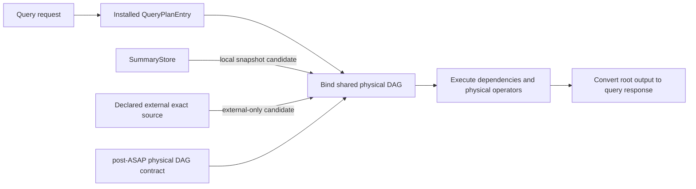

# Query DAG execution

## Decision and ownership

ASAPPlanner owns `asap-physical-operators`, its independent DAG runtime and the
post-ASAP IR that defines its computation contract. The precomputation engine and query
engine consume the same library. Changes to an IR operation and its execution
implementation can be reviewed in one Planner PR.

The backend owns source binding, window selection, catalog and storage access,
publication, and protocol conversion. It does not maintain copies of the shared
runtime or generic computation algorithms. JSON and Arrow conversion at the SQL
boundary does not make Arrow the internal representation of every summary.

The [shared library design](https://github.com/ProjectASAP/ASAPPlanner/blob/feat/shared-physical-operators/docs/design_docs/physical-planning-and-deployment.md)
contains the architecture and DataFusion comparison. DataFusion provides mature
Arrow operators; ASAP's independent runtime directly owns shared producers and
custom summary state formats. Those states need not fit Arrow RecordBatch.

## Execution model

A plan is a DAG of typed operations. A producer can have multiple consumers and
executes once per run. Each consumer sees its output independently. The runtime
owns dependency scheduling, bounded buffering, cancellation and request-local
caching of intermediate results. Separate query evaluation times and precomputation
windows have separate execution state.

Ingestion means accepting input data. Precomputation means executing a selected
Physical DAG before a query request, including work triggered by ingestion or
scheduled window processing. Query execution evaluates the selected request-time
DAG. Build, merge and readout are reusable operators; their placement belongs to
the selected plan, not the operator kind.


```mermaid
flowchart LR
  Request[Query request] --> Entry[Installed QueryPlanEntry]
  Entry --> Bind[Bind shared physical DAG]
  Bind --> Run[Execute dependencies and physical operators]
  Run --> Result[Convert root output to query response]
  Store[SummaryStore] -->|local snapshot candidate| Bind
  Exact[Declared external exact source] -->|external-only candidate| Bind
  Planner[post-ASAP physical DAG contract] --> Bind
```

The installed plan carries deployment bindings and source references. Planner
operations retain Planner types, parameters, expressions and grouping semantics.
SQL relation nodes bind through the shared Planner binder and execute in one
shared DAG. Their storage frontiers execute together as multiple roots, sharing
upstream work and the enclosing cancellation and memory budget. PromQL bindings convert labeled vectors and windows to native
batches; common arithmetic, aggregation, sorting, limiting and temporal
computation execute in the library. Metric-name presentation and protocol
matching remain deployment bindings.

## Request consistency and resource contracts

One installed query request owns one budget and cancellation signal. Range
steps and nested physical DAGs have separate execution state but share that
control. Tracked memory includes the pinned SDS/current-series view, prepared
inputs, native workspace, and retained results. JSON decoding and SQL encoding
use conservative workspace estimates; this is not a process-wide RSS limit.
Releasing an allocation returns its budget. Resource exhaustion or cancellation
terminates the request and must not trigger exact fallback, even if a revision
changes concurrently.

```text
range request
  ├─ pin one eligible input snapshot
  ├─ prepare inputs                 ┐
  ├─ execute t1 → retain result      ├─ one request budget
  ├─ execute t2 → retain result      │  and cancellation signal
  └─ return accumulated result      ┘
```

For continuous local input, PromQL and SQL pin a common eligible revision across
all required outputs. Partial publication of r2 does not invalidate a complete
r1 that still satisfies freshness and coverage. The selected QueryPlan's
catalog generation remains mandatory.

External exact adapters currently provide evaluation time, not a source
snapshot token. Consequently a candidate combining local SDS/current-series
state with external exact data is rejected during installation and checked
again before source access. This includes summary-derived candidate pruning.
Equal timestamps cannot establish equal input revisions:

```text
local SDS at r1       external exact after a late correction
       └──────── division ────────┘
                 rejected: no common snapshot proof
```

A deployment may instead select whole-query exact execution. Resource failure
in an already executing physical DAG is not permission to make that switch.
No cross-system snapshot protocol is introduced here.

The native context is thread-local to one dedicated request-worker invocation
because Planner's context is not Send. Async callers signal cancellation to
that worker; remote waits and nested native polling observe it. The worker
clears its context when the request exits, so reused threads cannot share
budgets or cancellation between requests. Cancellation is cooperative at
polling boundaries, not preemption inside an individual synchronous kernel.

## Physical operator coverage and acceptance contract

An accepted local plan must have an implementation for every reachable
operation, including its types, parameters, grouping and state requirements.
Relation binding checks the same native implementations at installation and
execution. Unsupported operations must be rejected explicitly. Declaring an
external source is a separate deployment choice, not evidence of local support.

Operator support belongs to the [Planner library contract](physical-operators.md),
not a second backend operator matrix. Deployment acceptance additionally requires
compatible typed inputs, stored-state formats, grouping, windows, and accuracy
evidence. A library kernel alone does not establish deployment feasibility.

## Candidate pruning and grouped ranking

Candidate pruning is a composed subgraph:

1. Read candidate keys from a summary.
2. Obtain authoritative values from a declared source.
3. Apply a general semi-join on explicit matching keys.
4. Sort by score and apply Limit independently within each group.

There is no dedicated MembershipFilter or grouped TopK physical operator.
A global Limit is not a grouped Limit. Candidate completeness belongs to the
pruning certificate; exact scoring and sorting cannot prove that an omitted key
would not have won. Missing authoritative values fail certified pruning.
Best-effort pruning remains explicitly approximate. Authoritative local values must
come from the same pinned input snapshot as the candidate summary. An external
scoring source is not admitted without a common snapshot proof.

## Precomputation boundary

| Precomputation mode | Definition | Backend acceptance |
| --- | --- | --- |
| No precomputation | Start from raw data and perform all required computation at query time | Deferred until local raw sources and query-time summary construction are bound |
| Partial precomputation | Reuse stored results or states and compute the remaining query work at query time | Supported stored-state/value DAGs; plans requiring local raw input remain deferred |
| Full precomputation | All data-dependent computation of the query result is completed before the request | Retrieve a prepared result matching the requested query and time scope |

These definitions are algorithm-independent. KLL tests are examples, not the
definition of any mode. Reading a prebuilt KLL state and estimating its quantile
at query time is partial precomputation of the result.

## Acceptance

Library tests exercise shared-producer diamonds, multiple consumers,
backpressure, cancellation, memory accounting, both execution phases, typed
expressions, joins, grouped Sort/Limit and window computations. Backend tests
exercise installed source bindings, stored-state reconstruction, query results,
and rejection of unsupported plans. Tests compare computations against exact
results or declared approximation guarantees as appropriate.

Local raw Scan and a universal implementation of every Planner aggregate or
extension are not part of this migration. They must not be presented as complete
through fallback routing or by tests supplied with already decoded raw batches.

## Planner compilation and deployment binding

The backend `DeploymentPlanCompiler` establishes state identities, window contracts
and query and precomputation bindings. ASAPPlanner #462 owns `physical_planner`, native
operators and DAG execution. Its compiler accepts typed input contracts without
live readers and produces `CompiledPhysicalDag`; instantiation binds inputs and
checks their properties without repeating operator lowering.

The SQL relation adapter composes Planner-compiled operators into that reusable
physical representation before reading storage, then resolves typed inputs and
instantiates the selected graph. PromQL vector and precomputation adapters continue
to supply protocol/window inputs to the same native library. Source coverage,
revision admission, publication and serving remain deployment responsibilities.
