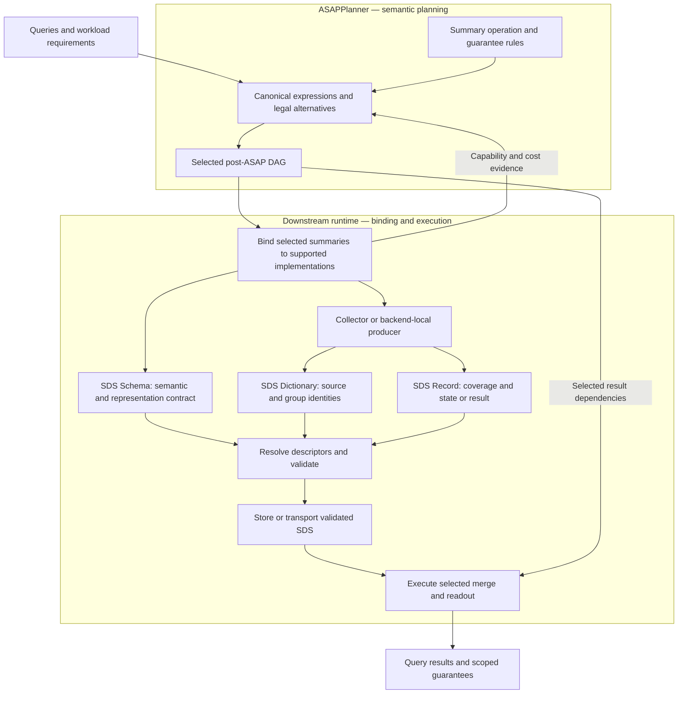

# Self-Describing Summary (SDS)

Status: proposed system contract, not an implemented wire format.
Audience: ProjectASAP designers, architects and component maintainers.
This backend-hosted proposal extends the shared summary contracts; it does not
create a second authoritative specification beside the Collector system design.

## Design decision

**An SDS is summary state or a summary result together with a resolvable
description of its meaning, representation, permitted operations and guarantees.**
An aggregation is a computation that produces an SDS, not the SDS itself.

The common model must accommodate exact accumulators, distribution summaries,
distinct-count summaries and keyed-frequency summaries. Item/weight is a
type-specific update signature, not a mandatory SDS-wide structure.

<strong>Figure 1. SDS across the ASAPPlanner–runtime boundary.</strong>

The post-ASAP DAG remains the authoritative semantic plan. SDS describes the
data flowing through its summary operations; it is neither another optimization
DAG nor a replacement for scheduling, deployment or query plans.

## Problem, baseline and minimum outcome

Today summary interpretation is spread across Planner types, backend
aggregation configuration, state schemas and algorithm codecs. A decoder can
understand bytes without knowing the input population or what a readout means.
Conversely, knowing the algorithm name does not establish merge compatibility.
The recent heap-update issue illustrates this split, but does not define the
general abstraction.

The [Collector data model](https://github.com/ProjectASAP/ASAPCollector-public/blob/3745d7fca6d37b4f2da03889a0db3098d07416cd/docs/data_model.md)
separates configuration, recurring series identity and window payload into
Schema / Dictionary / Record. Its final section also describes self-framed
ASAPv1 sketch bytes and the lifetime of Arrow dictionary state. SDS retains
that separation and adds an explicit semantic contract; it does not assume
that a decodable sketch envelope alone explains the summarized computation.

Backend baseline:
[`StateSchemaContract` and physical projections](../../control_plane/src/physical/compiler.rs),
[`BackendAggregation`](../../control_plane/src/physical/colored_dag/emitter.rs),
and the [summary-family extension boundary](../developer_docs/cross-component-adding-summary-family.md).
These are foundations to evolve, not duplicate with parallel registries.

Minimum outcome: the same selected summary can be produced, transferred,
persisted and read without guessing its semantics from metric names, missing
options or receiver-local defaults. One receiver can reject an incompatible
operation and explain which contract failed.

Non-goals: arbitrary executable code in metadata, a universal sketch algorithm,
new query optimization rules, a new wire codec, all-backend deployment coverage,
or automatic support for every future summary. This PR changes documentation
only; Rust types, Planner dependencies and deployed records remain unchanged.

## Inputs, outputs and workflow

Inputs are the selected summary operations, canonical input bindings and
requirements, plus runtime implementation/codec capabilities. Outputs are
validated SDS descriptors and records, followed by the readouts already
selected by the DAG.

1. Planner establishes what computation is legal and what its guarantee means.
2. Binding checks the entire selected operation path and chooses concrete
   state/encoding implementations. Unsupported candidates return to selection.
3. The producer receives an immutable SDS Schema and emits dictionary entries
   and records consistent with it.
4. A receiver resolves descriptors, verifies generation/provenance and checks
   payload compatibility before accepting state.
5. The executor performs only selected, supported operations. A transformation
   that changes semantics produces an explicitly described output SDS.
6. Readouts retain coverage and the applicable guarantee. Missing state,
   unknown descriptors or unmet assumptions cause explicit rejection/fallback,
   not implicit summary substitution.

## The data contract

Schema, Dictionary and Record are logical roles, not a mandate to introduce
three new services or tables. Existing plan and transport structures can carry
these roles.

### SDS Schema: stable meaning and representation

| Common concern | Required meaning |
| --- | --- |
| Input domain | Canonical source/projection/filter bindings, input types, units where relevant, and null/NaN/duplicate semantics |
| Population structure | Group-key schema and reduction meaning; an ungrouped population is valid |
| Summary type | Versioned semantic type, algorithm or exact-state implementation, and type-specific parameters |
| State representation | Typed state layout, codec/version and any compatibility-critical configuration |
| Operations | Typed input/output contracts and preconditions for supported build/update/merge/readout; retract/subtract only when actually supported |
| Guarantee contract | Which readout quantity is bounded, error model, confidence scope, assumptions and composition rules |
| Coverage interpretation | Domain and boundary conventions for interpreting instance coverage; time windows are one profile |

An input or rule reference must resolve to a versioned definition, rather than
a process-local pointer. Schemas describe known operations; they do not embed
an interpreter or authorize an operation merely by naming it.

Type-specific contracts are tagged, versioned schemas, not unrestricted
key/value bags. For example:

| Summary type | Type-specific input/state contract | Possible readouts |
| --- | --- | --- |
| Exact SUM/COUNT | Numeric observations, count qualification, sum/count fields and numeric arithmetic semantics | Sum, observation count, derived mean |
| DDSketch | Numeric observation; relative-accuracy parameter and supported value domain | Quantile with value-error semantics |
| KLL | Ordered observation; capacity and algorithm/version-specific compaction contract | Quantile with rank-error semantics |
| HLL | Element extraction/canonicalization, precision and hash configuration | Distinct-count estimate |
| CMS / CountSketch | Key extraction, increment semantics, dimensions and hash configuration | Point-frequency estimate |
| Heap-bearing frequency summary | Frequency contract plus candidate-maintenance state and capacity | Frequency and supported TopK readouts |

These are proposed contract examples, not a capability claim for every current
runtime. A generic integer `sketch_size` cannot represent all these parameters.
Likewise, mandatory `item` and `weight` fields would misdescribe non-frequency
summaries. They belong only where the operation signature needs them.

Grouping keys describe populations; they are not the same as the elements
inserted into a summary. For example, an HLL grouped by service can summarize
distinct user IDs within each service.

### SDS Dictionary: reusable instance identity

The dictionary associates a compact local ID with a Schema reference and
concrete source/group values. A time-series profile uses metric and labels;
a relational profile may use dataset identity and typed group tuples.
Field identities, absent values and nulls must not collapse into ambiguous
string concatenations.

An `agg_id`-like identifier selects the aggregation recipe/Schema.
A `series_id`-like identifier selects a concrete population under that recipe.
Neither is a globally meaningful identity without its namespace/context.
Identical labels under different contracts must not alias accidentally.

### SDS Record: one instance of state or result

A record identifies its dictionary entry, actual coverage and a tagged payload:

- Full state: a complete state snapshot for the declared coverage.
- State delta: a change requiring a particular base/checkpoint and supported
  delta-application contract.
- Readout result: a typed scalar, tuple or collection, identifying the readout
  and its arguments. It is not implicitly mergeable summary state.

Thus a quantile value identifies its quantile level; a TopK result identifies
its selection/readout contract. A bare `value=42` is not self-describing.
Output shape is not restricted to `f64`.

Actual window bounds and inclusion rules belong to coverage for a time-series
record. A batch summary instead identifies its dataset snapshot/partition.
Do not require every SDS to have a time window. Completeness, freshness and
instance-specific evidence travel with, or are durably referenced by, the
record; a Schema's mathematical guarantee does not certify missing input.

Producer epoch, sequence, plan generation and checkpoint linkage remain in the
existing frame/provenance contract and accompany the SDS when necessary.
Do not create a conflicting second sequence or readiness protocol.

## What self-describing requires

The unit of self-description is the record plus its resolvable descriptor
closure, not necessarily one network row containing every field.

- A connected stream may establish Schema once and extend a dictionary.
- A persisted/exported unit must include or durably reference all required
  descriptors. A delta also needs its base chain to reconstruct state.
- On reconnect or transfer to another replica, restore the descriptor context
  before interpreting dependent records. IDs must not resolve against an
  unrelated previous session.
- Unknown references are rejected or buffered within explicit resource limits.
  No fallback to a guessed algorithm, parameter set or update mode.
- Inline descriptions and control-plane-installed descriptions must agree;
  conflicting definitions for one identity are errors.

Wire framing answers how to decode bytes. Semantic self-description answers
what those bytes summarize and which operations are valid. Neither implies
that the receiver implements the algorithm or trusts the producer.

## Reuse, merging and identity

Three questions must remain separate:

| Question | Required reasoning |
| --- | --- |
| Can two consumers reuse one producer? | Planner proves that one maintained state satisfies both selected computations and requirements |
| Can two states be merged directly? | The summary's operation rule checks representation, input semantics, coverage, provenance and assumptions |
| Can one summary be transformed for another consumer? | Planner selects a legal rollup, projection, conversion or parameter transformation, and binding supports it |

Different fields do not universally prohibit reuse. Equal fields do not
universally permit a merge. HLL union may legitimately overlap populations,
whereas summing two overlapping SUM states double-counts observations.
Algebraic associativity does not promise bitwise-identical floating-point
results under every merge order; the numeric contract must state the policy.

Use a semantic contract identity for meaning, a representation identity for
encoding compatibility, and existing materialization/generation identities
for maintained runtime state. These are distinct roles, not necessarily new
independent ID fields. Audit current fingerprints and schema IDs before
extending them. Compact stream IDs refer to these identities; they do not
replace them. Equality fingerprints are lookup aids, not equivalence proofs.

## Examples beyond TopK

### Exact state shared by several readouts

For a fixed, complete snapshot of integer observations:

| Group | Observations | SDS state |
| --- | --- | --- |
| service=api, region=east | 10 | sum=10, count=1 |
| service=api, region=west | 2, 4, 8 | sum=14, count=3 |

The Schema specifies the input projection, group keys, integer sum/count
semantics and component-wise merge. The dictionary binds east/west identities;
each record carries its snapshot coverage and typed state.

A selected rollup to service produces sum=24, count=4. SUM reads 24 and
sample-weighted mean reads 6 from that shared state. Averaging the two regional
means instead gives a different computation and is not a legal substitution.
Counts must use the same qualifying observations as the sum; COUNT(*) and
COUNT(nullable_column) cannot be conflated. Rollup checks disjoint input
coverage or an explicitly authorized duplicate policy.

### Quantiles and distinct counts

A DDSketch and a KLL may both answer a quantile request, but do not describe
the same error quantity or interchangeable state. Planner chooses a legal
alternative for the requested error contract; a receiver does not merge them
because both advertise a quantile readout.

Two HLL states can support union when their versioned rule permits the
element encoding, hash configuration and precision combination. Adding their
cardinality estimates is not that operation. Precision conversion is allowed
only through an explicitly supported transformation and revised guarantee.

### Frequency and TopK

A frequency summary can use key/increment updates without any TopK readout.
A heap-bearing implementation may additionally maintain candidates. Its heap
capacity describes retained state; readout `k` describes the requested result.
Changing `k` need not create a new producer if capacity and guarantee suffice.

For temporal counts, the increment is one per qualifying observation; for
temporal sums it is the selected value. These are distinct type-specific
update contracts. The compatibility adapter may derive `weight_mode` from
them, but new SDS interpretation must not rely on `heap_update_mode: None`.
TopK membership evidence is distinct from frequency-estimation error evidence.

## Accuracy, evidence and scope

Accuracy belongs to a supported readout under stated conditions, not merely
to an algorithm name or a generic `epsilon/delta` pair on opaque bytes.
Distinguish requested accuracy, the type's guarantee model and the
instance-specific evidence that permits claiming an achieved guarantee.

Record the error quantity (for example, value-relative versus rank error),
failure event, scope, assumptions and evidence provenance. Deterministic
bounds need no invented delta; unknown guarantees remain unknown. Exact
arithmetic claims are separate from complete-input and freshness claims.

For a fixed 20-group query result, simultaneous failure probability at most
0.05 follows if each valid row bound is at most 0.0025, by the union bound.
Independence is unnecessary. Twenty per-row 95% intervals do not establish
95% confidence for the entire result. Adaptive group selection, TopK membership,
or repeated evaluations need their own applicable bounds and scope.

Planner owns guarantee composition and failure-budget allocation. SDS preserves
the selected scope and evidence references so the runtime cannot silently
reinterpret a per-row bound as a whole-query bound. Shared state does not make
errors independent or eliminate a consumer's guarantee obligations.

## Ownership and minimal complexity

| Owner | Authority |
| --- | --- |
| ASAPPlanner | Logical summary operations, legal rewrites/reuse and guarantee composition |
| Summary implementation libraries | Algorithm/state versions, codecs, implemented operations and associated mathematical contracts |
| Shared ProjectASAP data contract | SDS descriptor/reference/record meaning and cross-component conformance rules |
| Collector and backend adapters | Actual capability support, binding, production, validation, transport and execution |
| Runtime plans | Deployment, handles, materialization generations, lifecycle and readiness |

Use the existing family-extension and schema/frame boundaries to implement
SDS. Do not add a generic plugin engine, new optimizer or centralized registry
service merely to name this contract. Once accepted, the shared normative
definition belongs with the existing cross-component contracts; downstream
documentation references it and describes only its own adapter.

Rejected alternatives: a TopK-shaped universal struct; a flat arbitrary
parameter map with implicit defaults; copying every descriptor into every
record; and treating byte/schema equality as proof of semantic reuse.
Each either excludes other families, obscures compatibility or repeats data
without adding meaning. Type-specific contracts plus resolvable references
are the smallest design covering the demonstrated cases.

## Acceptance before implementation

These are proposed acceptance gates, not tests claimed to exist in this PR.
Test design here is by the design author, not an independent reviewer.

| Gate | Observable acceptance |
| --- | --- |
| Generality | SUM/COUNT, quantile and HLL examples work without fake item/weight fields; frequency examples specify their own update signature |
| Shared execution | Exact example yields sum=24 and mean=6 with one maintained compatible producer per partition/generation |
| Compatibility | Reject incompatible hashes, unknown versions, ambiguous inputs, missing readout arguments and illegal overlapping SUM merges |
| Valid transformations | Planner-selected group rollup succeeds; invalid pooled-mean replacement fails |
| Persistence/transport | Decode after restart/replica transfer with restored descriptors; reject missing descriptor/base and conflicting ID reuse |
| Guarantees | Preserve rank/value distinction and per-row/whole-result scope; incomplete coverage cannot be labeled complete |
| Operational safety | Unknown-type/oversized metadata and unbounded dictionary growth are rejected or bounded; duplicates and wrong-generation frames follow existing rules |
| Traceability | A rejected record identifies contract, materialization, producer/generation and reason without logging sensitive source values |

Measure descriptor bytes per unique schema/population and record bytes per
emitted state, including reconnect overhead. Do not claim constant total
metadata under unbounded group cardinality. Track validation failures and
descriptor misses separately from payload decoding and query readiness.
Extension effort is evaluated by adding a non-frequency summary without
changing the common fields; no fabricated throughput or delivery estimate is
part of this proposal.

## High-level migration, risks and completion

1. Map current Planner types, state schemas, fingerprints and frame fields to
   the contract above. Agree on one normative owner and versioning policy.
2. Define typed contracts for existing exact, distribution, distinct and
   frequency summaries. Unknown legacy semantics stay explicitly unsupported.
3. Add producer/consumer adapters using the existing carrier. Keep the old
   runtime configuration as a derived compatibility projection, not a second
   semantic authority.
4. Demonstrate descriptor resolution, persistence and the exact shared-state
   example in backend-local execution. Validate distributed transport separately.
5. Dual-validate old/new descriptions during rollout; switch only when they
   agree. Retire implicit defaults after all supported producers and stored
   states have an explicit interpretation.

Schema evolution creates new immutable identities; it must not reinterpret
old persisted records. Rollback remains possible while old representations
are retained and both readers understand the active version. Writing
new-only state requires capability negotiation and an explicit rollback or
rebuild path. No destructive data conversion is authorized by this proposal.

Principal risks are semantic drift between descriptors and implementations,
unbounded descriptor retention, incorrect overlap assumptions and unsupported
cross-version state. Admission validation, conformance fixtures and durable
descriptor retention address these risks without trusting metadata as proof.

Completion is scoped: the first supported profile passes the gates above and
no longer guesses summary semantics. Other engines, summary families and
workload lifecycles are ProjectASAP-wide extensions, not a prerequisite for
this backend's first SDS milestone.

Before implementation, maintainers must settle the normative package/location,
canonical descriptor identity/version rules and supported compatibility matrix.
An implementation schedule depends on that audit; this design does not claim
the migration is already delivered.
