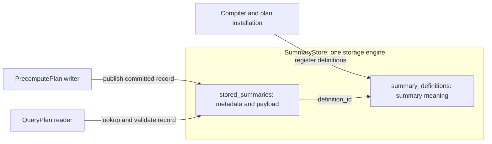

# Summary storage and Self-Describing Summary architecture

Status: proposed contract with current-backend migration notes. The names below
are design vocabulary; existing Rust types and persisted wire fields are not
renamed by this documentation change. Audience:
developers compiling, storing, recovering or reading summary state.

Terminology: [Planner/backend glossary](planner-backend-glossary.md).

## Purpose and scope

The Self-Describing Summary (SDS) model defines the meaning and representation
of summary records in one `SummaryStore`. It connects PrecomputePlan writers to QueryPlan readers
without requiring either runtime to reinterpret Planner IR.

This document owns summary identity, schema, state references and the conditions
for reading an instance. The [integration design](asapplanner-integration.md) owns
deployment binding of Planner-provided Physical DAGs; the [migration plan](asapplanner-migration-plan.md)
owns delivery.
Cost ranking, operator scheduling and transmission policy are outside SDS.

## Document map

1. [Architecture at a glance](#architecture-at-a-glance)
2. [Worked example](#worked-example)
3. [Core objects](#core-objects)
4. [Identity and reference rules](#identity-and-reference-rules)
5. [Plan and storage contract](#plan-and-storage-contract)
6. [Read eligibility](#read-eligibility)
7. [Validation and migration](#validation-and-migration)
8. [Deferred work](#deferred-work)

## Architecture at a glance

V1 has exactly two stored data objects: `SummaryDefinition` and `StoredSummary`.
One `SummaryStore` owns their two logical tables:

| Table | Row type | What it stores |
| --- | --- | --- |
| `summary_definitions` | `SummaryDefinition` | Definition ID → source/filter, input value, family, parameters, grouping and time semantics |
| `stored_summaries` | `StoredSummary` | Concrete record key → definition ID, actual format, coverage and payload |

The compiler supplies a definitions snapshot with the plan bundle. Installation
validates it and registers its rows in `summary_definitions`. The snapshot is an
installation artifact, not another storage service. Precompute execution writes
complete records to `stored_summaries`; query execution reads those records using
its installed output reference and partition selection. A row is visible to
readers only after its metadata and payload are committed together logically.

These are logical tables within the existing storage engine; this design does
not require a new SQL database. The store may use separate files or indexes
internally. V1 introduces neither `SummaryMetadataStore` nor
`SummaryPayloadStore`, nor a separate catalog `Materialization` object.

Shared semantic metadata lives once in `SummaryDefinition`; each `StoredSummary`
references it by `definition_id`. Instance-specific metadata (group key, window,
actual coverage and format) and payload together form that `StoredSummary`.
Separating an internal index from payload files does not introduce a third data
object. V1 reuses existing storage facilities without requiring either physical
co-location or a new metadata/payload storage split.



The compiler assigns a `stored_output_id` to each PrecomputePlan DAG output that
is persisted. The PrecomputePlan writer and QueryPlan readers use this ID to name
the same output within one plan version. It is a binding ID, not a memory slot or
a separate storage object.

## Worked example

`plan_version` identifies the coherent version of PrecomputePlan, QueryPlans
and their catalog bindings installed together. The value `42` below is an
illustrative version identifier. Updating summary contents or publishing a new
time partition does not change the plan version. State readiness is tracked
separately; installing a plan version does not make its required state ready.

Two queries request different percentiles from the same five-minute KLL summary:

```yaml
installed_plan:
  plan_version: 42
  definitions_snapshot:
    summary_definition:
      id: def-api-latency-kll
      input: request_latency_seconds
      group_by: [service]
      range: 5m
      algorithm: {kind: kll, k: 200}

  precompute_plan:
    write_state:
      node_id: write-kll
      reference: {stored_output_id: latency-kll, definition_id: def-api-latency-kll}
      schema: kll-v1
      encoding: kll-binary-v1
      partition_by: [service, window_end]

  query_plans:
    q50:
      read_state:
        reference: {stored_output_id: latency-kll, definition_id: def-api-latency-kll}
        expected_schema: kll-v1
        expected_encoding: kll-binary-v1
        partition: {service: api, window_end: evaluation_time}
      estimate: {quantile: 0.50}
    q99:
      read_state:
        reference: {stored_output_id: latency-kll, definition_id: def-api-latency-kll}
        expected_schema: kll-v1
        expected_encoding: kll-binary-v1
        partition: {service: api, window_end: evaluation_time}
      estimate: {quantile: 0.99}

runtime_summary_store:
  summary_definitions:
    def-api-latency-kll:
      input: request_latency_seconds
      group_by: [service]
      range: 5m
      algorithm: {kind: kll, k: 200}
  stored_summaries:
    - key:
        plan_version: 42
        stored_output_id: latency-kll
        group_key: {service: api}
        window: {start_exclusive: '12:00', end_inclusive: '12:05'}
      definition_id: def-api-latency-kll
      format: {schema: kll-v1, encoding: kll-binary-v1}
      coverage: {start_exclusive: '12:00', end_inclusive: '12:05'}
      payload: <encoded KLL state>
```

One shared PrecomputePlan producer writes the required state partitions. Both
QueryPlans resolve the same stored output and apply different readout parameters.
They neither create duplicate producers nor search the catalog for alternatives
at serving time.

`runtime_summary_store` is observed runtime data, not part of the installed
plan. Its example entry says that the `service=api` partition contains encoded
KLL state covering `(12:00, 12:05]`. The format fields let the reader reject
incompatible bytes. The row becomes visible only after its payload and metadata
are committed. No abstract payload locator is required by this design.

## Core objects

| Object | Meaning | Changes when |
| --- | --- | --- |
| `SummaryDefinition` | Canonical input, operation, grouping, time semantics, algorithm and parameters | Summary semantics change |
| `StoredSummary` | One `SummaryStore` entry: instance metadata plus its associated summary payload | Runtime publishes a new or replacement partition or completed aggregate |

`StoredOutputReference` is a reader/writer binding inside an installed plan. It
names a stored producer output and definition; it is not a third stored data
object, table, or independently managed entity. The reference example below
shows how plans locate the two-object storage model.

### Example: `summary_definitions` describes what to compute

One row says: summarize `request_latency_seconds` values separately for each
service over a five-minute window using KLL with `k=200`. It applies to all
services and evaluation windows; it contains no computed sketch bytes.
The following examples illustrate the design, not a serialized Rust API.

```yaml
summary_definitions:
  def-api-latency-kll:
    input: {metric: request_latency_seconds, value: sample_value}
    family: {kind: Sketch, algorithm: KLL, parameters: {k: 200}}
    group_by: [service]
    time_semantics: {range: 5m, bounds: "(start, end]"}
    output_type: kll_state
```

`def-api-latency-kll` is the definition ID. A record for `service=worker` or a
later five-minute window can refer to this same definition.

### Example: `stored_summaries` contains an actual computed result

After precompute finishes the `service=api` window `(12:00, 12:05]`, it publishes
one committed record containing the identifying metadata and the encoded KLL
payload. The placeholder below stands for real sketch bytes, not raw samples.

```yaml
stored_summaries:
  - key:
      plan_version: 42
      stored_output_id: latency-kll
      group_key: {service: api}
      window: {start_exclusive: '12:00', end_inclusive: '12:05'}
    definition_id: def-api-latency-kll
    format: {schema: kll-v1, encoding: kll-binary-v1}
    coverage: {start_exclusive: '12:00', end_inclusive: '12:05'}
    payload: <encoded KLL state for these samples>
```

The `definition_id` connects this result to its meaning in `summary_definitions`.
A result for `service=worker`, or for `(12:01, 12:06]`, is another record with a
different key even if it uses the same definition and stored output.

### Example: `StoredOutputReference` connects a reader to its writer

Within installed plan version `42`, the writer and both percentile readers carry
the following reference:

```yaml
reference:
  stored_output_id: latency-kll
  definition_id: def-api-latency-kll
```

This names the producer output and its definition; it does not contain a payload
or select a concrete window. For a request at `12:05` for `service=api`, the
reader's group and time selection completes the lookup key:

```text
(42, latency-kll, {service: api}, (12:00, 12:05])
```

The q50 and q99 QueryPlans can resolve that same stored record. Their downstream
readouts use `quantile=0.50` and `quantile=0.99`, respectively. The reference is
identical because a different readout does not require another KLL producer.
The reader still checks the record's definition, format and actual coverage
before using its payload.

A definition includes every field needed to decide semantic equivalence: source
and filters, input value, operation or sketch parameters, grouping, time
semantics, accuracy fields that affect state, and output type. Display names,
costs, locations, readiness and retention status are excluded.

Boundary bindings connect Planner's typed physical inputs and outputs to stored
records. The backend does not classify semantic nodes or choose where to cut
computation. One stored output corresponds to a selected persisted physical
output, with all compatible consumers referencing that identity.

| Field | Owner |
| --- | --- |
| Stored-output ID | Backend-assigned, plan-version-scoped identity shared by writer and readers |
| Definition ID | Semantic definition referenced by the stored-output binding |
| State family and parameters | Planner output contract, recorded in `SummaryDefinition` |
| Schema and encoding | Supported writer format and matching reader expectations; records declare actual format |
| Grouping and coverage requirement | Planner boundary contract, realized by backend record selection |
| Physical storage layout and permitted writer | Backend output binding |
| Provenance | Planner logical-to-physical mapping |
| Schedule and retention | Backend operational configuration satisfying the selected lifecycle |
| Actual readiness | Committed record metadata checked at execution time |

Bindings are compiled together and validated against the physical boundary
contracts. Repeated format expectations on a reader do not authorize an
independent format choice. No standalone catalog Materialization object or
additional binding registry is required.

A `StoredSummary` means the complete logical entry in `SummaryStore`: its
metadata and its associated payload. The metadata records plan version,
stored-output ID, definition, actual format, partition key,
coverage/completion, producer sequence where applicable, and integrity data.
The payload bytes may be stored separately inside the `SummaryStore`
implementation, but they are not a separate architecture component and never
belong in definition rows.

## Identity and reference rules

| Identity | Answers |
| --- | --- |
| Definition ID | What semantics does the state represent? |
| Plan version + stored output ID | Which installed producer output does this state belong to? |
| Stored-summary key | Which concrete group/window record is it? |
| Plan version | With which atomic installation may it be used? |
| Schema/encoding ID | How are its bytes interpreted? |

Definition IDs identify rows in `summary_definitions`; plan versions come from
installation and stored-output IDs from the compiler. The runtime addresses a
`StoredSummary` by the composite key:

```text
(plan_version, stored_output_id, group_key, window)
```

`group_key` contains canonical label names and values. `window` identifies
the intended time partition, including its boundary convention; actual coverage
must still satisfy the reader. V1 needs no additional instance UUID. A
`StoredOutputReference` identifies the output across its records, not a pointer
to one payload; reader partition/time selection supplies the rest of the lookup.
Schema/encoding IDs identify supported formats.
Human-readable names are diagnostics, not join keys. Reuse across plan versions
requires an explicit compatibility decision; a matching definition ID is
insufficient.

A `StoredOutputReference` identifies a stored output and definition within the enclosing
plan version. The reader/writer binding constrains acceptable partition, schema,
plan version and coverage. A reader binding may select several instances, such
as panes covering one range, but cannot broaden semantics or substitute another
algorithm. QueryPlan and derived PrecomputePlan nodes resolve references through
exact indexed lookup, never serving-time candidate selection.

## Plan and storage contract

The following diagram shows deployed data flow. Build/readout computation is
carried by Planner Physical DAGs; Read/Write denote backend boundary adapters,
not a second backend operator IR.

```text
PrecomputePlan
  Input -> BuildKLL -> Write(output-17, kll-v1)

SDS
  SummaryStore.summary_definitions: def-9 -> KLL(k=200) and input semantics
  Plan bundle: version 42; writer/reader bind output-17 to def-9
  SummaryStore.stored_summaries: key -> definition, format, coverage and payload

QueryPlan
  Read(output-17, kll-v1) -> SummaryEstimate -> Result
```

Writer, instance metadata and reader must agree on stored-output ID, definition ID,
schema/encoding, grouping, time partition and plan version. State family and
parameters must match the referenced `summary_definitions` row.
The query runtime follows the installed reference instead of scanning the catalog.

A stored summary derived from existing state has a distinct stored-output ID and an explicit
reference to completed source state:

```text
PrecomputePlan: Read state A -> derive -> Write state B
QueryPlan:      Read state B -> estimate -> result
```

Source and destination are never represented as the same instance.

## Read eligibility

The immediate use case needs one decision: can this installed QueryPlan read the
state bound by its `StoredOutputReference`? A read is eligible only when `SummaryStore`
contains the referenced instance, its payload has been committed, and its plan
version, definition, schema/encoding, partition and coverage satisfy the reader
binding. Otherwise the query uses its configured exact fallback or reports that
the result is unavailable.

This design does not introduce a general instance lifecycle. Terms such as
`Building`, `Draining` and `Retired` belong to existing runtime scheduling and
cleanup mechanisms where needed; they are not new SDS states. Plan installation
authorizes a binding but does not by itself make an instance readable.

## Validation and migration

Compilation, installation, writes, recovery and reads enforce:

1. Each stored-output ID resolves to one definition and authorized producer
   binding within its plan version; each instance identifies that version and
   stored output.
2. Instance metadata declares the payload's actual schema and encoding.
3. References preserve definition semantics and compatible plan version.
4. Writer and reader grouping, time partition, schema and coverage agree.
5. Derived reads meet their completion requirement.
6. Retirement blocks new bindings before state reclamation.
7. Unknown schemas, malformed payloads and unauthorized updates fail closed.

The backend implements these checks using shared state codecs and its existing
storage engine. No parallel metadata/payload service is introduced. The
[migration plan](asapplanner-migration-plan.md) separates plan-schema retirement
from supported persisted-payload compatibility and defines identity conversion
and recovery gates.

Runtime-independent state formats and reconstruction belong in shared libraries.
Backend storage, scheduling and publication remain backend-owned; physical
computation runs through the shared executor without an ASAPCollector dependency.

## Deferred work

SDS does not define CollectorPlan, TransmissionPlan, distributed activation, a
new checkpoint protocol, a general instance lifecycle, cost/ERP evidence or
retention-policy selection. Those systems may reference SDS identities without
becoming part of this model.
