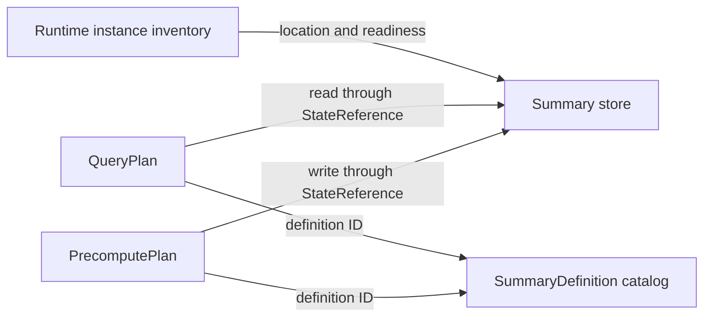

# Summary Catalog and Self-Describing Summary architecture

Status: proposed contract with current-backend migration notes. Audience:
developers compiling, storing, recovering or reading summary state.

## Purpose and scope

The Summary Catalog and Self-Describing Summary (SDS) model defines what persisted
summary state means. It connects PrecomputePlan writers to QueryPlan readers
without requiring either runtime to reinterpret Planner IR.

This document owns summary identity, schema, state references, readiness and
lifecycle. The [integration design](asapplanner-integration.md) owns executable
plan splitting; the [migration plan](asapplanner-migration-plan.md) owns delivery.
Cost ranking, operator scheduling and transmission policy are outside SDS.

## Document map

1. [Architecture at a glance](#architecture-at-a-glance)
2. [Worked example](#worked-example)
3. [Core objects](#core-objects)
4. [Identity and reference rules](#identity-and-reference-rules)
5. [Plan and storage contract](#plan-and-storage-contract)
6. [Lifecycle and readiness](#lifecycle-and-readiness)
7. [Validation and migration](#validation-and-migration)
8. [Deferred work](#deferred-work)

## Architecture at a glance

The catalog stores summary definitions. PrecomputePlan and QueryPlan carry
matching state references and format/partition configuration. Runtime inventory
records actual state instances; payload bytes live in the summary store.
There is no separate catalog `Materialization` object.



The compiler assigns a `state_slot_id` to a stored producer output within a plan
version. This is a join key in compiled bindings, not another catalog entity with
its own lifecycle. Multiple query readers can reference the same slot.

## Worked example

`plan_version` identifies the coherent version of PrecomputePlan, QueryPlans
and their catalog bindings installed together. The value `42` below is an
illustrative version identifier. Updating summary contents or publishing a new
time partition does not change the plan version. State readiness is tracked
separately; installing a plan version does not make its required state ready.

Two queries request different percentiles from the same five-minute KLL summary:

```yaml
plan_version: 42
summary_definition:
  id: def-api-latency-kll
  input: request_latency_seconds
  group_by: [service]
  range: 5m
  algorithm: {kind: kll, k: 200}

precompute_plan:
  write_state:
    node_id: write-kll
    reference: {state_slot_id: latency-kll, definition_id: def-api-latency-kll}
    schema: kll-v1
    encoding: kll-binary-v1
    partition_by: [service, window_end]

state_instances:
  - id: state-api-1205
    plan_version: 42
    state_slot_id: latency-kll
    definition_id: def-api-latency-kll
    schema: kll-v1
    encoding: kll-binary-v1
    partition: {service: api, window_end: '12:05'}
    coverage: {start_exclusive: '12:00', end_inclusive: '12:05'}
    location: opaque-store-locator
    status: ready

query_plans:
  q50:
    read_state: &shared_read
      reference: {state_slot_id: latency-kll, definition_id: def-api-latency-kll}
      expected_schema: kll-v1
      expected_encoding: kll-binary-v1
      partition: {service: api, window_end: evaluation_time}
    estimate: {quantile: 0.50}
  q99:
    read_state: *shared_read
    estimate: {quantile: 0.99}
```

PrecomputePlan updates each state partition once. Both QueryPlans resolve the
same bound slot and apply different readout parameters. They neither
create duplicate producers nor search the catalog for alternatives at serving
time.

## Core objects

| Object | Meaning | Changes when |
| --- | --- | --- |
| `SummaryDefinition` | Canonical input, operation, grouping, time semantics, algorithm and parameters | Summary semantics change |
| `SummaryStateInstance` | One stored partition, such as a series/pane or completed aggregate | Runtime creates or replaces payload state |
| `StateReference` | A typed plan reference to permitted materialized state | A compiled reader/writer binding changes |

A definition includes every field needed to decide semantic equivalence: source
and filters, input value, operation or sketch parameters, grouping, time
semantics, accuracy fields that affect state, and output type. Display names,
costs, locations, readiness and retention status are excluded.

The former standalone `Materialization` catalog object was an over-abstraction:
its fields already belong to the definition, executable bindings or runtime
instance metadata. Their ownership is explicit below.

| Former field | Owner in this design |
| --- | --- |
| Materialization ID | Replaced by a compiler-assigned `state_slot_id`, scoped to the plan version, in reader/writer references. |
| Definition ID | `StateReference` points to the catalog's `SummaryDefinition`. |
| Plan version | Installed plan bundle; persisted instance metadata repeats it for recovery validation. |
| State family and algorithm parameters | `SummaryDefinition`. |
| Schema and encoding | Writer configuration and matching reader expectations; instances declare the actual payload format. |
| Physical partition layout | Writer partitioning and matching reader partition selection. |
| Permitted writer | PrecomputePlan write binding; runtime validates writes against the installed binding. |
| Provenance | Compiler's physical-to-semantic node mapping. |

The compiler emits both bindings from one decision and validates agreement
before installation. Repetition of format fields in the serialized plans does
not authorize independent selection. The catalog does not need a second registry
for those fields. Retention and refresh policy belong to the producer's selected
lifecycle and PrecomputePlan; observed readiness belongs to runtime inventory.

A state instance records plan version, slot, definition, actual format and its
partition key, coverage/completion, producer sequence
where applicable, lifecycle status, location and integrity metadata. Payload
bytes remain in the summary store, not in catalog descriptors.

## Identity and reference rules

| Identity | Answers |
| --- | --- |
| Definition ID | What semantics does the state represent? |
| Plan version + state slot ID | Which installed producer output does this state belong to? |
| State-instance ID | Which concrete partition/payload is it? |
| Plan version | With which atomic installation may it be used? |
| Schema/encoding ID | How are its bytes interpreted? |

The compiler/catalog authority assigns these identities once. Human-readable
names are diagnostics, not join keys. Reuse across plan versions requires an
explicit compatibility decision; a matching definition ID is insufficient.

A `StateReference` identifies a state slot and definition within the enclosing
plan version. The reader/writer binding constrains acceptable
partition, schema, plan version and coverage. It may select several instances, such
as panes covering one range, but cannot broaden semantics or substitute another
algorithm. QueryPlan and derived PrecomputePlan nodes resolve references through
exact indexed lookup, never serving-time candidate selection.

## Plan and storage contract

```text
PrecomputePlan
  Input -> BuildKLL -> Write(slot-17, kll-v1)

SDS
  Catalog: def-9 -> KLL(k=200) and input semantics
  Plan bundle: version 42; writer/reader bind slot-17 to def-9
  Store: instances indexed by plan version, slot and partition

QueryPlan
  Read(slot-17, kll-v1) -> SummaryEstimate -> Result
```

Writer, instance metadata and reader must agree on slot, definition ID,
schema/encoding, grouping, time partition and plan version. State family and
parameters must match the referenced catalog definition.
The query runtime follows the installed reference instead of scanning the catalog.

A stored summary derived from existing state has a distinct destination slot and an explicit
reference to completed source state:

```text
PrecomputePlan: Read state A -> derive -> Write state B
QueryPlan:      Read state B -> estimate -> result
```

Source and destination are never represented as the same instance.

## Lifecycle and readiness

| State | Meaning |
| --- | --- |
| `Desired` | Installed plans require state for this slot and coverage |
| `Building` | Required state is being produced or recovered |
| `Ready` | Required schema and coverage are available |
| `Draining` | New work has stopped while existing use completes |
| `Retired` | New reads are prohibited; safe reclamation may follow |

Atomic activation installs intent, not ready data. A QueryPlan read checks
observed readiness and coverage, then follows its configured fallback or explicit
unavailability behavior. Reactivation does not make stale instances current.

Completed finite-input state is immutable. Additional writes require a new
authorized plan version or replacement instance. Mutable streaming state publishes
monotone coverage according to its installed contract.

## Validation and migration

Compilation, installation, writes, recovery and reads enforce:

1. Each slot resolves to one definition and authorized producer binding within
   its plan version; each instance identifies that version and slot.
2. Instance metadata declares the payload's actual schema and encoding.
3. References preserve definition semantics and compatible plan version.
4. Writer and reader grouping, time partition, schema and coverage agree.
5. Derived reads meet their completion requirement.
6. Retirement blocks new bindings before state reclamation.
7. Unknown schemas, malformed payloads and unauthorized updates fail closed.

The current backend distributes these responsibilities across `asap_types`,
control-plane publication and the summary store. Migration reuses authoritative
IDs and metadata rather than creating a parallel registry. Legacy artifacts are
normalized at the backend boundary and supported payloads retain versioned
readers and fixtures.

Remove the proposed `materializations` catalog collection and standalone object
from new plan examples and schemas. Preserve the existing
`BackendNodeBinding::Materialization` variant as the node-placement marker for
stored output; it does not imply a catalog object. At the compatibility boundary,
map legacy stored-output identifiers into version-scoped slots and copy their
format/partition constraints into matching bindings. Preserve payload locators
and reject unresolved or conflicting mappings; do not rename existing persisted
IDs or reinterpret legacy wire fields in place. Legacy formats keep their
versioned readers during the supported migration window.

Runtime-independent contracts and sketch reconstruction belong in neutral
libraries. Backend storage, scheduling and query execution remain backend-owned;
the backend must not depend on ASAPCollector.

## Deferred work

SDS does not define CollectorPlan, TransmissionPlan, distributed activation, a
new checkpoint protocol, cost/ERP evidence or retention-policy selection. Those
systems may reference SDS identities without becoming part of this model.
