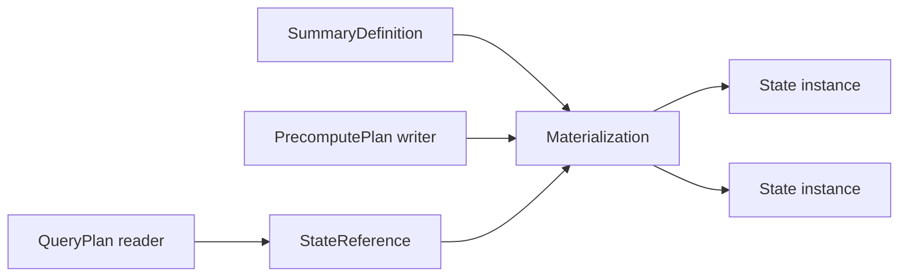

# Summary Catalog and Self-Describing Summary architecture

Status: proposed contract with notes on the current backend representation.
Audience: developers compiling, storing, recovering or reading summary state.

## Purpose and scope

The Summary Catalog and Self-Describing Summary (SDS) model is the authority for
persisted summary-state meaning. It connects PrecomputePlan writers to QueryPlan
readers without requiring either runtime to reinterpret Planner IR.

This document owns:

- stable summary semantics and materialization identity;
- state schema, encoding and partition identity;
- references from plans to stored state;
- readiness, generation and retirement metadata;
- validation required when state is written, recovered or read.

The [integration design](asapplanner-integration.md) owns physical subgraph
splitting and execution. The [migration plan](asapplanner-migration-plan.md)
owns delivery order. Cost evidence, candidate ranking, operator scheduling and
transmission policy are outside the SDS model.

## Core model

| Object | Meaning | Stability |
| --- | --- | --- |
| `SummaryDefinition` | Canonical semantics of a summary: input, operation, grouping, time semantics, algorithm and parameters | Stable while those semantics remain unchanged |
| `Materialization` | A physical-plan decision to produce a definition with a particular state contract | Versioned with the installed plan generation |
| `SummaryStateInstance` | One persisted state partition, such as a series/pane or completed aggregate | Created and retired by runtime lifecycle |
| `StateReference` | A typed reference used by QueryPlan or a derived PrecomputePlan node | Valid only for compatible definition, schema and generation rules |

The catalog stores definitions and materializations. Runtime inventory records
state instances. Plans carry state references rather than embedding payloads or
search predicates.



## Summary definition

A definition contains all fields required to decide whether two summaries have
the same meaning:

- canonical input source and filters;
- input value semantics;
- exact operation or sketch family and typed parameters;
- grouping and reduction semantics;
- query-range/time-partition semantics and alignment;
- accuracy contract where it affects state meaning;
- output value type.

Display names, plan generation, readiness, storage location, retention status and
observed costs do not belong to definition identity. Changing a semantic field
creates a different definition instead of mutating an existing one.

Definitions may refer to raw input or to another completed summary definition.
Derived input references are typed dependencies, not metric-name aliases.

## Materialization

A materialization commits a definition to a concrete state contract:

- stable definition ID;
- materialization ID and plan generation;
- state family, schema version and encoding;
- physical grouping and partition layout;
- permitted producer/writer identity where required;
- lifecycle and readiness policy;
- provenance back to selected semantic nodes.

Multiple materializations may implement the same definition, for example across
plan generations or storage migrations. QueryPlan reads a compiler-selected
materialization reference; the serving runtime does not search all catalog entries
for a substitute.

## Summary state instance

A state instance identifies one physical partition of a materialization. Its key
contains only dimensions needed to distinguish stored state, such as series or
group identity, time partition, producer/shard identity and generation. Its
metadata records:

- materialization and definition IDs;
- exact schema/encoding used by the payload;
- coverage or completion bounds;
- producer sequence/checkpoint metadata when applicable;
- creation, readiness and retirement state;
- content location and integrity information.

Payload bytes are stored in the summary store, not copied into the catalog
descriptor. Mutable runtime statistics do not change semantic identity.

## State reference

A state reference is the only normal connection between executable plans and
stored state. It identifies the required materialization and constrains the state
partition, schema and generation that may satisfy the read.

PrecomputePlan uses state references for derived-summary inputs. QueryPlan uses
them for result-producing reads. A reference may select multiple instances, such
as the panes covering one query range, but it cannot broaden the summary
definition or silently select another algorithm.

The runtime may resolve physical locations through an index. Resolution must be
an exact lookup under the installed reference and metadata; catalog scanning and
serving-time candidate selection are prohibited.

## Identity rules

The following identities have different purposes and must not be collapsed:

| Identity | Answers |
| --- | --- |
| Definition ID | What summary semantics does this state represent? |
| Materialization ID | Which installed physical production decision created it? |
| State-instance ID | Which concrete partition/payload is this? |
| Plan generation | With which atomic installation may it be used? |
| Schema/encoding ID | How are its bytes interpreted? |

IDs are assigned or derived once by the compiler/catalog authority and carried
through plans, storage and recovery. Human-readable names are diagnostic labels,
not join keys. A reused state instance across generations requires an explicit
compatibility decision; matching definition IDs alone is insufficient.

## Plan boundary

The physical-plan split uses the catalog as follows:

```text
PrecomputePlan
  Input -> Sum -> BuildKLL -> Write(materialization=mat-17)

Catalog/SDS
  mat-17 -> definition=def-9, family=KLL, schema=kll-v1, generation=42

QueryPlan
  Read(mat-17, schema=kll-v1) -> SummaryEstimate -> Result
```

The writer and reader share the same compiler binding. They must agree on:

- definition and materialization identity;
- state family, algorithm parameters, schema and encoding;
- grouping and time partition/alignment;
- generation compatibility and coverage requirements.

For a derived summary, the destination materialization has its own identity and
the maintenance node holds a `StateReference` to its completed source state. The
source and destination are never represented as the same instance.

## Lifecycle and readiness

Materialization intent and observed state are separate:

| State | Meaning |
| --- | --- |
| `Desired` | Installed plans require the materialization; usable state may not exist yet |
| `Building` | The runtime is producing or recovering required coverage |
| `Ready` | Required schema and coverage are available for the bound reads |
| `Draining` | No new work is assigned, but existing readers or writes are being completed |
| `Retired` | The materialization is unavailable to new reads and may be garbage-collected when safe |

Activation installs intent atomically but does not manufacture readiness. A
QueryPlan read checks observed readiness and coverage, then follows its configured
fallback or unavailability behavior. Reactivation of a retired definition creates
or binds an authorized materialization; it does not make stale instances current.

Completed finite-input state is immutable. Further additive writes require a new
authorized generation or replacement instance. Mutable streaming state publishes
monotone coverage/completion metadata according to its installed contract.

## Validation invariants

Compilation, installation, writes, recovery and reads enforce these invariants:

1. Every materialization resolves to exactly one definition.
2. Every state instance resolves to one materialization and declares its actual
   schema and encoding.
3. A state reference cannot change definition semantics during resolution.
4. Writer and reader grouping, time partition and schema contracts agree.
5. State from an incompatible generation is rejected before execution.
6. Ready state satisfies the reference's coverage and completion requirements.
7. Derived maintenance reads only completed input when its operator requires it.
8. Retirement prevents new bindings before physical state is reclaimed.
9. Unknown schema, malformed payload and unauthorized producer updates fail
   closed; they never become catalog-visible ready state.

## Current representation and migration boundary

The backend already has catalog descriptors, policy fingerprints, series IDs,
state metadata and persisted payloads, but responsibilities are distributed
across `asap_types`, control-plane publication and the summary store. Some current
artifacts also embed complete semantic DAGs in PrecomputePlan.

Migration should reuse authoritative IDs and storage metadata rather than create
a parallel registry. Legacy artifacts are normalized at the backend boundary;
new plans use explicit state references. Existing supported payloads remain
readable through versioned codecs and compatibility fixtures.

The backend must not depend on ASAPCollector for these contracts or codecs.
Runtime-independent envelope/schema definitions and sketch reconstruction belong
in neutral libraries. Backend storage, scheduling and query execution remain
backend-owned.

## Example

Two queries request percentiles over the same grouped input. The compiler selects
one compatible KLL materialization and emits two QueryPlan entries:

```text
definition def-9:
  input=request_latency, group_by=[service], range=5m, algorithm=KLL(k=200)

materialization mat-17, generation 42:
  definition=def-9, schema=kll-v1

state instances:
  mat-17/service=api/pane=12:00..12:01
  mat-17/service=api/pane=12:01..12:02
  ...

query q50: Read(mat-17) -> Estimate(0.50)
query q99: Read(mat-17) -> Estimate(0.99)
```

The producer updates each state partition once. Both queries resolve the same
bound materialization, compose the required coverage and apply different readout
parameters. Neither query creates a second producer or searches for a different
summary at serving time.

## Deferred work

This design does not define CollectorPlan or TransmissionPlan, distributed
activation, a new checkpoint protocol, cost/ERP evidence, or retention policy
selection. Those systems may reference SDS identities later without becoming
part of the SDS semantic model.
