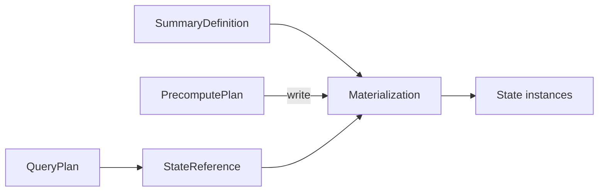

# Summary Catalog and Self-Describing Summary architecture

Status: proposed contract with current-backend migration notes. Audience:
developers compiling, storing, recovering or reading summary state.

## Purpose and scope

The Summary Catalog and Self-Describing Summary (SDS) model defines what persisted
summary state means. It connects PrecomputePlan writers to QueryPlan readers
without requiring either runtime to reinterpret Planner IR.

This document owns summary identity, schema, state references, readiness and
lifecycle. The [integration design](asapplanner-integration.md) owns executable
plan splitting; the [migration plan](asapplanner-migration-plan.md) owns delivery.
Cost ranking, operator scheduling and transmission policy are outside SDS.

## Document map

1. [Architecture at a glance](#architecture-at-a-glance)
2. [Worked example](#worked-example)
3. [Core objects](#core-objects)
4. [Identity and reference rules](#identity-and-reference-rules)
5. [Plan and storage contract](#plan-and-storage-contract)
6. [Lifecycle and readiness](#lifecycle-and-readiness)
7. [Validation and migration](#validation-and-migration)
8. [Deferred work](#deferred-work)

## Architecture at a glance

The catalog stores definitions and materializations. Runtime inventory records
state instances. Plans carry typed state references rather than payloads or
search predicates.



These objects remain distinct because “same summary semantics,” “same production
decision,” and “same stored payload” have different compatibility rules.

## Worked example

Two queries request different percentiles from the same five-minute KLL summary:

```yaml
summary_definition:
  id: def-api-latency-kll
  input: request_latency_seconds
  group_by: [service]
  range: 5m
  algorithm: {kind: kll, k: 200}

materialization:
  id: mat-api-latency-kll-g42
  definition: def-api-latency-kll
  generation: 42
  schema: kll-v1

state_instances:
  - id: state-api-1200
    materialization: mat-api-latency-kll-g42
    partition: {service: api, start: '12:00', end: '12:01'}
    status: ready
  - id: state-api-1201
    materialization: mat-api-latency-kll-g42
    partition: {service: api, start: '12:01', end: '12:02'}
    status: ready

query_state_references:
  q50: {materialization: mat-api-latency-kll-g42, quantile: 0.50}
  q99: {materialization: mat-api-latency-kll-g42, quantile: 0.99}
```

PrecomputePlan updates each state partition once. Both QueryPlans resolve the
same bound materialization and apply different readout parameters. They neither
create duplicate producers nor search the catalog for alternatives at serving
time.

## Core objects

| Object | Meaning | Changes when |
| --- | --- | --- |
| `SummaryDefinition` | Canonical input, operation, grouping, time semantics, algorithm and parameters | Summary semantics change |
| `Materialization` | An installed decision to produce a definition with one state contract | Plan generation or physical contract changes |
| `SummaryStateInstance` | One stored partition, such as a series/pane or completed aggregate | Runtime creates or replaces payload state |
| `StateReference` | A typed plan reference to permitted materialized state | A compiled reader/writer binding changes |

A definition includes every field needed to decide semantic equivalence: source
and filters, input value, operation or sketch parameters, grouping, time
semantics, accuracy fields that affect state, and output type. Display names,
costs, locations, readiness and retention status are excluded.

A materialization adds definition ID, plan generation, state family, schema,
encoding, physical partition layout, permitted writer identity and provenance.
Several generations may materialize the same definition.

A state instance adds its partition key, coverage/completion, producer sequence
where applicable, lifecycle status, location and integrity metadata. Payload
bytes remain in the summary store, not in catalog descriptors.

## Identity and reference rules

| Identity | Answers |
| --- | --- |
| Definition ID | What semantics does the state represent? |
| Materialization ID | Which installed physical decision produced it? |
| State-instance ID | Which concrete partition/payload is it? |
| Plan generation | With which atomic installation may it be used? |
| Schema/encoding ID | How are its bytes interpreted? |

The compiler/catalog authority assigns these identities once. Human-readable
names are diagnostics, not join keys. Reuse across generations requires an
explicit compatibility decision; a matching definition ID is insufficient.

A `StateReference` identifies one materialization and constrains acceptable
partition, schema, generation and coverage. It may select several instances, such
as panes covering one range, but cannot broaden semantics or substitute another
algorithm. QueryPlan and derived PrecomputePlan nodes resolve references through
exact indexed lookup, never serving-time candidate selection.

## Plan and storage contract

```text
PrecomputePlan
  Input -> BuildKLL -> Write(mat-17)

SDS
  mat-17 -> def-9, KLL(k=200), kll-v1, generation 42

QueryPlan
  Read(mat-17, kll-v1) -> SummaryEstimate -> Result
```

Writer, SDS entry and reader must agree on definition, materialization, state
family, parameters, schema/encoding, grouping, time partition and generation.
The query runtime follows the installed reference instead of scanning the catalog.

A derived materialization has a distinct destination identity and an explicit
reference to completed source state:

```text
PrecomputePlan: Read state A -> derive -> Write state B
QueryPlan:      Read state B -> estimate -> result
```

Source and destination are never represented as the same instance.

## Lifecycle and readiness

| State | Meaning |
| --- | --- |
| `Desired` | Installed plans require the materialization |
| `Building` | Required state is being produced or recovered |
| `Ready` | Required schema and coverage are available |
| `Draining` | New work has stopped while existing use completes |
| `Retired` | New reads are prohibited; safe reclamation may follow |

Atomic activation installs intent, not ready data. A QueryPlan read checks
observed readiness and coverage, then follows its configured fallback or explicit
unavailability behavior. Reactivation does not make stale instances current.

Completed finite-input state is immutable. Additional writes require a new
authorized generation or replacement instance. Mutable streaming state publishes
monotone coverage according to its installed contract.

## Validation and migration

Compilation, installation, writes, recovery and reads enforce:

1. Each materialization resolves to one definition and each instance to one
   materialization.
2. Instance metadata declares the payload's actual schema and encoding.
3. References preserve definition semantics and compatible generation.
4. Writer and reader grouping, time partition, schema and coverage agree.
5. Derived reads meet their completion requirement.
6. Retirement blocks new bindings before state reclamation.
7. Unknown schemas, malformed payloads and unauthorized updates fail closed.

The current backend distributes these responsibilities across `asap_types`,
control-plane publication and the summary store. Migration reuses authoritative
IDs and metadata rather than creating a parallel registry. Legacy artifacts are
normalized at the backend boundary and supported payloads retain versioned
readers and fixtures.

Runtime-independent contracts and sketch reconstruction belong in neutral
libraries. Backend storage, scheduling and query execution remain backend-owned;
the backend must not depend on ASAPCollector.

## Deferred work

SDS does not define CollectorPlan, TransmissionPlan, distributed activation, a
new checkpoint protocol, cost/ERP evidence or retention-policy selection. Those
systems may reference SDS identities without becoming part of this model.
