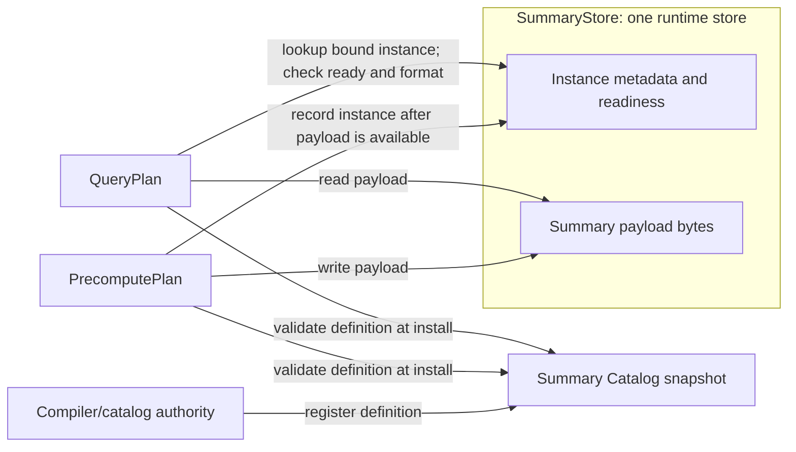

# Summary Catalog and Self-Describing Summary architecture

Status: proposed contract with current-backend migration notes. Audience:
developers compiling, storing, recovering or reading summary state.

Terminology: [Planner/backend glossary](planner-backend-glossary.md).

## Purpose and scope

The Summary Catalog and Self-Describing Summary (SDS) model defines what persisted
summary state means. It connects PrecomputePlan writers to QueryPlan readers
without requiring either runtime to reinterpret Planner IR.

This document owns summary identity, schema, state references and the conditions
for reading an instance. The [integration design](asapplanner-integration.md) owns
executable plan splitting; the [migration plan](asapplanner-migration-plan.md)
owns delivery.
Cost ranking, operator scheduling and transmission policy are outside SDS.

## Document map

1. [Architecture at a glance](#architecture-at-a-glance)
2. [Worked example](#worked-example)
3. [Core objects](#core-objects)
4. [Identity and reference rules](#identity-and-reference-rules)
5. [Plan and storage contract](#plan-and-storage-contract)
6. [Read eligibility](#read-eligibility)
7. [Validation and migration](#validation-and-migration)
8. [Deferred work](#deferred-work)

## Architecture at a glance

The Summary Catalog is the definition snapshot validated when a plan is
installed. PrecomputePlan and QueryPlan carry matching state references and
format/partition configuration. One runtime `SummaryStore` holds both instance
metadata and payload bytes; these are two kinds of data within the store, not
separate storage components. There is no separate catalog `Materialization`
object.

The compiler/catalog authority registers a `SummaryDefinition` when installing
the plan. The edges from both plans to that catalog are definition references
validated by catalog reads at installation, not runtime writes or serving-time
catalog searches. At runtime, PrecomputePlan writes a payload to
`SummaryStore` and records its instance metadata there. QueryPlan uses its
installed state reference to look up a matching instance in that same store,
checks readiness, coverage and format, then reads the payload. The catalog
holds definition semantics, the installed plans hold writer and reader
constraints, and the runtime store holds observed instances. These are logical
responsibilities; they do not require three independent services or databases.



The compiler assigns a `stored_output_id` to each PrecomputePlan DAG output that
is persisted. The PrecomputePlan writer and QueryPlan readers use this ID to name
the same output within one plan version. It is a binding ID, not a memory slot or
a separate storage object.

## Worked example

`plan_version` identifies the coherent version of PrecomputePlan, QueryPlans
and their catalog bindings installed together. The value `42` below is an
illustrative version identifier. Updating summary contents or publishing a new
time partition does not change the plan version. State readiness is tracked
separately; installing a plan version does not make its required state ready.

Two queries request different percentiles from the same five-minute KLL summary:

```yaml
installed_plan:
  plan_version: 42
  catalog_snapshot:
    summary_definition:
      id: def-api-latency-kll
      input: request_latency_seconds
      group_by: [service]
      range: 5m
      algorithm: {kind: kll, k: 200}

  precompute_plan:
    write_state:
      node_id: write-kll
      reference: {stored_output_id: latency-kll, definition_id: def-api-latency-kll}
      schema: kll-v1
      encoding: kll-binary-v1
      partition_by: [service, window_end]

  query_plans:
    q50:
      read_state:
        reference: {stored_output_id: latency-kll, definition_id: def-api-latency-kll}
        expected_schema: kll-v1
        expected_encoding: kll-binary-v1
        partition: {service: api, window_end: evaluation_time}
      estimate: {quantile: 0.50}
    q99:
      read_state:
        reference: {stored_output_id: latency-kll, definition_id: def-api-latency-kll}
        expected_schema: kll-v1
        expected_encoding: kll-binary-v1
        partition: {service: api, window_end: evaluation_time}
      estimate: {quantile: 0.99}

runtime_summary_store:
  - instance_id: state-api-1205
    plan_version: 42
    stored_output_id: latency-kll
    definition_id: def-api-latency-kll
    format: {schema: kll-v1, encoding: kll-binary-v1}
    partition: {service: api, window_end: '12:05'}
    coverage: {start_exclusive: '12:00', end_inclusive: '12:05'}
    ready: true
    payload: <encoded KLL state>
```

One shared PrecomputePlan producer writes the required state partitions. Both
QueryPlans resolve the same stored output and apply different readout parameters.
They neither create duplicate producers nor search the catalog for alternatives
at serving time.

`runtime_summary_store` is observed runtime data, not part of the installed
plan. Its example entry says that the `service=api` partition contains encoded
KLL state covering `(12:00, 12:05]`. The format fields let the reader reject
incompatible bytes, and `ready` becomes true only after that payload is
committed. No abstract payload locator is required by this design.

## Core objects

| Object | Meaning | Changes when |
| --- | --- | --- |
| `SummaryDefinition` | Canonical input, operation, grouping, time semantics, algorithm and parameters | Summary semantics change |
| `SummaryStateInstance` | One `SummaryStore` entry: instance metadata plus its associated summary payload | Runtime publishes a new or replacement partition or completed aggregate |
| `StateReference` | A typed plan reference to a permitted stored producer output | A compiled reader/writer binding changes |

A definition includes every field needed to decide semantic equivalence: source
and filters, input value, operation or sketch parameters, grouping, time
semantics, accuracy fields that affect state, and output type. Display names,
costs, locations, readiness and retention status are excluded.

The former standalone `Materialization` catalog object was an over-abstraction:
its fields already belong to the definition, executable bindings or runtime
instance metadata. Their ownership is explicit below.

| Former field | Owner in this design |
| --- | --- |
| Materialization ID | Replaced by a compiler-assigned `stored_output_id`, scoped to the plan version, in reader/writer references. |
| Definition ID | `StateReference` points to the catalog's `SummaryDefinition`. |
| Plan version | Installed plan bundle; persisted instance metadata repeats it for recovery validation. |
| State family and algorithm parameters | `SummaryDefinition`. |
| Schema and encoding | Writer configuration and matching reader expectations; instances declare the actual payload format. |
| Physical partition layout | Writer partitioning and matching reader partition selection. |
| Permitted writer | PrecomputePlan write binding; runtime validates writes against the installed binding. |
| Provenance | Compiler's physical-to-semantic node mapping. |

The compiler emits both bindings from one decision and validates agreement
before installation. Repetition of format fields in the serialized plans does
not authorize independent selection. The catalog does not need a second registry
for those fields. The selected deployment guarantee and schedule/retention belong
to Planner's deployment decision and the installed PrecomputePlan binding;
observed readiness belongs to instance metadata in `SummaryStore`.

A `SummaryStateInstance` means the complete logical entry in `SummaryStore`: its
metadata and its associated payload. The metadata records plan version,
stored-output ID, definition, actual format, partition key,
coverage/completion, producer sequence where applicable, and integrity data.
The payload bytes may be stored separately inside the `SummaryStore`
implementation, but they are not a separate architecture component and never
belong in catalog descriptors.

## Identity and reference rules

| Identity | Answers |
| --- | --- |
| Definition ID | What semantics does the state represent? |
| Plan version + stored output ID | Which installed producer output does this state belong to? |
| State-instance ID | Which concrete partition/payload is it? |
| Plan version | With which atomic installation may it be used? |
| Schema/encoding ID | How are its bytes interpreted? |

Definition IDs come from the catalog authority, plan versions from the
installation authority, stored-output IDs from the compiler, and state-instance IDs
from the runtime. Schema/encoding IDs identify supported formats.
Human-readable names are diagnostics, not join keys. Reuse across plan versions
requires an explicit compatibility decision; a matching definition ID is
insufficient.

A `StateReference` identifies a stored output and definition within the enclosing
plan version. The reader/writer binding constrains acceptable partition, schema,
plan version and coverage. A reader binding may select several instances, such
as panes covering one range, but cannot broaden semantics or substitute another
algorithm. QueryPlan and derived PrecomputePlan nodes resolve references through
exact indexed lookup, never serving-time candidate selection.

## Plan and storage contract

```text
PrecomputePlan
  Input -> BuildKLL -> Write(output-17, kll-v1)

SDS
  Catalog: def-9 -> KLL(k=200) and input semantics
  Plan bundle: version 42; writer/reader bind output-17 to def-9
  SummaryStore: instance metadata indexed by plan version, stored output and partition;
                encoded payload bytes reached through that metadata

QueryPlan
  Read(output-17, kll-v1) -> SummaryEstimate -> Result
```

Writer, instance metadata and reader must agree on stored-output ID, definition ID,
schema/encoding, grouping, time partition and plan version. State family and
parameters must match the referenced catalog definition.
The query runtime follows the installed reference instead of scanning the catalog.

A stored summary derived from existing state has a distinct stored-output ID and an explicit
reference to completed source state:

```text
PrecomputePlan: Read state A -> derive -> Write state B
QueryPlan:      Read state B -> estimate -> result
```

Source and destination are never represented as the same instance.

## Read eligibility

The immediate use case needs one decision: can this installed QueryPlan read the
state bound by its `StateReference`? A read is eligible only when `SummaryStore`
contains the referenced instance, its payload has been committed, and its plan
version, definition, schema/encoding, partition and coverage satisfy the reader
binding. Otherwise the query uses its configured exact fallback or reports that
the result is unavailable.

This design does not introduce a general instance lifecycle. Terms such as
`Building`, `Draining` and `Retired` belong to existing runtime scheduling and
cleanup mechanisms where needed; they are not new SDS states. Plan installation
authorizes a binding but does not by itself make an instance readable.

## Validation and migration

Compilation, installation, writes, recovery and reads enforce:

1. Each stored-output ID resolves to one definition and authorized producer
   binding within its plan version; each instance identifies that version and
   stored output.
2. Instance metadata declares the payload's actual schema and encoding.
3. References preserve definition semantics and compatible plan version.
4. Writer and reader grouping, time partition, schema and coverage agree.
5. Derived reads meet their completion requirement.
6. Retirement blocks new bindings before state reclamation.
7. Unknown schemas, malformed payloads and unauthorized updates fail closed.

The current backend distributes these responsibilities across `asap_types`,
control-plane publication and the existing `SketchStore`. Migration reuses its
authoritative IDs, instance metadata and payload storage rather than creating a
parallel store. Legacy artifacts are normalized at the backend boundary and
supported payloads retain versioned readers and fixtures.

Remove the proposed `materializations` catalog collection and standalone object
from new plan examples and schemas. Preserve the existing
`BackendNodeBinding::Materialization` variant as the node-placement marker for
stored output; it does not imply a catalog object. At the compatibility boundary,
map legacy stored-output identifiers into version-scoped output IDs and copy their
format/partition constraints into matching bindings. Preserve payload locators
and reject unresolved or conflicting mappings; do not rename existing persisted
IDs or reinterpret legacy wire fields in place. Legacy formats keep their
versioned readers during the supported migration window.

Runtime-independent contracts and sketch reconstruction belong in neutral
libraries. Backend storage, scheduling and query execution remain backend-owned;
the backend must not depend on ASAPCollector.

## Deferred work

SDS does not define CollectorPlan, TransmissionPlan, distributed activation, a
new checkpoint protocol, a general instance lifecycle, cost/ERP evidence or
retention-policy selection. Those systems may reference SDS identities without
becoming part of this model.
