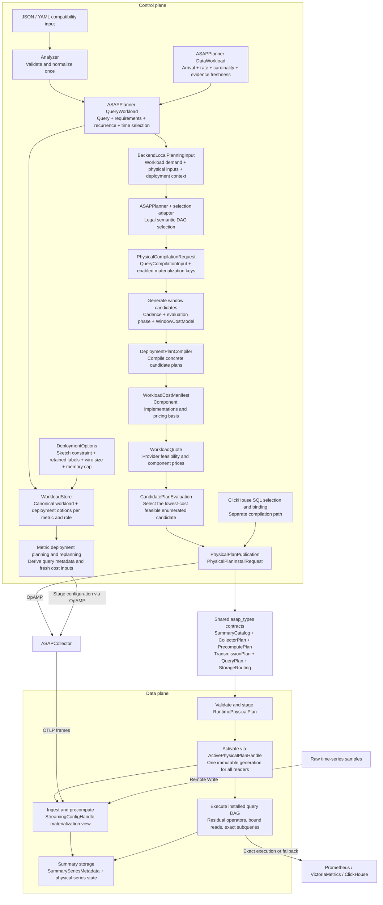

# Planning terminology and architecture

Audience: developers changing planning inputs, pricing, publication, or runtime
plan consumers. The [Chinese architecture review](architecture-naming-review.zh.md)
records the reasoning and the original-to-proposed naming checklist for #709.

SQL shares publication and runtime contracts; it does not currently use the
time-series workload quote-selection path. Metric stage emission remains a
separate deployment path, but its stored semantic input now uses the same Planner
`QueryWorkload` and embedded `DataWorkload` types. `LegacyMetricWorkload` and its
old `types::QueryWorkload` alias are deleted.

## Domain boundaries

| Value | Meaning |
|---|---|
| `QueryCompilationInput.selected_plan_root` | Selected semantic DAG root, including exact or mixed execution; not necessarily an approximate materialization |
| `WindowRealizationCandidate` | One concrete window framework/layout choice, not a whole-workload candidate |
| `PhysicalCompilationRequest.enabled_materialization_keys` | Optional candidate-key set: `None` enables all eligible keys; an empty set enables none |
| `CompiledPhysicalPlan` | A complete compiled candidate; selection can attach a `CandidatePlanSelectionReport` to the same type |
| `CostComponentDemand.pricing_basis` | Work priced per horizon or per query evaluation, not a currency/resource unit |
| `occurrences_per_horizon` | Floating-point expected occurrences multiplying a component's unit quote |
| `CandidatePlanEvaluation` | Diagnostic state throughout compilation and pricing, including failures and candidates awaiting quotes |
| `LifecycleUnitCosts` | Both one-time costs and per-update/per-second costs; not exclusively rates |
| `erp` | Error–Resource Profile planning inputs, including distribution evidence and matching policy |
| `PhysicalDeploymentContext.target_collector_ids` | Every targeted collector receives a plan; this is not an eligibility pool |
| `query_retention_margin_ms` | Extra retained history for lagging query evaluation; not a separate query-age rejection check |
| `RuntimePhysicalPlan` | Immutable runtime representation, also used while staged and draining |
| `ActivePhysicalPlanHandle` | Shared pointer to the currently active runtime generation |
| `StreamingConfigHandle` | Legacy owned config or a view projected from the active runtime plan |
| `SummarySeriesMetadata` | Metadata for a physical SID; distinct from a time-scoped SDS `SummaryInstance` |

`SummaryDefinitionId`, `PolicyFingerprint`, descriptor IDs, physical SIDs,
instance IDs, and catalog generations retain their distinct identities.
Likewise, plan activation, materialization readiness, and instance completeness
remain separate conditions. Retiring a drained plan marks lifecycle state; it
does not perform storage garbage collection.

## Compatibility transition

New Rust names retain the previous JSON/YAML field names through explicit serde
renames. New spellings are accepted as aliases where fields are deserialized.
This preserves old consumers, exact manifest comparisons, and serialized
identity inputs. Diagnostic enums retain their old string representations,
including unknown strings and the missing-status default.

Other old public type imports and selected method/function names remain deprecated
forwarders. The flat workload type is removed without a compatibility alias. This does **not** preserve old Rust struct-literal field names;
workspace callers migrate with the definitions. External Rust source consumers
must update fields using the review's mapping before these compatibility
imports are removed. No removal date is set until consumer migration is known.

Wire names containing historical terms, such as `enumerated_local_masks`, are
intentionally retained. New Rust set variables use candidate-key terminology.
Candidate ordering, bounded coverage, strict-less-than tie handling, pricing,
publication validation, and activation behavior are unchanged.

## Scope of this migration

The implementation clarifies planning/compiler types, candidate pricing and
diagnostics, publication conversion, runtime generations, streaming views,
series metadata, canonical workload registration, residual query operators, and the
data-plane update-sampling module. Existing re-exports remain compatibility
entrypoints rather than duplicate implementations.

The review also identifies follow-up work that is intentionally separate:

- Splitting the two `StreamingConfigHandle` modes and changing their write API.
  Active-plan snapshots read the runtime plan; `swap` still affects only the
  legacy backing slot. Plan activation changes authoritative active config.
- Removing legacy stage planning/emission, or unifying SQL and time-series
  candidate pricing.
- Renaming the full `SketchStore` public type or redesigning `QueryPlan` as a
  differently shaped execution catalog.
- Changing window units, schema versions, identity encodings, or typed ID
  ownership.

These remain separate from the naming changes and the canonical workload migration.

## Canonical workload registration

`RegisteredWorkload` is a backend registration envelope, containing only the
Planner `QueryWorkload` and `DeploymentOptions`. It does not store a parsed query
or a second set of metric, accuracy, window, cadence or data-rate fields.
`ParsedQuery` is an ephemeral adapter view; `WorkloadCharacteristics` is an input
DTO and a transient cost projection. The cached planner obtains that projection
from canonical evidence, and unavailable evidence skips rate-based cost selection.

For this single-metric adapter, `input_cardinality` denotes active time series and
`ingestion_rate` is the aggregate sample rate: 10 series at 5 Hz produces 50
samples/s. Distinct item keys per flush remain a separate deployment estimate.
Evidence provenance and freshness survive registry round trips. Unknown or stale
facts do not become declared defaults. Batch data has `AtRest` arrival and no
ongoing ingestion; repetition remains independent of arrival.

Compatibility field-only inputs generate explicit queries: quantile uses
`quantile_over_time(0.99, ...)`, cardinality uses `distinct_over_time(...)`, and
frequency uses a temporal item count. Filter values are JSON-escaped before query
parsing. Source and label identifiers must be accepted by the PromQL frontend.
The old `group_by_labels` input also supplies collector retention labels; these
are deployment options and do not introduce a query GROUP BY.

The single-metric registration route accepts one query entry, one selector,
equality filters, one-shot or fixed-interval demand, and supported real-time
selection. It rejects conflicting query/field overrides, multi-selector input,
regex or negative matching, offset/@, subqueries, `without`, unsupported cadence
forms, historical time-selection metadata and unenforced dollar constraints.
Cadences are checked before conversion to Planner milliseconds. The full query
compilation APIs retain their broader query support.

Both field-only and string requests bind from the registered canonical expression.
Explicit typed accuracy, including epsilon and delta, remains authoritative;
sketch choices remain physical constraints subject to legal binding. IDs and
routing hints are retained as registration metadata.

## Latest main integration

Window candidates are generated after semantic DAG selection from cadence, evaluation
phase and `WindowCostModel` quotes. Compiler provenance stays on each candidate
(`derived` / `cohort_only`) and is not accepted from serialized input. The old
external candidate/default-window fields and query-level provenance set are removed
by upstream #712. Shared panes preserve cadence, phase and evaluation alignment.
Publication includes storage routing derived from the selected physical plan (#713).
The former `types_v2` definitions now live in `types` (#717). These upstream API
removals also apply here; wire-name compatibility covers retained naming-only fields.

Upstream #715 removes unused auto/Pareto planning and rollback/diff HTTP routes
and their auxiliary modules. This integration retains those removals; canonical
workload registration and replanning continue through the retained interfaces.
