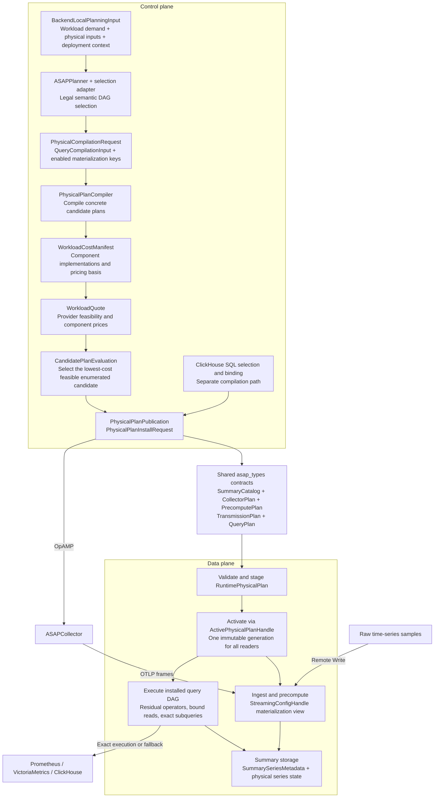

# Planning terminology and architecture

Audience: developers changing planning inputs, pricing, publication, or runtime
plan consumers. The [Chinese architecture review](architecture-naming-review.zh.md)
records the reasoning and the original-to-proposed naming checklist for #709.

SQL shares publication and runtime contracts; it does not currently use the
time-series workload quote-selection path. Legacy flat metric workloads and
stage emission remain a separate compatibility path.

## Domain boundaries

| Value | Meaning |
|---|---|
| `QueryCompilationInput.selected_plan_root` | Selected semantic DAG root, including exact or mixed execution; not necessarily an approximate materialization |
| `WindowRealizationCandidate` | One concrete window framework/layout choice, not a whole-workload candidate |
| `PhysicalCompilationRequest.enabled_materialization_keys` | Optional candidate-key set: `None` enables all eligible keys; an empty set enables none |
| `CompiledPhysicalPlan` | A complete compiled candidate; selection can attach a `CandidatePlanSelectionReport` to the same type |
| `CostComponentDemand.pricing_basis` | Work priced per horizon or per query evaluation, not a currency/resource unit |
| `occurrences_per_horizon` | Floating-point expected occurrences multiplying a component's unit quote |
| `CandidatePlanEvaluation` | Diagnostic state throughout compilation and pricing, including failures and candidates awaiting quotes |
| `LifecycleUnitCosts` | Both one-time costs and per-update/per-second costs; not exclusively rates |
| `erp` | Error–Resource Profile planning inputs, including distribution evidence and matching policy |
| `PhysicalDeploymentContext.target_collector_ids` | Every targeted collector receives a plan; this is not an eligibility pool |
| `query_retention_margin_ms` | Extra retained history for lagging query evaluation; not a separate query-age rejection check |
| `RuntimePhysicalPlan` | Immutable runtime representation, also used while staged and draining |
| `ActivePhysicalPlanHandle` | Shared pointer to the currently active runtime generation |
| `StreamingConfigHandle` | Legacy owned config or a view projected from the active runtime plan |
| `SummarySeriesMetadata` | Metadata for a physical SID; distinct from a time-scoped SDS `SummaryInstance` |

`SummaryDefinitionId`, `PolicyFingerprint`, descriptor IDs, physical SIDs,
instance IDs, and catalog generations retain their distinct identities.
Likewise, plan activation, materialization readiness, and instance completeness
remain separate conditions. Retiring a drained plan marks lifecycle state; it
does not perform storage garbage collection.

## Compatibility transition

New Rust names retain the previous JSON/YAML field names through explicit serde
renames. New spellings are accepted as aliases where fields are deserialized.
This preserves old consumers, exact manifest comparisons, and serialized
identity inputs. Diagnostic enums retain their old string representations,
including unknown strings and the missing-status default.

Old public type imports and selected method/function names remain deprecated
forwarders. This does **not** preserve old Rust struct-literal field names;
workspace callers migrate with the definitions. External Rust source consumers
must update fields using the review's mapping before these compatibility
imports are removed. No removal date is set until consumer migration is known.

Wire names containing historical terms, such as `enumerated_local_masks`, are
intentionally retained. New Rust set variables use candidate-key terminology.
Candidate ordering, bounded coverage, strict-less-than tie handling, pricing,
publication validation, and activation behavior are unchanged.

## Scope of this migration

The implementation clarifies planning/compiler types, candidate pricing and
diagnostics, publication conversion, runtime generations, streaming views,
series metadata, legacy metric workloads, residual query operators, and the
data-plane update-sampling module. Existing re-exports remain compatibility
entrypoints rather than duplicate implementations.

The review also identifies follow-up work that is intentionally separate:

- Splitting the two `StreamingConfigHandle` modes and changing their write API.
  Active-plan snapshots read the runtime plan; `swap` still affects only the
  legacy backing slot. Plan activation changes authoritative active config.
- Removing legacy stage planning/emission, or unifying SQL and time-series
  candidate pricing.
- Renaming the full `SketchStore` public type or redesigning `QueryPlan` as a
  differently shaped execution catalog.
- Changing window units, schema versions, identity encodings, or typed ID
  ownership.

These require their own behavior contracts and are not hidden in a naming PR.
