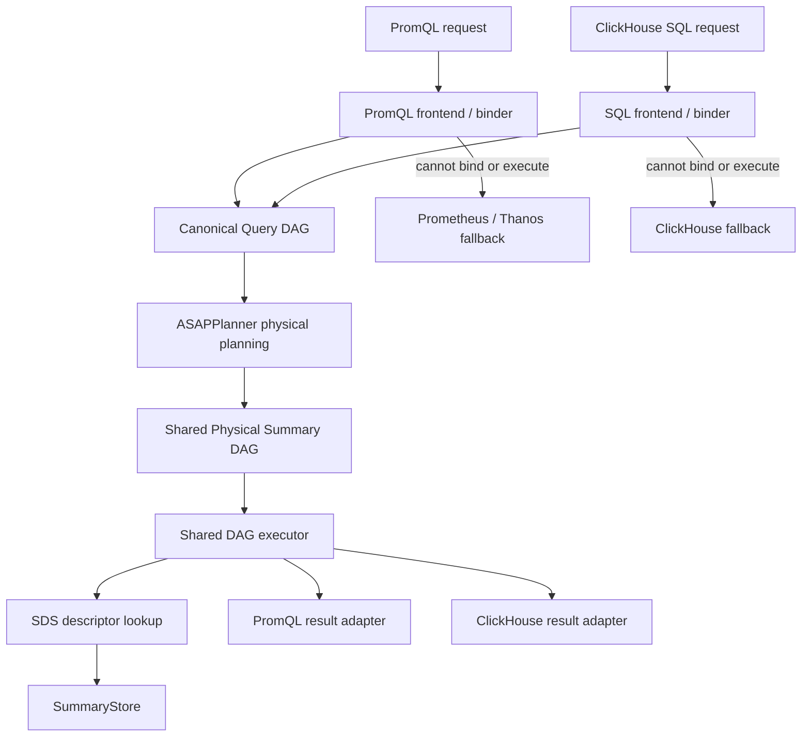

# ClickHouse SQL support

Status: implementation design

## Current implementation

The backend now has an independent ClickHouse HTTP listener and exact
fallback, an ASAPPlanner SQL entry point, a generation-aware SQL plan catalog,
SDS foreign-key validation and staged/active ACKs, and a shared relational DAG
execution path. `Project`, `Filter`, global `Sort`, and `Limit` execute above
summary readout; unsupported scalar expressions and relational shapes fail
closed to ClickHouse. SQL results are encoded as typed `JSON`, `JSONEachRow`,
or `TabSeparated` responses.

At startup, `--clickhouse-plan-bundle` (or
`ASAP_CLICKHOUSE_PLAN_BUNDLE`) installs the independently published table
schemas, SDS snapshot reference, SQL templates, execution windows, and allowed
materialization fingerprints. Omitting the bundle keeps the listener in exact
proxy mode. Historical ClickHouse rows can be replayed through
`ClickHouseReader` into the existing isolated backfill worker.

The same bundle can be published without restarting the backend. POST it to
`/api/v1/clickhouse-plan/stage`; the backend validates its SDS snapshot and all
SQL-plan descriptor foreign keys before returning a `staged` ACK. Then POST
`{"plan_id": ..., "plan_version": ...}` to
`/api/v1/clickhouse-plan/activate`. Activation switches the SQL plan generation
and its schema binder together and returns an `active` ACK. These endpoints are
served only on the independent ClickHouse listener.
Set `ASAP_CLICKHOUSE_PLAN_TOKEN` (or `--clickhouse-plan-token`) to require
`Authorization: Bearer <token>` on both publication operations.

The executable subset is intentionally narrower than ClickHouse SQL. Joins,
window functions, partitioned ranking, unsupported scalar functions, missing
plans, missing materializations, and incomplete coverage route to exact
ClickHouse without changing PromQL behavior or SDS semantics.

## Goals and invariants

ASAPQuery-backend exposes a ClickHouse-compatible HTTP endpoint, uses
ASAPPlanner's SQL frontend and canonical query DAG, executes the same physical
`SummaryNode` DAG used by PromQL, and forwards queries it cannot answer to an
exact ClickHouse backend.

ClickHouse support preserves the meaning and supported domain of every existing
PromQL-facing and shared data structure. It does not add SQL states to PromQL
request/result types, turn SDS into a query-plan protocol, or alter SDS
descriptor identity.

## Architecture



ASAPPlanner owns both frontends and the language-independent canonical and
post-ASAP DAGs. The backend owns serving-time binding, materialized-state
resolution, DAG execution, protocol rendering, and fallback selection.

SDS describes summary semantics, fidelity, encoding compatibility, and stable
identity. A physical DAG leaf resolves its required summary against the active
SDS registry. Query fingerprints, fallback targets, and complete query DAGs do
not become part of SDS.

## Module boundaries

```text
data_plane/src/query_engines/
├── canonical/
│   ├── executor.rs
│   ├── context.rs
│   ├── result.rs
│   ├── sds_resolver.rs
│   └── operators/
├── asap_promql_query_engine/
│   ├── promql_binder.rs
│   └── prometheus_result_adapter.rs
└── asap_clickhouse_query_engine/
    ├── request.rs
    ├── sql_binder.rs
    ├── clickhouse_result_adapter.rs
    └── fallback.rs
```

Compatibility modules may remain at their current paths. Moving PromQL files is
not required and must not change public `ASAPQueryEngine` behavior.

The canonical executor consumes ASAPPlanner's existing
`planner_types::post_asap::SummaryNode`. There is no backend-owned parallel SQL
physical DAG. Language adapters convert common execution outcomes to their own
protocol contracts.

## Request and result boundaries

PromQL continues using its current request, range request, vector, matrix, and
Prometheus response types. ClickHouse owns independent request and table-result
types, including database, query ID, settings, format, Arrow schema, and record
batches.

The canonical executor retains enough schema and grouping information for both
adapters. Existing PromQL wrappers continue returning their original types.

## Planning and publication

The backend control plane sends SQL workload and a ClickHouse schema catalog to
ASAPPlanner's SQL frontend. Both SQL and PromQL lower to `QueryExpr`, pass
through ASAP-aware mapping, and produce `SummaryNode`.

Planning produces two separately owned outputs:

1. Required summaries are published through the existing SDS lifecycle.
2. Query DAG templates are stored in a runtime query-plan catalog.

The catalog records a query fingerprint, output contract, and the existing
serializable, compiler-bound `QueryPlanEntry` physical DAG. It references SDS
descriptors without extending them.
Publication validates every descriptor reference against the candidate SDS
snapshot before atomically activating the catalog generation.

Serving looks up the published executable by fingerprint. It does not rerun
planning, select summary families, or search for replacement materializations.

## Execution and fallback

The shared executor performs candidate resolution, fetch, merge, and readout.
Its structured errors are interpreted at the language boundary: PromQL falls
back to Prometheus or Thanos, while SQL falls back to ClickHouse using the
original SQL text.

SQL falls back for unknown fingerprints, unsupported syntax, invalid binding,
missing or incompatible SDS descriptors, incomplete coverage, stale or gapped
state, unsupported output semantics, or execution/resource failure. Metadata,
health, DDL, and other non-accelerated ClickHouse requests pass through.

## Milestones

### 1. Independent ClickHouse protocol and fallback

- Add an independent ClickHouse HTTP path.
- Support raw POST, GET query parameters, database, query ID, settings, `/ping`,
  and Grafana response formats.
- Preserve upstream status, headers, and body during exact fallback.
- Verify Grafana health, metadata discovery, and SQL pass-through.

This milestone does not depend on DAG execution or change PromQL types.

### 2. Shared canonical planning

- Send SQL workloads and ClickHouse schemas from the backend control plane to
  ASAPPlanner's SQL frontend.
- Consume canonical `QueryExpr` and physical `SummaryNode` output.
- Publish required summaries through SDS.
- Install DAG templates in a separate, generation-aware query-plan catalog.
- Reject catalogs whose DAGs reference unavailable SDS descriptors.

### 3. Shared canonical DAG execution

- Promote the existing `SummaryExecutor` implementation into a canonical
  execution module without changing its PromQL wrapper.
- Add SQL binding and query fingerprint lookup.
- Execute SQL-produced `SummaryNode` DAGs with the shared executor.
- Add ClickHouse table-result conversion and serializers.
- Apply coverage-aware ClickHouse fallback.
- Add ClickHouse ingest/backfill and differential tests against an exact server.

## Verification

Existing PromQL tests must pass unchanged. ClickHouse coverage includes protocol
and forwarding tests, SQL frontend-to-`SummaryNode` tests, SDS reference
validation, shared-executor parity, time-boundary and type tests, Grafana smoke
tests, and a real-ClickHouse differential end-to-end test.

Run the optional real-server protocol and Grafana smoke suite with:

```bash
CLICKHOUSE_URL=http://127.0.0.1:8123 \
  cargo test -p data_plane --test clickhouse_differential_e2e -- --nocapture
```

The test compares proxy and exact responses for a deterministic SQL query,
ClickHouse version discovery, database discovery, and table discovery.
