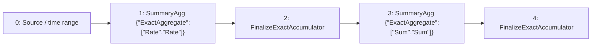

# grouped-rate

`sum by (label_0) (rate(data[1m]))`

[Raw selected plan](grouped-rate.json) · [DAG DOT](grouped-rate.dot)

## Selected computation: logical provenance

IDs below are Planner node IDs; QueryPlan adapter IDs are shown separately.

Root: `4`.



| Node | Dependencies (producer, edge role) | Timing | Operation | Output fields (index: name/type) |
| --- | --- | --- | --- | --- |
| 0 | `[]` | `{"timing":"ingestion_time","primitive":"Raw"}` | `{"source":{"TimeSeries":{"metric":"data"}},"predicates":[],"range":{"nanos":0,"secs":60}}` | `["0: ts/timestamp","1: value/float64","2: label_0/utf8","3: $promql_series_identity/utf8"]` |
| 1 | `[[0,"Input"]]` | `{"timing":"ingestion_time","primitive":"SummaryState"}` | `{"family":{"ExactAggregate":["Rate","Rate"]},"grouping":"PerSubpopulationInstance","input":{"item":null,"weight":{"Column":"SampleValue"},"weight_domain":{"kind":"unknown_or_signed"}},"kind":"summary_agg","reduction":"PerEntity"}` | `["0: ts/timestamp","1: value/{\"ExactAggregate\":[\"Rate\",\"Rate\"]}","2: label_0/utf8","3: $promql_series_identity/utf8"]` |
| 2 | `[[1,"Input"]]` | `{"timing":"ingestion_time","primitive":"Raw"}` | `{"kind":"value","operation":"FinalizeExactAccumulator"}` | `["0: ts/timestamp","1: value/float64","2: label_0/utf8","3: $promql_series_identity/utf8"]` |
| 3 | `[[2,"Input"]]` | `{"timing":"ingestion_time","primitive":"SummaryState"}` | `{"family":{"ExactAggregate":["Sum","Sum"]},"grouping":"PerSubpopulationInstance","input":{"item":null,"weight":{"Column":"SampleValue"},"weight_domain":{"kind":"unknown_or_signed"}},"kind":"summary_agg","reduction":{"Reduce":[2]}}` | `["0: label_0/utf8","1: sum/{\"ExactAggregate\":[\"Sum\",\"Sum\"]}"]` |
| 4 | `[[3,"Input"]]` | `{"timing":"query_time","primitive":"Raw"}` | `{"kind":"value","operation":"FinalizeExactAccumulator"}` | `["0: label_0/utf8","1: sum/float64"]` |

### Sort expressions

No standalone Sort node in this selected DAG; any ranking readout is shown in the operation table.

## Installed native physical program

This program is compiled before candidate pricing and installation. Serving restores its operators and binds its declared inputs.

Roots: `[4]`.

| Node | Dependencies | Operator / input contract | Output fields |
| --- | --- | --- | --- |
| 3 | `[]` | `{"Input":{"boundedness":"Bounded","emission":"Unknown"}}` | `["0: label_0/utf8","1: sum/{\"ExactAggregate\":[\"Sum\",\"Sum\"]}"]` |
| 4 | `[3]` | `{"Readout":{"parameters":{},"state":1,"statistic":"Sum"}}` | `["0: label_0/utf8","1: sum/float64"]` |


## Candidate admission and costing

Costs below come from the controlled Level 1 fixture, not production measurements.

```json
{
  "deployment_evaluation": "single_root_substitutions_in_preferred_workload",
  "inventory": "all_root_candidates",
  "joint_workload_search_exhaustive": false
}
```

### Planner physical candidate

Logical root: `"asap-explain-v1:root:67e3c968a91024e30d7278dfb416fc18d9822357bae63d3b81e179b0dc8c4ec5"`.

Sum { col: None } realizes as an exact Sum accumulator — the only realization realizations_for_intent produces for this intent (no approximate candidate applies); fixed-window precompute over complete per-series counter states

Guarantee: `{"bound":{"op":"zero"},"failure_probability":{"op":"zero"},"metric":"absolute_value","provenance":[{"kind":"exact","reason":"ExactAggregate(Sum)"},{"guarantee":{"bound":{"op":"zero"},"failure_probability":{"op":"zero"},"metric":"absolute_value","provenance":[{"kind":"exact","reason":"ExactAggregate(Rate)"},{"guarantee":{"bound":{"op":"zero"},"failure_probability":{"op":"zero"},"metric":"absolute_value","provenance":[{"kind":"exact","reason":"KeepPreAsap"}]},"input_index":0,"kind":"child_guarantee"},{"kind":"composition_step","operator":{"op":"counter_rate"},"rule":"exact_input"}]},"input_index":0,"kind":"child_guarantee"},{"kind":"composition_step","operator":{"op":"exact_sum"},"rule":"exact_input"}]}`

Materialized boundaries: `{"3":{"properties":{"boundedness":"Bounded","emission":"Unknown"},"schema":{"fields":[{"dtype":{"Plain":"utf8"},"name":"label_0","nullable":true},{"dtype":{"ExactAggregate":["Sum","Sum"]},"name":"sum","nullable":false}],"time_index":null}}}`

#### Maintenance physical DAG

| Node | Dependencies | Native operator / input |
| --- | --- | --- |
| 1 | `[]` | `{"Input":{"properties":{"boundedness":"Bounded","emission":"Unknown"},"schema":{"fields":[{"dtype":{"Plain":"timestamp"},"name":"ts","nullable":false},{"dtype":{"ExactAggregate":["Rate","Rate"]},"name":"value","nullable":false},{"dtype":{"Plain":"utf8"},"name":"label_0","nullable":true},{"dtype":{"Plain":"utf8"},"name":"$promql_series_identity","nullable":false}],"time_index":0}}}` |
| 2 | `[1]` | `{"Readout":{"parameters":{"logical_lookback_ms":"60000"},"state":1,"statistic":"Rate"}}` |
| 3 | `[2]` | `{"SummaryBuild":{"family":{"ExactAggregate":["Sum","Sum"]},"groups":[2],"time":0,"value":1}}` |

Roots: `[3]`.

#### Query physical DAG

| Node | Dependencies | Native operator / input |
| --- | --- | --- |
| 3 | `[]` | `{"Input":{"properties":{"boundedness":"Bounded","emission":"Unknown"},"schema":{"fields":[{"dtype":{"Plain":"utf8"},"name":"label_0","nullable":true},{"dtype":{"ExactAggregate":["Sum","Sum"]},"name":"sum","nullable":false}],"time_index":null}}}` |
| 4 | `[3]` | `{"Readout":{"parameters":{},"state":1,"statistic":"Sum"}}` |

Roots: `[4]`.

### Planner physical candidate

Logical root: `"asap-explain-v1:root:29e9de57b8636d3b794b4a3432b9763bf038f01c8250ef3c87fd88f6eacd8cac"`.

query-time grouped Sum over complete per-series Rate readouts

Guarantee: `{"bound":{"op":"zero"},"failure_probability":{"op":"zero"},"metric":"absolute_value","provenance":[{"kind":"exact","reason":"ExactAggregate(Sum)"},{"guarantee":{"bound":{"op":"zero"},"failure_probability":{"op":"zero"},"metric":"absolute_value","provenance":[{"kind":"exact","reason":"ExactAggregate(Rate)"},{"guarantee":{"bound":{"op":"zero"},"failure_probability":{"op":"zero"},"metric":"absolute_value","provenance":[{"kind":"exact","reason":"KeepPreAsap"}]},"input_index":0,"kind":"child_guarantee"},{"kind":"composition_step","operator":{"op":"counter_rate"},"rule":"exact_input"}]},"input_index":0,"kind":"child_guarantee"},{"kind":"composition_step","operator":{"op":"exact_sum"},"rule":"exact_input"}]}`

#### Query physical DAG

| Node | Dependencies | Native operator / input |
| --- | --- | --- |
| 2 | `[]` | `{"Input":{"properties":{"boundedness":"Bounded","emission":"Unknown"},"schema":{"fields":[{"dtype":{"Plain":"timestamp"},"name":"ts","nullable":false},{"dtype":{"Plain":"float64"},"name":"value","nullable":false},{"dtype":{"Plain":"utf8"},"name":"label_0","nullable":true},{"dtype":{"Plain":"utf8"},"name":"$promql_series_identity","nullable":false}],"time_index":0}}}` |
| 3 | `[2]` | `{"SummaryBuild":{"family":{"ExactAggregate":["Sum","Sum"]},"groups":[2],"time":0,"value":1}}` |
| 4 | `[3]` | `{"Readout":{"parameters":{},"state":1,"statistic":"Sum"}}` |

Roots: `[4]`.

### Planner physical candidate

Logical root: `"asap-explain-v1:root:14a2e361942e5e4c66d4f4da83a5fe4c6962aafb4f38a6c9fa12e1a9e544229b"`.

Sum { col: None } realizes as an exact Sum accumulator — the only realization realizations_for_intent produces for this intent (no approximate candidate applies)

Guarantee: `{"bound":{"op":"zero"},"failure_probability":{"op":"zero"},"metric":"absolute_value","provenance":[{"kind":"exact","reason":"ExactAggregate(Sum)"},{"guarantee":{"bound":{"op":"zero"},"failure_probability":{"op":"zero"},"metric":"absolute_value","provenance":[{"kind":"exact","reason":"ExactAggregate(Rate)"},{"guarantee":{"bound":{"op":"zero"},"failure_probability":{"op":"zero"},"metric":"absolute_value","provenance":[{"kind":"exact","reason":"KeepPreAsap"}]},"input_index":0,"kind":"child_guarantee"},{"kind":"composition_step","operator":{"op":"counter_rate"},"rule":"exact_input"}]},"input_index":0,"kind":"child_guarantee"},{"kind":"composition_step","operator":{"op":"exact_sum"},"rule":"exact_input"}]}`

Materialized boundaries: `{"3":{"properties":{"boundedness":"Bounded","emission":"Unknown"},"schema":{"fields":[{"dtype":{"Plain":"utf8"},"name":"label_0","nullable":true},{"dtype":{"ExactAggregate":["Sum","Sum"]},"name":"sum","nullable":false}],"time_index":null}}}`

#### Maintenance physical DAG

| Node | Dependencies | Native operator / input |
| --- | --- | --- |
| 1 | `[]` | `{"Input":{"properties":{"boundedness":"Bounded","emission":"Unknown"},"schema":{"fields":[{"dtype":{"Plain":"timestamp"},"name":"ts","nullable":false},{"dtype":{"ExactAggregate":["Rate","Rate"]},"name":"value","nullable":false},{"dtype":{"Plain":"utf8"},"name":"label_0","nullable":true},{"dtype":{"Plain":"utf8"},"name":"$promql_series_identity","nullable":false}],"time_index":0}}}` |
| 2 | `[1]` | `{"Readout":{"parameters":{"logical_lookback_ms":"60000"},"state":1,"statistic":"Rate"}}` |
| 3 | `[2]` | `{"SummaryBuild":{"family":{"ExactAggregate":["Sum","Sum"]},"groups":[2],"time":0,"value":1}}` |

Roots: `[3]`.

#### Query physical DAG

| Node | Dependencies | Native operator / input |
| --- | --- | --- |
| 3 | `[]` | `{"Input":{"properties":{"boundedness":"Bounded","emission":"Unknown"},"schema":{"fields":[{"dtype":{"Plain":"utf8"},"name":"label_0","nullable":true},{"dtype":{"ExactAggregate":["Sum","Sum"]},"name":"sum","nullable":false}],"time_index":null}}}` |

Roots: `[3]`.


| Candidate | Logical root IDs | Status | Fixture cost | Rejection / unavailable reason |
| --- | --- | --- | --- | --- |
| 0 | `["asap-explain-v1:root:722d82f36b4a40ae201580a132c020160361c2f6674ecb8707f26c66fef7910b"]` | `"unselected"` | `125.0` | `null` |
| 1 | `["asap-explain-v1:root:bfe1534e19d4c41e363e9af20952622ea2960305068dd68d4fa88c5cfaf804ba"]` | `"unselected"` | `61000000000000.0` | `null` |
| 2 | `["asap-explain-v1:root:ae2e8fab57dab7591871f33088a65256d32ad03a2f7ca53c9344c2ddbcbc8456"]` | `"bind_failed"` | `null` | `"failed to construct QueryPlan: invalid QueryPlan: Planner logical fragment does not match any original query subtree"` |
| 3 | `["asap-explain-v1:root:67e3c968a91024e30d7278dfb416fc18d9822357bae63d3b81e179b0dc8c4ec5"]` | `"selected"` | `100.0` | `null` |
| 4 | `["asap-explain-v1:root:29e9de57b8636d3b794b4a3432b9763bf038f01c8250ef3c87fd88f6eacd8cac"]` | `"unselected"` | `125.0` | `null` |
| 5 | `["asap-explain-v1:root:14a2e361942e5e4c66d4f4da83a5fe4c6962aafb4f38a6c9fa12e1a9e544229b"]` | `"bind_failed"` | `null` | `"failed to construct QueryPlan: invalid QueryPlan: physical program has incompatible input or result schema"` |

Successfully compiled candidate plans: [grouped-rate-0](candidates/grouped-rate-0.json), [grouped-rate-1](candidates/grouped-rate-1.json), [grouped-rate-3](candidates/grouped-rate-3.json), [grouped-rate-4](candidates/grouped-rate-4.json)

## Persisted boundaries

Binding for `compat-query-0`:

```json
{
  "nodes": {
    "0": {
      "placement": "maintenance_input"
    },
    "1": {
      "placement": "materialization",
      "stored_output": 1361847422443465319
    },
    "2": {
      "placement": "maintenance_input"
    },
    "3": {
      "placement": "materialization",
      "stored_output": 10670331111097222824
    }
  },
  "query_sink": 4,
  "query_plan_sink": 1,
  "precompute_sinks": [
    1,
    3
  ]
}
```

Stored output `1361847422443465319` → semantic definition `sds-v1:8ce91b101746c32849414f7a215bd7042800b84c4593ec8ece52cb06372dbc24`.

Stored output `10670331111097222824` → semantic definition `sds-v1:cec39af44f35c5eb916217878331b0aa67063c150457f529ee8fb2a0fd025f56`.

### Maintenance configuration

```json
[
  {
    "aggregation_type": "Rate",
    "aggregation_sub_type": "",
    "parameters": {
      "promql_right_closed": true
    },
    "grouping_labels": {
      "labels": [
        "label_0"
      ]
    },
    "population_key_encoding": "canonical_labels_v1",
    "partitioning": "per_entity",
    "aggregated_labels": {
      "labels": []
    },
    "rollup_labels": {
      "labels": []
    },
    "window_size": 60,
    "slide_interval": 10,
    "window_type": "sliding",
    "window_layout": {
      "kind": "full_window"
    },
    "pane_origin_ms": 0,
    "spatial_filter": "",
    "spatial_filter_normalized": "",
    "metric": "data",
    "num_aggregates_to_retain": 1,
    "table_name": null,
    "value_projection": null
  },
  {
    "aggregation_type": "Sum",
    "aggregation_sub_type": "",
    "parameters": {
      "promql_right_closed": true
    },
    "grouping_labels": {
      "labels": []
    },
    "population_key_encoding": "canonical_labels_v1",
    "partitioning": "grouped",
    "derived_input": {
      "inputs": [
        1361847422443465319
      ],
      "program_sha256": "c694daee1fcf9eab3978dc99f6a533ce14d6702756961eb698048e0a9d1c0943"
    },
    "aggregated_labels": {
      "labels": []
    },
    "rollup_labels": {
      "labels": []
    },
    "window_size": 60,
    "slide_interval": 10,
    "window_type": "sliding",
    "window_layout": {
      "kind": "full_window"
    },
    "pane_origin_ms": 0,
    "spatial_filter": "",
    "spatial_filter_normalized": "",
    "metric": "data",
    "num_aggregates_to_retain": 1,
    "table_name": null,
    "value_projection": null
  }
]
```

## Bound query execution

This is the emitted adapter representation, including dependencies, pane size, readout lookback and stored-output references. Legacy wire names are preserved so the export remains auditable.

```json
{
  "physical_dag": {
    "nodes": {
      "3": {
        "Input": {
          "properties": {
            "boundedness": "Bounded",
            "emission": "Unknown"
          },
          "schema": {
            "fields": [
              {
                "dtype": {
                  "Plain": "utf8"
                },
                "name": "label_0",
                "nullable": true
              },
              {
                "dtype": {
                  "ExactAggregate": [
                    "Sum",
                    "Sum"
                  ]
                },
                "name": "sum",
                "nullable": false
              }
            ],
            "time_index": null
          }
        }
      },
      "4": {
        "Operator": {
          "inputs": [
            3
          ],
          "operator": {
            "inputs": [
              {
                "fields": [
                  {
                    "dtype": {
                      "Plain": "utf8"
                    },
                    "name": "label_0",
                    "nullable": true
                  },
                  {
                    "dtype": {
                      "ExactAggregate": [
                        "Sum",
                        "Sum"
                      ]
                    },
                    "name": "sum",
                    "nullable": false
                  }
                ],
                "time_index": null
              }
            ],
            "kind": {
              "Readout": {
                "parameters": {},
                "state": 1,
                "statistic": "Sum"
              }
            },
            "output": {
              "fields": [
                {
                  "dtype": {
                    "Plain": "utf8"
                  },
                  "name": "label_0",
                  "nullable": true
                },
                {
                  "dtype": {
                    "Plain": "float64"
                  },
                  "name": "sum",
                  "nullable": false
                }
              ],
              "time_index": null
            }
          }
        }
      }
    },
    "roots": [
      4
    ],
    "version": 1
  },
  "language": "prom_ql",
  "query_id": "compat-query-0",
  "canonical_query": "sum by (label_0) (rate(data[1m]))",
  "root": 1,
  "nodes": {
    "0": {
      "op": "read_materialization",
      "binding": {
        "stored_output_reference": {
          "stored_output_id": 10670331111097222824,
          "definition_id": "sds-v1:cec39af44f35c5eb916217878331b0aa67063c150457f529ee8fb2a0fd025f56"
        },
        "full_window_slide_ms": 10000,
        "materialization": 10670331111097222824,
        "output_grouping": {
          "mode": "reduce",
          "keys": []
        },
        "window_ms": 60000,
        "pane_origin_ms": 0,
        "readout_lookback_ms": 60000
      }
    },
    "1": {
      "op": "physical",
      "inputs": [
        0
      ],
      "source_nodes": [
        3
      ],
      "max_bytes": 2147483648
    }
  },
  "instant": {
    "lookback_ms": 60000,
    "full_history": false,
    "cumulative_readout": true
  },
  "fallback": "exact_backend"
}
```
