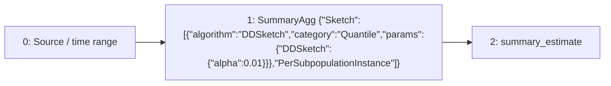

# temporal-quantile

`quantile_over_time(0.9, data[1m])`

[Raw selected plan](temporal-quantile.json) · [DAG DOT](temporal-quantile.dot)

## Selected computation: logical provenance

IDs below are Planner node IDs; QueryPlan adapter IDs are shown separately.

Root: `2`.



| Node | Dependencies (producer, edge role) | Timing | Operation | Output fields (index: name/type) |
| --- | --- | --- | --- | --- |
| 0 | `[]` | `{"timing":"ingestion_time","primitive":"Raw"}` | `{"source":{"TimeSeries":{"metric":"data"}},"predicates":[],"range":{"nanos":0,"secs":60}}` | `["0: ts/timestamp","1: value/float64"]` |
| 1 | `[[0,"Input"]]` | `{"timing":"ingestion_time","primitive":"SummaryState"}` | `{"family":{"Sketch":[{"algorithm":"DDSketch","category":"Quantile","params":{"DDSketch":{"alpha":0.01}}},"PerSubpopulationInstance"]},"grouping":"PerSubpopulationInstance","input":{"item":null,"weight":{"Column":"SampleValue"},"weight_domain":{"kind":"unknown_or_signed"}},"kind":"summary_agg","reduction":"PerEntity"}` | `["0: ts/timestamp","1: value/{\"Sketch\":[{\"algorithm\":\"DDSketch\",\"category\":\"Quantile\",\"params\":{\"DDSketch\":{\"alpha\":0.01}}},\"PerSubpopulationInstance\"]}"]` |
| 2 | `[[1,"Input"]]` | `{"timing":"query_time","primitive":"Raw"}` | `{"kind":"summary_estimate","query":{"Quantile":{"q":0.9}}}` | `["0: ts/timestamp","1: value/float64"]` |

### Sort expressions

No standalone Sort node in this selected DAG; any ranking readout is shown in the operation table.

## Candidate admission and costing

Costs below come from the controlled Level 1 fixture, not production measurements.

```json
{
  "deployment_evaluation": "single_root_substitutions_in_preferred_workload",
  "inventory": "all_root_candidates",
  "joint_workload_search_exhaustive": false
}
```

- quantile(q=0.9) realizes as a Kll sketch: composed guarantee (Rank, bound Some(0.013294757464848584), failure probability Some(0.01)) does not satisfy EpsilonDelta { epsilon: 0.01, delta: 0.01 }
### Planner physical candidate

Logical root: `null`.


Guarantee: `null`

invalid DAG: ranking requires one exact per-series Rate frontier

### Planner physical candidate

Logical root: `null`.


Guarantee: `null`

invalid DAG: ranking requires one exact per-series Rate frontier


| Candidate | Logical root IDs | Status | Fixture cost | Rejection / unavailable reason |
| --- | --- | --- | --- | --- |
| 0 | `["asap-explain-v1:root:ded85760335cdff2c017ddc4f55852bb07fa5e4199cd348e3f711f4f2d35f265"]` | `"selected"` | `95.0` | `null` |
| 1 | `["asap-explain-v1:root:8161e1fd955edc970415f0296701e178dc8549534e95bf0c9aa2be91c77f57d4"]` | `"unselected"` | `61000000000000.0` | `null` |
| 2 | `["asap-explain-v1:root:3d7e2af334c24d7e91dd07729e79ad69d3d76949f746da20a8d9f1bacfb6187b"]` | `"unselected"` | `61000000000000.0` | `null` |

Successfully compiled candidate plans: [temporal-quantile-0](candidates/temporal-quantile-0.json), [temporal-quantile-1](candidates/temporal-quantile-1.json), [temporal-quantile-2](candidates/temporal-quantile-2.json)

## Persisted boundaries

Binding for `compat-query-0`:

```json
{
  "nodes": {
    "0": {
      "placement": "maintenance_input"
    },
    "1": {
      "placement": "materialization",
      "stored_output": 3752266711358116078
    }
  },
  "query_sink": 2,
  "query_plan_sink": 0,
  "precompute_sinks": [
    1
  ]
}
```

Stored output `3752266711358116078` → semantic definition `sds-v1:2fde0175b6e4e3ba9124c880727f0aa355743ee5dd941aa16914493a5bf8cdf7`.

### Maintenance configuration

```json
[
  {
    "aggregation_type": "DDSketch",
    "aggregation_sub_type": "",
    "parameters": {
      "alpha": 0.01,
      "promql_right_closed": true
    },
    "grouping_labels": {
      "labels": []
    },
    "partitioning": "per_entity",
    "aggregated_labels": {
      "labels": []
    },
    "rollup_labels": {
      "labels": []
    },
    "window_size": 60,
    "slide_interval": 10,
    "window_type": "sliding",
    "window_layout": {
      "kind": "pane",
      "pane_secs": 10
    },
    "pane_origin_ms": 0,
    "spatial_filter": "",
    "spatial_filter_normalized": "",
    "metric": "data",
    "num_aggregates_to_retain": 7,
    "table_name": null,
    "value_projection": null
  }
]
```

## Bound query execution

This is the emitted adapter representation, including dependencies, pane size, readout lookback and stored-output references. Legacy wire names are preserved so the export remains auditable.

```json
{
  "language": "prom_ql",
  "query_id": "compat-query-0",
  "canonical_query": "quantile_over_time(0.9, data[1m])",
  "root": 0,
  "nodes": {
    "0": {
      "op": "summary_estimate",
      "input": 1,
      "query": {
        "kind": "quantile",
        "q": 0.9
      }
    },
    "1": {
      "op": "read_materialization",
      "binding": {
        "stored_output_reference": {
          "stored_output_id": 3752266711358116078,
          "definition_id": "sds-v1:2fde0175b6e4e3ba9124c880727f0aa355743ee5dd941aa16914493a5bf8cdf7"
        },
        "materialization": 3752266711358116078,
        "output_grouping": {
          "mode": "per_entity"
        },
        "window_ms": 10000,
        "pane_origin_ms": 0,
        "readout_lookback_ms": 60000
      }
    }
  },
  "instant": {
    "lookback_ms": 60000,
    "full_history": false,
    "cumulative_readout": true
  },
  "fallback": "exact_backend"
}
```
