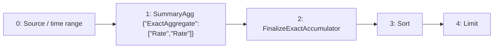

# topk-rate

`topk by (label_0) (3, rate(data[1m]))`

[Raw selected plan](topk-rate.json) · [DAG DOT](topk-rate.dot)

## Selected computation: logical provenance

IDs below are Planner node IDs; QueryPlan adapter IDs are shown separately.

Root: `4`.



| Node | Dependencies (producer, edge role) | Timing | Operation | Output fields (index: name/type) |
| --- | --- | --- | --- | --- |
| 0 | `[]` | `{"timing":"ingestion_time","primitive":"Raw"}` | `{"source":{"TimeSeries":{"metric":"data"}},"predicates":[],"range":{"nanos":0,"secs":60}}` | `["0: ts/timestamp","1: value/float64","2: label_0/utf8","3: $promql_series_identity/utf8"]` |
| 1 | `[[0,"Input"]]` | `{"timing":"ingestion_time","primitive":"SummaryState"}` | `{"family":{"ExactAggregate":["Rate","Rate"]},"grouping":"PerSubpopulationInstance","input":{"item":null,"weight":{"Column":"SampleValue"},"weight_domain":{"kind":"unknown_or_signed"}},"kind":"summary_agg","reduction":"PerEntity"}` | `["0: ts/timestamp","1: value/{\"ExactAggregate\":[\"Rate\",\"Rate\"]}","2: label_0/utf8","3: $promql_series_identity/utf8"]` |
| 2 | `[[1,"Input"]]` | `{"timing":"query_time","primitive":"Raw"}` | `{"kind":"value","operation":"FinalizeExactAccumulator"}` | `["0: ts/timestamp","1: value/float64","2: label_0/utf8","3: $promql_series_identity/utf8"]` |
| 3 | `[[2,"Input"]]` | `{"timing":"query_time","primitive":"Raw"}` | `{"kind":"value","operation":{"Sort":{"keys":[{"ascending":false,"expr":{"Column":1},"nulls_first":false}],"partition_by":[2]}}}` | `["0: ts/timestamp","1: value/float64","2: label_0/utf8","3: $promql_series_identity/utf8"]` |
| 4 | `[[3,"Input"]]` | `{"timing":"query_time","primitive":"Raw"}` | `{"kind":"value","operation":{"Limit":{"n":3,"offset":0,"partition_by":[2]}}}` | `["0: ts/timestamp","1: value/float64","2: label_0/utf8","3: $promql_series_identity/utf8"]` |

### Sort expressions

Node `3`: `{"keys":[{"ascending":false,"expr":{"Column":1},"nulls_first":false}],"partition_by":[2]}`

Its input is node `2`: `{"kind":"value","operation":"FinalizeExactAccumulator"}`. Column indices refer to that producer's output schema above.

## Installed native physical program

This program is compiled before candidate pricing and installation. Serving restores its operators and binds its declared inputs.

Roots: `[4]`.

| Node | Dependencies | Operator / input contract | Output fields |
| --- | --- | --- | --- |
| 2 | `[]` | `{"Input":{"boundedness":"Bounded","emission":"Unknown"}}` | `["0: ts/timestamp","1: value/float64","2: label_0/utf8","3: $promql_series_identity/utf8"]` |
| 3 | `[2]` | `{"Sort":{"groups":[2],"keys":[{"column":1,"descending":true,"nulls_first":false}]}}` | `["0: ts/timestamp","1: value/float64","2: label_0/utf8","3: $promql_series_identity/utf8"]` |
| 4 | `[3]` | `{"Limit":{"groups":[2],"n":3,"offset":0}}` | `["0: ts/timestamp","1: value/float64","2: label_0/utf8","3: $promql_series_identity/utf8"]` |


## Candidate admission and costing

Costs below come from the controlled Level 1 fixture, not production measurements.

```json
{
  "deployment_evaluation": "single_root_substitutions_in_preferred_workload",
  "inventory": "all_root_candidates",
  "joint_workload_search_exhaustive": false
}
```

### Planner physical candidate

Logical root: `"asap-explain-v1:root:cd8d58532ced0954eb6dee4f40babf574410c2137999b7fc4ae4954bcca9910f"`.

top-3 heavy-hitters realizes as a CmsWithHeap sketch — one of summary_candidates' candidates for this intent (asap_aware_mapping::replacement::realizations_for_intent); fixed-window precompute over complete per-series counter states

Guarantee: `{"bound":{"op":"unknown","statistic":"topk_membership_margin"},"failure_probability":{"op":"union_bound","terms":[{"op":"unknown","statistic":"topk_interval_failure_probability"},{"count":{"op":"unknown","statistic":"topk_max_distinct_items"},"inner":{"op":"constant","value":0.006737946999085467},"op":"scaled"}]},"metric":"top_k_membership","provenance":[{"guarantee":{"bound":{"op":"constant","value":0.009993683192864136},"failure_probability":{"count":{"op":"unknown","statistic":"topk_max_distinct_items"},"inner":{"op":"constant","value":0.006737946999085467},"op":"scaled"},"metric":"frequency","provenance":[{"algorithm":"CmsWithHeap","contract":"count_min_l1_markov_v1","kind":"sketch_readout","params":{"CmsWithHeap":{"depth":5,"heap_size":100,"width":272}},"query":"TopK { k: 100 }"},{"kind":"unavailable_statistic","statistic":"topk_max_distinct_items"},{"kind":"composition_step","operator":{"op":"approximate_aggregate"},"rule":"simultaneous_score_bounds_over_distinct_partition_item_identities"}]},"input_index":0,"kind":"child_guarantee"},{"kind":"unavailable_statistic","statistic":"topk_selected_lower_bound"},{"kind":"unavailable_statistic","statistic":"topk_excluded_upper_bound"},{"kind":"unavailable_statistic","statistic":"topk_interval_failure_probability"},{"kind":"composition_step","operator":{"op":"top_k_selection"},"rule":"topk_membership_margin_certificate"}]}`

Materialized boundaries: `{"3":{"properties":{"boundedness":"Bounded","emission":"Unknown"},"schema":{"fields":[{"dtype":{"Plain":"utf8"},"name":"label_0","nullable":true},{"dtype":{"Sketch":[{"algorithm":"CmsWithHeap","category":"TopK","params":{"CmsWithHeap":{"depth":5,"heap_size":100,"width":272}}},"PerSubpopulationInstance"]},"name":"topk_3","nullable":false}],"time_index":null}}}`

#### Maintenance physical DAG

| Node | Dependencies | Native operator / input |
| --- | --- | --- |
| 1 | `[]` | `{"Input":{"properties":{"boundedness":"Bounded","emission":"Unknown"},"schema":{"fields":[{"dtype":{"Plain":"timestamp"},"name":"ts","nullable":false},{"dtype":{"ExactAggregate":["Rate","Rate"]},"name":"value","nullable":false},{"dtype":{"Plain":"utf8"},"name":"label_0","nullable":true},{"dtype":{"Plain":"utf8"},"name":"$promql_series_identity","nullable":false}],"time_index":0}}}` |
| 2 | `[1]` | `{"Readout":{"parameters":{"logical_lookback_ms":"60000"},"state":1,"statistic":"Rate"}}` |
| 3 | `[2]` | `{"KeyedSummaryBuild":{"family":{"Sketch":[{"algorithm":"CmsWithHeap","category":"TopK","params":{"CmsWithHeap":{"depth":5,"heap_size":100,"width":272}}},"PerSubpopulationInstance"]},"groups":[2],"items":[0,3],"value":1}}` |

Roots: `[3]`.

#### Query physical DAG

| Node | Dependencies | Native operator / input |
| --- | --- | --- |
| 3 | `[]` | `{"Input":{"properties":{"boundedness":"Bounded","emission":"Unknown"},"schema":{"fields":[{"dtype":{"Plain":"utf8"},"name":"label_0","nullable":true},{"dtype":{"Sketch":[{"algorithm":"CmsWithHeap","category":"TopK","params":{"CmsWithHeap":{"depth":5,"heap_size":100,"width":272}}},"PerSubpopulationInstance"]},"name":"topk_3","nullable":false}],"time_index":null}}}` |
| 4 | `[3]` | `{"KeyedReadout":{"k":100,"state":1}}` |
| 5 | `[4]` | `{"Project":[{"Planner":{"expression":{"Column":1},"output":["timestamp",false],"schema":{"closed":false,"columns":[{"dtype":"utf8","name":"label_0","nullable":true,"table":null},{"dtype":"timestamp","name":"ts","nullable":false,"table":null},{"dtype":"utf8","name":"$promql_series_identity","nullable":false,"table":null},{"dtype":"float64","name":"__asap_estimate","nullable":false,"table":null}],"time_index":null,"unique_keys":[]}}},{"Planner":{"expression":{"Column":3},"output":["float64",false],"schema":{"closed":false,"columns":[{"dtype":"utf8","name":"label_0","nullable":true,"table":null},{"dtype":"timestamp","name":"ts","nullable":false,"table":null},{"dtype":"utf8","name":"$promql_series_identity","nullable":false,"table":null},{"dtype":"float64","name":"__asap_estimate","nullable":false,"table":null}],"time_index":null,"unique_keys":[]}}},{"Planner":{"expression":{"Column":0},"output":["utf8",true],"schema":{"closed":false,"columns":[{"dtype":"utf8","name":"label_0","nullable":true,"table":null},{"dtype":"timestamp","name":"ts","nullable":false,"table":null},{"dtype":"utf8","name":"$promql_series_identity","nullable":false,"table":null},{"dtype":"float64","name":"__asap_estimate","nullable":false,"table":null}],"time_index":null,"unique_keys":[]}}},{"Planner":{"expression":{"Column":2},"output":["utf8",false],"schema":{"closed":false,"columns":[{"dtype":"utf8","name":"label_0","nullable":true,"table":null},{"dtype":"timestamp","name":"ts","nullable":false,"table":null},{"dtype":"utf8","name":"$promql_series_identity","nullable":false,"table":null},{"dtype":"float64","name":"__asap_estimate","nullable":false,"table":null}],"time_index":null,"unique_keys":[]}}}]}` |
| 6 | `[5]` | `{"Sort":{"groups":[2],"keys":[{"column":1,"descending":true,"nulls_first":false}]}}` |
| 7 | `[6]` | `{"Limit":{"groups":[2],"n":3,"offset":0}}` |

Roots: `[7]`.

### Planner physical candidate

Logical root: `"asap-explain-v1:root:ec50b2a3ab2acf52587d69138433ae7e0aa525df93ada9e5fb087afa57e89caa"`.

top-3 heavy-hitters realizes as a CountSketchWithHeap sketch — one of summary_candidates' candidates for this intent (asap_aware_mapping::replacement::realizations_for_intent); fixed-window precompute over complete per-series counter states

Guarantee: `{"bound":{"op":"unknown","statistic":"topk_membership_margin"},"failure_probability":{"op":"union_bound","terms":[{"op":"unknown","statistic":"topk_interval_failure_probability"},{"count":{"op":"unknown","statistic":"topk_max_distinct_items"},"inner":{"op":"constant","value":0.009940766872773949},"op":"scaled"}]},"metric":"top_k_membership","provenance":[{"guarantee":{"bound":{"op":"constant","value":0.01},"failure_probability":{"count":{"op":"unknown","statistic":"topk_max_distinct_items"},"inner":{"op":"constant","value":0.009940766872773949},"op":"scaled"},"metric":"l2_frequency","provenance":[{"algorithm":"CountSketchWithHeap","contract":"count_sketch_l2_median_hoeffding_v1","kind":"sketch_readout","params":{"CountSketchWithHeap":{"depth":83,"heap_size":100,"width":30000}},"query":"TopK { k: 100 }"},{"kind":"unavailable_statistic","statistic":"topk_max_distinct_items"},{"kind":"composition_step","operator":{"op":"approximate_aggregate"},"rule":"simultaneous_score_bounds_over_distinct_partition_item_identities"}]},"input_index":0,"kind":"child_guarantee"},{"kind":"unavailable_statistic","statistic":"topk_selected_lower_bound"},{"kind":"unavailable_statistic","statistic":"topk_excluded_upper_bound"},{"kind":"unavailable_statistic","statistic":"topk_interval_failure_probability"},{"kind":"composition_step","operator":{"op":"top_k_selection"},"rule":"topk_membership_margin_certificate"}]}`

Materialized boundaries: `{"3":{"properties":{"boundedness":"Bounded","emission":"Unknown"},"schema":{"fields":[{"dtype":{"Plain":"utf8"},"name":"label_0","nullable":true},{"dtype":{"Sketch":[{"algorithm":"CountSketchWithHeap","category":"TopK","params":{"CountSketchWithHeap":{"depth":83,"heap_size":100,"width":30000}}},"PerSubpopulationInstance"]},"name":"topk_3","nullable":false}],"time_index":null}}}`

#### Maintenance physical DAG

| Node | Dependencies | Native operator / input |
| --- | --- | --- |
| 1 | `[]` | `{"Input":{"properties":{"boundedness":"Bounded","emission":"Unknown"},"schema":{"fields":[{"dtype":{"Plain":"timestamp"},"name":"ts","nullable":false},{"dtype":{"ExactAggregate":["Rate","Rate"]},"name":"value","nullable":false},{"dtype":{"Plain":"utf8"},"name":"label_0","nullable":true},{"dtype":{"Plain":"utf8"},"name":"$promql_series_identity","nullable":false}],"time_index":0}}}` |
| 2 | `[1]` | `{"Readout":{"parameters":{"logical_lookback_ms":"60000"},"state":1,"statistic":"Rate"}}` |
| 3 | `[2]` | `{"KeyedSummaryBuild":{"family":{"Sketch":[{"algorithm":"CountSketchWithHeap","category":"TopK","params":{"CountSketchWithHeap":{"depth":83,"heap_size":100,"width":30000}}},"PerSubpopulationInstance"]},"groups":[2],"items":[0,3],"value":1}}` |

Roots: `[3]`.

#### Query physical DAG

| Node | Dependencies | Native operator / input |
| --- | --- | --- |
| 3 | `[]` | `{"Input":{"properties":{"boundedness":"Bounded","emission":"Unknown"},"schema":{"fields":[{"dtype":{"Plain":"utf8"},"name":"label_0","nullable":true},{"dtype":{"Sketch":[{"algorithm":"CountSketchWithHeap","category":"TopK","params":{"CountSketchWithHeap":{"depth":83,"heap_size":100,"width":30000}}},"PerSubpopulationInstance"]},"name":"topk_3","nullable":false}],"time_index":null}}}` |
| 4 | `[3]` | `{"KeyedReadout":{"k":100,"state":1}}` |
| 5 | `[4]` | `{"Project":[{"Planner":{"expression":{"Column":1},"output":["timestamp",false],"schema":{"closed":false,"columns":[{"dtype":"utf8","name":"label_0","nullable":true,"table":null},{"dtype":"timestamp","name":"ts","nullable":false,"table":null},{"dtype":"utf8","name":"$promql_series_identity","nullable":false,"table":null},{"dtype":"float64","name":"__asap_estimate","nullable":false,"table":null}],"time_index":null,"unique_keys":[]}}},{"Planner":{"expression":{"Column":3},"output":["float64",false],"schema":{"closed":false,"columns":[{"dtype":"utf8","name":"label_0","nullable":true,"table":null},{"dtype":"timestamp","name":"ts","nullable":false,"table":null},{"dtype":"utf8","name":"$promql_series_identity","nullable":false,"table":null},{"dtype":"float64","name":"__asap_estimate","nullable":false,"table":null}],"time_index":null,"unique_keys":[]}}},{"Planner":{"expression":{"Column":0},"output":["utf8",true],"schema":{"closed":false,"columns":[{"dtype":"utf8","name":"label_0","nullable":true,"table":null},{"dtype":"timestamp","name":"ts","nullable":false,"table":null},{"dtype":"utf8","name":"$promql_series_identity","nullable":false,"table":null},{"dtype":"float64","name":"__asap_estimate","nullable":false,"table":null}],"time_index":null,"unique_keys":[]}}},{"Planner":{"expression":{"Column":2},"output":["utf8",false],"schema":{"closed":false,"columns":[{"dtype":"utf8","name":"label_0","nullable":true,"table":null},{"dtype":"timestamp","name":"ts","nullable":false,"table":null},{"dtype":"utf8","name":"$promql_series_identity","nullable":false,"table":null},{"dtype":"float64","name":"__asap_estimate","nullable":false,"table":null}],"time_index":null,"unique_keys":[]}}}]}` |
| 6 | `[5]` | `{"Sort":{"groups":[2],"keys":[{"column":1,"descending":true,"nulls_first":false}]}}` |
| 7 | `[6]` | `{"Limit":{"groups":[2],"n":3,"offset":0}}` |

Roots: `[7]`.

### Planner physical candidate

Logical root: `"asap-explain-v1:root:ff175f2c427d9949807e2bd5169591d1dc41e1bd57baf68829309d6bf53efa65"`.

select exact Top-K from independently maintained temporal values

Guarantee: `{"bound":{"op":"zero"},"failure_probability":{"op":"zero"},"metric":"absolute_value","provenance":[{"kind":"exact","reason":"ExactAggregate(Rate)"},{"guarantee":{"bound":{"op":"zero"},"failure_probability":{"op":"zero"},"metric":"absolute_value","provenance":[{"kind":"exact","reason":"KeepPreAsap"}]},"input_index":0,"kind":"child_guarantee"},{"kind":"composition_step","operator":{"op":"counter_rate"},"rule":"exact_input"}]}`

#### Query physical DAG

| Node | Dependencies | Native operator / input |
| --- | --- | --- |
| 2 | `[]` | `{"Input":{"properties":{"boundedness":"Bounded","emission":"Unknown"},"schema":{"fields":[{"dtype":{"Plain":"timestamp"},"name":"ts","nullable":false},{"dtype":{"Plain":"float64"},"name":"value","nullable":false},{"dtype":{"Plain":"utf8"},"name":"label_0","nullable":true},{"dtype":{"Plain":"utf8"},"name":"$promql_series_identity","nullable":false}],"time_index":0}}}` |
| 3 | `[2]` | `{"Sort":{"groups":[2],"keys":[{"column":1,"descending":true,"nulls_first":false}]}}` |
| 4 | `[3]` | `{"Limit":{"groups":[2],"n":3,"offset":0}}` |

Roots: `[4]`.

### Planner physical candidate

Logical root: `"asap-explain-v1:root:7c0ca598df442f28b14ab8b6b82c4071766750a438b47008db140848fbb80374"`.

top-3 heavy-hitters realizes as a CmsWithHeap sketch — one of summary_candidates' candidates for this intent (asap_aware_mapping::replacement::realizations_for_intent)

Guarantee: `{"bound":{"op":"unknown","statistic":"topk_membership_margin"},"failure_probability":{"op":"union_bound","terms":[{"op":"unknown","statistic":"topk_interval_failure_probability"},{"count":{"op":"unknown","statistic":"topk_max_distinct_items"},"inner":{"op":"constant","value":0.006737946999085467},"op":"scaled"}]},"metric":"top_k_membership","provenance":[{"guarantee":{"bound":{"op":"constant","value":0.009993683192864136},"failure_probability":{"count":{"op":"unknown","statistic":"topk_max_distinct_items"},"inner":{"op":"constant","value":0.006737946999085467},"op":"scaled"},"metric":"frequency","provenance":[{"algorithm":"CmsWithHeap","contract":"count_min_l1_markov_v1","kind":"sketch_readout","params":{"CmsWithHeap":{"depth":5,"heap_size":100,"width":272}},"query":"TopK { k: 100 }"},{"kind":"unavailable_statistic","statistic":"topk_max_distinct_items"},{"kind":"composition_step","operator":{"op":"approximate_aggregate"},"rule":"simultaneous_score_bounds_over_distinct_partition_item_identities"}]},"input_index":0,"kind":"child_guarantee"},{"kind":"unavailable_statistic","statistic":"topk_selected_lower_bound"},{"kind":"unavailable_statistic","statistic":"topk_excluded_upper_bound"},{"kind":"unavailable_statistic","statistic":"topk_interval_failure_probability"},{"kind":"composition_step","operator":{"op":"top_k_selection"},"rule":"topk_membership_margin_certificate"}]}`

#### Query physical DAG

| Node | Dependencies | Native operator / input |
| --- | --- | --- |
| 2 | `[]` | `{"Input":{"properties":{"boundedness":"Bounded","emission":"Unknown"},"schema":{"fields":[{"dtype":{"Plain":"timestamp"},"name":"ts","nullable":false},{"dtype":{"Plain":"float64"},"name":"value","nullable":false},{"dtype":{"Plain":"utf8"},"name":"label_0","nullable":true},{"dtype":{"Plain":"utf8"},"name":"$promql_series_identity","nullable":false}],"time_index":0}}}` |
| 3 | `[2]` | `{"KeyedSummaryBuild":{"family":{"Sketch":[{"algorithm":"CmsWithHeap","category":"TopK","params":{"CmsWithHeap":{"depth":5,"heap_size":100,"width":272}}},"PerSubpopulationInstance"]},"groups":[2],"items":[0,3],"value":1}}` |
| 4 | `[3]` | `{"KeyedReadout":{"k":100,"state":1}}` |
| 5 | `[4]` | `{"Project":[{"Planner":{"expression":{"Column":1},"output":["timestamp",false],"schema":{"closed":false,"columns":[{"dtype":"utf8","name":"label_0","nullable":true,"table":null},{"dtype":"timestamp","name":"ts","nullable":false,"table":null},{"dtype":"utf8","name":"$promql_series_identity","nullable":false,"table":null},{"dtype":"float64","name":"__asap_estimate","nullable":false,"table":null}],"time_index":null,"unique_keys":[]}}},{"Planner":{"expression":{"Column":3},"output":["float64",false],"schema":{"closed":false,"columns":[{"dtype":"utf8","name":"label_0","nullable":true,"table":null},{"dtype":"timestamp","name":"ts","nullable":false,"table":null},{"dtype":"utf8","name":"$promql_series_identity","nullable":false,"table":null},{"dtype":"float64","name":"__asap_estimate","nullable":false,"table":null}],"time_index":null,"unique_keys":[]}}},{"Planner":{"expression":{"Column":0},"output":["utf8",true],"schema":{"closed":false,"columns":[{"dtype":"utf8","name":"label_0","nullable":true,"table":null},{"dtype":"timestamp","name":"ts","nullable":false,"table":null},{"dtype":"utf8","name":"$promql_series_identity","nullable":false,"table":null},{"dtype":"float64","name":"__asap_estimate","nullable":false,"table":null}],"time_index":null,"unique_keys":[]}}},{"Planner":{"expression":{"Column":2},"output":["utf8",false],"schema":{"closed":false,"columns":[{"dtype":"utf8","name":"label_0","nullable":true,"table":null},{"dtype":"timestamp","name":"ts","nullable":false,"table":null},{"dtype":"utf8","name":"$promql_series_identity","nullable":false,"table":null},{"dtype":"float64","name":"__asap_estimate","nullable":false,"table":null}],"time_index":null,"unique_keys":[]}}}]}` |
| 6 | `[5]` | `{"Sort":{"groups":[2],"keys":[{"column":1,"descending":true,"nulls_first":false}]}}` |
| 7 | `[6]` | `{"Limit":{"groups":[2],"n":3,"offset":0}}` |

Roots: `[7]`.

### Planner physical candidate

Logical root: `"asap-explain-v1:root:cb14776f9b6a08d08dbd095533579fb8b8fb6baa3f59d13f177b010e8123df05"`.

top-3 heavy-hitters realizes as a CountSketchWithHeap sketch — one of summary_candidates' candidates for this intent (asap_aware_mapping::replacement::realizations_for_intent)

Guarantee: `{"bound":{"op":"unknown","statistic":"topk_membership_margin"},"failure_probability":{"op":"union_bound","terms":[{"op":"unknown","statistic":"topk_interval_failure_probability"},{"count":{"op":"unknown","statistic":"topk_max_distinct_items"},"inner":{"op":"constant","value":0.009940766872773949},"op":"scaled"}]},"metric":"top_k_membership","provenance":[{"guarantee":{"bound":{"op":"constant","value":0.01},"failure_probability":{"count":{"op":"unknown","statistic":"topk_max_distinct_items"},"inner":{"op":"constant","value":0.009940766872773949},"op":"scaled"},"metric":"l2_frequency","provenance":[{"algorithm":"CountSketchWithHeap","contract":"count_sketch_l2_median_hoeffding_v1","kind":"sketch_readout","params":{"CountSketchWithHeap":{"depth":83,"heap_size":100,"width":30000}},"query":"TopK { k: 100 }"},{"kind":"unavailable_statistic","statistic":"topk_max_distinct_items"},{"kind":"composition_step","operator":{"op":"approximate_aggregate"},"rule":"simultaneous_score_bounds_over_distinct_partition_item_identities"}]},"input_index":0,"kind":"child_guarantee"},{"kind":"unavailable_statistic","statistic":"topk_selected_lower_bound"},{"kind":"unavailable_statistic","statistic":"topk_excluded_upper_bound"},{"kind":"unavailable_statistic","statistic":"topk_interval_failure_probability"},{"kind":"composition_step","operator":{"op":"top_k_selection"},"rule":"topk_membership_margin_certificate"}]}`

#### Query physical DAG

| Node | Dependencies | Native operator / input |
| --- | --- | --- |
| 2 | `[]` | `{"Input":{"properties":{"boundedness":"Bounded","emission":"Unknown"},"schema":{"fields":[{"dtype":{"Plain":"timestamp"},"name":"ts","nullable":false},{"dtype":{"Plain":"float64"},"name":"value","nullable":false},{"dtype":{"Plain":"utf8"},"name":"label_0","nullable":true},{"dtype":{"Plain":"utf8"},"name":"$promql_series_identity","nullable":false}],"time_index":0}}}` |
| 3 | `[2]` | `{"KeyedSummaryBuild":{"family":{"Sketch":[{"algorithm":"CountSketchWithHeap","category":"TopK","params":{"CountSketchWithHeap":{"depth":83,"heap_size":100,"width":30000}}},"PerSubpopulationInstance"]},"groups":[2],"items":[0,3],"value":1}}` |
| 4 | `[3]` | `{"KeyedReadout":{"k":100,"state":1}}` |
| 5 | `[4]` | `{"Project":[{"Planner":{"expression":{"Column":1},"output":["timestamp",false],"schema":{"closed":false,"columns":[{"dtype":"utf8","name":"label_0","nullable":true,"table":null},{"dtype":"timestamp","name":"ts","nullable":false,"table":null},{"dtype":"utf8","name":"$promql_series_identity","nullable":false,"table":null},{"dtype":"float64","name":"__asap_estimate","nullable":false,"table":null}],"time_index":null,"unique_keys":[]}}},{"Planner":{"expression":{"Column":3},"output":["float64",false],"schema":{"closed":false,"columns":[{"dtype":"utf8","name":"label_0","nullable":true,"table":null},{"dtype":"timestamp","name":"ts","nullable":false,"table":null},{"dtype":"utf8","name":"$promql_series_identity","nullable":false,"table":null},{"dtype":"float64","name":"__asap_estimate","nullable":false,"table":null}],"time_index":null,"unique_keys":[]}}},{"Planner":{"expression":{"Column":0},"output":["utf8",true],"schema":{"closed":false,"columns":[{"dtype":"utf8","name":"label_0","nullable":true,"table":null},{"dtype":"timestamp","name":"ts","nullable":false,"table":null},{"dtype":"utf8","name":"$promql_series_identity","nullable":false,"table":null},{"dtype":"float64","name":"__asap_estimate","nullable":false,"table":null}],"time_index":null,"unique_keys":[]}}},{"Planner":{"expression":{"Column":2},"output":["utf8",false],"schema":{"closed":false,"columns":[{"dtype":"utf8","name":"label_0","nullable":true,"table":null},{"dtype":"timestamp","name":"ts","nullable":false,"table":null},{"dtype":"utf8","name":"$promql_series_identity","nullable":false,"table":null},{"dtype":"float64","name":"__asap_estimate","nullable":false,"table":null}],"time_index":null,"unique_keys":[]}}}]}` |
| 6 | `[5]` | `{"Sort":{"groups":[2],"keys":[{"column":1,"descending":true,"nulls_first":false}]}}` |
| 7 | `[6]` | `{"Limit":{"groups":[2],"n":3,"offset":0}}` |

Roots: `[7]`.


| Candidate | Logical root IDs | Status | Fixture cost | Rejection / unavailable reason |
| --- | --- | --- | --- | --- |
| 0 | `["asap-explain-v1:root:f0c94e03e570989e93edbfab0f772b40c3f91ab4f8c5ef4ec2c358afed9fa40b"]` | `"unselected"` | `155.0` | `null` |
| 1 | `["asap-explain-v1:root:76385b579aa7ad029c49286fa41a3ce4dd16ff0f8341067025d8820107be52cb"]` | `"unselected"` | `61000000000000.0` | `null` |
| 2 | `["asap-explain-v1:root:198684922b0bfbc2d1a2c2639fd790356a6950798dd395e5c40ebd6e4dc302ec"]` | `"unselected"` | `242.0` | `null` |
| 3 | `["asap-explain-v1:root:cd8d58532ced0954eb6dee4f40babf574410c2137999b7fc4ae4954bcca9910f"]` | `"bind_failed"` | `null` | `"query compat-query-0: selected summary readout has no certified accuracy guarantee; provide scoped evidence or use exact execution"` |
| 4 | `["asap-explain-v1:root:ec50b2a3ab2acf52587d69138433ae7e0aa525df93ada9e5fb087afa57e89caa"]` | `"bind_failed"` | `null` | `"query compat-query-0: selected summary readout has no certified accuracy guarantee; provide scoped evidence or use exact execution"` |
| 5 | `["asap-explain-v1:root:ff175f2c427d9949807e2bd5169591d1dc41e1bd57baf68829309d6bf53efa65"]` | `"selected"` | `125.0` | `null` |
| 6 | `["asap-explain-v1:root:7c0ca598df442f28b14ab8b6b82c4071766750a438b47008db140848fbb80374"]` | `"bind_failed"` | `null` | `"query compat-query-0: selected summary readout has no certified accuracy guarantee; provide scoped evidence or use exact execution"` |
| 7 | `["asap-explain-v1:root:cb14776f9b6a08d08dbd095533579fb8b8fb6baa3f59d13f177b010e8123df05"]` | `"bind_failed"` | `null` | `"query compat-query-0: selected summary readout has no certified accuracy guarantee; provide scoped evidence or use exact execution"` |

Successfully compiled candidate plans: [topk-rate-0](candidates/topk-rate-0.json), [topk-rate-1](candidates/topk-rate-1.json), [topk-rate-2](candidates/topk-rate-2.json), [topk-rate-5](candidates/topk-rate-5.json)

## Persisted boundaries

Binding for `compat-query-0`:

```json
{
  "nodes": {
    "0": {
      "placement": "maintenance_input"
    },
    "1": {
      "placement": "materialization",
      "stored_output": 11966640087163441478
    }
  },
  "query_sink": 4,
  "query_plan_sink": 2,
  "precompute_sinks": [
    1
  ]
}
```

Stored output `11966640087163441478` → semantic definition `sds-v1:8ce91b101746c32849414f7a215bd7042800b84c4593ec8ece52cb06372dbc24`.

### Maintenance configuration

```json
[
  {
    "aggregation_type": "Rate",
    "aggregation_sub_type": "",
    "parameters": {
      "promql_right_closed": true
    },
    "grouping_labels": {
      "labels": [
        "label_0"
      ]
    },
    "partitioning": "per_entity",
    "aggregated_labels": {
      "labels": []
    },
    "rollup_labels": {
      "labels": []
    },
    "window_size": 60,
    "slide_interval": 10,
    "window_type": "sliding",
    "window_layout": {
      "kind": "pane",
      "pane_secs": 10
    },
    "pane_origin_ms": 0,
    "spatial_filter": "",
    "spatial_filter_normalized": "",
    "metric": "data",
    "num_aggregates_to_retain": 7,
    "table_name": null,
    "value_projection": null
  }
]
```

## Bound query execution

This is the emitted adapter representation, including dependencies, pane size, readout lookback and stored-output references. Legacy wire names are preserved so the export remains auditable.

```json
{
  "physical_dag": {
    "nodes": {
      "2": {
        "Input": {
          "properties": {
            "boundedness": "Bounded",
            "emission": "Unknown"
          },
          "schema": {
            "fields": [
              {
                "dtype": {
                  "Plain": "timestamp"
                },
                "name": "ts",
                "nullable": false
              },
              {
                "dtype": {
                  "Plain": "float64"
                },
                "name": "value",
                "nullable": false
              },
              {
                "dtype": {
                  "Plain": "utf8"
                },
                "name": "label_0",
                "nullable": true
              },
              {
                "dtype": {
                  "Plain": "utf8"
                },
                "name": "$promql_series_identity",
                "nullable": false
              }
            ],
            "time_index": 0
          }
        }
      },
      "3": {
        "Operator": {
          "inputs": [
            2
          ],
          "operator": {
            "inputs": [
              {
                "fields": [
                  {
                    "dtype": {
                      "Plain": "timestamp"
                    },
                    "name": "ts",
                    "nullable": false
                  },
                  {
                    "dtype": {
                      "Plain": "float64"
                    },
                    "name": "value",
                    "nullable": false
                  },
                  {
                    "dtype": {
                      "Plain": "utf8"
                    },
                    "name": "label_0",
                    "nullable": true
                  },
                  {
                    "dtype": {
                      "Plain": "utf8"
                    },
                    "name": "$promql_series_identity",
                    "nullable": false
                  }
                ],
                "time_index": 0
              }
            ],
            "kind": {
              "Sort": {
                "groups": [
                  2
                ],
                "keys": [
                  {
                    "column": 1,
                    "descending": true,
                    "nulls_first": false
                  }
                ]
              }
            },
            "output": {
              "fields": [
                {
                  "dtype": {
                    "Plain": "timestamp"
                  },
                  "name": "ts",
                  "nullable": false
                },
                {
                  "dtype": {
                    "Plain": "float64"
                  },
                  "name": "value",
                  "nullable": false
                },
                {
                  "dtype": {
                    "Plain": "utf8"
                  },
                  "name": "label_0",
                  "nullable": true
                },
                {
                  "dtype": {
                    "Plain": "utf8"
                  },
                  "name": "$promql_series_identity",
                  "nullable": false
                }
              ],
              "time_index": 0
            }
          }
        }
      },
      "4": {
        "Operator": {
          "inputs": [
            3
          ],
          "operator": {
            "inputs": [
              {
                "fields": [
                  {
                    "dtype": {
                      "Plain": "timestamp"
                    },
                    "name": "ts",
                    "nullable": false
                  },
                  {
                    "dtype": {
                      "Plain": "float64"
                    },
                    "name": "value",
                    "nullable": false
                  },
                  {
                    "dtype": {
                      "Plain": "utf8"
                    },
                    "name": "label_0",
                    "nullable": true
                  },
                  {
                    "dtype": {
                      "Plain": "utf8"
                    },
                    "name": "$promql_series_identity",
                    "nullable": false
                  }
                ],
                "time_index": 0
              }
            ],
            "kind": {
              "Limit": {
                "groups": [
                  2
                ],
                "n": 3,
                "offset": 0
              }
            },
            "output": {
              "fields": [
                {
                  "dtype": {
                    "Plain": "timestamp"
                  },
                  "name": "ts",
                  "nullable": false
                },
                {
                  "dtype": {
                    "Plain": "float64"
                  },
                  "name": "value",
                  "nullable": false
                },
                {
                  "dtype": {
                    "Plain": "utf8"
                  },
                  "name": "label_0",
                  "nullable": true
                },
                {
                  "dtype": {
                    "Plain": "utf8"
                  },
                  "name": "$promql_series_identity",
                  "nullable": false
                }
              ],
              "time_index": 0
            }
          }
        }
      }
    },
    "roots": [
      4
    ],
    "version": 1
  },
  "language": "prom_ql",
  "query_id": "compat-query-0",
  "canonical_query": "topk by (label_0) (3, rate(data[1m]))",
  "root": 2,
  "nodes": {
    "0": {
      "op": "exact_readout",
      "input": 1,
      "readout": "rate"
    },
    "1": {
      "op": "read_materialization",
      "binding": {
        "stored_output_reference": {
          "stored_output_id": 11966640087163441478,
          "definition_id": "sds-v1:8ce91b101746c32849414f7a215bd7042800b84c4593ec8ece52cb06372dbc24"
        },
        "materialization": 11966640087163441478,
        "output_grouping": {
          "mode": "per_entity"
        },
        "window_ms": 10000,
        "pane_origin_ms": 0,
        "readout_lookback_ms": 60000
      }
    },
    "2": {
      "op": "physical",
      "inputs": [
        0
      ],
      "source_nodes": [
        2
      ],
      "max_bytes": 2147483648
    }
  },
  "instant": {
    "lookback_ms": 60000,
    "full_history": false,
    "cumulative_readout": true
  },
  "fallback": "exact_backend"
}
```
