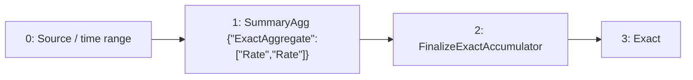

# grouped-rate

`sum by (label_0) (rate(data[1m]))`

[Raw selected plan](grouped-rate.json) · [DAG DOT](grouped-rate.dot)

## Selected computation: logical provenance

IDs below are Planner node IDs; QueryPlan adapter IDs are shown separately.

Root: `3`.



| Node | Dependencies (producer, edge role) | Timing | Operation | Output fields (index: name/type) |
| --- | --- | --- | --- | --- |
| 0 | `[]` | `{"timing":"ingestion_time","primitive":"Raw"}` | `{"source":{"TimeSeries":{"metric":"data"}},"predicates":[],"range":{"nanos":0,"secs":60}}` | `["0: ts/timestamp","1: value/float64","2: label_0/utf8"]` |
| 1 | `[[0,"Input"]]` | `{"timing":"ingestion_time","primitive":"SummaryState"}` | `{"family":{"ExactAggregate":["Rate","Rate"]},"grouping":"PerSubpopulationInstance","input":{"item":null,"weight":{"Column":"SampleValue"},"weight_domain":{"kind":"unknown_or_signed"}},"kind":"summary_agg","reduction":"PerEntity"}` | `["0: ts/timestamp","1: value/{\"ExactAggregate\":[\"Rate\",\"Rate\"]}","2: label_0/utf8"]` |
| 2 | `[[1,"Input"]]` | `{"timing":"query_time","primitive":"Raw"}` | `{"kind":"value","operation":"FinalizeExactAccumulator"}` | `["0: ts/timestamp","1: value/float64","2: label_0/utf8"]` |
| 3 | `[[2,"Input"]]` | `{"timing":"query_time","primitive":"Raw"}` | `{"kind":"value","operation":{"Exact":{"Aggregate":{"having":null,"measures":[{"col":null,"kind":"sum"}],"output_names":[""],"reduction":{"Reduce":[2]}}}}}` | `["0: label_0/utf8","1: sum/float64"]` |

### Sort expressions

No standalone Sort node in this selected DAG; any ranking readout is shown in the operation table.

## Candidate admission and costing

Costs below come from the controlled Level 1 fixture, not production measurements.

```json
{
  "deployment_evaluation": "single_root_substitutions_in_preferred_workload",
  "inventory": "all_root_candidates",
  "joint_workload_search_exhaustive": false
}
```


| Candidate | Logical root IDs | Status | Fixture cost | Rejection / unavailable reason |
| --- | --- | --- | --- | --- |
| 0 | `["asap-explain-v1:root:f64d455c779dbeffa3b3791fa9f36aa53ff23ca87cbedcec85cd8f15514c79d1"]` | `"selected"` | `125.0` | `null` |
| 1 | `["asap-explain-v1:root:4f1a460e06820b58ecb3eba688270ec13eb5a8490e30d797b6e6792e02b0eb7b"]` | `"unselected"` | `61000000000000.0` | `null` |
| 2 | `["asap-explain-v1:root:72da058ea30881ecb59998b94e12f7eec58af16de26d7d41ee8aa00bf93584e3"]` | `"bind_failed"` | `null` | `"failed to construct QueryPlan: invalid QueryPlan: Planner residual does not match any original query subtree"` |

Successfully compiled candidate plans: [grouped-rate-0](candidates/grouped-rate-0.json), [grouped-rate-1](candidates/grouped-rate-1.json)

## Persisted boundaries

Binding for `compat-query-0`:

```json
{
  "nodes": {
    "0": {
      "placement": "maintenance_input"
    },
    "1": {
      "placement": "materialization",
      "stored_output": 11966640087163441478
    }
  },
  "query_sink": 3,
  "query_plan_sink": 0,
  "precompute_sinks": [
    1
  ]
}
```

Stored output `11966640087163441478` → semantic definition `sds-v1:528d2a7adb528822d205d1e239daf9904249ae30c5c50c6f7288f286b451ea6c`.

### Maintenance configuration

```json
[
  {
    "aggregation_type": "Rate",
    "aggregation_sub_type": "",
    "parameters": {
      "promql_right_closed": true
    },
    "grouping_labels": {
      "labels": [
        "label_0"
      ]
    },
    "partitioning": "per_entity",
    "aggregated_labels": {
      "labels": []
    },
    "rollup_labels": {
      "labels": []
    },
    "window_size": 60,
    "slide_interval": 10,
    "window_type": "sliding",
    "window_layout": {
      "kind": "pane",
      "pane_secs": 10
    },
    "pane_origin_ms": 0,
    "spatial_filter": "",
    "spatial_filter_normalized": "",
    "metric": "data",
    "num_aggregates_to_retain": 7,
    "table_name": null,
    "value_projection": null
  }
]
```

## Bound query execution

This is the emitted adapter representation, including dependencies, pane size, readout lookback and stored-output references. Legacy wire names are preserved so the export remains auditable.

```json
{
  "language": "prom_ql",
  "query_id": "compat-query-0",
  "canonical_query": "sum by (label_0) (rate(data[1m]))",
  "root": 0,
  "nodes": {
    "0": {
      "op": "logical",
      "operator": {
        "kind": "aggregate",
        "operation": "sum",
        "grouping": {
          "labels": [
            "label_0"
          ],
          "without": false
        }
      },
      "inputs": [
        1
      ]
    },
    "1": {
      "op": "exact_readout",
      "input": 2,
      "readout": "rate"
    },
    "2": {
      "op": "read_materialization",
      "binding": {
        "stored_output_reference": {
          "stored_output_id": 11966640087163441478,
          "definition_id": "sds-v1:528d2a7adb528822d205d1e239daf9904249ae30c5c50c6f7288f286b451ea6c"
        },
        "materialization": 11966640087163441478,
        "output_grouping": {
          "mode": "per_entity"
        },
        "window_ms": 10000,
        "pane_origin_ms": 0,
        "readout_lookback_ms": 60000
      }
    }
  },
  "instant": {
    "lookback_ms": 60000,
    "full_history": false,
    "cumulative_readout": true
  },
  "fallback": "exact_backend"
}
```
