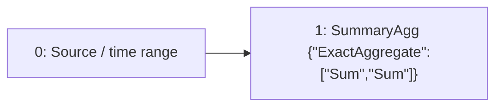

# grouped-temporal-sum

`sum by (label_0) (sum_over_time(data[1m]))`

[Raw selected plan](grouped-temporal-sum.json) · [DAG DOT](grouped-temporal-sum.dot)

## Planner-selected computation

IDs below are Planner node IDs; QueryPlan adapter IDs are shown separately.

Root: `1`.



| Node | Dependencies (producer, edge role) | Timing | Operation | Output fields (index: name/type) |
| --- | --- | --- | --- | --- |
| 0 | `[]` | `{"timing":"ingestion_time","primitive":"Raw"}` | `{"source":{"TimeSeries":{"metric":"data"}},"predicates":[],"range":{"nanos":0,"secs":60}}` | `["0: ts/timestamp","1: value/float64","2: label_0/utf8"]` |
| 1 | `[[0,"Input"]]` | `{"timing":"ingestion_time","primitive":"SummaryState"}` | `{"family":{"ExactAggregate":["Sum","Sum"]},"grouping":"PerSubpopulationInstance","input":{"item":null,"weight":{"Column":"SampleValue"},"weight_domain":{"kind":"unknown_or_signed"}},"kind":"summary_agg","reduction":{"Reduce":[2]}}` | `["0: label_0/utf8","1: sum/{\"ExactAggregate\":[\"Sum\",\"Sum\"]}"]` |

### Sort expressions

No standalone Sort node in this selected DAG; any ranking readout is shown in the operation table.

## Persisted boundaries

Binding for `compat-query-0`:

```json
{
  "nodes": {
    "0": {
      "placement": "maintenance_input"
    },
    "1": {
      "placement": "materialization",
      "stored_output": 13322971198486020251
    }
  },
  "query_sink": 1,
  "query_plan_sink": 0,
  "precompute_sinks": [
    1
  ]
}
```

Stored output `13322971198486020251` → semantic definition `sds-v1:25186a3b39fd0bf46b5def7edafbbeeece9dee5451578e92992346e544008119`.

### Maintenance configuration

```json
[
  {
    "aggregation_type": "Sum",
    "aggregation_sub_type": "",
    "parameters": {
      "promql_right_closed": true
    },
    "grouping_labels": {
      "labels": [
        "label_0"
      ]
    },
    "partitioning": "grouped",
    "aggregated_labels": {
      "labels": []
    },
    "rollup_labels": {
      "labels": []
    },
    "window_size": 60,
    "slide_interval": 10,
    "window_type": "sliding",
    "window_layout": {
      "kind": "pane",
      "pane_secs": 10
    },
    "pane_origin_ms": 0,
    "spatial_filter": "",
    "spatial_filter_normalized": "",
    "metric": "data",
    "num_aggregates_to_retain": 7,
    "table_name": null,
    "value_projection": null
  }
]
```

## Bound query execution

This is the emitted adapter representation, including dependencies, pane size, readout lookback and stored-output references. Legacy wire names are preserved so the export remains auditable.

```json
{
  "language": "prom_ql",
  "query_id": "compat-query-0",
  "canonical_query": "sum by (label_0) (sum_over_time(data[1m]))",
  "root": 0,
  "nodes": {
    "0": {
      "op": "exact_readout",
      "input": 1,
      "readout": "sum"
    },
    "1": {
      "op": "read_materialization",
      "binding": {
        "stored_output_reference": {
          "stored_output_id": 13322971198486020251,
          "definition_id": "sds-v1:25186a3b39fd0bf46b5def7edafbbeeece9dee5451578e92992346e544008119"
        },
        "materialization": 13322971198486020251,
        "output_grouping": {
          "mode": "reduce",
          "keys": [
            "label_0"
          ]
        },
        "window_ms": 10000,
        "pane_origin_ms": 0,
        "readout_lookback_ms": 60000
      }
    }
  },
  "instant": {
    "lookback_ms": 60000,
    "full_history": false,
    "cumulative_readout": true
  },
  "fallback": "exact_backend"
}
```
