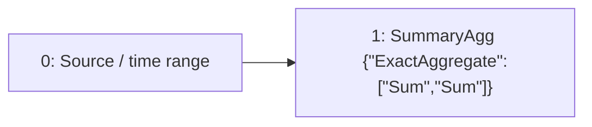

# spatial-sum

`sum by (label_0) (data)`

[Raw selected plan](spatial-sum.json) · [DAG DOT](spatial-sum.dot)

## Selected computation: logical provenance

IDs below are Planner node IDs; QueryPlan adapter IDs are shown separately.

Root: `1`.



| Node | Dependencies (producer, edge role) | Timing | Operation | Output fields (index: name/type) |
| --- | --- | --- | --- | --- |
| 0 | `[]` | `{"timing":"ingestion_time","primitive":"Raw"}` | `{"source":{"TimeSeries":{"metric":"data"}},"predicates":[],"range":{"nanos":0,"secs":5}}` | `["0: ts/timestamp","1: value/float64","2: label_0/utf8"]` |
| 1 | `[[0,"Input"]]` | `{"timing":"ingestion_time","primitive":"SummaryState"}` | `{"family":{"ExactAggregate":["Sum","Sum"]},"grouping":"PerSubpopulationInstance","input":{"item":null,"weight":{"Column":"SampleValue"},"weight_domain":{"kind":"unknown_or_signed"}},"kind":"summary_agg","reduction":{"Reduce":[2]}}` | `["0: label_0/utf8","1: sum/{\"ExactAggregate\":[\"Sum\",\"Sum\"]}"]` |

### Sort expressions

No standalone Sort node in this selected DAG; any ranking readout is shown in the operation table.

## Candidate admission and costing

Costs below come from the controlled Level 1 fixture, not production measurements.

```json
{
  "deployment_evaluation": "single_root_substitutions_in_preferred_workload",
  "inventory": "all_root_candidates",
  "joint_workload_search_exhaustive": false
}
```

### Planner physical candidate

Logical root: `null`.


Guarantee: `null`

invalid DAG: ranking requires one exact per-series Rate frontier


| Candidate | Logical root IDs | Status | Fixture cost | Rejection / unavailable reason |
| --- | --- | --- | --- | --- |
| 0 | `["asap-explain-v1:root:f1f01292c4567698a8e8acac6a2147aad3e20999d9e0a3cdac57e86ebea99e68"]` | `"selected"` | `95.0` | `null` |
| 1 | `["asap-explain-v1:root:19a9f2c7e270097f72fd82ea90b8a1baefc2a54b3cb8ff566e01a9bd2b857e8c"]` | `"unselected"` | `61000000000000.0` | `null` |
| 2 | `["asap-explain-v1:root:1e1d66f44d82fe1bacd1349202d41469f901c182c7aa739c49d2aaea64a26950"]` | `"unselected"` | `130.0` | `null` |
| 3 | `["asap-explain-v1:root:09a98cbf293139fa8c7db7876752cf5cee5c30c8b367d8b3eeb7bb8aded3178c"]` | `"unselected"` | `122.0` | `null` |

Successfully compiled candidate plans: [spatial-sum-0](candidates/spatial-sum-0.json), [spatial-sum-1](candidates/spatial-sum-1.json), [spatial-sum-2](candidates/spatial-sum-2.json), [spatial-sum-3](candidates/spatial-sum-3.json)

## Persisted boundaries

Binding for `compat-query-0`:

```json
{
  "nodes": {
    "0": {
      "placement": "maintenance_input"
    },
    "1": {
      "placement": "materialization",
      "stored_output": 10394281891663284740
    }
  },
  "query_sink": 1,
  "query_plan_sink": 0,
  "precompute_sinks": [
    1
  ]
}
```

Stored output `10394281891663284740` → semantic definition `sds-v1:25186a3b39fd0bf46b5def7edafbbeeece9dee5451578e92992346e544008119`.

### Maintenance configuration

```json
[
  {
    "aggregation_type": "Sum",
    "aggregation_sub_type": "",
    "parameters": {
      "promql_right_closed": true
    },
    "grouping_labels": {
      "labels": [
        "label_0"
      ]
    },
    "partitioning": "grouped",
    "aggregated_labels": {
      "labels": []
    },
    "rollup_labels": {
      "labels": []
    },
    "window_size": 5,
    "slide_interval": 10,
    "window_type": "sliding",
    "window_layout": {
      "kind": "full_window"
    },
    "pane_origin_ms": 5000,
    "spatial_filter": "",
    "spatial_filter_normalized": "",
    "metric": "data",
    "num_aggregates_to_retain": 1,
    "table_name": null,
    "value_projection": null
  }
]
```

## Bound query execution

This is the emitted adapter representation, including dependencies, pane size, readout lookback and stored-output references. Legacy wire names are preserved so the export remains auditable.

```json
{
  "language": "prom_ql",
  "query_id": "compat-query-0",
  "canonical_query": "sum by (label_0) (data)",
  "root": 0,
  "nodes": {
    "0": {
      "op": "exact_readout",
      "input": 1,
      "readout": "sum"
    },
    "1": {
      "op": "read_materialization",
      "binding": {
        "stored_output_reference": {
          "stored_output_id": 10394281891663284740,
          "definition_id": "sds-v1:25186a3b39fd0bf46b5def7edafbbeeece9dee5451578e92992346e544008119"
        },
        "full_window_slide_ms": 10000,
        "materialization": 10394281891663284740,
        "output_grouping": {
          "mode": "reduce",
          "keys": [
            "label_0"
          ]
        },
        "window_ms": 5000,
        "pane_origin_ms": 5000,
        "readout_lookback_ms": 5000
      }
    }
  },
  "instant": {
    "lookback_ms": 5000,
    "full_history": false,
    "cumulative_readout": true
  },
  "fallback": "exact_backend"
}
```
