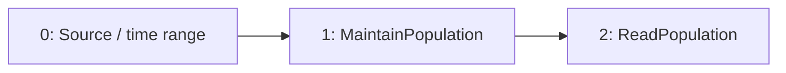

# spatial-topk

`topk by (label_0) (3, data)`

[Raw selected plan](spatial-topk.json) · [DAG DOT](spatial-topk.dot)

## Selected computation: logical provenance

IDs below are Planner node IDs; QueryPlan adapter IDs are shown separately.

Root: `2`.



| Node | Dependencies (producer, edge role) | Timing | Operation | Output fields (index: name/type) |
| --- | --- | --- | --- | --- |
| 0 | `[]` | `{"timing":"ingestion_time","primitive":"Raw"}` | `{"source":{"TimeSeries":{"metric":"data"}},"predicates":[],"range":{"nanos":0,"secs":5}}` | `["0: ts/timestamp","1: value/float64","2: label_0/utf8"]` |
| 1 | `[[0,"Input"]]` | `{"timing":"ingestion_time","primitive":"Raw"}` | `{"kind":"value","operation":{"MaintainPopulation":{"population":{"input":{"CurrentSeries":{"grouping":["label_0"],"lookback_ms":5000,"matchers":[],"metric":"data","without":false}},"max_k":3,"quantiles":false}}}}` | `["0: ts/timestamp","1: value/float64","2: label_0/utf8"]` |
| 2 | `[[1,"Input"]]` | `{"timing":"query_time","primitive":"Raw"}` | `{"kind":"value","operation":{"ReadPopulation":{"readout":{"TopK":{"k":3}}}}}` | `["0: ts/timestamp","1: value/float64","2: label_0/utf8"]` |

### Sort expressions

No standalone Sort node in this selected DAG; any ranking readout is shown in the operation table.

## Installed native physical program

This program is compiled before candidate pricing and installation. Serving restores its operators and binds its declared inputs.

Roots: `[2]`.

| Node | Dependencies | Operator / input contract | Output fields |
| --- | --- | --- | --- |
| 1 | `[]` | `{"Input":{"boundedness":"Bounded","emission":"Unknown"}}` | `["0: ts/timestamp","1: value/float64","2: label_0/utf8","3: $promql_series_identity/utf8"]` |
| 18446744073709551615 | `[1]` | `{"Sort":{"groups":[2],"keys":[{"column":1,"descending":true,"nulls_first":false}]}}` | `["0: ts/timestamp","1: value/float64","2: label_0/utf8","3: $promql_series_identity/utf8"]` |
| 2 | `[18446744073709551615]` | `{"Limit":{"groups":[2],"n":3,"offset":0}}` | `["0: ts/timestamp","1: value/float64","2: label_0/utf8","3: $promql_series_identity/utf8"]` |


## Candidate admission and costing

Costs below come from the controlled Level 1 fixture, not production measurements.

```json
{
  "deployment_evaluation": "single_root_substitutions_in_preferred_workload",
  "inventory": "all_root_candidates",
  "joint_workload_search_exhaustive": false
}
```

### Planner physical candidate

Logical root: `"asap-explain-v1:root:cd34fea63097fb2fcf8b219ec4be8de476ce61574e8a06ee40d888613116f208"`.

top-3 heavy-hitters realizes as a CountSketchWithHeap sketch — one of summary_candidates' candidates for this intent (asap_aware_mapping::replacement::realizations_for_intent)

Guarantee: `{"bound":{"op":"unknown","statistic":"topk_membership_margin"},"failure_probability":{"op":"union_bound","terms":[{"op":"unknown","statistic":"topk_interval_failure_probability"},{"count":{"op":"unknown","statistic":"topk_max_distinct_items"},"inner":{"op":"constant","value":0.009940766872773949},"op":"scaled"}]},"metric":"top_k_membership","provenance":[{"guarantee":{"bound":{"op":"constant","value":0.01},"failure_probability":{"count":{"op":"unknown","statistic":"topk_max_distinct_items"},"inner":{"op":"constant","value":0.009940766872773949},"op":"scaled"},"metric":"l2_frequency","provenance":[{"algorithm":"CountSketchWithHeap","contract":"count_sketch_l2_median_hoeffding_v1","kind":"sketch_readout","params":{"CountSketchWithHeap":{"depth":83,"heap_size":100,"width":30000}},"query":"TopK { k: 100 }"},{"kind":"unavailable_statistic","statistic":"topk_max_distinct_items"},{"kind":"composition_step","operator":{"op":"approximate_aggregate"},"rule":"simultaneous_score_bounds_over_distinct_partition_item_identities"}]},"input_index":0,"kind":"child_guarantee"},{"kind":"unavailable_statistic","statistic":"topk_selected_lower_bound"},{"kind":"unavailable_statistic","statistic":"topk_excluded_upper_bound"},{"kind":"unavailable_statistic","statistic":"topk_interval_failure_probability"},{"kind":"composition_step","operator":{"op":"top_k_selection"},"rule":"topk_membership_margin_certificate"}]}`

#### Query physical DAG

| Node | Dependencies | Native operator / input |
| --- | --- | --- |
| 1 | `[]` | `{"Input":{"properties":{"boundedness":"Bounded","emission":"Unknown"},"schema":{"fields":[{"dtype":{"Plain":"timestamp"},"name":"ts","nullable":false},{"dtype":{"Plain":"float64"},"name":"value","nullable":false},{"dtype":{"Plain":"utf8"},"name":"label_0","nullable":true},{"dtype":{"Plain":"utf8"},"name":"$promql_series_identity","nullable":false}],"time_index":0}}}` |
| 2 | `[1]` | `{"KeyedSummaryBuild":{"family":{"Sketch":[{"algorithm":"CountSketchWithHeap","category":"TopK","params":{"CountSketchWithHeap":{"depth":83,"heap_size":100,"width":30000}}},"PerSubpopulationInstance"]},"groups":[2],"items":[0,3],"value":1}}` |
| 3 | `[2]` | `{"KeyedReadout":{"k":100,"state":1}}` |
| 4 | `[3]` | `{"Project":[{"Planner":{"expression":{"Column":1},"output":["timestamp",false],"schema":{"closed":false,"columns":[{"dtype":"utf8","name":"label_0","nullable":true,"table":null},{"dtype":"timestamp","name":"ts","nullable":false,"table":null},{"dtype":"utf8","name":"$promql_series_identity","nullable":false,"table":null},{"dtype":"float64","name":"__asap_estimate","nullable":false,"table":null}],"time_index":null,"unique_keys":[]}}},{"Planner":{"expression":{"Column":3},"output":["float64",false],"schema":{"closed":false,"columns":[{"dtype":"utf8","name":"label_0","nullable":true,"table":null},{"dtype":"timestamp","name":"ts","nullable":false,"table":null},{"dtype":"utf8","name":"$promql_series_identity","nullable":false,"table":null},{"dtype":"float64","name":"__asap_estimate","nullable":false,"table":null}],"time_index":null,"unique_keys":[]}}},{"Planner":{"expression":{"Column":0},"output":["utf8",true],"schema":{"closed":false,"columns":[{"dtype":"utf8","name":"label_0","nullable":true,"table":null},{"dtype":"timestamp","name":"ts","nullable":false,"table":null},{"dtype":"utf8","name":"$promql_series_identity","nullable":false,"table":null},{"dtype":"float64","name":"__asap_estimate","nullable":false,"table":null}],"time_index":null,"unique_keys":[]}}},{"Planner":{"expression":{"Column":2},"output":["utf8",false],"schema":{"closed":false,"columns":[{"dtype":"utf8","name":"label_0","nullable":true,"table":null},{"dtype":"timestamp","name":"ts","nullable":false,"table":null},{"dtype":"utf8","name":"$promql_series_identity","nullable":false,"table":null},{"dtype":"float64","name":"__asap_estimate","nullable":false,"table":null}],"time_index":null,"unique_keys":[]}}}]}` |
| 5 | `[4]` | `{"Sort":{"groups":[2],"keys":[{"column":1,"descending":true,"nulls_first":false}]}}` |
| 6 | `[5]` | `{"Limit":{"groups":[2],"n":3,"offset":0}}` |

Roots: `[6]`.


| Candidate | Logical root IDs | Status | Fixture cost | Rejection / unavailable reason |
| --- | --- | --- | --- | --- |
| 0 | `["asap-explain-v1:root:ac0ac7d5f573754e55e5f37a75d60ace6d3a74eeb081ce85a7dc96334ca31d73"]` | `"bind_failed"` | `null` | `"failed to construct QueryPlan: invalid QueryPlan: Planner residual does not match any original query subtree"` |
| 1 | `["asap-explain-v1:root:e13e67835975ec59bb3fdbe296544ae7da37f949b359f5deaa7103b77ac9c2f1"]` | `"unselected"` | `61000000000000.0` | `null` |
| 2 | `["asap-explain-v1:root:01d98a8e246904cf0d42a2404bae63f7818f902759c57e16e178802f080b9ec3"]` | `"selected"` | `130.0` | `null` |
| 3 | `["asap-explain-v1:root:cd34fea63097fb2fcf8b219ec4be8de476ce61574e8a06ee40d888613116f208"]` | `"bind_failed"` | `null` | `"query compat-query-0: selected summary readout has no certified accuracy guarantee; provide scoped evidence or use exact execution"` |

Successfully compiled candidate plans: [spatial-topk-1](candidates/spatial-topk-1.json), [spatial-topk-2](candidates/spatial-topk-2.json)

## Persisted boundaries

No precompute executable DAG is installed for this selected candidate.

No summary stored-output binding. Maintained current-series input, when present, is visible in the DAG and QueryPlan.

### Maintenance configuration

```json
[]
```

## Bound query execution

This is the emitted adapter representation, including dependencies, pane size, readout lookback and stored-output references. Legacy wire names are preserved so the export remains auditable.

```json
{
  "physical_dag": {
    "nodes": {
      "1": {
        "Input": {
          "properties": {
            "boundedness": "Bounded",
            "emission": "Unknown"
          },
          "schema": {
            "fields": [
              {
                "dtype": {
                  "Plain": "timestamp"
                },
                "name": "ts",
                "nullable": false
              },
              {
                "dtype": {
                  "Plain": "float64"
                },
                "name": "value",
                "nullable": false
              },
              {
                "dtype": {
                  "Plain": "utf8"
                },
                "name": "label_0",
                "nullable": true
              },
              {
                "dtype": {
                  "Plain": "utf8"
                },
                "name": "$promql_series_identity",
                "nullable": false
              }
            ],
            "time_index": 0
          }
        }
      },
      "18446744073709551615": {
        "Operator": {
          "inputs": [
            1
          ],
          "operator": {
            "inputs": [
              {
                "fields": [
                  {
                    "dtype": {
                      "Plain": "timestamp"
                    },
                    "name": "ts",
                    "nullable": false
                  },
                  {
                    "dtype": {
                      "Plain": "float64"
                    },
                    "name": "value",
                    "nullable": false
                  },
                  {
                    "dtype": {
                      "Plain": "utf8"
                    },
                    "name": "label_0",
                    "nullable": true
                  },
                  {
                    "dtype": {
                      "Plain": "utf8"
                    },
                    "name": "$promql_series_identity",
                    "nullable": false
                  }
                ],
                "time_index": 0
              }
            ],
            "kind": {
              "Sort": {
                "groups": [
                  2
                ],
                "keys": [
                  {
                    "column": 1,
                    "descending": true,
                    "nulls_first": false
                  }
                ]
              }
            },
            "output": {
              "fields": [
                {
                  "dtype": {
                    "Plain": "timestamp"
                  },
                  "name": "ts",
                  "nullable": false
                },
                {
                  "dtype": {
                    "Plain": "float64"
                  },
                  "name": "value",
                  "nullable": false
                },
                {
                  "dtype": {
                    "Plain": "utf8"
                  },
                  "name": "label_0",
                  "nullable": true
                },
                {
                  "dtype": {
                    "Plain": "utf8"
                  },
                  "name": "$promql_series_identity",
                  "nullable": false
                }
              ],
              "time_index": 0
            }
          }
        }
      },
      "2": {
        "Operator": {
          "inputs": [
            18446744073709551615
          ],
          "operator": {
            "inputs": [
              {
                "fields": [
                  {
                    "dtype": {
                      "Plain": "timestamp"
                    },
                    "name": "ts",
                    "nullable": false
                  },
                  {
                    "dtype": {
                      "Plain": "float64"
                    },
                    "name": "value",
                    "nullable": false
                  },
                  {
                    "dtype": {
                      "Plain": "utf8"
                    },
                    "name": "label_0",
                    "nullable": true
                  },
                  {
                    "dtype": {
                      "Plain": "utf8"
                    },
                    "name": "$promql_series_identity",
                    "nullable": false
                  }
                ],
                "time_index": 0
              }
            ],
            "kind": {
              "Limit": {
                "groups": [
                  2
                ],
                "n": 3,
                "offset": 0
              }
            },
            "output": {
              "fields": [
                {
                  "dtype": {
                    "Plain": "timestamp"
                  },
                  "name": "ts",
                  "nullable": false
                },
                {
                  "dtype": {
                    "Plain": "float64"
                  },
                  "name": "value",
                  "nullable": false
                },
                {
                  "dtype": {
                    "Plain": "utf8"
                  },
                  "name": "label_0",
                  "nullable": true
                },
                {
                  "dtype": {
                    "Plain": "utf8"
                  },
                  "name": "$promql_series_identity",
                  "nullable": false
                }
              ],
              "time_index": 0
            }
          }
        }
      }
    },
    "roots": [
      2
    ],
    "version": 1
  },
  "language": "prom_ql",
  "query_id": "compat-query-0",
  "canonical_query": "topk by (label_0) (3, data)",
  "root": 0,
  "nodes": {
    "0": {
      "op": "logical",
      "operator": {
        "kind": "current_series",
        "population": {
          "metric": "data",
          "matchers": [],
          "grouping": {
            "labels": [
              "label_0"
            ],
            "without": false
          },
          "lookback_ms": 5000,
          "max_input_lag_ms": 5000,
          "history_retention_ms": 0,
          "max_series": 100000,
          "max_bytes": 1073741824,
          "max_k": 3,
          "quantiles": false
        },
        "readout": {
          "kind": "snapshot"
        }
      },
      "inputs": []
    }
  },
  "instant": {
    "lookback_ms": 5000,
    "full_history": false,
    "cumulative_readout": true
  },
  "fallback": "exact_backend"
}
```
