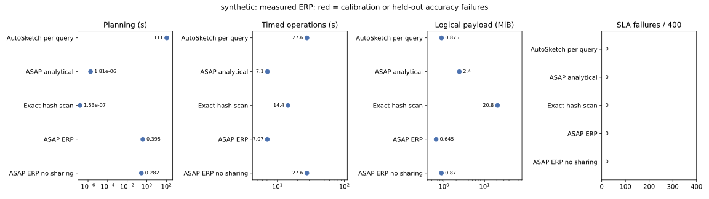
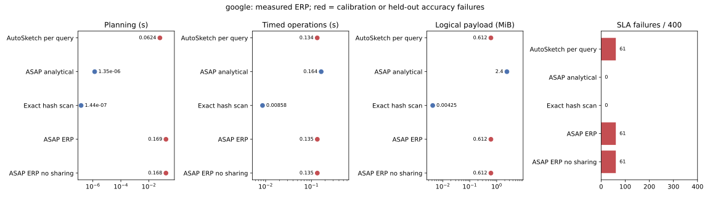

# Measured ERP Top-K dashboard comparison (v2)

Supersedes the withdrawn v1 measurements. Values below are generated from release-mode raw data; they are not smoke-test results.

Four TopK(10) frequency queries cover the latest 1, 5, 15, and 60 minutes. A new 30-second pane arrives before every dashboard refresh. Each trial evaluates 100 refreshes (400 panel queries), with exactly the same endpoints for all methods. Calibration uses the first 120 panes; held-out endpoints are 121–220. Update time includes warm-up and ingestion of all 220 panes. Events update sketches in their original order, one event per update.

Synthetic: 10,000,000 events from a truncated Zipf(1.1), domain size 100,000, seeds 42–44. Independent profile seeds are 1000–1002; the uniform alternative uses 2000–2002. Google: collection_id frequencies from instance_usage, start_time timestamps, 30-second panes, the previously selected consecutive interval starting at pane 77774. The committed replay has 1,971 events and 683 keys. This sparse single-shard interval is not representative of full Google production traffic.

ERP consumes a persisted catalog in sketch-bench's ERP-v1 record format plus window-loss and empirical-shape metadata. The backend Top-K benchmark adapter generates these window-conditioned records because atomic frequency error is insufficient evidence for merged Top-K recall. Shape matching compares observed cardinality, events per pane, and top-1/10/100/1000 probability mass; it does not hard-classify a trace as Zipf or uniform. Distance >0.5 or an ambiguity margin <0.05 rejects a match. ASAPPlanner's ErpArtifact.select selects the least retained-memory measured configuration passing all relevant window-loss constraints. Full ERP compares shared versus independent pane layouts; the no-sharing arm optimizes each window independently.

Both empirical methods minimize logical retained memory and use the same 72 configurations: CMS or CountSketch, depth {3,5,7}, width {128,256,512,1024}, heap {16,32,64}. Per-instance budget is 128 KiB and total retained-sketch budget is 16 MiB. AutoSketch uses per-family discrete LHS, numeric-neighbor search, direction stopping and memory pruning; it benchmarks each window independently. This adapts Algorithm 4 to CPU sketches with a heap-capacity dimension, omitting P4 stage/ALU allocation. Analytical sizing rounds upward to the shared grid and supplies additive error parameters; those bounds do not certify Recall@10.

Accuracy target is Recall@10 ≥0.8 on each observed endpoint. Boundary ties are exchangeable only in remaining boundary slots; missing a strictly heavier key still counts as an error. Benchmark evidence is empirical, not a guarantee on unseen data. Any nonzero held-out violation count marks the point as failing the per-query target; do not compare it as an accuracy-equivalent winner.

Memory is a common logical proxy: counters plus 32 bytes per heap slot, multiplied by retained panes. It excludes heap strings, allocator overhead and transient query state. Exact retains raw u32 keys and performs a timed hash-group scan; it is a reference microbenchmark, not the production backend exact path. Exact can exceed the approximate deployment budget and is marked separately.

The uniform alternative catalog uses 1,000,000 generated events (545,500 calibration events); its lower per-pane rate is part of matching and it is not treated as interchangeable with the 10M-event Zipf scenario.

Algorithm reference: [AutoSketch, §5 and Algorithm 4](https://www.usenix.org/system/files/nsdi24-sun.pdf). Data source: [Google instance_usage shard](https://storage.googleapis.com/clusterdata_2019_a/instance_usage-000000000000.parquet.gz); download/checksum instructions are in download_google_cluster_data_2019.sh.

Synthetic catalog loading: 0.16675s, measured once and charged in full to every ERP planning row below. Online matching/selection alone is separately recorded in each erp_decision.

## Synthetic — median of three trials

| Method | Planning s | Timed operations s | Update s | Merge s | MiB | Recall | Violations / 400 |
|---|---:|---:|---:|---:|---:|---:|---:|
| AutoSketch per query | 111.27 | 27.607 | 27.3604 | 0.244174 | 0.8750 | 0.9985 | 0 |
| ASAP analytical | 1.809e-06 | 7.10018 | 6.83658 | 0.261733 | 2.4023 | 1.0000 | 0 |
| Exact hash scan | 1.53e-07 | 14.3669 | 0.0170298 | 0 | 20.8076 | 1.0000 | 0 |
| ASAP ERP | 0.395438 | 7.06526 | 6.82634 | 0.237945 | 0.6445 | 0.9997 | 0 |
| ASAP ERP no sharing | 0.282127 | 27.5568 | 27.3138 | 0.242643 | 0.8701 | 0.9997 | 0 |

AutoSketch calibration-infeasible searches: 0/12. Algorithm 4's best observed point in such a search is not a feasible configuration.

Planning includes catalog deserialization and online selection for ERP. Profile construction is additional and reported below. Timed operations sum update, eviction, merge and readout (or exact scanning); this excludes harness/window-view setup, query-state teardown outside those timers, and scoring-oracle time for approximate methods. It is not client end-to-end latency. Merge includes sketch-library candidate reconciliation; its cost cannot be separated through the current portable API.

Selected configurations and match distances for every trial are in `erp_decisions`; AutoSketch logs each window's planning time, evaluated candidate count, calibration score and selected configuration in `autosketch_searches`.

Google catalog loading: 0.165571s, measured once and charged in full to every ERP planning row below. Online matching/selection alone is separately recorded in each erp_decision.

## Google — median of three trials

| Method | Planning s | Timed operations s | Update s | Merge s | MiB | Recall | Violations / 400 |
|---|---:|---:|---:|---:|---:|---:|---:|
| AutoSketch per query | 0.0623984 | 0.134186 | 0.0058616 | 0.127262 | 0.6123 | 0.8915 | 61 |
| ASAP analytical | 1.35e-06 | 0.163738 | 0.00283837 | 0.160023 | 2.4023 | 0.9970 | 0 |
| Exact hash scan | 1.44e-07 | 0.00857507 | 3.6581e-05 | 0 | 0.0042 | 1.0000 | 0 |
| ASAP ERP | 0.168986 | 0.134751 | 0.00586025 | 0.127845 | 0.6123 | 0.8915 | 61 |
| ASAP ERP no sharing | 0.168184 | 0.134746 | 0.0058178 | 0.127838 | 0.6123 | 0.8915 | 61 |

AutoSketch calibration-infeasible searches: 0/12. Algorithm 4's best observed point in such a search is not a feasible configuration.

Empty exact windows: 1/400 per trial. Empty exact and predicted sets receive recall/precision 1; this convention is shared by every baseline.

First-trial ERP failures by window (1m/5m/15m/60m): [0, 9, 0, 52]. The 60m query has only one complete calibration endpoint in a 60m prefix; three timing repetitions of that endpoint do not establish temporal robustness. These results do not demonstrate Google held-out SLA compliance. Longer independent calibration histories and uncertainty/drift validation require a separate, preregistered follow-up; thresholds were not tuned on these held-out failures.

Planning includes catalog deserialization and online selection for ERP. Profile construction is additional and reported below. Timed operations sum update, eviction, merge and readout (or exact scanning); this excludes harness/window-view setup, query-state teardown outside those timers, and scoring-oracle time for approximate methods. It is not client end-to-end latency. Merge includes sketch-library candidate reconciliation; its cost cannot be separated through the current portable API.

Selected configurations and match distances for every trial are in `erp_decisions`; AutoSketch logs each window's planning time, evaluated candidate count, calibration score and selected configuration in `autosketch_searches`.

## Profile construction and scope

| Catalog source | Measured construction seconds |
|---|---:|
| zipf | 1008.02 |
| uniform | 120.692 |
| google | 1.88711 |

For a user dataset without an existing profile, cold-start cost includes its profile construction plus loading and selection. Google profiling replays the same calibration prefix three times; these are timing repetitions, not independent distribution samples. Synthetic profiles use three independent streams. No held-out events enter profile construction or shape observation.

This PR evaluates measured configuration selection through the real Planner ERP selector and shared/independent 30-second pane execution. It does not implement production online shape observation, arbitrary pane-width search, drift-triggered replanning, or a formal recall guarantee. The benchmark adapter emits ERP-compatible evidence; it is not an invocation of the sketch-bench executable. Memory is minimized first; empirical CPU costs are composed and recorded as estimates, not used as a competing optimization objective. Timings are sequential wall measurements on a shared host; consult manifest.json for revisions, commands and checksums.
