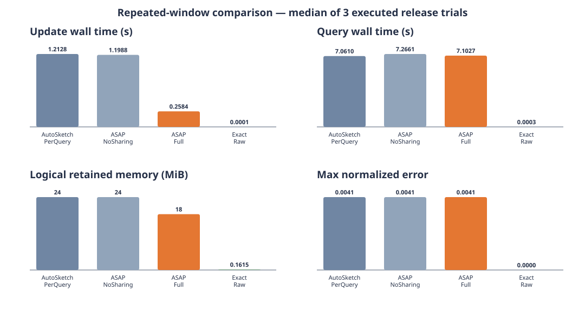

# Google ClusterData 2019 executed results

These results come from actual release executions over the downloaded official
cell-a `instance_usage-000000000000.parquet.gz` object. They are neither smoke
tests nor synthetic data. The scope is **cell-a/shard-0**, not the full trace.



## Data and query workload

- Input: all 626,337 usage rows in the shard, containing 44,806 collection IDs.
- Replay: rows sorted by `(start_time, dense_collection_id)` into all 8,929
  consecutive native five-minute panes. Collection IDs are sorted and mapped to
  dense integers; events are not sampled or shuffled.
- Queries: frequency of every one of the 44,806 collection IDs over the latest
  5m, 15m, 1h, 6h, and 24h complete windows.
- Recurrence: every trial executes the five queries three times after replay,
  producing 15 range queries and 672,090 point estimates per method.
- Sketch: real `asap_sketchlib::CountMinSketch`, depth 4. The configuration
  sweep uses widths 64, 256, 512, 1024, 2048, and 4096.
- Accuracy contract: maximum point error divided by the number of events in its
  window must be at most 0.01. Exact arrays are the oracle.
- Timings: sequential wall-clock observations in an optimized release build;
  values are medians of three executions of the same trace except the explicitly
  labeled width-1024 one-run probe.

The checked-in [replay metadata](data/google-cluster-2019/replay-metadata.json)
and [per-configuration raw JSON](data/google-cluster-2019/) contain the inputs
and every measured row. The third-party Parquet remains outside Git and is
recovered with the checksum-verifying downloader.

## Empirical sizing result

| CMS width x depth | Max normalized error | Meets 1% target | ASAP-Full logical memory |
|---|---:|:---:|---:|
| 64 x 4 | 0.04598 | no | 0.56 MiB |
| 256 x 4 | 0.01149 | no | 2.25 MiB |
| 512 x 4 | 0.01149 | no | 4.50 MiB |
| 1024 x 4 | 0.01149 | no | 9.00 MiB |
| **2048 x 4** | **0.00413** | **yes** | **18.00 MiB** |
| 4096 x 4 | 0 | yes, overconfigured | 36.00 MiB |

On this finite candidate sweep, 2048 x 4 is the smallest measured feasible
configuration. Choosing 4096 x 4 solely for zero observed error doubles retained
memory without being required by the 1% contract. Conversely, widths 256 through
1024 all miss because a collision in the sparse 5m window contributes more than
1%; larger windows alone would hide that failure.

## Method comparison at 2048 x 4

| Method | Update wall time | Query wall time | Updates | Retained state | Logical bytes | Max error |
|---|---:|---:|---:|---:|---:|---:|
| AutoSketch-PerQuery | 1.2128 s | 7.0610 s | 3,131,685 | 376 sketches | 24,641,536 | 0.00413 |
| ASAP-NoSharing | 1.1988 s | 7.2661 s | 3,131,685 | 376 sketches | 24,641,536 | 0.00413 |
| ASAP-Full | 0.2584 s | 7.1027 s | 626,337 | 288 sketches | 18,874,368 | 0.00413 |
| Exact-Raw | 0.000063 s | 0.000286 s | 626,337 appends | 21,167 keys | 169,336 | 0 |

ASAP-Full performs 5x fewer CMS updates than the five query-local deployments,
uses 23.4% less CMS payload, and has a 4.69x median update-time speedup. Its query
time is approximately unchanged because this runner evaluates the same retained
panes for each method.

The exact baseline decisively wins both memory and latency on this particular
latest-24h slice: only 21,167 usage records fall in that interval, while a CMS is
allocated for every pane, including sparse panes. The runner also sums estimates
across panes rather than using a native merged-CMS query path. Therefore this
result supports sharing's maintenance benefit but **does not support a claim that
sketching beats exact execution on this workload**. A planner should select exact
for this sparse regime or account for sparse-pane representation and merge cost.

## Reproduce

```sh
python3 tools/autosketch-comparison/prepare_google_cluster_trace.py \
  /mydata/datasets/google-cluster-data-2019/cell-a/instance_usage-000000000000.parquet.gz \
  /mydata/google-cluster-asap-eval/replay.tsv \
  --metadata /mydata/google-cluster-asap-eval/replay-metadata.json

cargo run --release -p data_plane --example repeated_window_comparison -- \
  --output /mydata/google-cluster-asap-eval/results-w2048.json \
  --backend-revision "$(git rev-parse HEAD)" \
  --input-tsv /mydata/google-cluster-asap-eval/replay.tsv \
  --pane-seconds 300 --window-panes 1,3,12,72,288 \
  --width 2048 --depth 4 --trials 3 --query-repetitions 3
```
