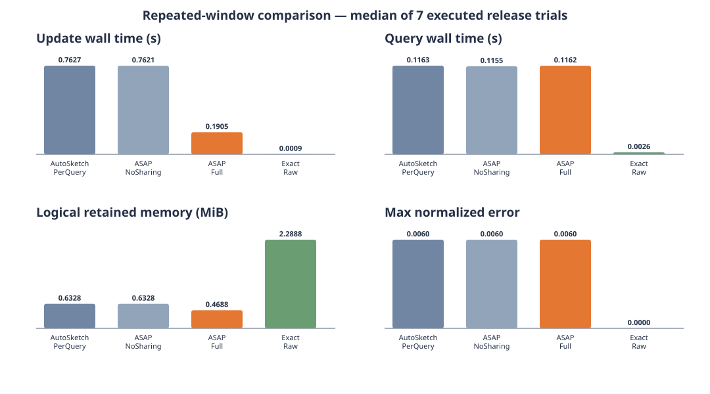

# Repeated-window performance results

These are executed release-benchmark results, not smoke-test results. The
checked-in [raw JSON](data/repeated-window.json) contains all seven trials and
records backend revision `15f8ea14bef2ea6f771a01bc78b55f13a0cdf636`.



## Workload, data, and queries

- **Data:** 120 consecutive one-minute panes. Each pane contains 5,000 positive
  frequency updates, for 600,000 events per trial. Keys are integers sampled
  uniformly from `[0, 1000)` by the checked-in SplitMix64 generator. Seven trials
  use seeds `42` through `48`. There is no ingestion, network, or disk I/O.
- **Queries:** four latest-complete-window frequency workloads with ranges 1m,
  5m, 15m, and 60m. A query asks for the frequencies of all 1,000 declared keys.
  Each trial executes the complete set of four queries ten times after ingestion,
  so each method answers 40 range queries and performs 40,000 point estimates.
- **Sketch:** every approximate method uses the real
  `asap_sketchlib::CountMinSketch` with identical `width=256, depth=4`. A pane
  payload is `256 * 4 * 8 = 8,192` counter bytes. Parameters are fixed here so
  this experiment isolates window sharing rather than configuration quality.
- **AutoSketch-PerQuery:** maintains independent pane collections with retention
  1, 5, 15, and 60, which is the natural deployment for a query-local optimizer.
- **ASAP-NoSharing:** intentionally uses the same physical state as PerQuery. It
  is the control separating planner configuration from sharing.
- **ASAP-Full:** updates one set of one-minute panes, retains the last 60, and
  reuses them for all four window queries.
- **Exact-Raw:** retains the raw integer keys for the latest 60 panes and scans
  them to construct exact frequency arrays.

`update_wall_seconds` covers state construction and event updates.
`query_wall_seconds` covers all ten repetitions of all four queries.
Logical memory includes CMS counter payload or retained `usize` keys, excluding
allocator/object overhead. Methods run sequentially; reported values are medians,
not isolated CPU profiles.

Regenerate the figure using only the Python standard library:

```sh
python3 tools/autosketch-comparison/plot_repeated_window.py \
  tools/autosketch-comparison/data/repeated-window.json \
  tools/autosketch-comparison/figures/repeated-window.svg
```

## Results

| Method | Update wall time | Query wall time | Counter updates | Retained state | Logical bytes | Max normalized error |
|---|---:|---:|---:|---:|---:|---:|
| AutoSketch-PerQuery | 0.7627 s | 0.1163 s | 2,400,000 | 81 sketches | 663,552 | 0.0066 |
| ASAP-NoSharing | 0.7621 s | 0.1155 s | 2,400,000 | 81 sketches | 663,552 | 0.0066 |
| ASAP-Full | 0.1905 s | 0.1162 s | 600,000 | 60 sketches | 491,520 | 0.0066 |
| Exact raw | 0.0009 s | 0.0026 s | 600,000 appends | 300,000 keys | 2,400,000 | 0 |

ASAP-Full performs 4x fewer sketch updates than the query-local layouts and
uses 25.9% fewer logical sketch bytes, while returning the same estimates and
error. The measured update wall-time speedup is 4.00x. ASAP-NoSharing and
AutoSketch-PerQuery intentionally converge: this is the control showing that
the result comes from cross-window sharing, not a different sketch.

The exact baseline is faster for this in-memory synthetic point-query kernel but
retains 4.88x the logical bytes of ASAP-Full. It omits parsing, grouping, network,
and storage-engine costs, so it is not a database latency result. Likewise, this
runner evaluates the latest complete windows rather than launching the backend
or Planner.

## Backend E2E calibration observation

A separate real Prometheus/backend run over `/mydata/metrics.txt` successfully
discovered nine candidates, calibrated all nine, and selected one materialization
shared by two queries. Its three evaluation trials correctly served all 40
occurrences through external-exact fallback: the input covers 24h minus 30s,
while the selected 24h query requires complete 30-second pane coverage. The
runtime rejected the missing earliest pane with `counter SDS requires full-pane
query coverage`. This is a useful fail-closed test, not a warm-path performance
measurement, and is therefore not mixed into the table above.
